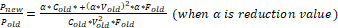

## CH1. Abstraction in Computer

컴퓨터 구조 수업을 통해 배울 수 있는 것들

1. 프로그램 성능을 결정하는 요소 및 개선할 수 있는 방법, 계산 방법 

2. 하드웨어/소프트웨어 인터페이스 

3. 하드웨어 디자이너가 성능 및 에너지 효율을 향상시키는 방법 

   

### 1. 프로그램 성능을 결정하는 요소 및 개선 방법

#### 프로그램 성능에 영향을 미치는 요인들

- 프로그래밍 언어, 컴파일러, 아키텍처
- 프로세서, 메모리

- 알고리즘: 실행되는 operation의 수를 얼마나 줄일 수 있는가
- OS, I/O 시스템

 

#### 프로그램 성능을 개선하기 위한 방법

- Abstraction을 통한 디자인 단순화

- Parallelism: 병렬 처리를 통한 성능개선

- Pipelining: 파이프라이닝을 통한 성능개선

- Prediction: 예측을 통한 성능개선

- Hierarchy of memories: 메모리 계층 구성을 통한 성능개선

- Dependability via redundancy

 

### 2. 하드웨어/소프트웨어 인터페이스

 

**1. Application software**: 하이 레벨 언어로 쓰여진 소프트웨어

**2. System software**

- Compiler: 하이레벨 언어 코드를 머신 코드로 바꿈
- OS: 메모리와 저장공간을 관리, I/O 관리, task 스케쥴링, 리소스 분배

**3. Hardware**:  Processor (CPU), memory, I/O controllers

 

#### Stored Program Architecture

- 컴퓨터는 유한하기 때문에 primitive instructions 집합만을 처리할 수 있다.
- primitive instructions을 결합하여 복잡하고 거대한 프로그램을 만듭니다.

- primitive instructions 조합으로 다양한 기능 구현 가능
  - 명령어와 데이터는 모두 단일 메모리 구조에 저장됩니다.
- 프로그램은 처리 장치에서 분리되어 결과적으로 편집 가능합니다.

**Program**: a set of instruction for computer to execute

#### 현대 컴퓨터 구성

모든 컴퓨터는 같은 구성으로 이루어져 있다.

- Input/Output: display (LCD monitor, touchscreen)

- Storage: memory, Hard disk, CD/DVD, flash

  - 휘발성: Main memory 
  - 비휘발성: Magnetic disk, Flash memory, Optical disk

- 네트워크 어댑터

  - LAN: Ethernet
  - WAN: Internet
  - Wireless network: Wi-Fi, Bluetooth

  => advantage: Communication, resource sharing, nonlocal access

- CPU

1. Datapath: performs arithmetic operation
2. Control: controls datapath, memory, I/O

\* cache: small fast SRAM memory for immediate access to data

##### **Technology**

Processor (CPU)

- Ingredient: Silicon (Semi-conductor)
- Making process

 

​             i.     Silicon ingot: diameter: 8~12 inches, length: 12~24 inches

​            ii.     convert to wafer by slicing (under 0.1 inches width)

​            iii.     Since It is impossible to make innocent wafer, make into the pieces (dies or chips)

Yield(수율): proportion of working dies per wafer

Integrated Circiut Cost

$$
cost \ per \ die = \frac{wafer \ per \ cost}{die \ per \ wafer \ * yield} \\
Dies \ per \ wafer \approx \frac{wafer \ area}{die \ area} \\
yield = \frac{1}{(1+(defeats \ per \ area \ * \ \frac{diea \ area}{2}))^2}
$$

=> Cost is nonlinear to area and defect rate 

- Wafer cost and area are fixed
- Defect rate determined by manufacturing process
- Die area determined by architecture and circuit design

To reduce the cost

1. Decrease die area
2. Manufacturing process should be improved

##### **Performance**

- Response time(or execution time): How long it takes to do a task
- Throughput (or bandwidth): Total work done per unit time
  - Replacing the processor with a faster version
  - Adding more processors

**Relative performance**

 

 

 

 

 

 

Ex) A: 10s, B: 15s then

 

 

**Measuring execution time**

- Elapsed time: Total response time: Processing + I/O + O/S overhead + ….
- CPU time: Only processing time (= CPU performance)

 o CPU time: Time to execute program

 o System CPU time: CPU time + time to ready to execute program

 

**CPU Clocking**

   x Clock: determinant that hardware event occurs.

​      \* clock cycle (or tick): time interval of clock

​      \* clock period: duration of clock cycle

 

​      \* clock frequency (=clock speed): cycles per second (inverse of clock period)

 

 

**CPU Times**

 

 

Performance improved by

- Reducing the number of clock cycles n Increasing the clock rate
- clock cycle time = 1/(clock rate)
- Hardware designer must often trade off clock rate against cycle count for a program

Example)

   

**Instruction Count and CPI**

CPI example

**Weighted Average CPI - CPI in more detail  (when instruction counts are different)**

​      

Ex) If there are 5types of instruction: 

Load (5cycles), Store (4cycles), R-type (4cycles), Branch (3cycles), Jump (3cycles)

And if a program has:

50% load, 15% store, 25% R-type, 8% branch, 2% jump

 

CPI example

Performance summary

**Power**

-  
- ​     

Reducing Power

=> For this reason, Multiprocessor appear

 

Multiprocessor needs:

 \1. Reduce overhead of communication & pipelining

 \2. load balancing

**Pitfall**

1. Amdahl’s law:  

Ex) Suppose a program needs to execute 100s using 80s at multiply. If we want to execute 5 times faster, How much improved multiply time?

20 = 80/n +20 (불가능함)

It is impossible to be 5 times faster when 80% of time used in multiply.

 

2. Low power at idle

n Look back at i7 power benchmark n At 100% load: 258W
 n At 50% load: 170W (66%)
 n At 10% load: 121W (47%)

n Google data center
 n Mostly operates at 10% – 50% load
 n At 100% load less than 1% of the time
 n 33% of the peak power at 10% of the load (2012)

n Consider designing processors to make power proportional to load

3. **MIPS as a Performance Metric**

MIPS: Millions of Instructions Per Second

n Doesn’t account for
 n Differences in ISAs between computers
 n Differences in complexity between instructions

CPI varies between programs on a given CPU

 

Concluding

 Cost/performance is improving
 n Due to underlying technology development

n Hierarchical layers of abstraction n In both hardware and software

n Instruction set architecture
 n The hardware/software interface

n Execution time
 n the best performance measure

n Power is a limiting factor
 n Use parallelism to improve performance

