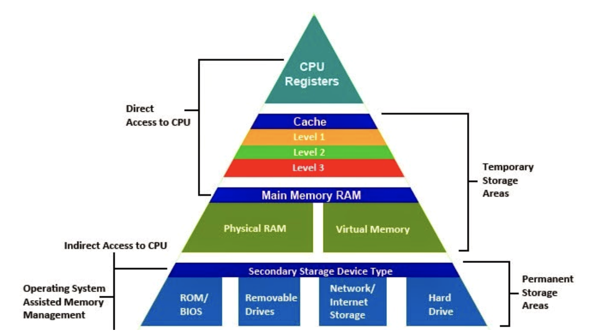
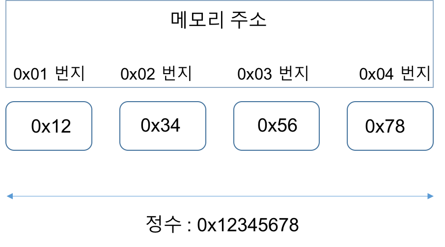

# CH2. Instruction: Language of the computer

 

## Instruction Set

- Instruction: 컴퓨터 언어의 한 단어 

- Instruction set: 주어진 아키텍처에서 이해하는 명령의 어휘
  - 컴퓨터 명령의 레퍼토리
  - 많은 측면에서 공통점이 있지만 컴퓨터마다 명령어 세트가 다릅니다.


#### MIPS Instruction Set

- 책 전체에서 예제로 사용
- 임베디드 코어 시장의 큰 점유율
  - 소비자 가전, 네트워크/저장 장비, 카메라, 프린터 등의 애플리케이션
- 다른 유명한 명령어 세트: ARMv7, intel x86, ARMv8


## **Hardware Operation**

### 규칙 1. 간단하게 하기 위해선 규칙적인 것이 좋다.

- Arithmetic operands은 항상 3개이다.
- 한 줄에 하나의 명령어만 사용할 수 있다.


**1. 더하기(add)**: `add a, b, c `= `a = b + c`

**2. 빼기(sub)**: `sub a, b, c `= `a = b - c`


**C code**

```c
// 1
f = (g+h) - (i+j);
  
  
// 2
a = b+c+d;
```


**MIPS code (assembly)**

```assembly
# 1
add t0, g, h     # t0 = g+h
add t1, i, j     # t1 = i+j
sub f, t0, t1     # f = t-u


# 2
add t, b, c     # t = b+c
add a, t, d     # a = t+d = b+c+d
```


### 규칙 2. 작은 것이 더 빠르다.

#### **2-1. Register Operand**

레지스터: CPU안에 거주하며 메인 메모리(RAM)보다 빠르고 작다.


**cf> 메모리 계층구조**




- 산술 명령어는 레지스터 피연산자를 사용합니다.
- MIPS에는 32비트 레지스터 파일이 32개 있습니다.
  - 자주 사용하는 데이터에 사용
  - 0부터 31까지의 숫자
  - 32비트 데이터는 word라고 부릅니다.
- 레지스터 이름
  - 임시 값의 경우: $t0, $t1, ..., $t9
  - 저장된 변수의 경우: $s0, $s1, ..., $s7

| Name      | Number | Use                            |
| --------- | ------ | ------------------------------ |
| $zero     | 0      | 상수 값 0을 표현               |
| $at       | 1      | 임시 어셈블러                  |
| $v0, $v1  | 2,3    | 함수값과 계산식 결과값         |
| $a0 ~ $a3 | 4~7    | Arguments                      |
| $t0 ~ $t7 | 8~15   | 임시 변수                      |
| $s0 ~ $s7 | 16~23  | 저장된 변수                    |
| $t8, $t9  | 24,25  | 임시 변수                      |
| $k0, $k1  | 26,27  | OS 커널을 위해 예약된 레지스터 |
| $gp       | 28     | 글로벌 포인터                  |
| $sp       | 29     | 스택 포인터                    |
| $fp       | 30     | 프레임 포인터                  |
| $ra       | 31     | 리턴 주소                      |


Ex) f = (g + h) – (i + j) 에서 컴파일러가 변수 f, g, h, ,i, j를 레지스터 $s0, $s1, $s2, $s3, $s4에 각각 할당했다고 하자. 컴파일된 MIPS 코드를 보여라.


**C code**

```c
// f =$s0, g=$s1, h=$s2, i=$s3, j=$s4
f = (g+h) - (i+j);
```

 

**MIPS code (assembly)**

```assembly
add $t0, $s1, $s2
add $t1, $s3, $s4
sub $s0, $t0, $t1
```


 

#### **2-2. Memory Operand**

메인 메모리: 복합 데이터(배열, 구조체, 동적 데이터)에 사용되는 메모리

- 복합 데이터의 산술 연산 과정은 **메인 메모리에서 레지스터로 값을 로드**하고 **레지스터의 결과를 메인 메모리에 저장**해야한다.
- 메모리 주소는 바이트 단위로 표기됩니다. 

```
8bit = 1byte
1024byte = 1kb
1024kb = 1mb
1024mb = 1gb
1024gb = 1tb
```


- MIPS는 빅 엔디안 방식을 사용합니다.
  - 빅 엔디안: MSB(most significant byte)를 가장 왼쪽 바이트에 위치시키는 표기법.
  - 리틀 엔디안(Little Endian):  LSB(least significant byte)를 가장 왼쪽 바이트에 위치시키는 표기법.


**MSB, LSB**

- MSB: most significant bit (가장 왼쪽 비트)

   

- LSB: least significant bit (가장 오른쪽 비트)


**Big endian, Little endian**

컴퓨터가 어떤 바이트 주소를 워드 주소로 사용하는지에 따라 나뉜다. 

- Big endian: 제일 왼쪽 최상위 byte주소를 word (add, lw, sub 등등) 주소로 쓰는 경우
- Little endian: 제일 오른쪽 최하위 byte 주소를 word 주소로 쓰는 경우

우리가 공부하는 MIPS의 경우에는 Big endian 방식을 채택한다.


**CPU에 따라서 바이트의 숫자를 메모리 공간에 저장하는 방식에 있어 차이**가 있을 수 있습니다. 이해하기 쉽게 32비트 CPU란 가정하에 간략한 예를 들어보겠습니다.

```
00000000 00000000 00000000 00000001
```

CPU에서는 4바이트의 숫자 1을 이진수 형태로 예시처럼 저장하는가 하면, 다음과 같이 거꾸로 저장하는 CPU도 존재합니다.

```
00000001 00000000 00000000 00000000
```

위에서 확인할 수 있는 차이때문에 데이터를 주고 받는 통신에 있어 데이터의 표현을 어떻게 하느냐는 상당히 중요합니다.

- **상위 바이트의 값(word의 주소값)을 작은 번지수에 저장**하는 방식의 **`빅 엔디안(big endian)`**

- **상위 바이트의 값(word의 주소값)을 큰 번지수에 저장**하는 방식의 **`리틀 엔디안(little endian)`**


자! 그럼 다시한번 예를 들어보겠습니다. 이번에는 4바이트 int형 정수 0x12345678이 있다고 생각해보겠습니다. 먼저 **`빅 엔디안(big endian)`**부터 확인해보겠습니다.




 **`리틀 엔디안(little endian)`**은 이와 반대 입니다.


예시에서와 같이 **`리틀 엔디안(little endian)`**은 데이터의 상위 바이트가 주소값이 큰 곳에 저장이 됩니다.


참고로 우리가 주로 사용하는 **인텔 계열은 `리틀 엔디안(little endian)`**방식으로 데이터를 저장하고 있습니다. 이와 같은 CPU가 **`빅 엔디안(big endian)`**방식의 CPU와 데이터를 주고 받을때는 서로 데이터를 저장하는 방식에서의 차이가 있어 문제가 발생할 수 있습니다. 따라서 CPU간의 호환 문제를 해결하기 위해 통일된 네트워크 바이트 순서를 정의 했고 이는 **`빅 엔디안(big endian)`** 방식입니다.

 즉, 네트워크상으로 데이터를 전송할 때는 데이터의 배열을 **`빅 엔디안(big endian)`**으로 변경해서 송신해야 합니다. 수신하는 입장에서도 네트워크에서 전달되는 데이터가 **`빅 엔디안(big endian)`**방식임을 인지하고 있어야 올바른 데이터 처리가 가능합니다.


##### 연속 주소 예제

**1. lw**: load word, 메모리에 저장된 값을 레지스터로 복사하는 명령


**C code**

```c
g = h + A[10];        // g = $s1, h = $s2, A = $s3
```


**MIPS code**


```assembly
lw $t0, 10($s3) 		# 10은 배열의 변위(offset), ($s3)은 배열의 base register
add $s1, $s2, $t0  	# g = h + A[10]
```

프로그램에서 8비트로 구성된 1byte를 사용하므로 대부분 컴퓨터는 바이트 단위로 주소를 지정한다. Word 주소는 Word를 구성하는 4byte 주소 중 하나를 사용한다. 따라서 연속된 Word (such as a[0], a[1])는 주소가 4byte씩 차이가 난다.


위의 예제는 `lw $t0, 10($s3)`에서 `lw $t0, 4*10($s3)`로 수정되어야 한다.

```assembly
lw $t0, 4*10($s3) 		# 10은 배열의 변위(offset), 4는 주소값차이, ($s3)은 배열의 base register
add $s1, $s2, $t0  		# g = h + A[10]
```


 


**2. sw**: store word, 레지스터에 저장된 값을 메모리로 복사하는 명령

**C code**

```c
A[12] = h + A[10]         // $s1,  A = $s2
```


**MIPS code**


```assembly
lw $t0, 40($s2)      	# $t0 = A[10]
add $t0, $s1, $t0    	# $t1 = h + A[10]
sw $t0, 48($s2)     	# A[12] = $t1
```


 

**Memory VS Register**

- 레지스터는 메모리보다 액세스 속도가 빠릅니다.
- 더 많은 명령어 실행을 위해선 메모리 데이터에 대한 작업에는 로드 및 저장이 필요합니다.
- 속도를 위해 컴파일러는 가능한 레지스터 변수를 사용합니다.
  - 덜 자주 사용되는 변수만 메모리에서 가져옵니다.
  - 따라서 레지스터 최적화가 중요합니다

 


### 규칙 3. 일반적인 경우를 빠르게

- 상수를 직접 더하는 것은 `lw` 명령을 피합니다.


#### **3-1. Immediate operation**


**1. addi**: add immediate, 레지스터에 상수를 더한다. 뺄셈의 경우에는 음수를 더한다. (subi는 없음) 


**C code**

```c
a = a + 4;         // a = $s1
b = a;						 // b = $s2
```


**MIPS code**


```assembly
addi $s1, $s1, 4   	# a += 4
add $s2, $s1, $zero	# register 0 ($zero)는 상수 0이다, 변수값을 옮길때 사용
```

 

 


**2진법 양수/음수 표기**

**Unsigned N-bit number** 

$ x\_{n-1}\*2^{n-1} + x\_{n-2}\*2^{n-2} + ... + x_{0}*2^{0} $

- range: 0 ~ $2^n-1 $ (32bits에서 0 ~ $2^32-1$)
- Example) $ 0000\ 0000\ 0000\ 0000\ 0000\ 0000\ 0000\ 1101_2 \\\ = 0+0+0+0+0+0+0+1\*2^3+1\*2^2+0\*2^1+1*2^0 \\\ = 11_{10} $


**Signed N-bit number**: 2의 보수법 사용

$  -x\_{n-1}\*2^{n-1} + x\_{n-2}\*2^{n-2} + ... + x_{0}*2^{0} $
$$
-x_{n-1}*2^{n-1} + x_{n-2}*2^{n-2} + ... + x_{0}*2^{0}
$$

- range: $-2^{n-1} ~ 2^{n-1}-1 $ (32bits에서 $-2^{31} ~ 2^{31}-1$) 
- Example) $ 1111\ 1111\ 1111\ 1111\ 1111\ 1111\ 1111\ 1100_2 \\\ = -1\*2^{31}+1\*2^{30}+...+1\*2^3+1\*2^2+0\*2^1+0*2^0 \\\ = -4_{10} $


=> MSB가 0이면 양수, 1이면 음수이다.

 

 

**Signed negation** (양수 <-> 음수)
$$
X+\bar{X} = -1 \Leftrightarrow \bar{X} + 1 = X
$$

- 원리: $ X+\bar{X} = -1 \Leftrightarrow \bar{X} + 1 = X $

- Example) +2 -> -2

i. $ 0000\ 0000\ 0000\ 0000\ 0000\ 0000\ 0000\ 0010_2 $을 각 비트에 대해 반전시킨다.

ii. $ 1111\ 1111\ 1111\ 1111\ 1111\ 1111\ 1111\ 1101_2 $ 에 1을 더한다.

iii. $ 1111\ 1111\ 1111\ 1111\ 1111\ 1111\ 1111\ 1110_2  = -2_{10} $


 

**Sign extension**

더 큰 바이트로 확장하는 것, 현재 word의 msb의 값으로 새로운 비트를 모두 채운다.

$ 2 = 0000\ 0010\ \rightarrow 0000\ 0000\ 0000\ 0010\ \\\ -2 = 1111\ 1110\ \rightarrow 1111\ 1111\ 1111\ 1110 $


 

**2. lb**: load byte, 바이트를 부호 있는 수로 간주하고 남은 24비트를 부호확장해서 채운다.

**3. lbu**: load byte unsigned, 바이트를 부호 없는 수로 간주하고 채운다.


**C code**

```c
char a = -5; 	// 8bit signed integer, 1111 1011
int b = a; 		// 32bit signed integer, 1111 1111 1111 1111 1111 1111 [ 1111 1011 ]
							// 메모리에는 "확장"이 일어난다.
							// a = $s1, b = $s2

```


**MIPS code**

```assembly
lbu $s2, $s1 # 
add $s2, $s2, $zero
```


