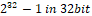
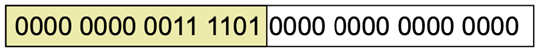

# CH2. Instruction: Language of the computer

 

## Instruction Set

- Instruction: 컴퓨터 언어의 한 단어 

- Instruction set: 주어진 아키텍처에서 이해하는 명령의 어휘
  - 컴퓨터 명령의 레퍼토리
  - 많은 측면에서 공통점이 있지만 컴퓨터마다 명령어 세트가 다릅니다.


#### MIPS Instruction Set

- 책 전체에서 예제로 사용
- 임베디드 코어 시장의 큰 점유율
  - 소비자 가전, 네트워크/저장 장비, 카메라, 프린터 등의 애플리케이션
- 다른 유명한 명령어 세트: ARMv7, intel x86, ARMv8


## **Hardware Operation**

### 규칙 1. 간단하게 하기 위해선 규칙적인 것이 좋다.

- Arithmetic operands은 항상 3개이다.
- 한 줄에 하나의 명령어만 사용할 수 있다.


**1. 더하기(add)**: `add a, b, c `= `a = b + c`

**2. 빼기(sub)**: `sub a, b, c `= `a = b - c`


**C code**

```c
// 1
f = (g+h) - (i+j);
  
  
// 2
a = b+c+d;
```


**MIPS code (assembly)**

```assembly
# 1
add t0, g, h     # t0 = g+h
add t1, i, j     # t1 = i+j
sub f, t0, t1     # f = t-u


# 2
add t, b, c     # t = b+c
add a, t, d     # a = t+d = b+c+d
```


### 규칙 2. 작은 것이 더 빠르다.

#### **2-1. Register Operand**

레지스터: CPU안에 거주하며 메인 메모리(RAM)보다 빠르고 작다.


**cf> 메모리 계층구조**


- 산술 명령어는 레지스터 피연산자를 사용합니다.
- MIPS에는 32비트 레지스터 파일이 32개 있습니다.
  - 자주 사용하는 데이터에 사용
  - 0부터 31까지의 숫자
  - 32비트 데이터는 word라고 부릅니다.
- 레지스터 이름
  - 임시 값의 경우: $t0, $t1, ..., $t9
  - 저장된 변수의 경우: $s0, $s1, ..., $s7

| Name      | Number | Use                            |
| --------- | ------ | ------------------------------ |
| $zero     | 0      | 상수 값 0을 표현               |
| $at       | 1      | 임시 어셈블러                  |
| $v0, $v1  | 2,3    | 함수값과 계산식 결과값         |
| $a0 ~ $a3 | 4~7    | Arguments                      |
| $t0 ~ $t7 | 8~15   | 임시 변수                      |
| $s0 ~ $s7 | 16~23  | 저장된 변수                    |
| $t8, $t9  | 24,25  | 임시 변수                      |
| $k0, $k1  | 26,27  | OS 커널을 위해 예약된 레지스터 |
| $gp       | 28     | 글로벌 포인터                  |
| $sp       | 29     | 스택 포인터                    |
| $fp       | 30     | 프레임 포인터                  |
| $ra       | 31     | 리턴 주소                      |


Ex) f = (g + h) – (i + j) 에서 컴파일러가 변수 f, g, h, ,i, j를 레지스터 $s0, $s1, $s2, $s3, $s4에 각각 할당했다고 하자. 컴파일된 MIPS 코드를 보여라.


**C code**

```c
// f =$s0, g=$s1, h=$s2, i=$s3, j=$s4
f = (g+h) - (i+j);
```

 

**MIPS code (assembly)**

```assembly
add $t0, $s1, $s2
add $t1, $s3, $s4
sub $s0, $t0, $t1
```


 

#### **2-2. Memory Operand**

메인 메모리: 복합 데이터(배열, 구조체, 동적 데이터)에 사용되는 메모리

- 복합 데이터의 산술 연산 과정은 **메인 메모리에서 레지스터로 값을 로드**하고 **레지스터의 결과를 메인 메모리에 저장**해야한다.
- 메모리 주소는 바이트 단위로 표기됩니다. 

```
8bit = 1byte
1024byte = 1kb
1024kb = 1mb
1024mb = 1gb
1024gb = 1tb
```


- MIPS는 빅 엔디안 방식을 사용합니다.
  - 빅 엔디안: MSB(most significant byte)를 가장 왼쪽 바이트에 위치시키는 표기법.
  - 리틀 엔디안(Little Endian):  LSB(least significant byte)를 가장 왼쪽 바이트에 위치시키는 표기법.


**MSB, LSB**

- MSB: most significant bit (가장 왼쪽 비트)

   

- LSB: least significant bit (가장 오른쪽 비트)


**Big endian, Little endian**

컴퓨터가 어떤 바이트 주소를 워드 주소로 사용하는지에 따라 나뉜다. 

- Big endian: 제일 왼쪽 최상위 byte주소를 word (add, lw, sub 등등) 주소로 쓰는 경우
- Little endian: 제일 오른쪽 최하위 byte 주소를 word 주소로 쓰는 경우

우리가 공부하는 MIPS의 경우에는 Big endian 방식을 채택한다.


**CPU에 따라서 바이트의 숫자를 메모리 공간에 저장하는 방식에 있어 차이**가 있을 수 있습니다. 이해하기 쉽게 32비트 CPU란 가정하에 간략한 예를 들어보겠습니다.

```
00000000 00000000 00000000 00000001
```

CPU에서는 4바이트의 숫자 1을 이진수 형태로 예시처럼 저장하는가 하면, 다음과 같이 거꾸로 저장하는 CPU도 존재합니다.

```
00000001 00000000 00000000 00000000
```

위에서 확인할 수 있는 차이때문에 데이터를 주고 받는 통신에 있어 데이터의 표현을 어떻게 하느냐는 상당히 중요합니다.

- **상위 바이트의 값(word의 주소값)을 작은 번지수에 저장**하는 방식의 **`빅 엔디안(big endian)`**

- **상위 바이트의 값(word의 주소값)을 큰 번지수에 저장**하는 방식의 **`리틀 엔디안(little endian)`**


자! 그럼 다시한번 예를 들어보겠습니다. 이번에는 4바이트 int형 정수 0x12345678이 있다고 생각해보겠습니다. 먼저 **`빅 엔디안(big endian)`**부터 확인해보겠습니다.


 **`리틀 엔디안(little endian)`**은 이와 반대 입니다.


예시에서와 같이 **`리틀 엔디안(little endian)`**은 데이터의 상위 바이트가 주소값이 큰 곳에 저장이 됩니다.


참고로 우리가 주로 사용하는 **인텔 계열은 `리틀 엔디안(little endian)`**방식으로 데이터를 저장하고 있습니다. 이와 같은 CPU가 **`빅 엔디안(big endian)`**방식의 CPU와 데이터를 주고 받을때는 서로 데이터를 저장하는 방식에서의 차이가 있어 문제가 발생할 수 있습니다. 따라서 CPU간의 호환 문제를 해결하기 위해 통일된 네트워크 바이트 순서를 정의 했고 이는 **`빅 엔디안(big endian)`** 방식입니다.

 즉, 네트워크상으로 데이터를 전송할 때는 데이터의 배열을 **`빅 엔디안(big endian)`**으로 변경해서 송신해야 합니다. 수신하는 입장에서도 네트워크에서 전달되는 데이터가 **`빅 엔디안(big endian)`**방식임을 인지하고 있어야 올바른 데이터 처리가 가능합니다.


##### 연속 주소 예제

**1. lw**: load word, 메모리에 저장된 값을 레지스터로 복사하는 명령


**C code**

```c
g = h + A[10];        // g = $s1, h = $s2, A = $s3
```


**MIPS code**


```assembly
lw $t0, 10($s3) 		# 10은 배열의 변위(offset), ($s3)은 배열의 base register
add $s1, $s2, $t0  	# g = h + A[10]
```

프로그램에서 8비트로 구성된 1byte를 사용하므로 대부분 컴퓨터는 바이트 단위로 주소를 지정한다. Word 주소는 Word를 구성하는 4byte 주소 중 하나를 사용한다. 따라서 연속된 Word (such as a[0], a[1])는 주소가 4byte씩 차이가 난다.


위의 예제는 `lw $t0, 10($s3)`에서 `lw $t0, 4*10($s3)`로 수정되어야 한다.

```assembly
lw $t0, 4*10($s3) 		# 10은 배열의 변위(offset), 4는 주소값차이, ($s3)은 배열의 base register
add $s1, $s2, $t0  		# g = h + A[10]
```


 


**2. sw**: store word, 레지스터에 저장된 값을 메모리로 복사하는 명령

**C code**

```c
A[12] = h + A[10]         // $s1,  A = $s2
```


**MIPS code**


```assembly
lw $t0, 40($s2)      	# $t0 = A[10]
add $t0, $s1, $t0    	# $t1 = h + A[10]
sw $t0, 48($s2)     	# A[12] = $t1
```


 

**Memory VS Register**

- 레지스터는 메모리보다 액세스 속도가 빠릅니다.
- 더 많은 명령어 실행을 위해선 메모리 데이터에 대한 작업에는 로드 및 저장이 필요합니다.
- 속도를 위해 컴파일러는 가능한 레지스터 변수를 사용합니다.
  - 덜 자주 사용되는 변수만 메모리에서 가져옵니다.
  - 따라서 레지스터 최적화가 중요합니다

 


### 규칙 3. 일반적인 경우를 빠르게

- 상수를 직접 더하는 것은 `lw` 명령을 피합니다.


#### **3-1. Immediate operation**


**1. addi**: add immediate, 레지스터에 상수를 더한다. 뺄셈의 경우에는 음수를 더한다. (subi는 없음) 


**C code**

```c
a = a + 4;         // a = $s1
b = a;						 // b = $s2
```


**MIPS code**


```assembly
addi $s1, $s1, 4   	# a += 4
add $s2, $s1, $zero	# register 0 ($zero)는 상수 0이다, 변수값을 옮길때 사용
```

 

 


**2진법 양수/음수 표기**

**Unsigned N-bit number** 

$ x\_{n-1}\*2^{n-1} + x\_{n-2}\*2^{n-2} + ... + x_{0}*2^{0} $

- range: 0 ~ $2^n-1 $ (32bits에서 0 ~ $2^32-1$)
- Example) $ 0000\ 0000\ 0000\ 0000\ 0000\ 0000\ 0000\ 1101_2 \\\ = 0+0+0+0+0+0+0+1\*2^3+1\*2^2+0\*2^1+1*2^0 \\\ = 11_{10} $


**Signed N-bit number**: 2의 보수법 사용

$  -x\_{n-1}\*2^{n-1} + x\_{n-2}\*2^{n-2} + ... + x_{0}*2^{0} $
$$
-x_{n-1}*2^{n-1} + x_{n-2}*2^{n-2} + ... + x_{0}*2^{0}
$$

- range: $-2^{n-1} ~ 2^{n-1}-1 $ (32bits에서 $-2^{31} ~ 2^{31}-1$) 
- Example) $ 1111\ 1111\ 1111\ 1111\ 1111\ 1111\ 1111\ 1100_2 \\\ = -1\*2^{31}+1\*2^{30}+...+1\*2^3+1\*2^2+0\*2^1+0*2^0 \\\ = -4_{10} $


=> MSB가 0이면 양수, 1이면 음수이다.

 

 

**Signed negation** (양수 <-> 음수)
$$
X+\bar{X} = -1 \Leftrightarrow \bar{X} + 1 = X
$$

- 원리: $ X+\bar{X} = -1 \Leftrightarrow \bar{X} + 1 = X $

- Example) +2 -> -2

i. $ 0000\ 0000\ 0000\ 0000\ 0000\ 0000\ 0000\ 0010_2 $을 각 비트에 대해 반전시킨다.

ii. $ 1111\ 1111\ 1111\ 1111\ 1111\ 1111\ 1111\ 1101_2 $ 에 1을 더한다.

iii. $ 1111\ 1111\ 1111\ 1111\ 1111\ 1111\ 1111\ 1110_2  = -2_{10} $


 

**Sign extension**

더 큰 바이트로 확장하는 것, 현재 word의 msb의 값으로 새로운 비트를 모두 채운다.

$ 2 = 0000\ 0010\ \rightarrow 0000\ 0000\ 0000\ 0010\ \\\ -2 = 1111\ 1110\ \rightarrow 1111\ 1111\ 1111\ 1110 $


 

**2. lb**: load byte, 바이트를 부호 있는 수로 간주하고 남은 24비트를 부호확장해서 채운다.

**3. lbu**: load byte unsigned, 바이트를 부호 없는 수로 간주하고 채운다.


C code

```c
char a = -5; 	// 8bit signed integer, 1111 1011
int b = a; 		// 32bit signed integer

 

// b에서 무슨 일이 생기지?? 메모리에는 "확장"이 일어난다.

 
1111 1111 1111 1111 1111 1111 [ 1111 1011 ]
```


MIPS code

```assembly
lb $s1, 1($s2) # s2레지스터에서 인덱스를 한 바이트만 읽어 s0에 load
lbu 
```


 


### 원칙4. 좋은 설계에는 적당한 절충이 필요하다.


#### **Machine code: representing Instruction**

- Instruction들은 결국 바이너리로 인코딩되어 컴퓨터에게 전달된다.
- MIPS instruction의 경우 32-bit word로 변환된다.


MIPS에는 이러한 명령어의 3가지 Format의 명령어가 존재한다.


#### **1. R-format Instructions**

assembly가 기계어로 32비트 워드로 변환되고 그 32비트 워드의 구조가 어떻게 되어있는지 살펴보자.


- op: operation code
- rs: 첫 번째 레지스터 값
- rt: 두 번째 레지스터 값
- rd: 연산 결과가 저장되는 레지스터 값
- shamt: shift instruction을 위한 공간
- funct: 함수코드, opcode와 함게 조합되어 사용된다.

 


##### **예시: `add $t0, $s1, $s2`**


**레지스터 표**

| Name      | Number | Use                            |
| --------- | ------ | ------------------------------ |
| $zero     | 0      | 상수 값 0을 표현               |
| $at       | 1      | 임시 어셈블러                  |
| $v0, $v1  | 2,3    | 함수값과 계산식 결과값         |
| $a0 ~ $a3 | 4~7    | Arguments                      |
| $t0 ~ $t7 | 8~15   | 임시 변수                      |
| $s0 ~ $s7 | 16~23  | 저장된 변수                    |
| $t8, $t9  | 24,25  | 임시 변수                      |
| $k0, $k1  | 26,27  | OS 커널을 위해 예약된 레지스터 |
| $gp       | 28     | 글로벌 포인터                  |
| $sp       | 29     | 스택 포인터                    |
| $fp       | 30     | 프레임 포인터                  |
| $ra       | 31     | 리턴 주소                      |


**opcode 표**


 

00000 10001 10010 01000 00000 100000 = 02324020<sub>16</sub>


Cf> 16진법

 

Ex)    

| e    | c    | a    | 8    | 6    | 4    | 2    | 0    |
| ---- | ---- | ---- | ---- | ---- | ---- | ---- | ---- |
| 1110 | 1100 | 1010 | 1000 | 0110 | 0100 | 0010 | 0000 |

 


####  MIPS I-format Instruction


 If op is sw(35) or lw(43), then rs is base address and 16bits will be address.


 

Ex) lw $t0, 32($s3), sw$t0, 48($s3)


 

Ex2) A[300]= h + A[300]을 MIPS code로 작성하고 machine code로 변환하여라

 

 


----


**Logical operation**

shift

\- **sll**: shift left logical (=multiply 2), shift left and fill with 0 bits

Ex) sll $t2, $s0, 4           // $t2 = $s0 << 4bit


 

if $s0 = 0000 0000 … 0000  = 9, then $t2 = 0000 0000 … 1001  = 144

 

\- **srl**: shift right logical

Ex) srl $t2, $s0, 4           // $t2 = $s0 >> 4bits

 

if $s0 = 0000 0000 … 1001  = 144, then $t2 = 0000 0000 … 0000  = 9

 

 And / Or

\- **and**: select some bits, clear others to 0

일부 패턴을 감추는 역할을 하기 때문에 MASK라고도 부른다.

Ex) and $t0, $t1, $t2


 

\- **or**: set some bits to 1, leave others unchanged

Ex) $t0, $t1, $t2


 

\- **not**

Not을 구현하기 위해서는 3개의 피연산자 형식을 유지하기 위해 NOR으로 구현되었다.

A NOR b == NOT (a or b)

A NOR b == NOT (a or 0) = NOT a

 

Ex) nor $t0, $t1, $zero


 

**Conditional branch**

\- **beq**: branch if equal

Ex) beq rs, rt, L1                 // if (rs == rt) then branch to instruction label L1

 

\- **bne**: branch if not equal           

Ex) bne rs, rt, L1                 // if (rs != rt) then branch to instruction label L1

 

\- **slt**: set less than           cf> **sltu**

Ex) slt $t0, $s0, $s1               // if ($s0 < $s1) then $t0 = 1. Otherwise 0

 

\- **slti**: set less than immediate    cf> **sltui**

Ex) slt $t0, $s0, a                 // if ($s0 < a) then $t0 = 1. Otherwise 0

 

\- **j**: jump

Ex) j L1                       // unconditional jump to instruction label L1

 

**If implement**

Ex) C code:  if (i==j) f = g+h;

​        else   f = g-h;

​           i, j, f, g, h is $s0, $s1, $s2, $s3, $s4

 

  MIPS: 

  bne $s0, $s1, ELSE

  add $s2, $s3, $s4

  j EXIT

  ELSE: sub $s2, $s3, $s4

  EXIT:

**Loop implement**

Ex) C code: while (save[i] == k) i += 1;

i = $s3, k = $s5, base address of *save* is $s6

 

  MIPS:

​      LOOP:

​      sll $t1, $s3, 2        // i * 4

​      add $t1, $t1, $s6      // base address + i *4

​      lw $t0, 0($t1)

​      bne $t0, $s5, EXIT

​      addi $s3, $s3, 1

​      j LOOP

 

Ex2) C code: for (int i=0; i<k; i++) save[i] = i+2;

i = $s3, k = $s5, base address of *save* is $s6

 

  MIPS:

​      add $s3, $s3, 0

LOOP:

​      slt $t0, $s3, $s5

​      bne $t0, 1, EXIT

​      sll $t1, $s3, 2

​      add $t1, $s3, $s6

​      lw $t2, 0($t1)

​      addi $t2, $s3, 2

​      sw $t2, 0($t1)

​      addi $s3, $s3, 1

​      j LOOP

​      EXIT:

 

 

x < y (max index of array such ) -> 0 

means 

​      sltu $t0, $s1, $t2

​      beq $t0, $zero, IndexOutOfBounds

 


 

**Procedure calling**

 Step

 \1. 매개 변수들을 레지스터에 넣는다.

\2. 프로시저로 제어권을 넘긴다.

\3. 프로시저를 수행하기 위한 저장공간을 할당받는다.

\4. 프로시저의 연산을 수행한다.

\5. 결과 값을 호출자를 위한 레지스터에 넣는다.

\6. 호출을 한 시점(Instruction)으로 돌아간다.

 

$a0 ~ $a3: 매개변수를 넘기기 위한 레지스터 (4~7번)

$v0 ~ $v1: 반환값을 반환하기 위한 레지스터 (2~3번)

$t0 ~ $t9: 임시 레지스터, callee의해 덮어 쓰여질 수 있다.

$s0 ~ $s7: 비휘발성 레지스터, callee에 의해만 저장되고 복원되어야 한다.

$gp: global pointer for static data (28번)

$sp: stack pointer (29번)

$fp: frame pointer (30번)

$ra: return address, 프로시저가 어디로 돌아갈지 기억하고 있는 레지스터 (31번)

 

\- **jal**: jump and link, 지정된 주소로 점프하면서 동시에 다음 명령어의 주소를 $ra를 저장

Ex) jal ProcedureLabel                  

 

\- **jr**: jump register, 레지스터에 저장된 주소로 무조건 점프한다.

Cf> Program Counter (PC): 현재 수행 중인 명령어의 주소를 기억하는 레지스터

 

jal X 명령을 이용해서 procedure X(callee)로 점프하고 $ra 레지스터의 PC+4 값을 저장한다.( jal = $ra <- PC + 4) callee는 계산을 끝낸 후 결과를 $v0 or $v1에 넣고 jr $ra명령을 실행하여 복귀한다.

 

 

 

 

 

 

 

 

 

 

 

 

Ex) C code: int leaf_example(int g, h, i, j) {

​           int f;

​           f = (g+h) – (i+j);

​           return f;

​           }          // g, h, i, j: $a0~$a3, f is $s0, result is $v0

 

MIPS code:

LEAF:  addi $sp, $sp, -4      // int f, 4바이트 공간을 할당해준다.

​    sw $s0, 0($sp)       // f에 공간 할당 후, 쓰레기값 넣기

​    add $t0, $a0, $a1

​    add $t1, $a2, $a3

​    sub $s0, $t0, $t1

​    add $v0, $s0, 0       

​    lw $s0, 0($sp)        // $s0 값을 원래 초기값(쓰레기 값)

​    addi $sp, $sp, 4       // 다시 변수 f 공간 반납

​    jr $ra             

 

 

|      |                                     |
| ---- | ----------------------------------- |
|      |  |


cf> memory allocation with stack pointer


 

**
**

 

**Recursive procedure**

값이 보존되어야 할 모든 레지스터를 스택에 넣는다. 복귀한 후에 메모리에서 값을 꺼내 레지스터를 원상 복구하고 이에 맞춰 스택포인터를 다시 조정한다.

 o Caller pushes

 \1. $a0 ~ $a3: 매개변수를 저장하는 레지스터 

\2. $t0 ~ $t9: call 이후에 필요하다

 

 o Callee pushes

 \1. $ra: return address

\2. $s0 ~ $s7: callee가 사용하는 모든 레지스터

 

Ex) C code:

​      int fact (int n) {

​           if (n<1) return 1;

​           else return n*fact(n-1);        // Argument in n $a0, result in $v0

 

  MIPS code:

FACT:

​      addi $sp, $sp, -8                 // n, return address 공간 할당   

​      sw $ra, 4($sp)                   // 이번 프로시저의 return address 저장

​      sw $a0, 0($sp)                  // 이번 프로시저의 n값 저장

​      slti $t0, $a0, 1                  // n < 1

​      beq $t0, $zero, L1                // if (n > 1)

​      addi $v0, $zero, 1                // else n = 1

​      addi $sp, 8                    // pop 2 items from stack

​      jr $ra                        // jal로 돌아감, 정확히는 jal다음 (PC+4)

L1:

​      addi $a0, -1                    // n--

​      jal FACT                      // FACT로 점프 및 PC+4를 $ra에 저장

​      lw $a0, 0($sp)                   // 저장된 n 값 지우면서 $a0에 저장    

​      lw $ra, 4($sp)                   // 저장된 return address $ra에 저장

​      addi $sp, $sp, 8                 // 다 지우면서 올라가기

​      mul $v0, $a0, $v0                // n*fact(n-1)

​      jr $ra                        // jal FACT 의 다음 instruction으로 이동

 


 

 

 


**global pointer**

모든 프로시저 외부에서 선언된 변수는 정적 변수로 간주되고 나머지는 자동 변수로 간주된다.

 

**Frame pointer**

프로시저 프레임의 첫 번째 워드를 가리키는 포인터, 스택 포인터의 값이 프로시저 내에서 바뀔 수도 있으므로 메모리 내 지역 변수에 대한 변위는 기준이 달라질 수 있다. 그 때 사용하는 것이 frame pointer 이다. 


 

 

**Memory Layout**

o Text: program code (machine code)

o Static data: global variable

o Dynamic data: heap

 ex) malloc in C, new in java

o Stack: automatic variable

 

​      

 

 

 

 

 

 

Cf> more than 4 arguments

MIPS: 나머지 인수를 프레임 포인터 바로 위 스택에 넣는다.

 

 

 

**Byte / Halfword operation**

\- **lb, lh**: load byte, load halfword

Ex) lb rt, offset(rs)     // rt로 32비트 부호확장을 수행한다.

 

\- **lbu, lhu**: load byte unsigned, load halfword unsigned

Ex) lbu rt, offset(rs)     // rt로 0으로 채우는 32비트 확장을 수행 (unsinged)

 

\- **sb, sh**: store byte, store halfword

Ex) sb rt, offset       // 가장 오른쪽에 있는 바이트 혹은 halfword를 offset(rs)에 저장한다.

 

Cf> string copy


 

MIPS code:

 

 

32-bit constants

\- lui: load upper immediate

Ex) lui $s0, 61                   // 상위 4바이트를 61로 채운다.



 

\- ori: or immediate

Ex) ori $s0, $s0, 2304              // 하위 4바이트에 원래 숫자 + 2304를 더한다.


 

**Branch addressing** 

**- PC-relative addressing (beq, bne)**


모든 주소가 16비트 필드에 들어가기엔 너무 작아서 어떤 레지스터를 지정해 그 값을 분기 주소와 더하도록 하는 것이다.

è 대부분의 분기의 목적지는 분기 명령 근처에 위치한다.

 

PC = 레지스터 + 분기주소

 o Target address: PC + offset x 4: PC를 기준으로 범위 안에서 분기할 수 있다.

 주의!

​      목적 주소를 알아내려 할때 PC는 이미 4만큼 증가했다.

​      Target address: PC + 4 + offset x 4

 

 

**Jump addressing** 

**- (Pseudo) direct jump addressing** (instruction j or jal)


 J-format 

주소를 저장할 때, 오른쪽으로 두 번 Shift한 값을 저장하기 때문에 28비트의 주소를 기억한다.


 

 위와 같이 상위 4바이트 내에서 이동 가능하다.

 

 

 

 

 

 

 

**Register addressing**: R-format instruction, 

레지스터 안의 32비트를 이용해 주소 전체를 이동할 수 있다.


 

**Base addressing: R-format instruction**


 

**Immediate addressing**


 

Cf> Branching far away

만약, 분기의 목적지가 16비트 Offset으로 표현하기에 너무 멀리 있다면, 코드가 재작성된다.

Ex) beq $s0, $s1, L1 에서 L1이 너무 멀리 있다면


처럼 재작성한다.

 

 

**Translation and Startup**

 


 

 

 

 

 

 

 

\- 컴파일러

사람이 짠 high-level language를 assembly language로 바꾼다.

 

\- 어셈블러

대부분의 어셈블러 명령어는 기계 명령어와 일대일 대응이 되는데, 어셈블러는 그것을 좀 더 다듬는다. 예를 들어 move $t0, $t1 → add $t0, $zero, $t1. 간단한 변경 뿐 아니라 $at 레지스터(assembler temporary)를 이용하여 코드 자체를 바꾸기도 한다. 

 

또한 어셈블러는 어셈블리 프로그램을 기계어로 바꾼다.

 o object file header: 목적 파일을 구성하는 각 부분의 크기와 위치를 서술

 o text segment: 기계어 코드

 o static data segment: 프로그램 수명 동안 할당되는 데이터가 들어 있다.

Ex) global variables, string, constant

 

 o relocation info: 프로그램이 메모리에 적재될 때 절대 주소의 의존하는 명령어와 워드를 표시

 o symbol table: 아직 정의되지 않고 남아 있는 레이블을 저장

 o debugging info: 각 모듈이 어떻게 번역되었는가에 대한 간단한 설명

 

\- 링커

따로 어셈블된 기계어 프로그램을 하나로 연결해주는 역할

 \1. 코드와 데이터 모듈을 메모리에 심벌 형태로 올려놓는다.

 \2. 데이터와 명령어 레이블의 주소를 결정

 \3. 외부 및 내부 참조 해결

=> 링커가 모듈을 메모리에 적재할 때 모두 절대 실제 위치에 해당하는 값으로 재설정 해야함


 