[TOC]


## Chapter 1

### i. What is the Internet?

#### General View

- A set of independent networks interconnected

- loosely hierarchical

- Property
  - Protocol: TCP/IP
  - Internet standards
    - RFC: Request for comment, 인터넷 기술에 적용 가능한 기술 메모장
    - IETF: Internet Engineering Task Force: 인터넷 관리 조직

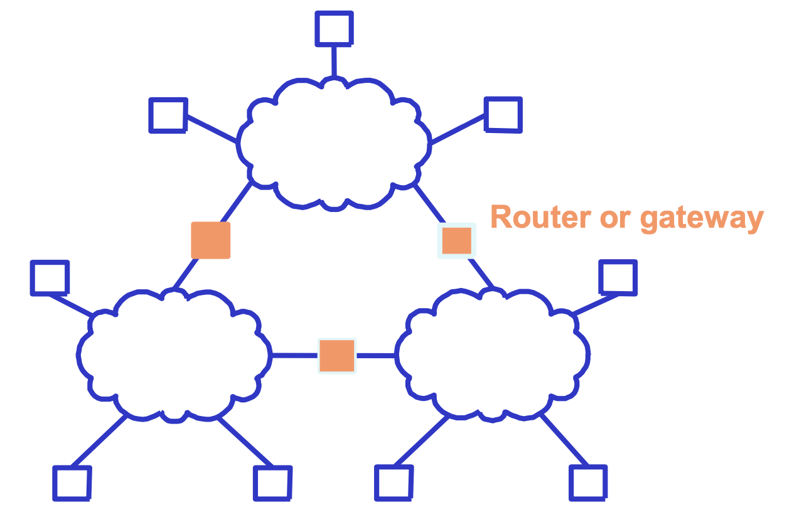    


#### Service View

: 인터넷은 많은 정보통신 어플리케이션(Web, email, games, file-sharing, etc)을 가능하게 하고 최선을 다해 도와주지만 통신이 잘 될거라고는 보장하지는 않습니다. (Best Effort Service) 

  => layer 3 (network layer)까지 보장된 서비스를 지원하지 않습니다.

- 프로토콜의 종류
  - UDP: Connectionless unreliable
  - TCP: Connection-oriented reliable

 

Cf> **프로토콜**이란?

둘 이상의 통신에서의 정보 교환이 일어날 때 지켜야 하는 규칙 및 절차

 - 메시지 형식

 - 통신된 메시지의 순서

 - 메시지 등의 전송 및 수신에 대한 조치

   Ex) three-way handshaking

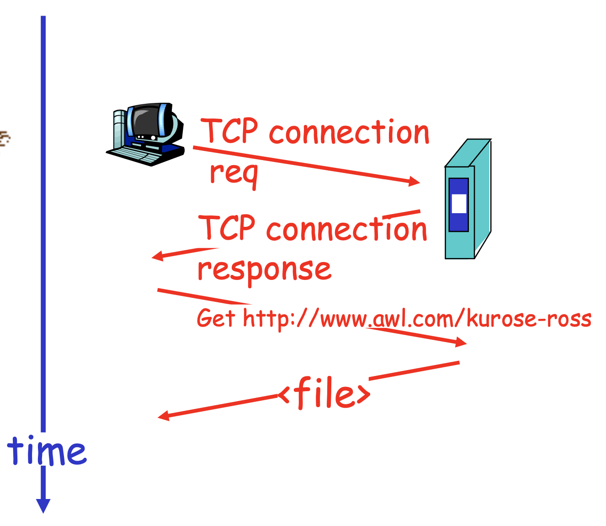  


### ii. Network: 정보를 전달 할 수있는 장치들의 연결

Ex) Telephone network, Internet, cable network, N-ISDN, B-ISDN

네트워크의 원칙: KISS (keep it simple and stupid) 


#### 네트워크 구조

- Network edge

  : 종단 시스템, 네트워크를 실질적으로 사용하는 어플리케이션
  - 호스트 (clients & servers; data centre)
  
    Ex) PC, 노트북, 스마트폰


- Access networks, physical media

  : 유, 무선 통신 링크

  - 커뮤니케이션 링크: 직접적으로 두 노드를 잇는 물리적인 선
  
  Ex) fiber, copper, radio satellite
  
  

\> Communication links: A physical medium used to connect nodes directly

- Network core

  : 라우터들의 연결

  - 라우터: 패킷을 전송(forward)하는 장치

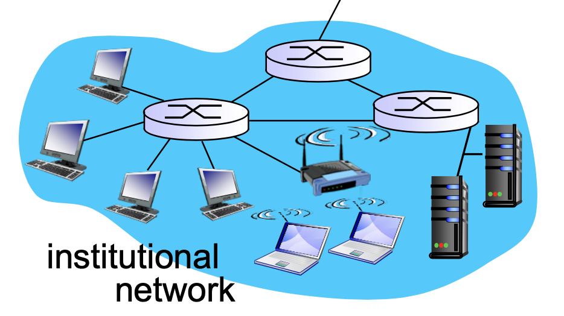


##### Access Network (네트워크에 end system 연결하기)

###### I. 홈 네트워크 연결 (Residential access nets) 

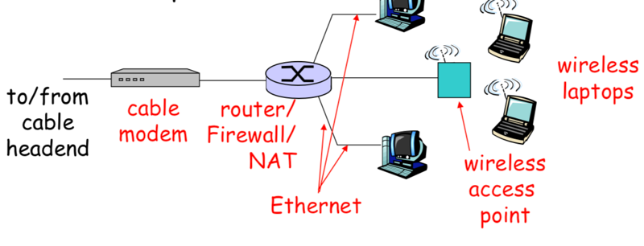

- 홈 네트워크에 연결하기 위한 요소들
  - xDSL or cable modem
  - router/firewall/NAT
  - Ethernet
  - Wireless access point


**1. Dialup via modem (모뎀 전화선)**

- 약 56kbps 속도로 라우터에 직접 엑세스 합니다.
- 인터넷과 통화를 동시에 사용할 수 없습니다.

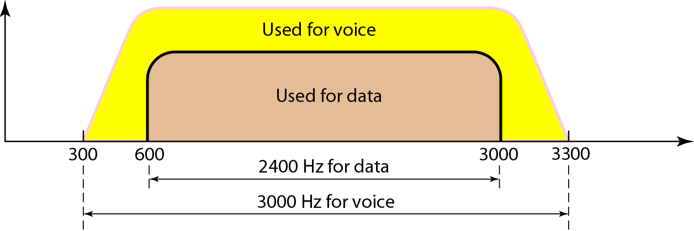

 

**2. DSL (Digital Subscriber Line)**

- 고속 디지털 통신
- 인터넷과 통화를 동시에 사용 할 수 있습니다.


How?  음성을 전용선을 통해 서로 다른 주파수로 변환하여 데이터를 처리합니다.

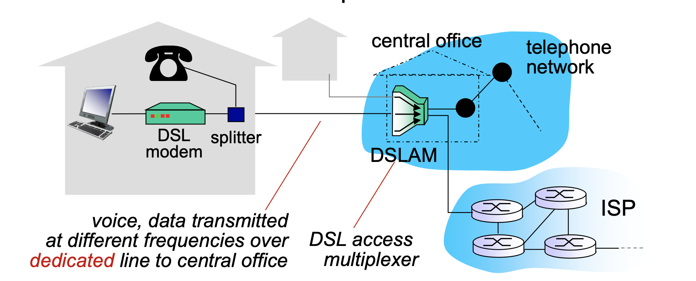


또한 주파수가 높을 수록 전송 거리가 짧아집니다.

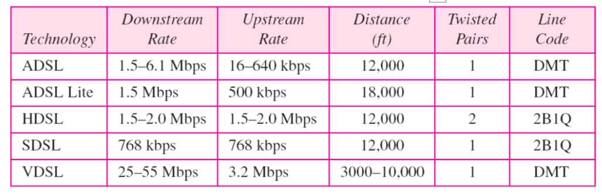

​               

Cf> ADSL(Asymmetric Digital Subscriber Line),  DSL의 변종

- DMT (Discrete Multi-Tone) 기술을 사용하여 디지털 신호를 아날로그 신호로 변환
- 업로드 속도는 항상 다운로드 속도보다 느립니다.

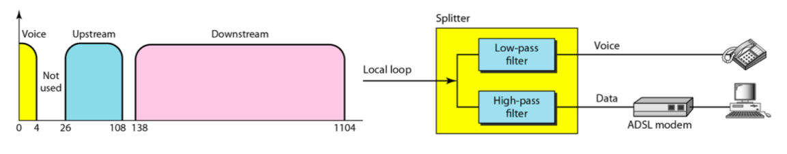


**3. Cable**

- HFC (hybrid fiber coax)
  - Asymmetric: Downstream - 30Mbps / Upstream- 2Mbps
  - Fiber + coaxial cable
    - Fiber: ISP 부터 Fiber 노드까지
    - Coaxial cable: Fiber 노드부터 가정집 까지

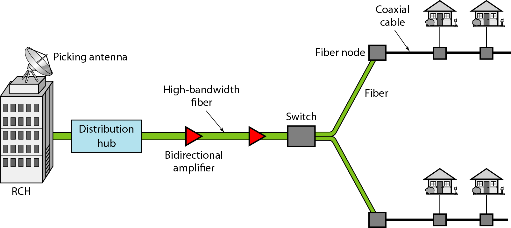


Homes share access to router

- FTTH (Fiber To The Home)
  - Home run
  -  AON
  - TDMA-PON (B/E/G-PON)
  - WDMA-PON (DWDM/CWDM-PON)

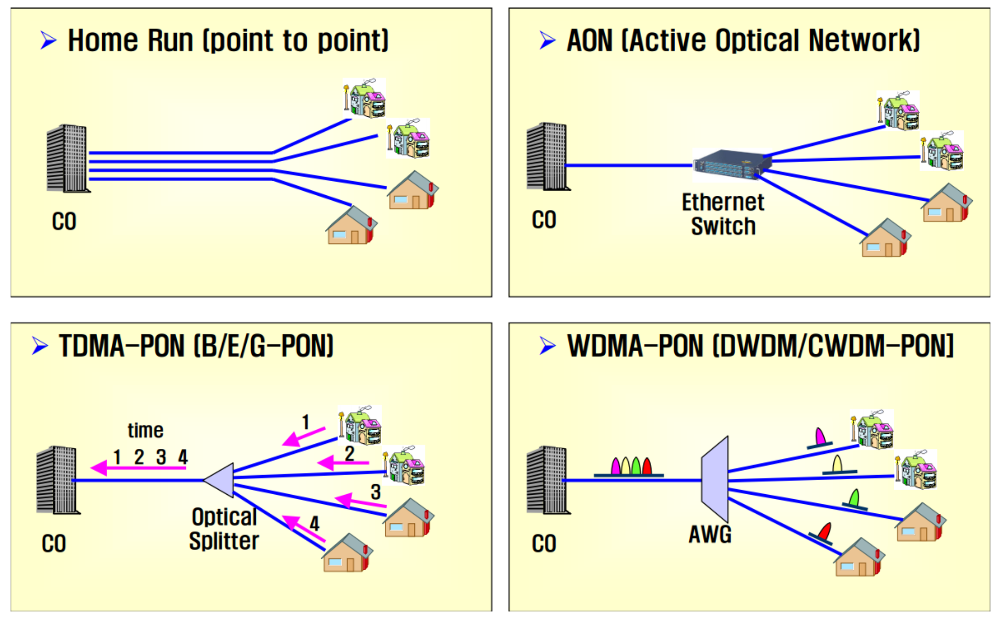


###### II. 기업 네트워크 연결 (school, company)

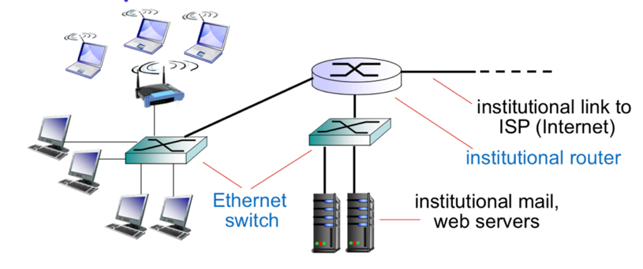

**1. LAN (Local Area Network)**

집, 사무실 또는 학교 건물과 같은 이웃을 연결하는 컴퓨터 네트워크


​      

**2. Ethernet switch**

Ethernet: 여러 데이터 스테이션의 고유한 물리적 주소인 MAC 주소를 통해 광범위한 데이터 통신이 가능합니다. 약 2.5km 이내의 최대 1,024 개의 데이터 스테이션이 10Mbps의 전송 속도로 정보를 교환 할 수 있습니다.


###### III. 모바일 엑세스 네트워크

**1. Wireless LANs (WiFi)**

- 범위: 빌딩 하나 내외 (100ft.)
- 속도: 802.11b/g기준 54Mbps


**2. Wide-area wireless access**

- 범위: 10km 내외
- 속도: 1~10Mbps, ex) 3G, 4G, LTE


###### 보충 1. Physical media (Transmission media) 

- Guided (유선) 

  **1. Twisted-pair cable (TP)**

  - UTP (Unshielded Twisted Pair)
    - Category 3: traditional phone wires, 10Mbps
    - Category 5: 100Mbps Ethernet
    - Category 5e: 1 Gbps
    - Category 6: 10Gbps

  단위 길이 당 몇번 꼬았느냐에 차이가 있습니다. 더 많이 비틀수록 좋습니다. 꼬인 선은 두 선 사이의 신호 전압 차이에 영향을 미칩니다.

  

  - STP (Shielded Twisted Pair): 외부 간섭이 UTP보다 덜합니다.

    

  **2. Coaxial cable**

  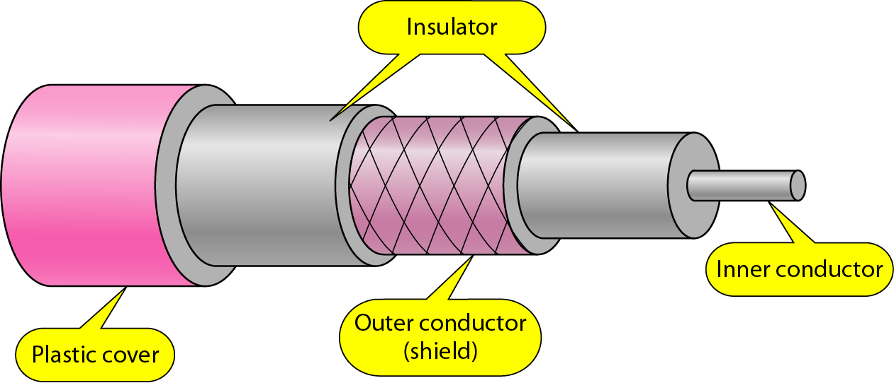

  - baseband: 매우 좁고 0에 가까운 주파수 범위를 갖는 신호

    - 단일 채널 케이블
    - legacy Ethernet
    - 통신중 중 변조가 없습니다.

  - broadband

    - 다중 채널 케이블 ex) HFC

    - 통신중 변조를 합니다.

      

  **3. Fiber-optic cable (광섬유 케이블)**

  - 초 고 대역폭(bandwidth), 최대 50Tbps
  - 외부 간섭에 취약하지 않음 (= 낮은 오류율)
  - 도청으로부터 안전
  - 매우 낮은 감쇠(attenuation)

 

- Unguided (무선)

  1. Radio

     - ITU-R에 의해 규제됩니다.

     - 주파수 스펙트럼

       : VLF(3~30kHz), LF(30~300kHz), MF(300~3000kHz), HF(3~30Mhz; HAM), VHF(30~300MHz; Tv, FM), UHF(300~3000MHz;TV)

       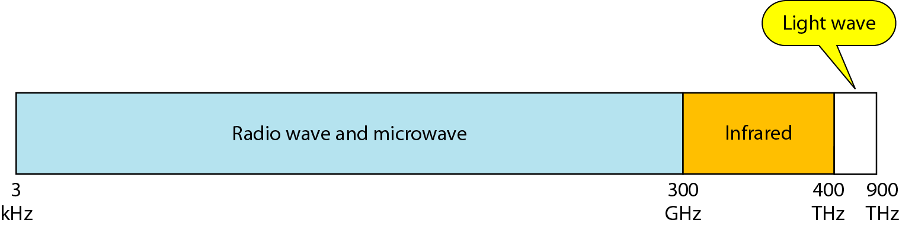

       | 종류            | 규격             | 속도           |
       | --------------- | ---------------- | -------------- |
       | LAN             | IEEE802.11, WiFi | 11Mbps, 54Mbps |
       | wide-area       | Cellular, 3G, 4G |                |
       | 인공위성        |                  | 45Mbps         |
       | 지상 마이크로파 |                  |                |


###### 보충 2. 패킷 전송

- 개요

1. 메시지를 받습니다 
2. Packetlize (= 작은 청크로 분할) 
3. 패킷 전송률 R로 전송

$$
패킷\ 전송\ 딜레이 = L\ bit를\ 전송하는데\ 필요한\ 시간 = \frac {L(bits)} {R (bits/sec)}
$$

 

- 기초 이론

1. Nyquist Theorem

​        : Noiseless 채널의 최대 데이터 속도를 나타냅니다.
$$
Maximum\ rate = 2B\ log_2V\ bits/sec
\\
\\ 
B=bandwidth [hz],\ V = discrete\ levels\ of\ each\ symbol
$$


2. Shannon Theorem

​       : 채널 용량, 랜덤 노이즈 채널의 최대 비트 전송률
$$
Maximum\ bit\ rate = B\ log_2(1+\frac{S}{N})\ bits/sec
\\
S/N: signal-to-noise 비율
$$


```
Q) If a binary signal is sent over a 3-kHz channel whose signal-to-noise ratio is 20dB, what is the maximum achievable data rate?

- By Nyquist theorem: 

2 * 3 k * log22 = 6 kbps

- By Shannon theorem: 

3 k * log2(1+100) = 19.97 kbps
```


 

##### Network Core

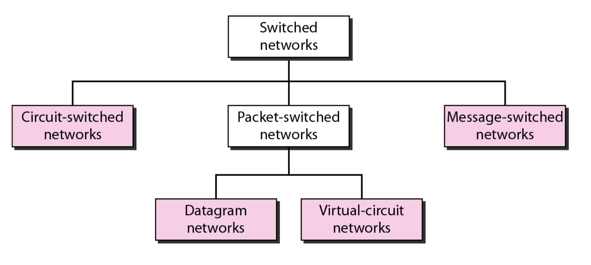


###### Circuit switching

: 리소스 독점, 두 사람이 전화할 때 대역폭을 독점적으로 할당한다. (= no sharing = guaranteed)


**과정**

- Circuit establishment (**Call setup**):  연결하기 전에 연결을 설정하는 파트이다. 패킷 스위칭 방법에는 이 과정이 없다.

- Transmission: 실질적으로 데이터 교환이 일어나는 부분

  cf> propagation delay (빨간 동그라미 부분)

- Circuit release: 연결 해제

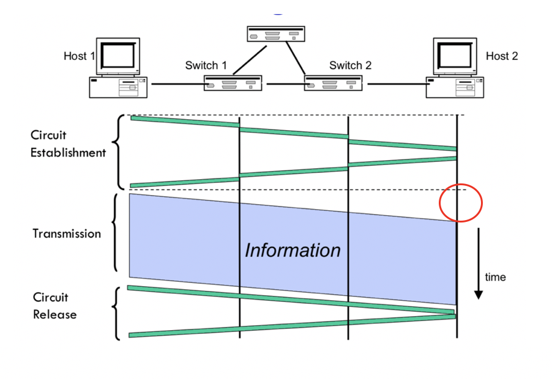

 

 

**Multiplexing**: 단일 데이터 링크를 통해 여러 신호를 동시에 전송하는 방법

- FDM (Frequency division multiplexing, 주파수 분할 멀티플렉싱)

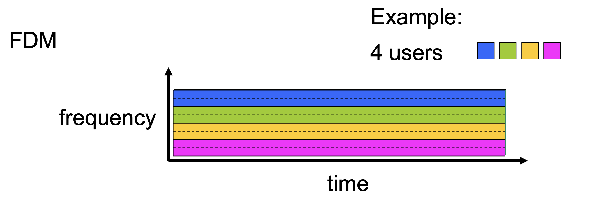

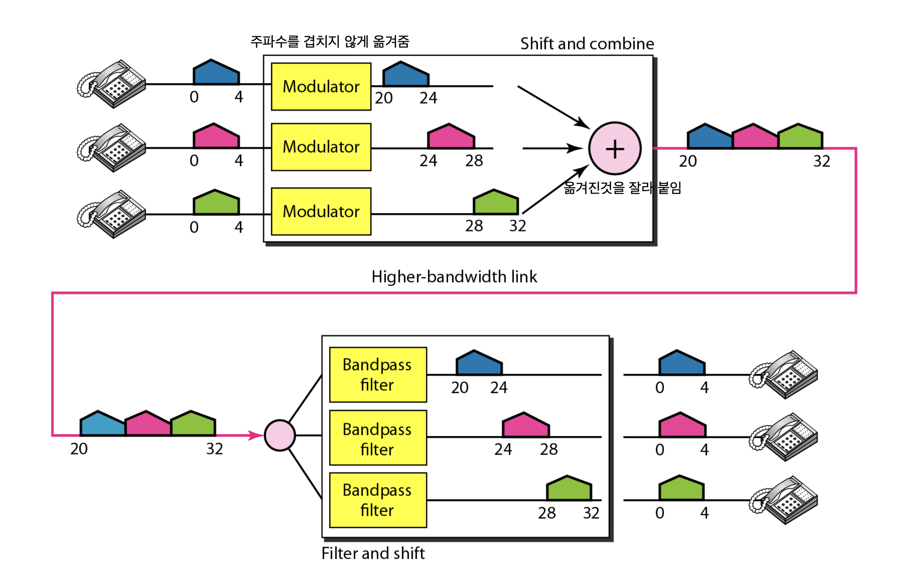


- TDM (Time Division multiplexing, 시간 분할 멀티플렉싱)

    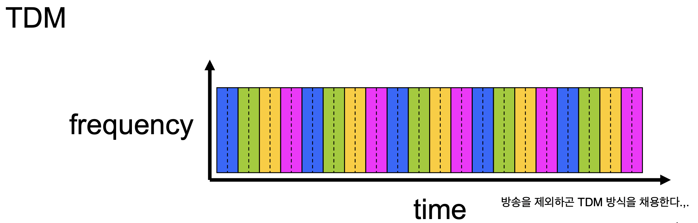

  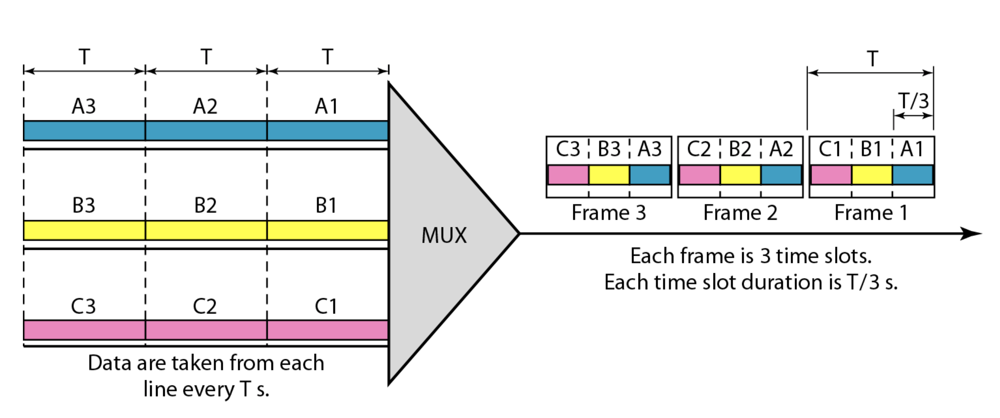

  - 장점: 서비스의 품질을 보장해준다. (Quality of Service)
  - 단점
    - resources 사용에서 비효율적이다.
    - Circuit establishment 시간 때문에 delay가 생긴다.

 


###### 문제 1

Circuit-switched network을 사용하여 호스트 A에서 B로 640,000비트 크기의 파일을 보내는 데 얼마나 걸릴까요?

- 모든 링크의 속도는 1.536Mbps입니다
- 각 링크는 24개의 슬롯이 있는 TDM을 사용합니다.
- 회로 설정에 500msec이 소요됩니다.


###### Packet-switching

데이터를 패킷(packet)이라는 단위로 쪼개서 전송하는 방식. 패킷은 다음 링크로 전송하기 전에 저장을 한 뒤 전달하는 store and forward 방식을 사용. 패킷의 헤더에는 출발지(source) 목적지(destination) 정보가 있습니다. 

라우팅 알고리즘(**Routing**, **Forwarding**)을 이용하여 경로를 설정하고, 중간의 라우터들을 거쳐 최종 목적지에 도달하게 됩니다. 이러한 과정에서 패킷은 다음 라우터로 이동하기 위해 큐에서 대기(**queueing**)하는데, 이 때 수용할 수 있는 큐의 범위를 초과하면 손실(loss)이 발생하게 됩니다. 


**o Routing**: 패킷이 가야할 출발점 - 종착점 경로를 결정합니다.

**o Forwarding**: 라우터에서 적절한 다음 라우터로 패킷을 이동시키는 것을 말합니다.


 

- 각 패킷은 링크 대역 폭을 사용한다. 즉, 데이터 전송 시 할당 경로가 없고 같은 경로를 다같이 사용할 수 있다. 

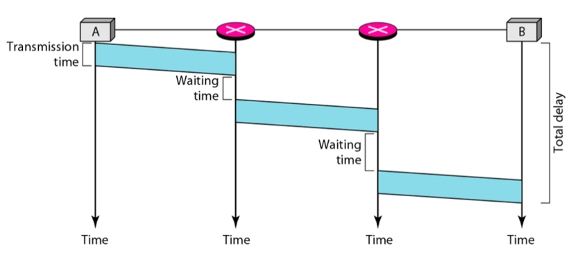

- 경로가 미리 정해지지 않았기 때문에 필요한 경우에만 network resource를 사용 

  (= call setup 시간이 없어서 간단하고 빠르다.)

```
total delay = 3L / R
- 패킷 크기 = L bits
- 전송 속도 = R bps
```

 

###### 문제 2

만약 N명의 사용자가 1Mbps의 링크를 이용하고 각 사용자는 100kb/s 가 필요하다.

CS방식을 사용할 때와 PS방식을 사용할 때 몇 명이나 사용할 수 있는가?

| Packet switching                   | Circuit switching            |
| ---------------------------------- | ---------------------------- |
| 동시에 사용하지 않는다면 10명 이상 | 1000 / 100 = 10, 동시에 10명 |

 

**1. Datagram Networks** 방식 (= connectionless model)

- Setup 단계가 없다.

- Stateless switch (경로를 미리 만들지 않음)

- 각 패킷은 목적지가 같아도 독립적으로 전달된다.  => 보내는 순서가 맞지 않아서 따로 맞춰줘야함

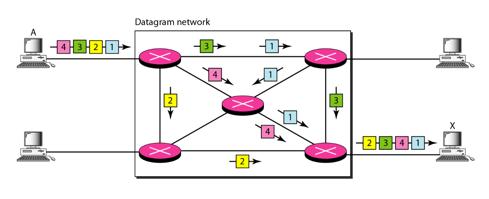

 

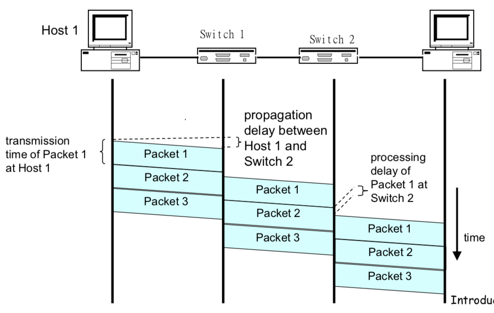

 

​       

 

**2. Virtual Circuit Networks** 방식

전송 전, signaling protocol을 사용해 목적지까지 virtual circuit을 구성한다. 경로까지의 모든 스위치는 연결 상태를 유지하고 들어오고 나가는 interface와 VCI가 있다.

- Virtual circuit entry: in_interface, in_VCI, out_interface, out_VCI  (table은 call setup과정에서 만든다.)
- 리소스(라우터, 스위치)의 예약은 가능하지만 전적으로 사용하진 않는다.

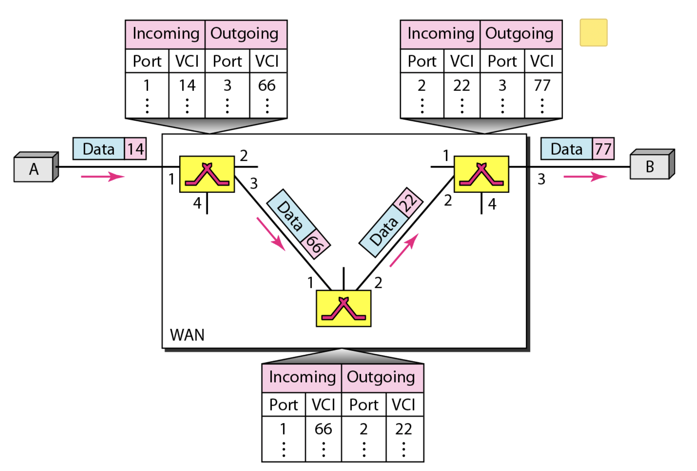

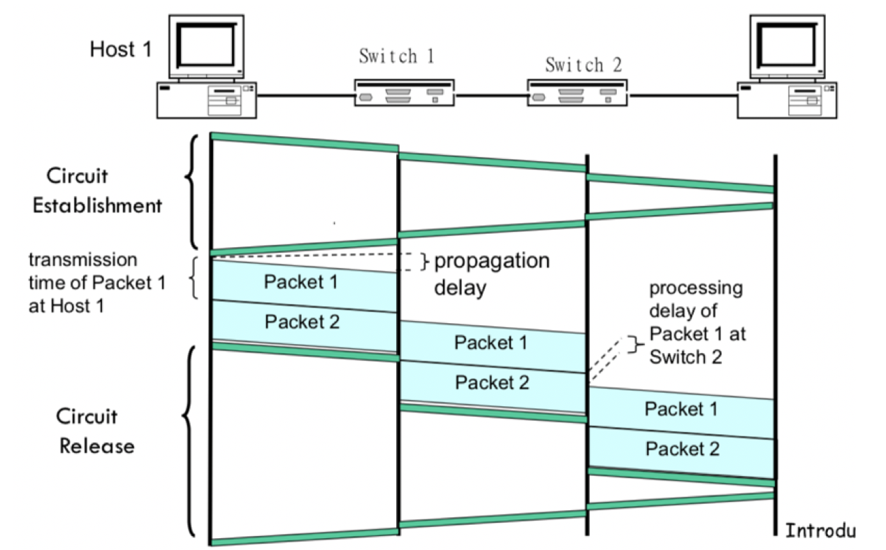

 

- VC types
  - PVC: 데이터가 전송되지 않을 때에도 논리적인 연결이 양단간에 성립, 상시 회선을 가상으로 유지, 고정적으로 회선이 결정
  - SVC: 필요시 에만 통신의 양단간에 경로가 유지되는 가상 회선 방식, 통신을 하면서 상대를 선택할 수도 있음.
    

**장점**

- 테이블의 30만개의 아이피가 들어있는데 쪼개서 넣어놓기 때문에 table 크기가 작고 따라서 검색 시간이 줄어들고packet switch 속도의 속도가 빨라진다.

- 자원이 call setup을 할 때 할당되므로 QoS를 보장할 수도 있다. 

- 패킷이 순서대로 도착한다.


**단점**

- call setup이 필요하다. 
- 모든 스위치가 연결상태를 유지해야 되므로 고장에 대해서 민감하다. (스위치가 고장 나면 다시 연결이 필요하다)


###### 보충 3. Internet structure

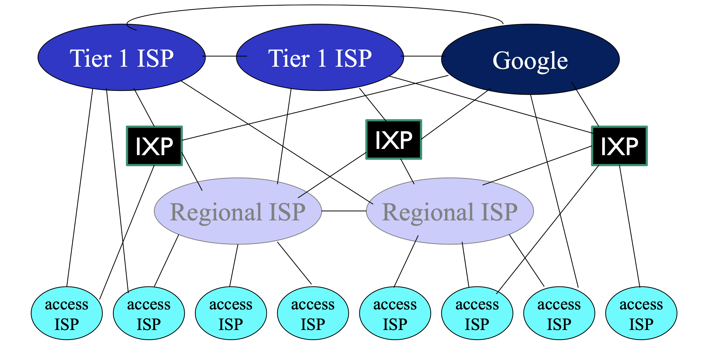

- IXP(Internet exchange point): ISP에서 access net으로 직접 연결되면 경쟁이 일어날 수 있으니 IXP로 묶어놓았다.

- Regional net: ISP에서 access net으로 직접 연결되면 관리가 어려우니 regional net을 두어 연결한다.

- Content provide network: ISP이외에 구글이나, 마이크로소프트 등 큰 회사가 ISP역할을 하기도 한다.

 


#### 네트워크 성능

- Throughput: bps, 일정시간 내 얼마나 많은 양의 data를 전송할 수 있는지

  - 수신자와 발신자의 bits / time 에 따라 달라진다.
  - 병목현상(bottleneck link): 느린 link의 속도로 맞춰진다.

  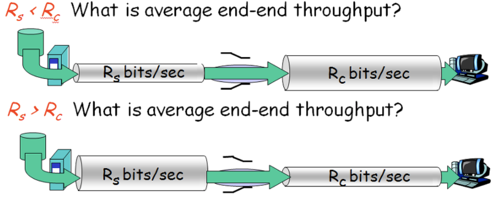

 

​	**계산**

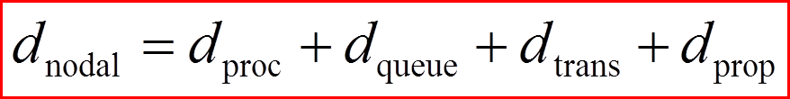
	Delay: packet이 목적지까지 도달하는데 걸리는 시간.

1. processing : bit 에러 체크, 출력 링크 결정

2. queueing : 출력 링크에 전송을 위한 대기 시간, 라우터의 혼잡 규모에 의존         

   R = 링크 대역폭 (bps),  L=패킷의 길이 (bits),  a = average packet arrival rate일 때,

   traffic intensity = La/R                                                       

   - La/R < 1: queueing 시간이 적게 걸린다                                           

   - La/R = 1: queueing 시간이 매우 커진다.                                     

   - La/R > 1: GG                           

   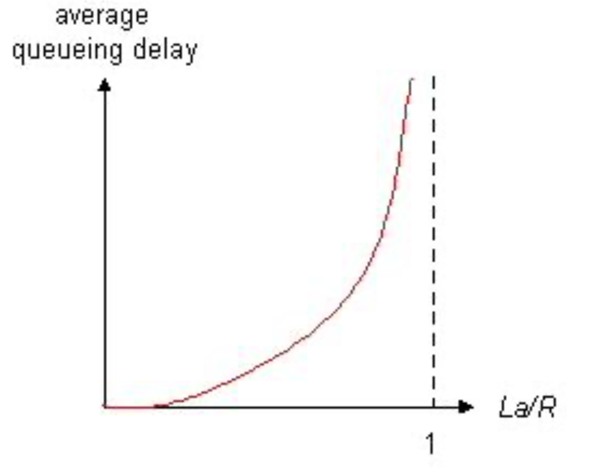

   cf> **packet loss**: 큐가 가득 차있는 경우 이전 노드에 의해 재전송되거나 버려진다.

   

   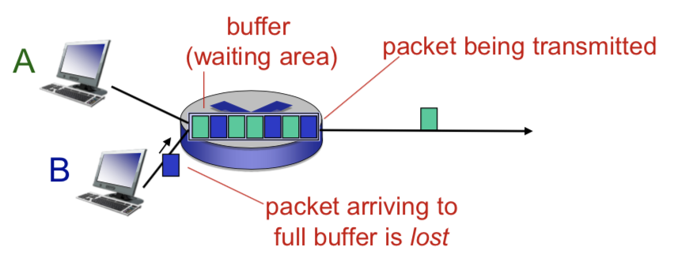

   

3. Transmission delay: **L / R** 

   ​			(L = packet length(bits) R = link bandwidth(bps))

4. propagation delay: **d / s** 

   ​			(d = length of physical link, s = propagation speed in medium (~2x10^8 m/sec))


 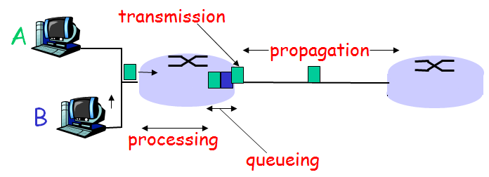

 


###### 문제 3


#### 네트워크 레이어

네트워크들은 워낙 복잡하기 때문에 계층별로 서비스를 구현해 모듈화하여 유지 보수 및 변화에 용이하도록 설계했다.

 

- 프로토콜 인터페이스
  - Service interface: 같은 호스트 다른 layer간의 인터페이스
  - Peer-to-peer interface: 다른 호스트 같은 layer 교환하는 메시지의 인터페이스

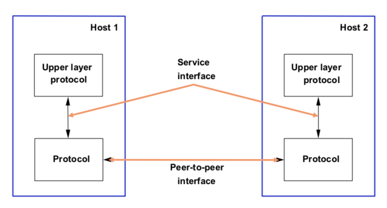

 

즉, Layer n은 layer n+1의 서비스 제공자이다.

(서비스는 SAP(Service Access Point)에서 이루어진다. )

- PDU (Protocol Data Unit) = Header(PCI)+n-SDU 

- SDU(Service Data Unit) = (n-1)-SDU

  Ex) L4: PDU(PCI+SDU) =>L3: SDU

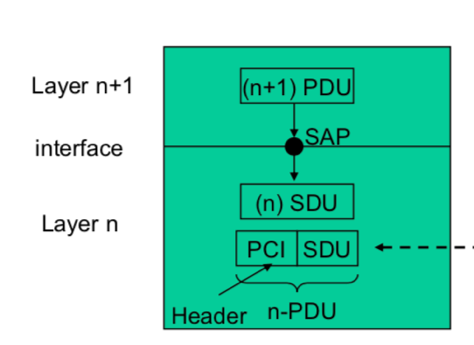 

 

 

- 기초 서비스

1. Request: 이벤트 요청.

2. Indication: 이벤트 알리기.

3. response: 이벤트 응답.

4. confirm: 이전 이벤트에 대한 응답이 돌아옴


Request와 confirm만 있을 수도 있고 response가 없을 수도 있다.
Layer가 반응해야 response과정이 있는 것.

 

 

- Internet protocol Stack
  - OSI 7계층 (OSI 7 layer reference model)

  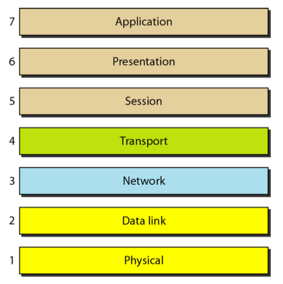

  | 계층         | 역할                                                      |
  | ------------ | --------------------------------------------------------- |
  | Physical     | 한 노드에서 다음 노드로 개별 비트를 이동시키는 역할       |
  | Data link    | 한 노드에서 다음 노드로 프레임을 이동시키는 역할          |
  | Network      | 원본 호스트에서 대상 호스트로 개별 패킷을 전달시키는 역할 |
  | Transport    | 한 프로세스에서 다른 프로세스로 메시지 배달               |
  | Session      | 대화 상자 제어 및 동기화 담당                             |
  | Presentation | 번역, 압축 및 암호화                                      |
  | Application  | 사용자에게 서비스 제공                                    |

  

  - 5 (or 4) layer structure

  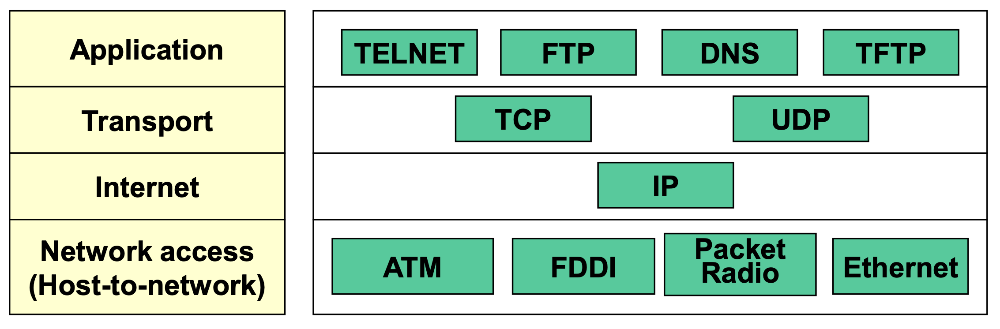

  ​	IETF (Internet Engineering Task Force)에 의해 정해졌다.

 

###### cf> Encapsulation

하위 레이어로 내려가면서 header와 trailer가 더해지면서 각 층의 통신 서비스를 도와주도록 캡슐화를 한다. 

상위 레이어로 다시 올라오면서 decapsulation한다.

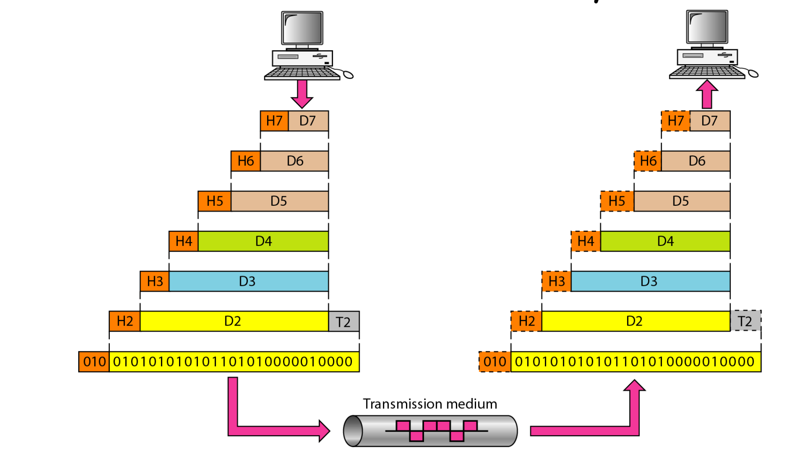

 

 


 #### 네트워크 보안

- Virus: 수신 / 실행 객체(ex 이메일 첨부)에 의한 자가 복제 감염

- Worm: 스스로 실행되는 객체를 직접 수신했을 때 자가 복제 감염

- Spyware: 키 입력 기록, 방문한 웹 사이트, 수집 사이트에 정보 업로드 가능

- DoS (Denial of Service), DDoS (Distributed Dos) - 봇넷 (botnet)

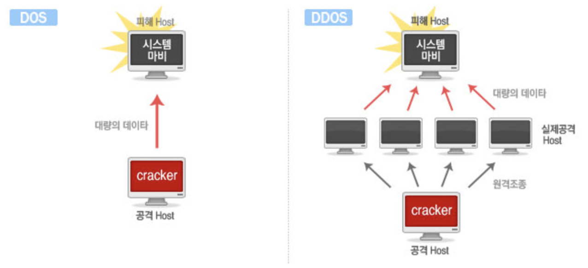

- Packet sniffing : 트래픽 도청

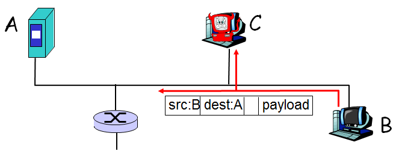

- IP spoofing: 출발지를 속여서 패킷 보내기

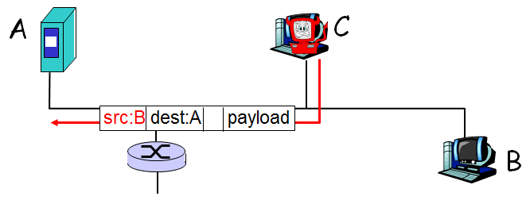

- Man-in-the-middle attack

: 네트워크 통신을 조작하여 통신 내용을 도청하거나 조작하는 공격 기법이다. 중간자 공격은 통신을 연결하는 두 사람 사이에 중간자가 침입하여, 두 사람은 상대방에게 연결했다고 생각하지만 실제로는 두 사람은 중간자에게 연결되어 있으며 중간자가 한쪽에서 전달된 정보를 도청 및 조작한 후 다른 쪽으로 전달한다.

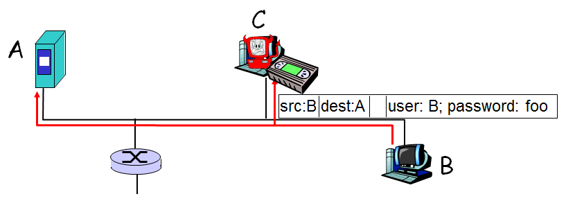


  

