[TOC]

## Chapter 2

### i. Application 구조

#### Client – server

- Server: 언제나 켜져 있고 IP주소는 고정되어 있다.
- Client: 클라이언트끼리 직접적으로 통신하지 않고 서버를 통해 통신, 동적인 IP, 간헐적 연결

​     Ex) Web (Client가 Server에게 object 요청 )

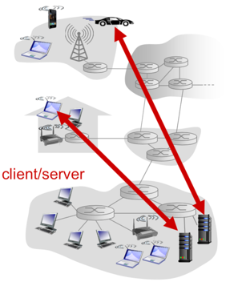

 

#### peer-to-peer

: 항상 켜져 있는 서버가 없고 클라이언트끼리 직접 통신한다.

- Peer들은 원할 때만 연결하고 IP주소를 변경한다. => 확장성(Scalability)이 높지만 관리하기 힘들다.

​     Ex) Bit torrent

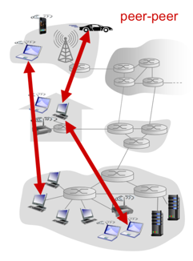

 

#### Hybrid

: p2p인데 정보를 관리하는 서버(Centralized server)가 있음

1. Skype(voice-over-IP P2P) 
2. Instant messaging

 유저의 IP주소를 중앙 서버에 저장하고 통신하기 전에 IP주소를 찾을 때만 서버와 통신한다. 이 때 통신의 실제 주체는 Process이다. 

###### 보충 1. 프로세스 통신

- 프로세스: 호스트에서 실행되는 프로그램
  - 서버 프로세스: 통신을 시작하기 위해 접속을 기다린다. (통신을 응답)
  - 클라이언트 프로세스: 통신을 시작 (= 초기화)

같은 host에서 실행되는 process간의 통신은 OS에서 제공하는 내부 통신을 이용한다

다른 host에서 실행되는 process간의 통신은 message를 교환을 한다.

 

- 소켓

: Application과 TCP/UDP나 다른 protocol stack 사이에 존재 

프로세스는 메시지를 소켓을 통해 보내고 받는다. 

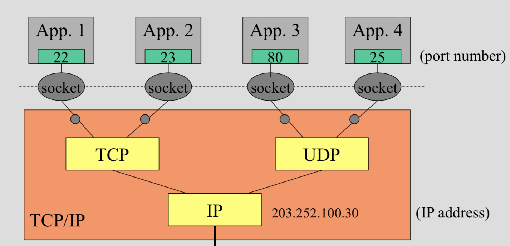

- 포트

: 한 호스트에서 여러 개의 process가 실행되기 때문에 구별하기 위한 숫자

0-1024번 포트는 **well-known port**라고 한다.

=> Process: 집, Socket: 출입문, Port: 방 

​       

###### 보충 2. App-layer protocol

: 메시지가 교환되는 rule, 메시지의 문법, 타입, 필드를 정의한 프로토콜, network application의 한 요소

- types: message 교환의 방식 	ex)request & response message
- syntax: message안에 field가 무엇이 있고 field가 어떻게 구분이 되어지는가
- semantics: 각각의 field가 어떤 의미를 가지고 있는가
- rules: 언제, 어떻게 프로세스가 메시지를 주고받을 것 인가

​              

###### 보충 3. Transport layer (TCP & UDP)란 무엇인가?

: 전송을 담당하는 계층

- Needs
  - 데이터 무결성(Data integrity): 데이터가 손실되지 않고 전송되는가
  - 처리량(Throughput): 처리 시간
  - 보안(Security)
  - 시간(Timing): delay 시간

어떤 application을 쓰느냐에 따라 어느 정도 허용치가 있다.

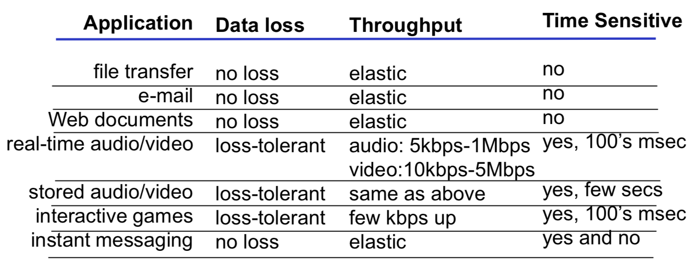

- Types
  - TCP: 연결 지향형, 신뢰 할 수 있는 데이터 전송 서비스 Ex) email, web, file transfer
    - Flow control: 받는 사람의 버퍼가 넘치는 것을 예방함
    - Congestion Control: 네트워크가 처리 가능한 양(traffic)을 제어, 속도

  ​       But, Timing과 대역폭은 보장하지 않는다. (IP가 해줌, Network layer) 

  

  - UDP: 비 연결 지향형, no handshaking, 아무것도 보장하지 않는다.

    Ex) 멀티미디어 스트리밍, 인터넷 전화

 

- Security

  TCP, UDP 둘다 Encryption이 없기 때문에 Security가 필요하다!

  - TLS (transport layer security) = SSL(secure socket layer)

    : Transport layer에서 server, client에 대한 인증 및 암호화 

  - DTLS(Datagram TLS): UDP상에서도 가능한 TLS

  

### ii. Web과 HTTP

#### Web

- 웹 페이지는 객체로 이루어져 있다.
  - 객체: 단순히 단일 URL로 지정할 수 있는 하나의 파일

    Ex) HTML, JPEG, JAVA audio file

- 각 object는 URL(Uniform resource locator)로 addressing 된다.

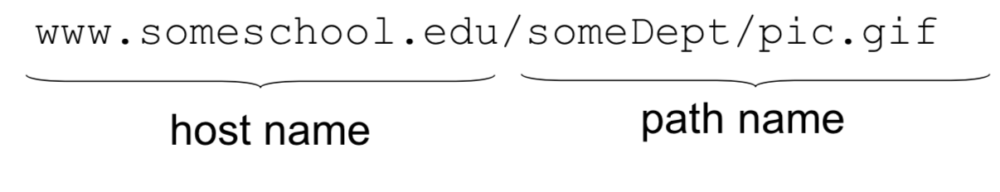

 

#### HTTP(Hyper Text Transfer Protocol)

웹의 App layer protocol, Hypertext object를 보내는데 사용한다.

##### 연결

- Model

  - Client: request, receive하고, web object를 보여주는 브라우저
  - Server: request에 대해서 object를 response 해주는 브라우저

  

- Protocol: TCP (port 80)

  - stateless protocol: 이전 요청에 대한 기록을 남기지 않는다. 파일을 보내고 연결을 끊는다.

  

- Connection

  - Non-Persistent

    1. 많아봐야 한 개의 객체를 TCP로 보내고 받는다.
    2. HTTP/1.0은 이 방식을 채택

    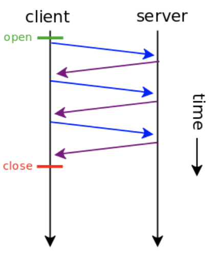

    3. 브라우저들은 주로 parallel TCP (한꺼번에 여러 개)의 연결을 열어서 객체를 가져옴

       

  - persistent

    1. 다수의 객체들이 단일 TCP연결
    2. 전송 후에도 연결을 유지
    3. HTTP/1.1 은 기본 값으로 이 방식을 채택
    4. 객체마다 1RTT(Round trip time)의 오버헤드가 감소
       - Persistent without pipelining: 한 개씩 요청을 받아서 처리한다. 
       - persistent with pipelining: 여러 개씩 요청을 받아서 처리한다. (HTTP/1.1)

​       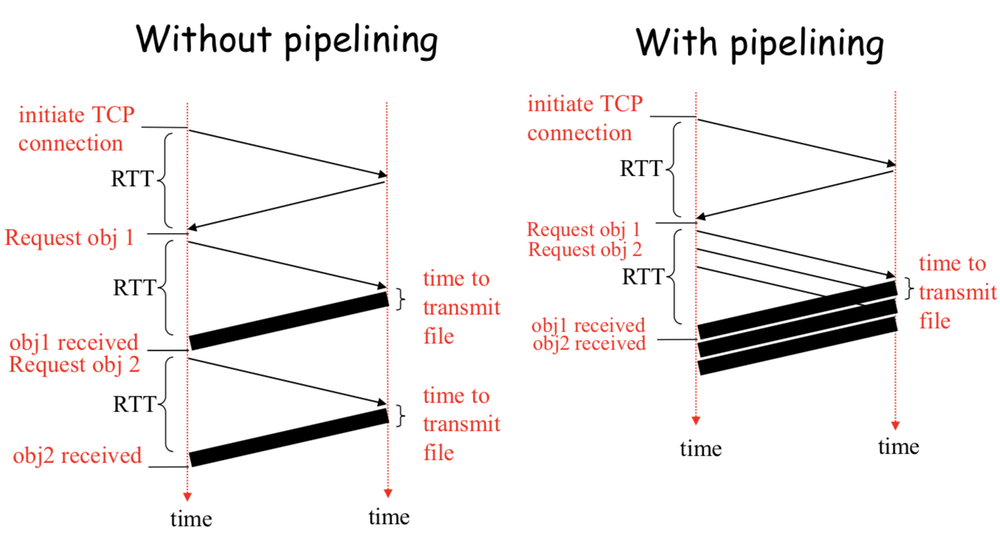

##### Contents

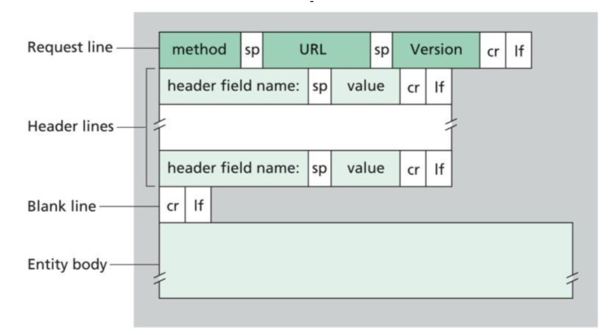

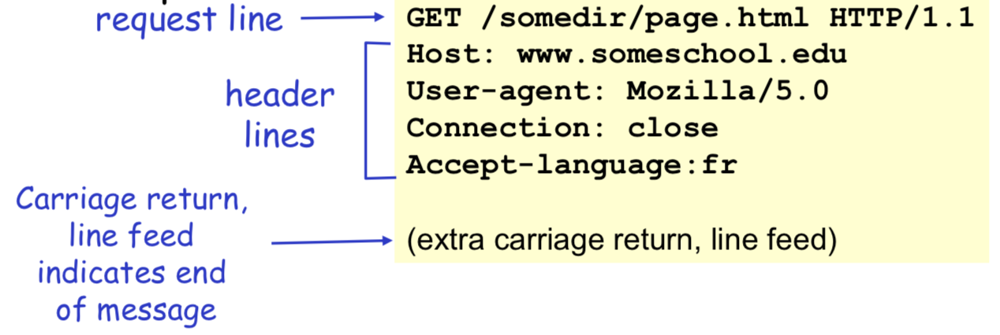

​	**1. HTTP Request Message**

​		i. Request line

​		- GET: URL field에서 값을 가져온다. Ex) 게시판 불러오기

​		\- PUT: 여러 번 해도 값의 변화가 없다. Ex) 게시판 글 수정

​		\- POST: 여러 번 하면 값이 여러 개 생김  Ex) 게시판 글 쓰기
 			=> CRUD: Create, Read, Update, Delete 4개 method로 동작 (C: POST, R: GET, U: PUT, D: DELETE)

###### GET vs. POST

- GET: URL 필드를 이용하여 업로드

- POST: entity body를 이용하여 업로드

GET은 해당 요청을 몇 번을 수행해도 해당 요청에 대한 결과가 계속 동일하게 돌아오는 것을 의미하며, POST는 해당 요청이 수행되면 서버에서 무언가 바뀌고, 동일한 결과가 돌아오는 것을 보장할 수 없다는 것을 의미한다.POST의 경우 GET과는 달리 쿼리 스트링(query string)의 글자 수 제약이 없으며, 파일업로드 등의 동작이 가능하다. 그리고 POST의 경우 쿼리스트링이 URL에 포함되지 않기때문에 user에게 파라미터 값 등을 덜 노출한 상태로 요청이 가능하다. 하지만 결국 HTTP 요청은 SSL을 이용하는 https가 아닌 경우 plain text로 이루어 지게 되고, 그러다 보니 요청을 열어보면 쿼리스트링이 동일하게 보이는 것은 마찬가지라 특별히 보안상 더 뛰어나다고는 말하기 힘들다.
  

​		ii. Header line

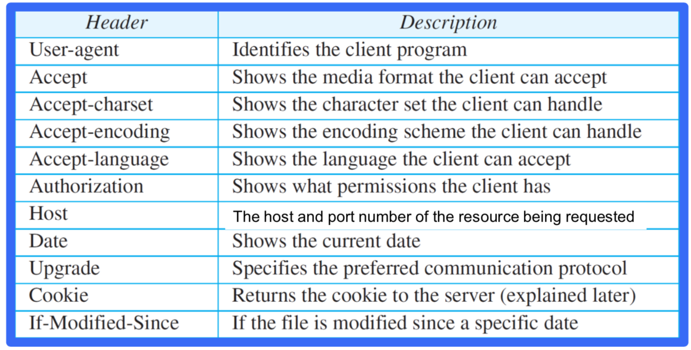

 

 

​	**2. HTTP Response Message**

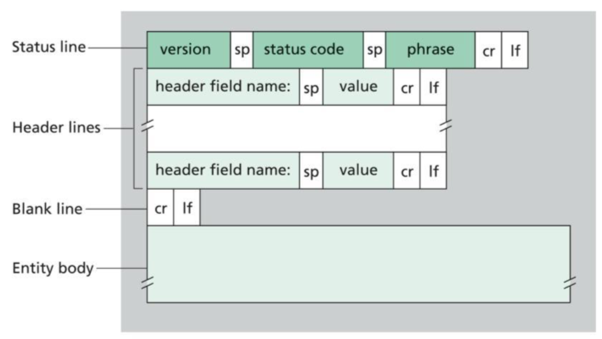

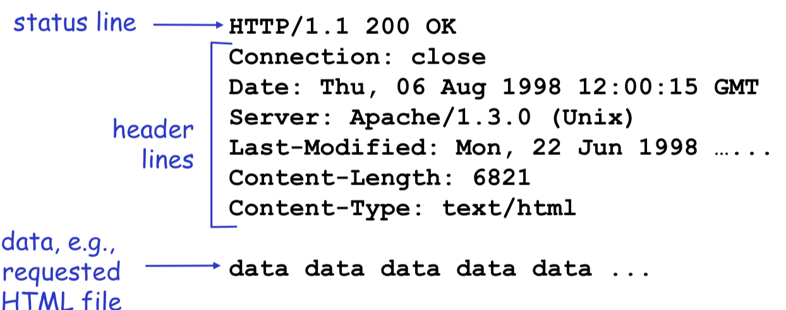

 

​		i. Status code: 3자리 정수

| Code | Message               | Description                                           |
| ---- | --------------------- | ----------------------------------------------------- |
| 200  | OK                    | 성공적으로 요청이 접수되었다.                         |
| 301  | Moved permanently     | 요청한 파일이 옮겨졌다. 옮겨진 주소가 메시지에 표시됨 |
| 400  | Bad Request           | 요청에 문법적 오류가 있다.                            |
| 404  | Not Found             | 요청한 문서가 서버에 없다.                            |
| 505  | Version Not Supported | HTTP 버전을 서버에서 지원하지 않는다.                 |

​    

 

​		ii. Header line

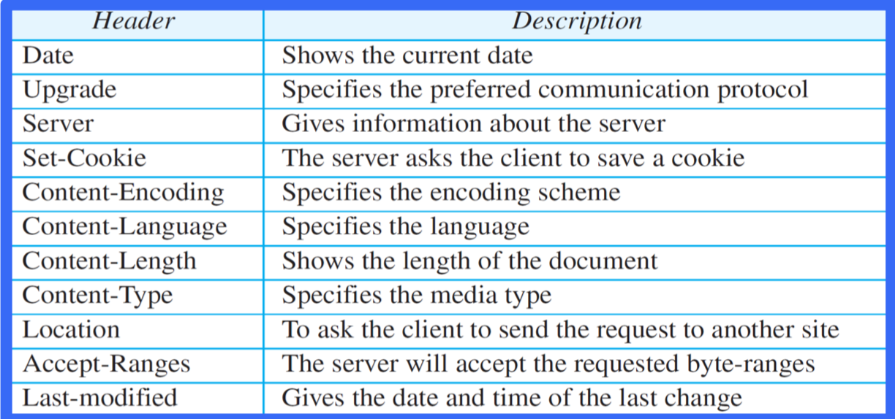

​       

#### Cookie

Server는 response를 보내고 나면 그 client는 잊어버린다. 웹사이트가 user를 구별하기 원하거나 user access를 제한하기를 원할 때 쿠키를 사용한다. Cookie는 작은 데이터 조각이고 실행할 수 없는 code이다, 직접적으로 고장을 일으키는 원인은 아니다.

 

- 동작원리

  - 서버가 새로운 user(Cookie가 없는 유저)임을 확인하면 user의 identifier(식별자)를 포함한 Set-Cookie header를 response한다.

  - Client는 Set-Cookie header에 있는 정보를 disk에 저장하고 다음에 같은 서버로 request할 때, 이를 사용한다.

    

- 구성
  - HTTP response message Set-Cookie header line
  - HTTP request Cookie header line
  - User의 browser와 host의 관리를 지속시키는 cookie file
  -  Web site의 back-end DB

 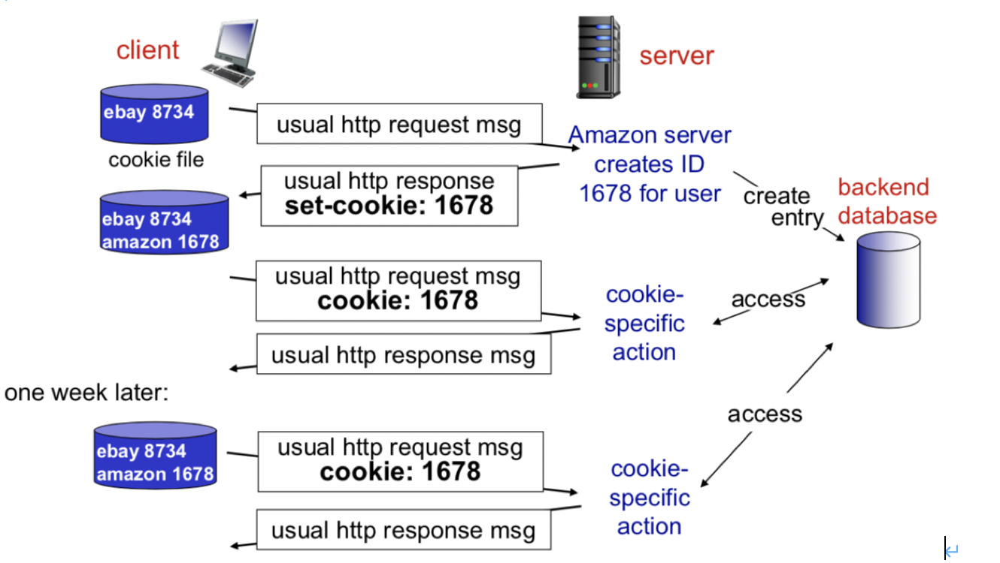

 

#### Web caching (proxy server)

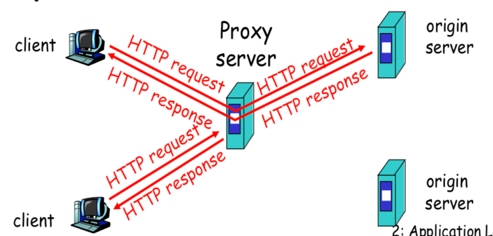

: Origin web server를 대신해서 중간에서 서비스해주는 네트워크 개체. 자체의 저장 디스크로 최근 request된 object의 사본을 저장한다.

- 유저 브라우저는 모든 요청을 프록시 서버로 보내도록 설정 되어야 한다.
- 만약 프록시 서버 요청한 object를 가지고 있다면 그대로 return
- 만약 없다면 프록시 서버는 원래 웹 서버에 object request를 보내고 응답 받아서 프록시 서버에 복사하고 유저 브라우저에 response한다.

| 장점                                                  | 단점                                            |
| ----------------------------------------------------- | ----------------------------------------------- |
| client의 request에 대한 response를 빠르게 할 수 있다. | Cache가 안된 object는 받아오는데 더 오래 걸린다 |
| 기관에 접속 회선의 traffic을 줄일 수 있다.            |                                                 |

###### 문제

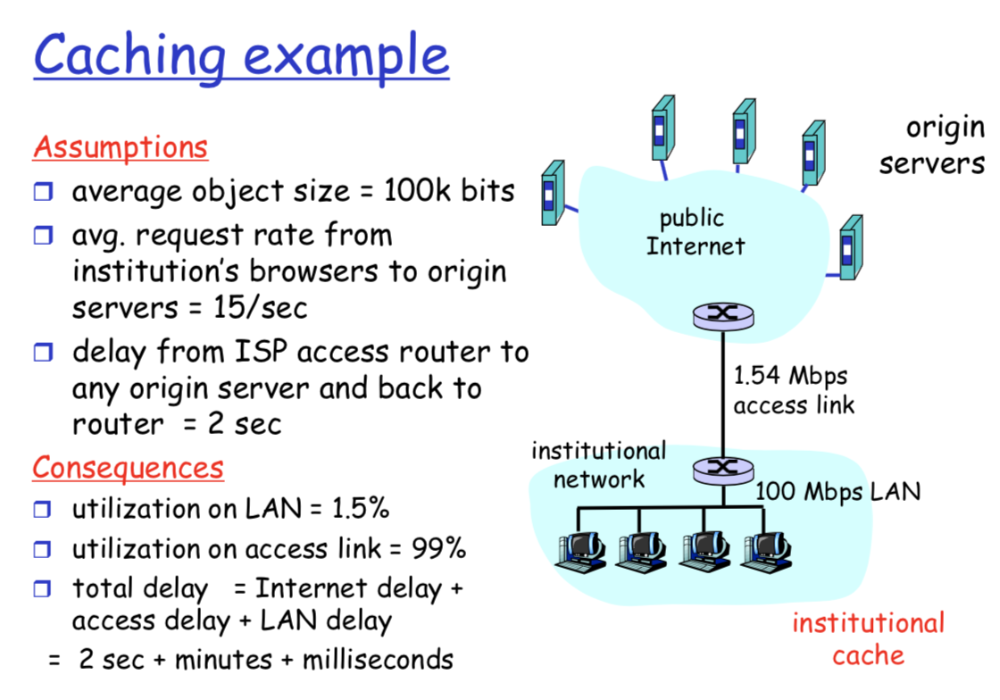

해결1: Access link의 대역폭을 증가시킨다. 여기선 10mpbs 정도로 

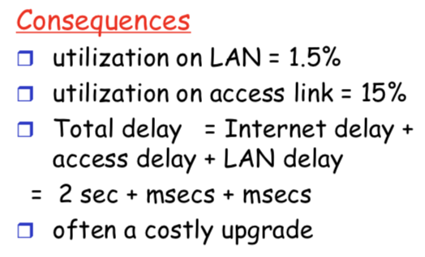=> 비싸다

 

해결2: Cache 서버를 LAN망 안에 둔다.

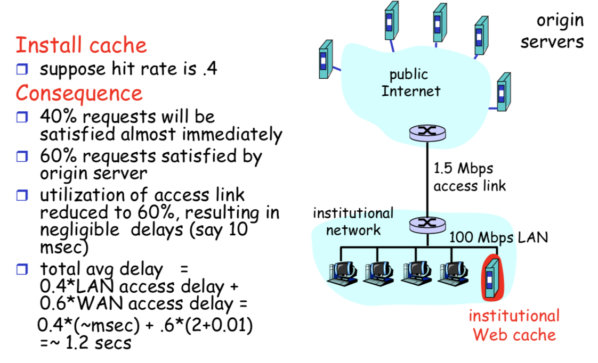

=> 문제점: Cache가 오래전 정보일 수 있다.

 

해결3: 조건부 get, 헤더라인에 If-modified-since를 추가해 브라우저가 cache에게 요청할 때 Cache는 Server에게 정보가 갱신되었는지 조사 후 response한다.

### iii. Mail

