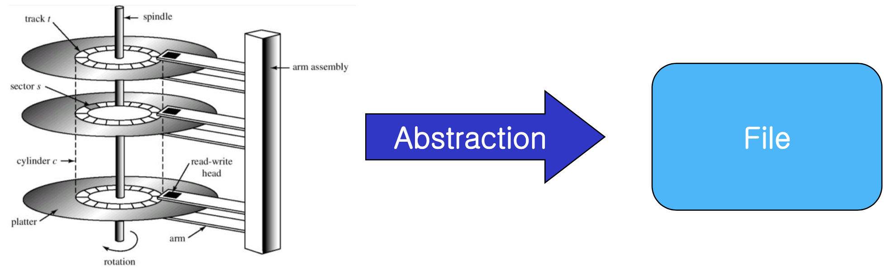
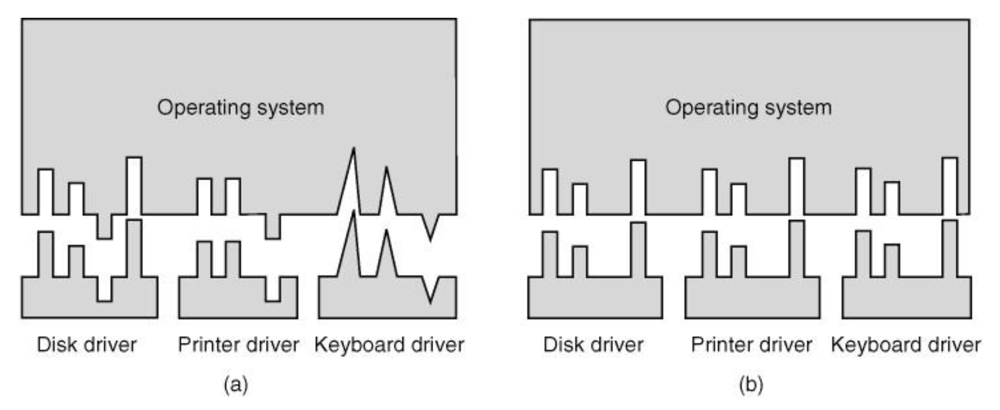
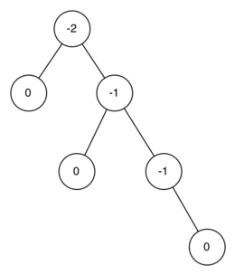
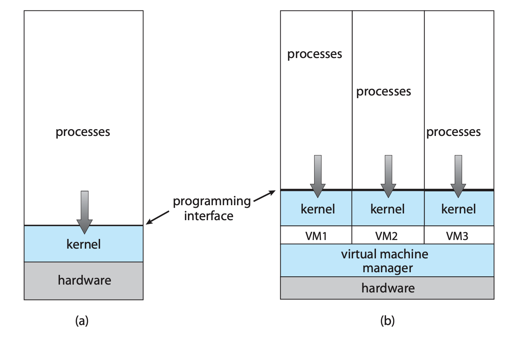

[TOC]


# 1. OS의 개요


## OS의 정의


**컴퓨터 시스템의 구성요소**

- 하드웨어: 기본 리소스를 제공한다 Ex) CPU, I/O device, memory
- OS(Operating System): CPU를 효율적으로 사용하기 위해 프로세스들에게 리소스를 적절하게 배분하고 통제하며 관리한다.
- Application Progrmas: 사용자의 목적을 달성하기 위한 프로그램들 Ex) Word, Spreadsheet, Compiler, etc..
- User


### OS는 무엇인가?

컴퓨터의 하드웨어를 관리해주는 프로그램이다. 즉, 하드웨어와 어플리케이션 사이에서 중개자. 하드웨어(CPU)의 효율적 이용을 위해 만들어졌다.

**OS = Kernel + additional programs (system program)**


* 커널(kernel): 운영 체제의 핵심 부분으로서, 운영 체제의 다른 부분 및 응용 프로그램 수행에 필요한 여러 가지 서비스를 제공한다. 컴퓨터가 켜진 순간 항상 커널은 작동한다.

- System program : OS와는 관련이 있지만 커널에 필수적인 부분은 아닌 프로그램
- application programs : OS와 전혀 관련 없는 프로그램


### OS는 무엇을 하는가? (System View)

- Control Program : 오류를 방지하고 프로그램을 통제한다.
  => 프로그램 하나가 잘못되어 일부나 다른 전체를 망칠 때 통제를 한다.  Ex) 블루 스크린

- Resource allocator: 시스템 리소스 관리, 하드웨어와 어플리케이션 사이에서 중개자
  => 한정된 CPU의 리소스를 많은 프로그램이 동시에 접근한다면, 충돌과 보안에서의 문제가 생길 것이므로 그것을 프로그램의 순서와 메모리 공간을 고려해 할당해주는 역할을 한다. 즉, 하드웨어(CPU)의 효율적 이용을 위해 만들어졌다.

- Providing environment: 자신 자체로는 아무 것도 하지 않지만, 사용자가 뭘 할 때 쉽게 해준다.


### OS의 존재 이유(목적)는 무엇인가?

- 사용자 프로그램을 실행하고 사용자 문제를 쉽게 해결하게 해줍니다.
- 컴퓨터 시스템을 사용하기 편리하게 만듭니다.
- 효율적인 방식으로 컴퓨터 하드웨어 사용합니다.


## 컴퓨터 시스템 구조과 동작

### 컴퓨터 시스템 동작

#### 컴퓨터 부팅에서 OS의 동작

1. 컴퓨터를 키면 Bootstrap program (firmware)이 실행된다.
2. firmware (하드웨어를 동작시키기 위한 소프트웨어. ROM, EEPROM) 체크
3. CPU의 레지스터부터 device controller, 메모리까지 모두 검사한다.
4. 오류가 없으면 Bootstrap loader가 하드웨어의 첫 번째 섹터에서 OS커널을 불러와서 메모리에 올려 실행한다. 


5. (Unix의 경우) `init`이라는 프로세스를 먼저 시작하고 다른 프로세스들을 시작합니다.
6. 그리고 이벤트를 기다리고 이벤트가 발생하면 처리한다. Ex) 키보드, 마우스 클릭
   => 최신 운영 체제는 인터럽트 기반 프로그램입니다.


#### Interrupt

: 주의를 끌기 위해 하드웨어나 소프트웨어에서 나오는 예측 불가능한 신호

별도의 코드들이 각 유형의 인터럽트에 대해 취해야 할 조치를 결정합니다. 각 유형의 표(interrupt vector)에 의거합니다.


- H/W interrupt: Sending signal to CPU

- S/W interrupt: System call ( = Moniter call)

  Ex) I/O access, memory allocation Excetption 

  Ex) Divide by zero, invalid memory aceess,


##### Interrupt Mechanism

: Interrupt가 발생하면 CPU가 지금 하는 일을 멈추고 interrupt handler (interrupt vector)를 실행한다. 발생한 인터럽트는 interrupt vector에 있는 어떤 한 interrupt handler랑 일치하고 알맞은 Handler로 처리한다.


예시 1

`scanf` 함수 호출 (CPU는 다른 일을 하는 중) -> 키 입력 (이벤트 발생) -> Interrupt (CPU에게 알림) -> Key buffer에 저장 -> CPU가 처리


### 컴퓨터 시스템 구조


**Common bus**: 컴퓨터 간에 데이터를 전송하는 하위 시스템 구성 요소들

- CPU, 메모리, device controller 모두 Common Bus에 연결되어 있다.
- I/O devices와 CPU를 동시에 실행 할 수 있다.
- 매우 간단하고 경제적이다.
- 각각의 장치는 local buffer를 가지고 있다.


#### 저장공간 구조 


- registers: CPU속에 있는 연산을 위한 조그마한 메모리 , buffer
- cache: 추후 설명


#### I/O 구조

- Old System

Busy waiting: CPU가 장치 상태를 계속 확인하고 있어야 한다. (No Interrupt)

 => CPU가 오직 I/O 디바이스만 기다린다 

 => 다른일을 할 수 가 없다. = 느리다.


- Modern systems

 1. Interrupt-driven I/O


- CPU가 컨트롤러한테 요청을 보낸다.

- I/O 요청이 완료되면 interrupt로 CPU에게 알린다.

이러한 형태의 인터럽트에 의한 I/O 방식은 소량의 데이터를 이동하는 데 적합하지만 디스크 I/O와 같은 대량 데이터 이동에 사용할 경우 높은 오버 헤드를 생성 할 수 있습니다. 이 문제를 해결하기 위해 직접 메모리 액세스 (DMA)가 사용됩니다.


2. DMA(Direct memory Access)

I / O 장치에 대한 버퍼, 포인터 및 카운터를 설정 한 후 장치 컨트롤러는 **CPU의 개입없이 전체 데이터 블록을 자체 버퍼 저장소에서 메모리로 직접 전송**합니다. CPU가 다른 일을 할 수 있고, 그만큼 성능이 향상된다.


## 컴퓨터 시스템 아키텍처

### Single-processor systems

Computer 1대 – CPU 1개

- 단가가 낮고 간단한 구성이다.

- User를 위한 프로세스라기보단 특수한 목적을 가진 디바이스를 위한 것


### Multi-processor Systems (Multi-core, parallel systems)

Computer 1대 – CPU 여러 개

- SMP(Symmetric multiprocessing) : 모든 CPU들이 동등한 자격(Peer)을 가진다.


- ASMP(Asymmetric multiprocessing) : CPU끼리 주종관계가 형성되어 있다. 마스터 CPU가 나머지 CPU의 자원을 배분한다.
  - 일정시간에 할 수 있는 처리량이 증가한다.
  - 안정성이 증가한다.
  - 메모리와 주변기기를 공유하기 때문에 경제성이 있다.


### Clustered Systems

Computer 여러 대 – CPU 여러 개


- SAN(storage-area network)를 통해 저장 공간을 공유한다.
   - SAN: 블록 수준 데이터 스토리지에 대한 액세스를 제공하는 전용 네트워크


- High-availability : 여러 대의 컴퓨터가 있기 때문에 한 컴퓨터가 죽어도 나머지로 버팀
- DLM(Distributed lock manger)지원: 여러대의 컴퓨터가 같은 데이터를 수정하는 것을 방지
- 고성능


## OS의 구조

옛날엔 CPU와 I/O 디바이스의 용량이 작아서 최대한 저 CPU와 I/O 디바이스를 바쁘게 쓰려는 의도에서 만들어진 구조이다. 그러다가 효율적으로 쓰는 방향을 개선해 나갔다.


### 효율성 측면

#### Multiprogramming

멀티프로그래밍은 CPU의 사용률을 **job scheduling**을 통해 높혔다. 하지만 메인 메모리는 모든 job들을 수용하기엔 너무 작아서 처음엔 job pool에다가 저장을 했다. 

- Job pool: 디스크에 위치하며 메인 메모리로 올라가기 기다리는 모든 job의 저장소 이다.

자발적으로 어쩌다 한번 job switching을 하고 CPU는 한번에 하나의 job을 처리 할 수 있다.


#### Multitasking (Timesharing)

CPU가 job들을 빠르게 자주 바꿔줌으로써 사용자가 각각의 프로그램이랑 interact할 수 있게 해준다.

- response time < 1sec.
- CPU scheduler가 준비된 job을 선택한다.
  - CPU scheduler: cpu time를 배분해주는 모듈 (다음 job은 무엇인가?)


#### Virtual Memory
메인 메모리가 부족해 physical disk를 메모리처럼 쓰는 것

- Swapping
- Virtual Memory


가상 메모리는 응용 프로그램의 메모리 공간이 연속적인 것 처럼 보이는 컴퓨터 시스템 기술이지만 실제로는 물리적으로 조각화되어 디스크 스토리지로 넘칠 수도 있습니다.


### 안정성 측면

#### Dual mode operation

여러 프로세스들이 메모리를 공유하기 때문에 한 프로세스가 모두를 해칠 수 있다. 
-> 중요한 명령어를 따로 구분을 해 두었다.

- user mode (mode bit=1)

: previlieged instructions 같은 다른 시스템에 해를 끼질 수 있는 코드 사용 불가
Ex) I/O instruction, timer instruction

- kernel mode (mode bit=0)

:supervisor mode, system mode, privileged mode
OS code, privileged instructions 허용


**듀얼 모드 작동의 장점** 

- 모드 위반 오류는 H / W로 감지하고 OS에서 처리 가능 
  - 시스템 정지없이 비정상 종료를 시킬 수 있음
  - 오류 메시지 혹은 메모리 덤프로 처리


cf> Function call을 사용하지 않는 이유?
Function call을 사용하면 mode bit가 바뀌지 않아 OS MODE에 진입할 수가 없다.


cf> 어떻게 OS모드를 신뢰할 수 있는가?
Interrupt는 os를 통해 cpu가 처리하고 그 처리기준은 interrupt vector이다. interrupt vector는 kernel에 의해 보증되었기 때문에 kernel모드를 신뢰할 수 있는 것이다.


**Time interrupt**

한 프로그램이 너무 많은 실행 시간을 가지고 있으면 강제로 메모리를 회수하는 것

- 작동

OS가 사용자 프로세스를 제어하기 전에 미리 정의 된 기간 후에 타이머가 인터럽트되도록 설정됩니다. 타이머 인터럽트가 발생하면 OS가 각 경우를 적절하게 처리하도록 제어 할 수 있습니다. 

타임 카운터는 previileged instruction으로 만 수정할 수 있습니다.


## OS의 코어 컴포넌트

### Process management

#### Process 관련 용어

##### ① Process: 실행중인 프로그램 (active entity)

두 프로세스가 동일한 프로그램에서 나왔다고 해도 개별 실행 시퀸스로 간주한다.

**- PC** (program counter, 레지스터 안에 있다) 
 실행할 다음 명령어 지정한다. 즉, sequence of machine instruction를 찾아준다.

 - 리소스를 필요로 한다.
 - 시스템을 구성하고 있는 유닛 
    system code를 실행시키는 OS 프로세스 =  + user code를 실행시키는 User 프로세스)


##### ② Thread: 프로그램 수행 시 프로세스 내부에 존재하는 수행 경로, 일련의 실행 코드

 한 프로세스에서 여러 갈래로 나뉘는 일 (프로세스는 껍데기일뿐, 실제 작업은 쓰레드가 담당한다.)

 - 각각의 쓰레드는 아이디, PC, 레지스터 셋, 스택 등을 각각 가지고 있다.
 - 한 프로세서에서 메모리를 공유한다. (= 리소스가 공유되는 수행 경로)


Cf> Single-thread, Multi-thread

 - 싱글 쓰레드 프로세스는 하나의 프로그램 카운터를 가진다.
 - 멀티쓰레드 프로세스는 여러개의 프로그램 카운터를 가진다. 
     - 멀티쓰레딩 : 하나의 프로세스 내에서 다수의 스레드가 동시에 수행되는 것


##### ③ Task: address space를 통한 수행 경로

 = 리소스가 공유되지 않는 다른 일
 Cf> Linux에선 프로세스인지 쓰레드인지 테스크인지 구별이 안된다.

- CPU에서 프로세스 및 스레드 예약
- 사용자 및 시스템 프로세스 생성 및 삭제
- 프로세스 일시 중지 및 재개
- 프로세스 동기화를위한 메커니즘 제공
- 프로세스 커뮤니케이션을 위한 메커니즘 제공


#### OS의 프로세스 관리

##### Process status management

1. Creation / deletion process
   : 프로세스 아이디, 메모리, PCB (process control block)를 OS kernel이 만들어 준다. like 학적부

2. Suspending / resuming process
3. Terminate process


##### Process synchronization

다른 프로세스가 같은 리소스를 요청할 때 교통정리를 하는 것


##### Process communication

원칙 상으로는 한 프로세스가 다른 프로세스에 간섭을 하지 못한다. 왜냐하면 프로세스가 서로를 죽일 수 있기 때문이다. 하지만 OS가 둘 사이를 연결해 전화의 형식으로 소통하게 해준다.


##### Dead lock Handling

 프로세스 A가 a라는 자원을 점유하고 있으며, 프로세스 B가 b라는 자원을 점유하고 있다. 이때 추가적인 작업을 위해 프로세스 A가 b 자원을 요청하고 프로세스 B가 a 자원을 요청하는 경우, 각 자원이 다른 프로세스에 의해 사용중이므로 해제가 될 때까지 대기하게 된다. 이런 경우 서로 자원을 해제할 때까지 무한히 대기하게 된다. 이것을 데드락이라고 한다.


### Memory Management

**메인 메모리**

- 현대 컴퓨터 시스템의 운영에 있어 핵심적인 부분
- 메인 메모리는 크기가 수십에서 수십억에 이르는 큰 바이트 배열이며 각각의 바이트는 고유의 주소를 갖는다.
- CPU 및 I/O장치에 의해 공유된 빠르게 액세스 할 수 있는 데이터 저장소


**OS의 메모리 관리**

- 현재 사용중인 메모리 부분과 사용중인 메모리 부분 추적
- 메모리 안팎으로 이동할 프로세스 (또는 프로세스의 일부) 및 데이터 결정
- 필요에 따라 메모리 공간 할당 및 할당 해제


### Storage Management

#### ① File-System Management by Os

- Physical storage: magnetic disk, optical disk, magnetic tape....
- File: OS에 의해 추상화 된 논리적 저장 장치




**파일시스템 관리**

- 파일 생성 및 삭제
- 디렉토리 생성 및 삭제
- 파일 및 디렉토리 조작을 위한 기본 요소 지원
- 보조 스토리지에 파일 매핑
- 안정적인 (비휘발성) 저장 매체에 파일 백업


#### ② Device Driver

디바이스 드라이버는 일관된 인터페이스를 제공합니다.



Q. Device driver vs Device controller의 차이점을 설명하세요


#### ③  Mass-Storage Management

**대용량 저장장치 관리**


메인메모리는 
1. 모든 데이터와 프로그램을 수용하기는 너무나 작다.
2. 휘발성 메모리이기 때문에 전원이 나가면 모두 지워진다.
-> 두 번째 저장 공간의 필요


- 여유 공간 관리 
- 스토리지 할당
- 디스크 스케줄링


#### ④ Caching

- Cache: 사용된 정보를 다음 액세스를 위한 작고 빠른 저장소에 있는 사용된 정보의 일시적 복사본
  - locality of reference: 뭘 불러오면 향후에 그것을 불러올 확률이 높다.

```
사용시 일시적으로 더 빠른 스토리지 시스템 (캐시)에 복제됩니다. 특정 정보가 필요할 때 먼저 캐시에 있는지 확인합니다. 만약 정보가 캐시에 있다면 캐시에서 직접 정보를 사용합니다. 그렇지 않은 경우 소스의 정보를 사용하여 곧 다시 필요할 것이라는 가정하에 캐시에 복사본을 넣습니다.
```


=> 메인 메모리는 보조 메모리의 캐시로 볼 수 있습니다.


**※ Cache coherency**

한 번에 한 프로세스만 돌아가는 싱글프로세스 환경에서는 어떤 자료에 대한 엑세스는 항상 계층 구조의 최상위 레벨에 복사본이기 때문에 A에 대한 접근은 문제가 없습니다.

 하지만 다음 그림과 같은 멀티태스킹 환경에서는 A에 대한 엑세스의 관리가 매우 중요합니다.

 

여러 프로세스가 A에 엑세스 하려고하면 이러한 각 프로세스는 가장 최근에 업데이트 된 A값을 얻습니다.
 이 상황은 내부 레지스터를 유지하는 멀티프로세스 환경에서는 더욱더 복잡해진다. 각각의 CPU들은 local cache를 포함하고 있어 A의 사본이 동시에 여러 캐시에 존재합니다. 여러 CPU들이 동시에 캐시를 실행할 수 있기 때문에, 한 캐시의 A값에 대한 업데이트가 A가 있는 다른 모든 local cache에 즉시 반영되는지 확인해야합니다. 다시 local cache들의 데이터값이 모두 같은가를 확인해야 합니다. 이 상황을 cache coherency라고 하고 하드웨어 이슈(OS시스템 레벨 아래서 다루는 문제)이다.

- Cache coherency: 공유 리소스의 로컬 캐시에 저장된 데이터의 무결성.


#### ⑤ I/O Systems

OS의 목적 중 하나는 특정 하드웨어 장치의 특성을 사용자로부터 숨기는 것이다.

예를 들어, 유닉스에서는 I/O장치 특성을 I/O장치 하위 시스템에 의해 운영 체제 자체의 대부분에서 숨겨진다.


**I/O의 하위 시스템의 구성 요소**

- 버퍼링, 캐싱, 스풀링을 포함하는 메모리 관리 요소

- 디바이스 드라이버 인터페이스
- 구체적 하드웨어 장치를 위한 드라이버 

=> 오직 디바이스 드라이버만 특정 드라이버가 어디 할당되어 있는지, 특성이 무엇인지 안다. 


### Protection and Security

- Protection: 리소스마다 이름을 붙여 나 아니면 사용하지 못하게 하는 것
- Security: 내 비밀번호를 훔쳐가지 못하게 하는 것


### Kernal Data Structure

#### Array

배열은 각 요소에 직접 액세스 할 수있는 간단한 데이터 구조입니다. 예를 들어, 메인 메모리는 배열로 구성됩니다. 저장되는 데이터 항목이 1 바이트보다 크면 항목에 여러 바이트를 할당 할 수 있으며 항목은 `항목 번호 × 항목 크기`로 지정됩니다. 

- 문제점

  - 크기가 다른 데이터의 저장이 불가

  - 나머지 데이터의 상대적 위치를 유지하면서 그 데이터 만 제거가 불가 

    => 다른 자료구조의 필요성


#### Linked list

배열의 각 항목은 직접 액세스 할 수 있지만 목록의 항목은 특정 순서로 액세스해야합니다. 하지만 리스트는 데이터를 시퀀스로 나타냅니다. 이 구조를 구현하는 가장 일반적인 방법은 linked list입니다. 

- 단일 연결 목록: 각 항목은 후속 항목을 가리 킵니다.


- 이중 연결 목록: 각 항목은 이전 항목 또는 후속 항목을 참조 할 수 있습니다.


- 순환 연결 목록: 목록의 마지막 요소는 null이 아닌 첫 번째 요소를 참조합니다.


**장점**: 다양한 크기의 항목을 수용하고 항목을 쉽게 삽입하고 삭제할 수 있습니다. 

**단점**: 크기 n의 목록에서 지정된 항목을 검색하는 성능이  O(n)입니다.


#### Stack

항목을 추가하고 제거하기 위해 LIFO (last in, first out) 원칙을 사용하는 순차적으로 정렬 된 데이터 구조. 


- 스택에 배치된 마지막 항목이 제거되는 첫 번째 항목입니다. 
- 스택에서 항목을 삽입하고 제거하는 작업을 각각 **Push** 및 **Pop**이라고합니다. 

운영 체제는 종종 함수 호출을 호출 할 때 스택을 사용합니다. 매개 변수, 지역 변수 및 반환 주소는 함수가 호출 될 때 스택으로 푸시됩니다. 함수 호출에서 반환하면 해당 항목이 스택에서 Pop됩니다.


#### Queue

대조적으로 큐는 FIFO (선입 선출) 원칙을 사용하는 순차적으로 정렬 된 데이터 구조입니다. 


- 데이터는 삽입된 순서대로 큐에서 제거됩니다. 
- 큐는 운영 체제에서도 매우 일반적입니다. Ex) 프린터로 전송되는 작업은 일반적으로 제출 된 순서대로 인쇄됩니다. 


#### Tree

데이터를 계층적으로 표현하는 데 사용할 수있는 데이터 구조. 

트리 구조의 데이터 값은 상위-하위 관계를 통해 연결됩니다. 

- 일반 트리: 부모는 무제한의 자식을 가질 수 있습니다. 

- 이진 트리: 부모는 최대 두 개의 자식을 가질 수 있으며 이를 왼쪽 자식과 오른쪽 자식이라고합니다. 

  - 순서: left child <= right child.

  - 복잡도

    - Unbalanced binary tree: 검색 O(n) 

    

    - Balanced binary tree: 검색 O(log n)


​					Linux가 CPU 스케줄링 알고리즘의 일부로 균형 이진 검색 트리를 사용하는 것을 볼 수 있습니다.


#### Hash Functions and Maps

**해시 함수**


데이터를 입력으로 사용하고 이 데이터에 대해 숫자 연산을 수행하고 숫자 값을 반환합니다. 

- 검색:  숫자 값을 테이블 (일반적으로 배열)에 대한 인덱스로 사용하여 데이터를 빠르게 검색 할 수 있습니다. 
- 복잡도: 테이블에서 데이터를 검색하기 위해 해시 함수를 사용하는 것은 최악의 경우에도 O(1)입니다. 

 이러한 성능 때문에 해시 함수는 운영 체제에서 광범위하게 사용됩니다. 


- 단점: **해시 충돌**

  두 입력이 동일한 출력 값을 생성 할 수 있습니다. 충돌이 많을수록 해시 함수의 효율성이 떨어집니다.


**해시 맵**

해시 함수를 사용하여 [key : value] 쌍을 연결 (또는 매핑)하여 해시 맵을 구현합니다.


#### Bitmaps

 비트 맵은 n개 항목의 상태를 나타내는 데 사용할 수있는 n개의 이진수 문자열입니다. 

- 여러 리소스가 있고 각 리소스의 가용성이 이진 숫자 값으로 표시됩니다. 
  - 0은 리소스를 사용할 수 있음을 의미하고 1은 사용할 수 없음을 나타냅니다 (또는 그 반대). 
- 비트 맵에서 i번째 위치의 값은 i번째 리소스와 연결됩니다. 

Ex)`001011101`
(앞에서 부터) 리소스 2, 4, 5, 6, 8은 사용할 수 없습니다. 리소스 0, 1, 3 및 7을 사용할 수 있습니다. 


비트 맵의 힘은 **공간 효율성**을 고려할 때 분명해집니다. 단일 비트 대신 8비트 부울 값을 사용하면 결과 데이터 구조가 8배 더 커집니다. 따라서 비트 맵은 많은 리소스의 가용성을 나타낼 필요가있을 때 일반적으로 사용됩니다.


### Computing Enviornments

#### 전통적 컴퓨팅

 20세기 후반에는 컴퓨팅 리소스가 상대적으로 부족했습니다. 따라서 컴퓨팅 리소스의 사용을 최적화하기 위해 여러 사용자가 이러한 시스템에서 멀티태스킹을 사용했습니다. Timesharing 시스템은 타이머와 스케줄링 알고리즘을 사용하여 CPU를 통해 프로세스를 빠르게 순환하여 각 사용자에게 리소스 공유를 제공했습니다.


#### 모바일 컴퓨팅

 모바일 컴퓨팅은 핸드 헬드 스마트 폰 및 태블릿 컴퓨터에서의 컴퓨팅을 의미합니다. 이러한 장치는 휴대 가능하고 가볍다는 특징을 갖습니다.

 지금까지 데스크톱에 비해 모바일 시스템은 전자 메일 및 웹 검색과 같은 서비스에 대한 핸드 헬드 모바일 액세스의 대가로 화면 크기, 메모리 용량 및 전체 기능을 포기했습니다. 그러나 지난 몇 년 동안 모바일 장치의 기능이 너무나 향상되어 노트북과 태블릿 간의 기능 차이를 식별하기 어렵습니다. 사실, 현대 모바일 장치의 기능은 데스크톱 또는 랩톱 컴퓨터에서 사용할 수 없거나 비실용적인 기능을 제공 할 수 있습니다.
 오늘날 모바일 시스템은 이메일 및 웹 브라우징뿐만 아니라 음악 및 비디오 재생, 디지털 책 읽기, 사진 촬영 및 고화질 비디오 녹화에도 사용됩니다. 따라서 이러한 장치에서 실행되는 광범위한 응용 프로그램에서 엄청난 성장이 계속됩니다. 

 현재 많은 개발자들이 GPS (Global Positioning System) 칩, 가속도계 및 자이로 스코프와 같은 모바일 장치의 고유 한 기능을 활용하는 애플리케이션을 설계하고 있습니다. 내장 된 GPS 칩을 통해 모바일 장치는 위성을 사용하여 지구상의 정확한 위치를 확인할 수 있습니다. 이 기능은 내비게이션을 제공하는 응용 프로그램을 설계하는 데 특히 유용합니다. 예를 들어 사용자에게 걷거나 운전할 방법을 알려주거나 레스토랑과 같은 근처 서비스로 안내 할 수 있습니다. 가속도계를 사용하면 모바일 장치가 지면에 대한 방향을 감지하고 기울이기 및 흔들림과 같은 특정 다른 힘을 감지 할 수 있습니다. 가속도계를 사용하는 여러 컴퓨터 게임에서 플레이어는 마우스 나 키보드를 사용하는 것이 아니라 모바일 장치를 기울이고, 회전하고, 흔들어 시스템과 통신합니다..
 온라인 서비스에 대한 액세스를 제공하기 위해 모바일 장치는 일반적으로 IEEE 표준 802.11 무선 또는 셀룰러 데이터 네트워크를 사용합니다. 

그러나 모바일 장치의 메모리 용량과 처리 속도는 PC보다 제한적입니다. 스마트 폰이나 태블릿의 저장 공간은 GB 단위이지만 데스크톱 컴퓨터의 저장 공간은 TB 단위입니다. 또한 전력 소비 문제에서 모바일 장치는 기존 데스크톱 및 랩톱 컴퓨터에서 볼 수있는 프로세서보다 더 작고, 느리고, 더 적은 처리 코어를 제공하는 프로세서를 자주 사용합니다.
 현재 모바일 컴퓨팅에서 지배적인 운영 체제는 Apple iOS와 Google Android입니다. iOS는 Apple iPhone 및 iPad 모바일 장치에서 실행되도록 설계되었습니다. Android는 여러 제조업체에서 제공하는 스마트 폰과 태블릿 컴퓨터를 지원합니다. 2장에서이 두 가지 모바일 운영 체제에 대해 자세히 살펴 봅니다.


#### 분산 시스템

분산 시스템은 시스템이 유지 관리하는 다양한 리소스에 대한 액세스 권한을 사용자에게 제공하기 위해 네트워크로 연결된 물리적으로 분리 된 이기종 컴퓨터 시스템의 모음입니다. 공유 리소스에 액세스하면 계산 속도, 기능, 데이터 가용성 및 안정성이 향상됩니다. 일부 운영 체제는 네트워크 인터페이스의 장치 드라이버에 포함 된 네트워킹 세부 정보를 사용하여 네트워크 액세스를 파일 액세스의 한 형태로 일반화합니다. 다른 것들은 사용자가 특별히 네트워크 기능을 호출하도록합니다. 일반적으로 시스템에는 두 가지 모드 (예 : FTP 및 NFS)가 혼합되어 있습니다. 분산 시스템을 만드는 프로토콜은 해당 시스템의 유용성과 인기에 큰 영향을 미칠 수 있습니다.
간단히 말해서 네트워크는 둘 이상의 시스템 간의 통신 경로입니다. 분산 시스템은 기능을 위해 네트워킹에 의존합니다. 네트워크는 사용되는 프로토콜, 노드 간 거리 및 전송 매체에 따라 다릅니다. TCP / IP는 가장 일반적인 네트워크 프로토콜이며 인터넷의 기본 아키텍처를 제공합니다. 대부분의 운영 체제는 모든 범용 운영 체제를 포함하여 TCP / IP를 지원합니다. 일부 시스템은 필요에 맞게 독점 프로토콜을 지원합니다. 운영 체제에서 네트워크 프로토콜은 관리를위한 장치 드라이버와 데이터를 처리 할 소프트웨어가있는 인터페이스 장치 (예 : 네트워크 어댑터) 만 있으면됩니다. 이러한 개념은이 책 전체에서 논의됩니다.
네트워크는 노드 사이의 거리에 따라 특성화됩니다. LAN (Local-area Network)은 방, 건물 또는 캠퍼스 내의 컴퓨터를 연결합니다. 광역 네트워크 (WAN)는 일반적으로 건물, 도시 또는 국가를 연결합니다. 예를 들어, 글로벌 기업은 전 세계 사무실을 연결하는 WAN을 가질 수 있습니다. 이러한 네트워크는 하나 또는 여러 프로토콜을 실행할 수 있습니다. 새로운 기술의 지속적인 출현은 새로운 형태의 네트워크를 제공합니다. 예를 들어 MAN (Metropolitan-Area Network)은 도시 내의 건물을 연결할 수 있습니다. BlueTooth 및 802.11 장치는 무선 기술을 사용하여 몇 피트 거리에서 통신하며, 본질적으로 전화와 헤드셋 또는 스마트 폰과 데스크톱 컴퓨터간에 PAN (개인 영역 네트워크)을 만듭니다.
네트워크를 전달하는 매체는 똑같이 다양합니다. 여기에는 구리선, 섬유 가닥 및 위성, 전자 레인지 접시 및 라디오 간의 무선 전송이 포함됩니다. 컴퓨팅 장치가 휴대폰에 연결되면 네트워크가 생성됩니다. 매우 단거리 적외선 통신도 네트워킹에 사용할 수 있습니다. 초보적인 수준에서 컴퓨터는 통신 할 때마다 네트워크를 사용하거나 만듭니다. 이러한 네트워크는 성능과 안정성도 다양합니다.
일부 운영 체제는 네트워크 연결을 제공하는 개념보다 네트워크 및 분산 시스템의 개념을 더 많이 취했습니다. 네트워크 운영 체제는 서로 다른 컴퓨터의 서로 다른 프로세스가 메시지를 교환 할 수 있도록하는 통신 체계와 함께 네트워크를 통한 파일 공유와 같은 기능을 제공하는 운영 체제입니다. 네트워크 운영 체제를 실행하는 컴퓨터는 네트워크를 인식하고 다른 네트워크 컴퓨터와 통신 할 수 있지만 네트워크의 다른 모든 컴퓨터에서 자율적으로 작동합니다. 분산 운영 체제는 덜 자율적 인 환경을 제공합니다. 서로 다른 컴퓨터는 하나의 운영 체제 만 네트워크를 제어한다는 착각을 일으킬만큼 밀접하게 통신합니다. 17 장에서는 컴퓨터 네트워크와 분산 시스템을 다룹니다.


#### Client-Server 시스템

PC가 더 빠르고 강력하고 저렴 해짐에 따라 설계자는 중앙 집중식 시스템 아키텍처에서 멀어졌습니다. 중앙 집중식 시스템에 연결된 터미널은 이제 PC와 모바일 장치로 대체되고 있습니다. 이에 따라 중앙 집중식 시스템에서 직접 처리 한 사용자 인터페이스 기능은 점점 더 자주 웹 인터페이스를 통해 PC에서 처리되고 있습니다. 결과적으로 오늘날의 많은 시스템은 클라이언트 시스템에서 생성 된 요청을 충족시키는 서버 시스템 역할을합니다. 클라이언트-서버 시스템이라고하는이 형태의 특수 분산 시스템은 그림 1.18과 같은 일반적인 구조를 가지고 있습니다.
서버 시스템은 컴퓨팅 서버 및 파일 서버로 크게 분류 할 수 있습니다.
• 컴퓨팅 서버 시스템은 클라이언트가 작업 수행 (예 : 데이터 읽기) 요청을 보낼 수있는 인터페이스를 제공합니다. 이에 대한 응답으로 서버는 작업을 실행하고 결과를 클라이언트에 보냅니다. 데이터에 대한 클라이언트 요청에 응답하는 데이터베이스를 실행하는 서버가 이러한 시스템의 한 예입니다.
• 파일 서버 시스템은 클라이언트가 파일을 생성, 업데이트, 읽기 및 삭제할 수있는 파일 시스템 인터페이스를 제공합니다. 이러한 시스템의 예로는 웹 브라우저를 실행하는 클라이언트에 파일을 전달하는 웹 서버가 있습니다.


#### Peer-to-Peer 시스템

분산 시스템의 또 다른 구조는 P2P (Peer-to-Peer) 시스템 모델입니다. 이 모델에서 클라이언트와 서버는 서로 구별되지 않습니다. 대신 시스템 내의 모든 노드는 피어로 간주되며 서비스 요청 또는 제공 여부에 따라 각 노드가 클라이언트 또는 서버 역할을 할 수 있습니다. 피어 투 피어 시스템은 기존 클라이언트-서버 시스템에 비해 이점을 제공합니다. 클라이언트-서버 시스템에서 서버는 병목 현상입니다. 그러나 피어 투 피어 시스템에서는 네트워크 전체에 분산 된 여러 노드에서 서비스를 제공 할 수 있습니다.
피어-투-피어 시스템에 참여하려면 노드가 먼저 피어 네트워크에 가입해야합니다. 노드가 네트워크에 연결되면 네트워크의 다른 노드에 서비스를 제공하고 서비스를 요청할 수 있습니다. 사용 가능한 서비스를 결정하는 것은 다음 두 가지 일반적인 방법 중 하나로 수행됩니다.
• 노드가 네트워크에 가입하면 해당 서비스를 네트워크의 중앙 조회 서비스에 등록합니다. 특정 서비스를 원하는 노드는 먼저이 중앙 집중식 조회 서비스에 연결하여 서비스를 제공하는 노드를 결정합니다. 나머지 통신은 클라이언트와 서비스 공급자간에 이루어집니다.
• 대체 체계는 중앙 집중식 조회 서비스를 사용하지 않습니다. 대신 클라이언트 역할을하는 피어는 네트워크의 다른 모든 노드에 서비스 요청을 브로드 캐스트하여 원하는 서비스를 제공하는 노드를 찾아야합니다. 해당 서비스를 제공하는 노드 (또는 노드)는 요청을하는 피어에 응답합니다. 이 접근 방식을 지원하려면 피어가 네트워크의 다른 피어가 제공하는 서비스를 검색 할 수 있도록 검색 프로토콜을 제공해야합니다. 그림 1.19는 이러한 시나리오를 보여줍니다.

피어 투 피어 네트워크는 1990 년대 후반에 피어가 서로 파일을 교환 할 수있는 Napster 및 Gnutella와 같은 여러 파일 공유 서비스를 통해 널리 보급되었습니다. Napster 시스템은 위에서 설명한 첫 번째 유형과 유사한 접근 방식을 사용했습니다. 중앙 집중식 서버는 Napster 네트워크의 피어 노드에 저장된 모든 파일의 인덱스를 유지하고
피어 노드간에 파일 교환이 발생했습니다. Gnutella 시스템은 두 번째 유형과 유사한 기술을 사용했습니다. 클라이언트는 시스템의 다른 노드에 파일 요청을 브로드 캐스트하고 요청을 서비스 할 수있는 노드는 클라이언트에 직접 응답했습니다. P2P 네트워크를 사용하여 저작권이있는 자료 (예 : 음악)를 익명으로 교환 할 수 있고 저작권이있는 자료의 배포를 규제하는 법률이 있기 때문에 파일 교환의 미래는 불확실합니다. 특히 Napster는 저작권 침해로 법적 문제를 겪었고 2001 년에 서비스가 중단되었습니다.
Skype는 피어 투 피어 컴퓨팅의 또 다른 예입니다. 이를 통해 클라이언트는 VoIP (Voice over IP)라는 기술을 사용하여 인터넷을 통해 음성 통화 및 영상 통화를하고 문자 메시지를 보낼 수 있습니다. Skype는 하이브리드 P2P 방식을 사용합니다. 여기에는 중앙 집중식 로그인 서버가 포함되지만 분산 형 피어도 통합되어 두 피어가 통신 할 수 있습니다.


#### 가상화

가상화는 운영 체제가 다른 운영 체제 내에서 응용 프로그램으로 실행될 수 있도록하는 기술입니다. 처음에는 그러한 기능에 대한 이유가 거의없는 것 같습니다. 그러나 가상화 산업은 방대하고 성장하고 있으며 이는 그 유용성과 중요성에 대한 증거입니다.
일반적으로 가상화는 에뮬레이션도 포함하는 소프트웨어 클래스의 한 구성원입니다. 에뮬레이션은 소스 CPU 유형이 대상 CPU 유형과 다를 때 사용됩니다. 예를 들어 Apple이 데스크톱 및 랩톱 컴퓨터를 위해 IBM Power CPU에서 Intel x86 CPU로 전환했을 때 "Rosetta"라는 에뮬레이션 기능이 포함되어 IBM CPU 용으로 컴파일 된 애플리케이션이 Intel CPU에서 실행될 수 있습니다. 동일한 개념을 확장하여 한 플랫폼 용으로 작성된 전체 운영 체제를 다른 플랫폼에서 실행할 수 있습니다. 그러나 에뮬레이션에는 많은 비용이 듭니다. 소스 시스템에서 기본적으로 실행되는 모든 컴퓨터 수준 명령은 대상 시스템에서 동일한 기능으로 변환되어야하며, 결과적으로 여러 대상 명령이 생성되는 경우가 많습니다. 소스 및 대상 CPU의 성능 수준이 비슷한 경우 에뮬레이션 된 코드가 네이티브 코드보다 훨씬 느리게 실행될 수 있습니다.
에뮬레이션의 일반적인 예는 컴퓨터 언어가 네이티브 코드로 컴파일되지 않고 대신 고급 형식으로 실행되거나 중간 형식으로 변환 될 때 발생합니다. 이것을 해석이라고합니다. BASIC과 같은 일부 언어는 컴파일하거나 해석 할 수 있습니다. 반대로 Java는 항상 해석됩니다. 해석은 고급 언어 코드가 기본 CPU 명령어로 변환되어 다른 CPU가 아니라 해당 언어가 기본적으로 실행될 수있는 이론적 가상 머신을 에뮬레이트한다는 점에서 에뮬레이션의 한 형태입니다. 따라서 "Java 가상 머신"에서 Java 프로그램을 실행할 수 있지만 기술적으로 이러한 가상 머신은 Java 에뮬레이터입니다.
반대로 가상화를 사용하면 특정 CPU 아키텍처에 대해 기본적으로 통합 된 운영 체제는 해당 CPU의 기본 운영 체제에서도 실행됩니다. 가상화는 여러 사용자가 동시에 작업을 실행할 수있는 방법으로 IBM 메인 프레임에서 처음 시작되었습니다. 여러 가상 머신을 실행하면 많은 사용자가 단일 사용자 용으로 설계된 시스템에서 작업을 실행할 수 있습니다. 나중에 Intel x86 CPU에서 여러 Microsoft Windows XP 응용 프로그램을 실행하는 문제에 대응하여 VMware는 XP에서 실행되는 응용 프로그램의 형태로 새로운 가상화 기술을 만들었습니다. 해당 응용 프로그램은 각각 자체 응용 프로그램을 실행하는 Windows 또는 기타 기본 x86 운영 체제의 게스트 복사본을 하나 이상 실행했습니다. (그림 1.20 참조) Windows는 호스트 운영 체제이고 VMware 애플리케이션은 가상 머신 관리자 VMM이었습니다. VMM은 게스트 운영 체제를 실행하고 리소스 사용을 관리하며 각 게스트를 다른 게스트로부터 보호합니다.
최신 운영 체제는 여러 응용 프로그램을 안정적으로 실행할 수 있지만 가상화 사용은 계속 증가하고 있습니다. 랩톱 및 데스크톱에서 VMM을 사용하면 탐색을 위해 여러 운영 체제를 설치하거나 기본 호스트가 아닌 운영 체제 용으로 작성된 응용 프로그램을 실행할 수 있습니다. 예를 들어 x86 CPU에서 Mac OS X를 실행하는 Apple 노트북은 Windows 게스트를 실행하여 Windows 응용 프로그램을 실행할 수 있습니다. 여러 운영 체제 용 소프트웨어를 작성하는 회사는 가상화를 사용하여 개발, 테스트 및 디버깅을 위해 단일 물리적 서버에서 이러한 운영 체제를 모두 실행할 수 있습니다. 데이터 센터 내에서 가상화는 컴퓨팅 환경을 실행하고 관리하는 일반적인 방법이되었습니다. VMware, ESX 및 Citrix XenServer와 같은 VMM은 더 이상 호스트 운영 체제에서 실행되지 않고 오히려 호스트입니다. 가상화의 기능 및 구현에 대한 자세한 내용은 16 장에 있습니다.




#### 클라우드 컴퓨팅

클라우드 컴퓨팅은 컴퓨팅, 스토리지 및 애플리케이션을 네트워크를 통해 서비스로 제공하는 컴퓨팅 유형입니다. 어떤면에서는 가상화를 기능의 기반으로 사용하기 때문에 가상화의 논리적 확장입니다. 예를 들어 Amazon Elastic Compute Cloud (EC2) 시설에는 인터넷의 모든 사람이 사용할 수있는 수천 개의 서버, 수백만 개의 가상 머신 및 페타 바이트의 스토리지가 있습니다. 사용자는 사용하는 리소스의 양에 따라 매월 지불합니다.
실제로 다음을 포함하여 많은 유형의 클라우드 컴퓨팅이 있습니다.

- 퍼블릭 클라우드 — 인터넷을 통해 서비스 비용을 지불하고자하는 모든 사람이 사용할 수있는 클라우드
- 사설 클라우드 — 해당 회사가 자체적으로 사용하기 위해 회사에서 운영하는 클라우드
- 하이브리드 클라우드 — 퍼블릭 및 프라이빗 클라우드 구성 요소를 모두 포함하는 클라우드
- SaaS (Software as a Service)-인터넷을 통해 사용할 수있는 하나 이상의 애플리케이션 (예 : 워드 프로세서 또는 스프레드 시트)
- PaaS (Platform as a Service)-인터넷을 통해 애플리케이션에서 사용할 수있는 소프트웨어 스택 (예 : 데이터베이스 서버)
- IaaS (Infrastructure as a Service)-인터넷을 통해 사용할 수있는 서버 또는 스토리지 (예 : 프로덕션 데이터의 백업 복사본을 만드는 데 사용할 수있는 스토리지)

클라우드 컴퓨팅 환경은 여러 유형의 조합을 제공 할 수 있으므로 이러한 클라우드 컴퓨팅 유형은 개별적이지 않습니다. 예를 들어 조직은 SaaS와 IaaS를 모두 공개적으로 사용 가능한 서비스로 제공 할 수 있습니다.
물론 여러 유형의 클라우드 인프라 내에는 기존 운영 체제가 있습니다. 그 외에도 사용자 프로세스가 실행되는 가상 머신을 관리하는 VMM이 있습니다. 더 높은 수준에서 VMM 자체는 Vware vCloud Director 및 오픈 소스 Eucalyptus 도구 세트와 같은 클라우드 관리 도구로 관리됩니다. 이러한 도구는 주어진 클라우드 내에서 리소스를 관리하고 클라우드 구성 요소에 대한 인터페이스를 제공하므로 새로운 유형의 운영 체제로 간주 할 수 있습니다.
그림 1.21은 IaaS를 제공하는 퍼블릭 클라우드를 보여줍니다. 클라우드 서비스와 클라우드 사용자 인터페이스는 모두 방화벽으로 보호됩니다.


#### 실시간 임베디드 시스템

임베디드 컴퓨터는 현존하는 가장 일반적인 형태의 컴퓨터입니다. 이러한 장치는 자동차 엔진 및 제조 로봇에서 DVD 및 전자 레인지에 이르기까지 모든 곳에서 볼 수 있습니다. 그들은 매우 구체적인 작업을하는 경향이 있습니다. 실행되는 시스템은 일반적으로 원시적이므로 운영 체제는 제한된 기능을 제공합니다. 일반적으로 사용자 인터페이스가 거의 없거나 전혀 없으며 자동차 엔진 및 로봇 팔과 같은 하드웨어 장치를 모니터링하고 관리하는 데 시간을 보내는 것을 선호합니다.
이러한 임베디드 시스템은 상당히 다양합니다. 일부는 기능을 구현하기위한 특수 목적 응용 프로그램과 함께 Linux와 같은 표준 운영 체제를 실행하는 범용 컴퓨터입니다. 다른 것은 원하는 기능 만 제공하는 특수 목적의 임베디드 운영 체제가있는 하드웨어 장치입니다. 그러나 다른 것은 운영 체제없이 작업을 수행하는 ASIC (application-specific integrated circuit)이있는 하드웨어 장치입니다.
임베디드 시스템의 사용은 계속해서 확대되고 있습니다. 독립형 장치와 네트워크 및 웹 요소로서 이러한 장치의 힘도 증가 할 것입니다. 지금도 집 전체를 컴퓨터화할 수 있으므로 중앙 컴퓨터 (범용 컴퓨터 또는 임베디드 시스템)가 난방 및 조명, 경보 시스템, 커피 메이커까지 제어 할 수 있습니다. 웹 액세스를 통해 주택 소유자는 집에 도착하기 전에 집에 난방을 할 수 있습니다. 언젠가 냉장고는 우유가 사라진 것을 알게되면 식료품 점에 알릴 수 있습니다.
임베디드 시스템은 거의 항상 실시간 운영 체제를 실행합니다. 실시간 시스템은 프로세서의 작동이나 데이터 흐름에 엄격한 시간 요구 사항이있을 때 사용됩니다. 따라서 전용 애플리케이션에서 제어 장치로 자주 사용됩니다. 센서는 데이터를 컴퓨터로 가져옵니다. 컴퓨터는 데이터를 분석하고 가능하면 센서 입력을 수정하기 위해 컨트롤을 조정해야합니다. 과학 실험, 의료 영상 시스템, 산업 제어 시스템 및 특정 디스플레이 시스템을 제어하는 시스템은 실시간 시스템입니다. 일부 자동차 엔진 연료 분사 시스템, 가전 제품 컨트롤러 및 무기 시스템도 실시간 시스템입니다.
실시간 시스템에는 잘 정의되고 고정 된 시간 제약이 있습니다. 정의 된 제약 조건 내에서 처리를 수행해야합니다. 그렇지 않으면 시스템이 실패합니다. 예를 들어, 로봇 팔이 조립중인 차에 부딪친 후 정지하라는 지시를받는 것은 아닙니다. 실시간 시스템은 시간 제약 내에서 올바른 결과를 반환하는 경우에만 올바르게 작동합니다. 이 시스템을 신속하게 대응하는 것이 바람직하지만 (필수는 아님) 시분할 시스템이나 시간 제약이 전혀없는 배치 시스템과 대조하십시오.
6 장에서는 운영 체제에서 실시간 기능을 구현하는 데 필요한 스케줄링 기능을 고려합니다. 9 장에서는 실시간 컴퓨팅을위한 메모리 관리 설계에 대해 설명합니다. 마지막으로 18 장과 19 장에서는 Linux 및 Windows 7 운영 체제의 실시간 구성 요소에 대해 설명합니다.


### 오픈소스 OS

이 장의 시작 부분에서 수많은 오픈 소스 릴리스의 가용성으로 인해 운영 체제 연구가 더 쉬워 졌다고 언급했습니다. 오픈 소스 운영 체제는 컴파일 된 바이너리 코드가 아닌 소스 코드 형식으로 제공되는 운영 체제입니다. Linux는 가장 유명한 오픈 소스 운영 체제이고 Microsoft Windows는 반대되는 폐쇄 소스 접근 방식의 잘 알려진 예입니다. Apple의 Mac OS X 및 iOS 운영 체제는 하이브리드 접근 방식으로 구성됩니다. 여기에는 Darwin이라는 오픈 소스 커널이 포함되어 있지만 독점적 인 비공개 소스 구성 요소도 포함되어 있습니다.
프로그래머는 소스 코드로 시작하여 시스템에서 실행할 수있는 바이너리 코드를 생성 할 수 있습니다. 반대로 바이너리에서 소스 코드를 역 엔지니어링하는 것은 상당히 많은 작업이며 주석과 같은 유용한 항목은 복구되지 않습니다. 소스 코드를 검사하여 운영 체제를 학습하면 다른 이점도 있습니다. 소스 코드를 가지고 학생은 운영 체제를 수정 한 다음 코드를 컴파일하고 실행하여 이러한 변경 사항을 시험해 볼 수 있습니다. 이는 훌륭한 학습 도구입니다. 이 텍스트에는 운영 체제 소스 코드 수정과 관련된 프로젝트가 포함되어 있으며 모든 중요한 운영 체제 주제가 다루어 지도록 높은 수준의 알고리즘을 설명합니다. 본문 전체에 걸쳐 심도있는 연구를 위해 오픈 소스 코드 예제에 대한 포인터를 제공합니다.
코드를 디버그하고, 분석하고, 지원을 제공하고, 변경 사항을 제안하여 코드에 기여하는 관심있는 (일반적으로 무료) 프로그래머 커뮤니티를 포함하여 오픈 소스 운영 체제에는 많은 이점이 있습니다. 많은 사람들이 코드를보고 있기 때문에 오픈 소스 코드는 닫힌 소스 코드보다 더 안전합니다. 확실히 오픈 소스 코드에는 버그가 있지만, 오픈 소스 옹호자들은 코드를 사용하고 보는 사람들의 수가 많기 때문에 버그가 더 빨리 발견되고 수정되는 경향이 있다고 주장합니다. 프로그램을 판매하여 수익을 얻는 회사는 종종 코드를 오픈 소스하는 것을 주저하지만 Red Hat과 수많은 다른 회사는 코드를 오픈 소스 할 때 영리 기업이 손해를 보지 않고 이익을 얻는다는 것을 보여주고 있습니다. 예를 들어, 지원 계약 및 소프트웨어가 실행되는 하드웨어 판매를 통해 수익을 창출 할 수 있습니다.


#### Linux

오픈 소스 운영 체제의 예로 GNU / Linux를 고려하십시오. GNU 프로젝트는 컴파일러, 편집기 및 유틸리티를 포함하여 많은 UNIX 호환 도구를 생성했지만 커널을 릴리스하지 않았습니다. 1991 년 핀란드의 한 학생 인 Linus Torvalds는 GNU 컴파일러와 도구를 사용하여 초보적인 UNIX 계열 커널을 출시하고 전 세계에 기여를했습니다. 인터넷의 출현으로 관심있는 사람은 누구나 소스 코드를 다운로드하여 수정하고 변경 사항을 Torvalds에 제출할 수 있습니다. 일주일에 한 번 업데이트를 출시함으로써이 소위 Linux 운영 체제가 빠르게 성장하고 수천 명의 프로그래머에 의해 향상되었습니다.
그 결과 GNU / Linux 운영 체제는 시스템의 수백 개의 고유 한 배포 또는 사용자 지정 빌드를 생성했습니다. 주요 배포에는 RedHat, SUSE, Fedora, Debian, Slackware 및 Ubuntu가 포함됩니다. 배포는 기능, 유틸리티, 설치된 응용 프로그램, 하드웨어 지원, 사용자 인터페이스 및 목적에 따라 다릅니다. 예를 들어 RedHat Enterprise Linux는 대규모 상업적 사용에 적합합니다. PCLinuxOS는 LiveCD입니다. 시스템의 하드 디스크에 설치하지 않고도 CD-ROM에서 부팅하고 실행할 수있는 운영 체제입니다. "PCLinuxOS Supergamer DVD"라고하는 PCLinuxOS의 한 변형은 그래픽 드라이버와 게임이 포함 된 LiveDVD입니다. 게이머는 DVD에서 부팅하기 만하면 모든 호환 시스템에서 실행할 수 있습니다. 게이머가 완료되면 시스템을 재부팅하면 설치된 운영 체제로 재설정됩니다.


#### BSD UNIX

BSD UNIX는 Linux보다 길고 복잡한 역사를 가지고 있습니다. 1978 년 AT & T UNIX에서 파생 된 제품으로 시작되었습니다. University of California at Berkeley (UCB)의 릴리스는 소스 및 바이너리 형식으로 제공되었지만 AT & T의 라이센스가 필요했기 때문에 오픈 소스가 아닙니다. BSD UNIX의 개발은 AT & T의 소송으로 인해 느려졌지만 결국 완전한 기능을 갖춘 오픈 소스 버전 인 4.4BSD-lite가 1994 년에 출시되었습니다.
Linux와 마찬가지로 FreeBSD, NetBSD, OpenBSD 및 DragonflyBSD를 포함하여 BSD UNIX 배포판이 많이 있습니다. FreeBSD의 소스 코드를 탐색하려면 Linux에 대해 위에서 설명한대로 관심있는 버전의 가상 머신 이미지를 다운로드하고 VMware 내에서 부팅하면됩니다. 소스 코드는 배포판과 함께 제공되며 / usr / src /에 저장됩니다. 커널 소스 코드는 / usr / src / sys에 있습니다. 예를 들어 FreeBSD 커널의 가상 메모리 구현 코드를 조사하려면 / usr / src / sys / vm의 파일을 참조하십시오.
Mac OS X의 핵심 커널 구성 요소 인 Darwin은 BSD UNIX를 기반으로하며 오픈 소스이기도합니다. 해당 소스 코드는 http://www.opensource.apple.com/에서 구할 수 있습니다. 모든 Mac OS X 릴리스에는 해당 사이트에 게시 된 오픈 소스 구성 요소가 있습니다. 커널이 포함 된 패키지 이름은 "xnu"로 시작합니다. Apple은 또한 http://connect.apple.com에서 광범위한 개발자 도구, 문서 및 지원을 제공합니다. 자세한 내용은 부록 A를 참조하십시오.


#### Solaris

Solaris는 Sun Microsystems의 상용 UNIX 기반 운영 체제입니다. 원래 Sun의 SunOS 운영 체제는 BSD UNIX를 기반으로했습니다. Sun은 1991 년 AT & T의 System V UNIX를 기반으로 전환했습니다. 2005 년 Sun은 대부분의 Solaris 코드를 OpenSolaris 프로젝트로 오픈 소스했습니다. 그러나 2009 년 Oracle이 Sun을 인수하면서이 프로젝트의 상태가 불분명 해졌습니다. 2005 년의 소스 코드는 소스 코드 브라우저를 통해 계속 사용할 수 있으며 http://src.opensolaris.org/source에서 다운로드 할 수 있습니다.
OpenSolaris 사용에 관심이있는 여러 그룹이 그 기반에서 시작하여 기능을 확장했습니다. 그들의 작업 세트는 프로젝트 Illumos로, OpenSolaris 기반에서 확장되어 더 많은 기능을 포함하고 여러 제품의 기반이되었습니다. Illumos는 http://wiki.illumos.org에서 사용할 수 있습니다.

