[TOC]


# 2. OS 구조

## Operating System Service

**사용자를 위한 서비스**

- UI 
  - CLI(커맨드라인 인터페이스)
  - batch Interface: 명령을 제어하는 명령과 지시문을 파일에 입력하고 해당 파일을 실행
  - GUI(Graphic User Interface)
- Program execution
- I/O operations:  프로세스는 I/O가 필요한데 효율과 안정성을 위해 유저가 직접 I/O장치에 엑세스할 수 없게 만들고 OS를 통해 대신 제공하게 했다 .
- File-system manipulation
- Error detection
- Communications: 프로세스 간의 정보공유통신, 사전 정의된 형식의 정보 패킷이 운영체제에 의해 프로세스간 이동


**효율적인 시스템을 그 자체를 위한 기능**

- Resource allocation
  - 여러 프로세스가 돌아갈 때 메모리의 할당
  - CPU 스케줄링 루틴
- Accounting: 우리가 어떻게 또는 얼마나 리소스를 사용하는지 파악하고 저장한다.  
- Protection and security

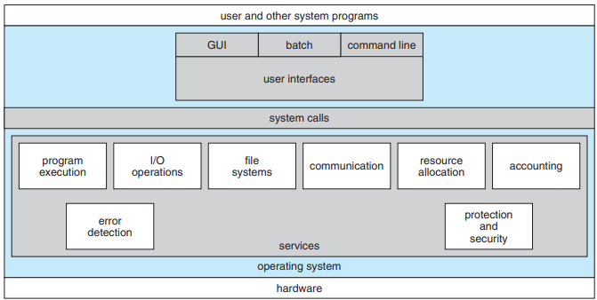 


## Operating System Interface

### User and Operating-System Interface

#### Command Interpreters

일부 운영 체제에는 커널에 명령 인터프리터가 포함되어 있습니다.

CI의 주 기능은 유저의 구체적인 커맨드를 받아서 실행하는 것이다. 여러 개의 커맨드들은 다음과 같은 파일 관리요청을 수행할 수 있어야 한다. (create, delete, list print, copy, execute..)

MS-DOS 및 UNIX 셸은 이러한 방식으로 작동합니다. 이러한 명령은 두 가지 일반적인 방법으로 구현할 수 있습니다.

첫 번째 방법은 CI 스스로가 커맨드를 실행할 코드를 포함하는 것이다. 예를 들어 삭제를 명령 할 때 CI는 매개 변수를 설정하고 적절한 시스템 호출으로 하는 코드의 섹션으로 점프합니다.
이 경우에는 각각의 명령들은 자체 구현코드가 필요하기 때문에 CI의 크기가 결정될 수 있다.

두 번째 방법은 유닉스에서 쓰이는 방법인데, 명령 실행은 시스템 프로그램에 의해 결정되는 경우이다. 이 상황에서는 CI는 어떤 식으로든 명령을 이해하지 못하고 단지 명령을 사용하여 메모리에 로드되어 실행될 파일을 식별한다. 예를 들어, 유닉스 명령인 rm a.txt를 사용할 때, rm라는 파일을 호출하고 메모리에 올리고 rm의 매개변수 a.txt를 설정하고 실행합니다. 즉 rm명령과 관련된 기능은 파일 rm의 코드에 의해 완전히 정의되는 것이다.
이 경우 프로그래머들은 적절한 이름으로 새로운 파일을 만듬으로서 쉽게 새로운 명령을 추가할 수 있다. 


#### Graphical User Interfaces

데스크탑 은유를 특징으로하는 마우스 기반 창 및 메뉴 시스템.

사용자는 마우스를 움직여 프로그램, 파일, 디렉토리 및 시스템 기능을 나타내는 화면 (바탕 화면)의 이미지 또는 아이콘에 포인터를 놓습니다. 마우스 포인터의 위치에 따라 마우스 버튼을 클릭하면 프로그램이 호출되고, 파일 또는 디렉토리 (폴더라고 함)를 선택하거나 명령이 포함 된 메뉴를 풀다운 할 수 있습니다.

- history
  - Xerox Alto computer (1973)
  - Apple Macintosh (1980s)
  - MS-Windows
  - Desktops based on X-window (CDE, KDE, GNOME)
  - 3D desktop (XGL, SphereXP, …)


### Programming Interfaces

#### System Calls (=Interrupt)

<OS - System call>

시스템 호출은 운영 체제에서 사용할 수있는 서비스에 대한 인터페이스를 제공합니다. 이러한 호출은 일반적으로 C 및 C ++로 작성된 루틴으로 사용할 수 있지만 특정 하위 수준 작업 (예 : 하드웨어에 직접 액세스해야하는 작업)은 어셈블리 언어 명령을 사용하여 작성해야 할 수 있습니다. 운영 체제에서 시스템 호출을 사용 가능하게하는 방법을 논의하기 전에 먼저 시스템 호출이 사용되는 방법을 설명하는 예제를 사용하겠습니다. 간단한 프로그램을 작성하여 한 파일에서 데이터를 읽고 다른 파일로 복사합니다. 프로그램에 필요한 첫 번째 입력은 입력 파일과 출력 파일이라는 두 파일의 이름입니다. 이러한 이름은 운영 체제 설계에 따라 여러 가지 방법으로 지정할 수 있습니다. 한 가지 접근 방식은 프로그램이 사용자에게 이름을 묻는 것입니다. 대화 형 시스템에서이 접근 방식은 먼저 화면에 프롬프트 메시지를 작성한 다음 키보드에서 두 파일을 정의하는 문자를 읽어야하는 일련의 시스템 호출이 필요합니다. 마우스 기반 및 아이콘 기반 시스템에서는 일반적으로 파일 이름 메뉴가 창에 표시됩니다. 그런 다음 사용자는 마우스를 사용하여 소스 이름을 선택할 수 있으며 지정할 대상 이름에 대한 창이 열릴 수 있습니다. 이 시퀀스에는 많은 I / O 시스템 호출이 필요합니다. 두 파일 이름을 얻으면 프로그램은 입력 파일을 열고 출력 파일을 만들어야합니다. 이러한 각 작업에는 다른 시스템 호출이 필요합니다. 각 작업에 대해 가능한 오류 조건에는 추가 시스템 호출이 필요할 수 있습니다. 예를 들어 프로그램이 입력 파일을 열려고 할 때 해당 이름의 파일이 없거나 파일이 액세스로부터 보호된다는 것을 알 수 있습니다. 이러한 경우 프로그램은 콘솔에 메시지 (다른 시스템 호출 순서)를 인쇄 한 다음 비정상적으로 종료 (다른 시스템 호출)해야합니다. 입력 파일이 있으면 새 출력 파일을 만들어야합니다. 같은 이름의 출력 파일이 이미 있음을 알 수 있습니다. 이 상황으로 인해 프로그램이 중단되거나 (시스템 호출) 기존 파일을 삭제 (다른 시스템 호출)하고 새 파일을 생성 (다른 시스템 호출) 할 수 있습니다. 대화 형 시스템에서 또 다른 옵션은 사용자에게 (프롬프트 메시지를 출력하고 터미널에서 응답을 읽기위한 일련의 시스템 호출을 통해) 기존 파일을 대체할지 프로그램을 중단할지 묻는 것입니다. 두 파일이 모두 설정되면 입력 파일 (시스템 호출)에서 읽고 출력 파일 (다른 시스템 호출)에 쓰는 루프에 들어갑니다. 각 읽기 및 쓰기는 가능한 다양한 오류 조건에 대한 상태 정보를 반환해야합니다. 입력시 프로그램은 파일의 끝에 도달했거나 읽기에 하드웨어 오류 (예 : 패리티 오류)가 있음을 발견 할 수 있습니다. 쓰기 작업에서 출력 장치에 따라 다양한 오류가 발생할 수 있습니다 (예 : 더 이상 디스크 공간 없음).


: 응용 프로그램이 OS 커널에서 서비스를 요청하는 데 사용하는 메커니즘

- Interrupt를 통해 사용 가능한 OS커널에 대한 기능 호출

- system call은 os에서 사용할 수 있는 서비스에 대한 인터페이스를 제공합니다. 또한  low-level 언어 (c, c++, assembly)로 작성된 언어로만 사용할 수 있습니다. 그래야 직접적으로 하드웨어에 접근할 수 있기 때문이다.

- Low-privileged에서 High-privieged로 안전하게 제어하는 메커니즘

  Ex) `open(), close(), read(), write(), fork(), kill(), wait(), ...`

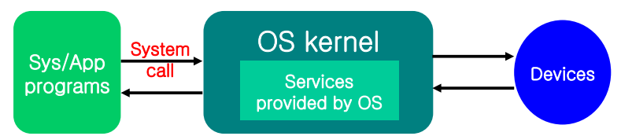  


##### Types of System Calls

- Process control
- File management
- Device management
- Information maintenance
- Communication


##### System call interface

많은 프로그래밍 언어에서, runtime support system (컴파일러에 포함 된 라이브러리에 내장된 함수)은 운영 체제에서 사용할 수 있는 **system call에 대한 링크**로 사용되는 system call interface를 제공합니다. 

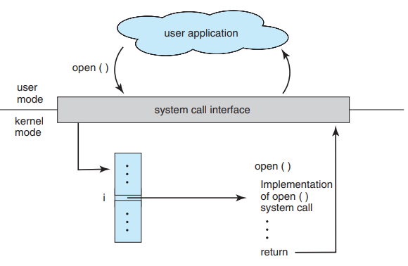

- system call interface는 API에서 함수 호출을 받아 운영 체제 내에서 필요한 system call을 호출합니다. 

- 번호는 각 system call과 연결되며 system call interface는 이 번호에 따라 indexed table을 유지 관리합니다.

- system call interface는 os kernel에서 원하는 system call을 호출하고 system call 및 모든 return value의 상태를 반환합니다.

- caller는 시스템 호출이 구현되는 방법이나 실행 중에 수행하는 작업에 대해 알 필요가 없습니다. 오히려 caller는 API를 따르고 해당 system call 실행의 결과로 운영 체제가 수행 할 작업을 이해하기만 하면됩니다.

따라서 운영 체제 인터페이스의 대부분의 세부 정보는 API에 의해 프로그래머에게 숨겨지고 런타임 지원 라이브러리에서 관리됩니다.


종종 원하는 시스템 호출의 ID보다 더 많은 정보가 필요합니다. 정확한 정보 유형과 양은 특정 운영 체제 및 호출에 따라 다릅니다. 예를 들어, 입력을 받으려면 소스로 사용할 파일이나 장치를 지정해야 할뿐만 아니라 입력을 읽어야하는 메모리 버퍼의 주소와 길이를 지정해야 할 수 있습니다. 물론, 장치 또는 파일과 길이는 호출에 암시 될 수 있습니다. 매개 변수를 운영 체제에 전달하는 데 세 가지 일반적인 방법이 사용됩니다.


**Parameter Passing in System Call**

- Register: 적은 양의 정보
- 블록의 주소: 많은 양의 정보

 parameter는 일반적으로 메모리의 블록 혹은 테이블에 저장되고 블록의 주소만 레지스터의 매개변수로 전달 된다. 

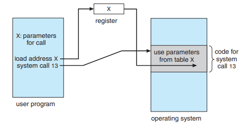

- 시스템 스택

몇몇 OS는 전달되는 매개변수의 수나 길이에 제약을 받지 않는 스택사용을 더 선호한다.


**Example of system-call interface in Linux**

```c
// User Program
int main () {
    ...
    open();
    ...
}
```

```assembly
# System-call Interfacee (libc)
open() {
	...
	movl 5, %eax # 레지스터의 이름
	int $0x80 # interrupt 번호(system call number) -> Handler(vector) -> OS kernel
	...
}
```

```assembly
# OS Kernel
sys_open() {
	...
}
```

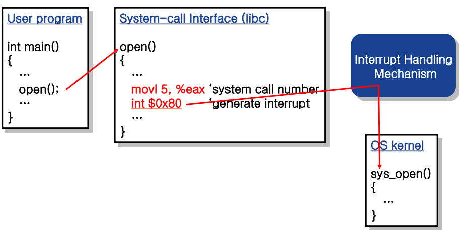


즉, System Call Interfaces은 커널에게 정보를 넘겨주며 커널모드로 전환시키며 커널모드에서 실행하기 위한 모든 데이터 처리 및 준비를 합니다.


**cf> System call vs I/O functions in programming language**

`fopen()` vs `open()`

 - `fopen`: C에서 정의된 표준함수 (호환성이 높다.)
 - `open`: OS에서 제공되는 advanced feature. `fopen()`는 `open()`를 사용하여 구현됩니다.


 간단한 프로그램도 운영 체제를 많이 사용할 수 있습니다. 종종 시스템은 초당 수천 개의 시스템 호출을 실행합니다. 그러나 대부분의 프로그래머는 이러한 수준의 세부 정보를 보지 못합니다. 일반적으로 응용 프로그램 개발자는 응용 프로그램 프로그래밍 인터페이스 (**API**)에 따라 프로그램을 설계합니다. API는 각 함수에 전달되는 매개 변수와 프로그래머가 예상 할 수있는 리턴 값을 포함하여 애플리케이션 프로그래머가 사용할 수있는 함수 세트를 지정합니다.


#### API (Application Programming Interface)

: 컴퓨터 시스템 (OS), 라이브러리 또는 애플리케이션이 서비스 요청을 허용하기 위해 제공하는 인터페이스

-> **system call을 조합해서 덩어리가 된 것들**


- High-level programming interface

  Ex) `MessageBox(...);`


**Three of the most common APIs**

- Windows API 

- POSIX API (UNIX, Linux, Mac OS X)
  하도 기관마다 지들끼리 만드는 유닉스가 많아서 유닉스의 기준을 만든 것이 POSIX이다. 
  POSIX는 유닉스의 표준으로 필수 SYSTEM CALL이 있다.
  Ex) open, close, read, write, fork, kill, wait

- Java API


프로그래머는 운영 체제에서 제공하는 코드 라이브러리를 통해 API에 액세스합니다. 

- UNIX 및 Linux:  C언어로 작성된 프로그램의 경우 라이브러리는 ibc
- Windows: `CreateProcess()`는 Windows 커널에서 `NTCreateProcess()` system call을 호출


**Advantages of Using API**

- 프로그램 이식성

API를 사용하여 프로그램을 설계하는 응용 프로그램 프로그래머는 동일한 API를 지원하는 모든 시스템에서 프로그램이 컴파일되고 실행될 것으로 기대할 수 있습니다

- API의 함수와 kernel 내의 연관된 systall 간에는 강한 상관 관계가 존재

POSIX 및 Windows API의 대부분은 UNIX, Linux 및 Windows 운영 체제에서 제공하는 기본 system call과 유사


##### Type of System Calls

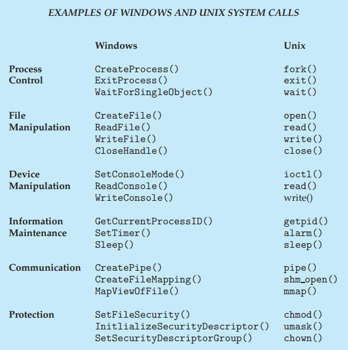 


###### 1. Process Control

① Load/Execution

- create process() or submit job()
  새로운 작업이나 프로세스를 만들기
- get process attributes() and set process attributes()
  작업 우선 순위, 허용 가능한 최대 실행 시간 등의 작업 또는 프로세스의 속성을 결정하고 재설정하는 기능
- terminate process()
  작업 또는 프로세스를 종료 
- wait time()
  일정 시간이 지날 때까지 기다리기
- wait event() 
  특정 이벤트가 발생할 때까지 기다리기
- signal event()
  작업 또는 프로세스는 해당 이벤트가 발생했을 때 신호를 보내야합니다.
- acquire lock(), release lock()
  공유되는 데이터의 무결성을 보장하기 위해 운영 체제는 종종 프로세스가 공유 데이터를 잠글 수있는 시스템 호출을 제공합니다. 그러면 잠금이 해제 될 때까지 다른 프로세스가 데이터에 액세스 할 수 없습니다.


**The MS-DOS operating(a single-tasking system)**

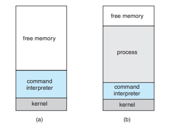

MS-DOS는 single-tasking system이기 때문에 프로세스가 돌아가는 동안 다른 프로세스를 실행 할 수 없다.

1. 시스템이 켜지면, CI가 호출된다.
2. 프로세스를 올리면 최대한의 메모리를 할당해 주시 위해서 CI의 영역까지 줄이면서 메모리공간을 내준다.
3. 프로세스가 실행된다.
4. 오류가 나면 에러 코드를 다음을 위해 메모리에 저장하고 종료하는 시스템 콜을 호출한다.
5. CI의 남은부분 (아까 프로세스를 위해 내준 메모리 공간 이외의 부분)이 실행을 계속한다.
6. 아까 프로세스를 위해 내준 메모리 공간을 디스크로부터 회수하고 에러를 보고한다.


**FreeBSD (derived from Berkeley UNIX)** 

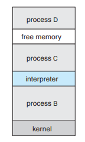 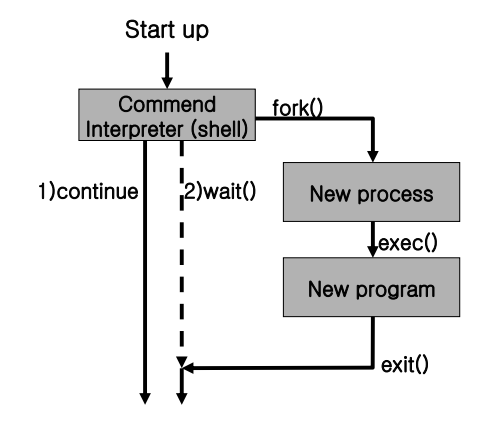 

FreeBSD는 multi-tasking system이기 때문에 프로세스가 돌아가는 동안 다른 프로세스를 실행 할 수 있다.

1. 로그인을 하면 사용자가 shell(CI)을 골라 사용한다. ex)cmd, powershell 
2. `fork()`를 사용하여 새로운 프로세스를 만든다.
3. 그 프로세스가 `exec()`을 사용해 메모리로 프로그램을 올린다.
   - 명령의 방식에 따라 shell은 프로세스가 완료될 때 까지 기다리거나(wait)
   - 백그라운드에서 프로세스를 실행한다. (continue)
     continue의 경우 shell은 즉시 다른 명령을 요청한다. (프로세스가 백그라운드에서 돌아갈 때, 바로 키보드에서 입력을 받지 못한다, 왜냐하면 shell이 I/O resource를 쓰고 있기 때문이다.)

4. 프로세스가 끝날 때 `exit()`을 사용해서 끝내며 shell에게 status code를 전송한다. (0 or error code)


**※ API reference**

- `fork()`: 프로세스를 생성할 때 사용한다. 이 때 생성하는 프로세스는 parent process, 생성된 프로세스는 child process라고 부른다. 모든 프로세스는 생성될 때 프로세스 아이디(pid)를 부여받는데, 이때 fork()에 대한 parent의 반환 값은 자식 프로세스의 pid이고 child의 반환값은 0이다.

- `exec()` family function

  - `execlp()`
  - `execvp()`

- `wait()`

  주로 fork()를 이용해서 자식 프로세스를 생성했을 때 사용한다. 

  wait() 를 쓰면 자식 프로세스가 종료할 때까지 해당영역에서 부모프로세스가 `sleep()` 모드로 기다리게 된다. 자식 프로세스와 부모 프로세스의 **동기화**를 위한목적으로 부모 프로세스가 자식 프로세스보다 먼저 종료되어서 자식프로세스가 고아 프로세스 (PPID 가 1)인 프로세스가 되는 걸 방지하기 위한 목적이다.  만약 자식 프로세스가 종료되었다면 함수는 즉시 리턴되며, 자식이 사용한 모든 시스템 자원을 해제한다. 그런데 어떤 이유로 부모가 `wait()`를 호출하기 전에 자식 프로세스가 종료버리는 경우도 있다 (잘못된 메모리 연산등으로 인한 종료 등) 이럴 경우 자식프로세스는 좀비프로세스가 되는데, `wait()` 함수는 즉시 리턴하도록 되어있다. 
  `wait()`의 인자 status 를 통하여 자식 프로세스의 상태를 받아올수 있는데, 자식프로세스의 상태값은 0 or  -1(에러)이다.


② Termination

- Normal termination (end): 자원, 현재 프로세스에 대한 정보 할당 해제

- Abnormal termination (abort) 

  디버깅 및 분석을 위해 메모리를 파일로 덤프하고 사용자에게 처리 방법을 묻습니다.

  - 대화형 시스템 : Command Interpreter
  - GUI 시스템 : 팝업 창
  - Batch System : 전체 작업을 종료하고 다음 작업을 계속합니다.
    - Control card : 프로세스 실행 관리 명령

->  프로그램이 종료 될 때 비정상적으로 종료되면 에러메세지(팝업 등)를 띄우고 디버거로 오류를 찾을 수 있다. 프로그램이 비정상적으로 종료되면 운영체제는 CI로 control을 전송하고, CI는 그냥 다음 커맨드를 실행한다. 유저가 알아서 잘 처리했을 것이라는 가정 하에.
 어떤 시스템은 문제를 발견하고 비정상적으로 종료하고 싶을 때 에러 레벨을 정의한다.
정상종료는 에러 레벨 0이고, CI는 에러 레벨을 사용해서 다음 액션을 어떻게 할지 자동으로 정한다.


###### 2. File Management

- `create()`, `delete()`

- `open()`, `close()`

- `read()`, `write()`, `reposition()`

  - `reposition()`: 파일을 읽을 때 r/w pointer가 있는데 그것의 위치를 앞뒤로 조정하는 것이 reposition이다.

    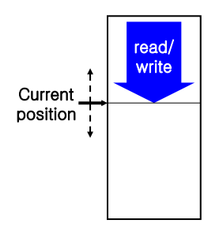

- `get_file_attributes()`, `set_file_attributes()`

- `move()`, `copy()`


###### 3. Device Management

- Resources
  - Physical device: disk, tape, memory
  - Abstract device: file

프로세스를 실행하려면 주 메모리, 디스크 드라이브, 파일 액세스 등 여러 리소스가 필요할 수 있습니다. 리소스를 사용할 수있는 경우 권한을 부여 할 수 있으며 제어권을 사용자 프로세스로 되돌릴 수 있습니다. 그렇지 않으면 충분한 리소스를 사용할 수있을 때까지 프로세스가 기다려야합니다.

 운영 체제에서 제어하는 다양한 리소스를 장치로 생각할 수 있습니다. 사용자가 여러 명인 시스템은 장치를 독점적으로 사용하기 위해 먼저 장치를 `request()`해야 할 수 있습니다. 장치 작업이 끝나면 `release()`합니다. 이러한 함수는 파일에 대한 `open ()` 및`close ()` system call과 유사합니다. 

일단 리소스가 요청되고 할당되면, 장치를 read (), write () 및 reposition () 할 수 있습니다. 사실, I/O 장치 (physical device) 와 file은 너무 비슷해서 UNIX를 포함한 많은 운영 체제가 이 둘을 동일하게 취급합니다.  즉 I/O 장치도 특별한 파일처럼 취급합니다. 이 경우 파일과 장치 모두에서 일련의 system call이 사용됩니다. 
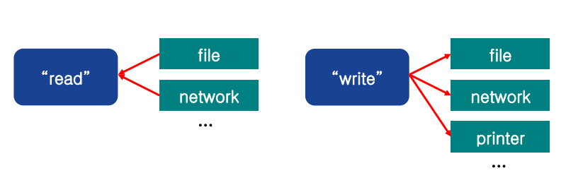


###### 4. Information Maintenance

대부분 system call은 사용자 프로그램과 운영 체제간에 정보를 전송하기 위한 목적으로 존재합니다.

- Current time, date 
- Information about system 
  - \# of current user, OS version, amount of free memory/disk space
- OS는 모든 프로세스에 대한 정보를 유지합니다.  Ex)`/proc` of LinuX


###### 5. Communication

통신 프로세스는 정보를 전송하기 위해 서로 메시지를 교환합니다. 메시지는 공통 사서함을 통해 직접 또는 간접적으로 프로세스간에 교환 될 수 있습니다. 

- Message Passing Model

  - 통신의 조건: 연결

    - 호스트 이름 (IP 주소)
    - 프로세스 이름

  - 통신 메커니즘

    1. `gethostid()` 및 `getprocessid()` system call이 운영 체제가 프로세스를 참조할 수 있는 식별자로 변환
    2. `openConnection()` system call
    3. 수신자 프로세스에서 `acceptConnection()`
    4. `readMessage()`, `writeMessage()`
    5. `closeConnection()`

    

  - 장점

    - 정보의 충돌이 없기 때문에 적은 양의 데이터를 교환하는 데 유용합니다. 
    - 공유 메모리보다 구현하기 쉽습니다.


- Shared-Memory Model

  - 통신 조건: 일반적으로 운영 체제는 한 프로세스가 다른 프로세스의 메모리에 액세스하지 못합니다. 공유 메모리를 사용하려면 두 개 이상의 프로세스가 이 제한을 제거하는 데 동의해야 합니다.

  - 통신 메커니즘

    1. 프로세스는 공유 메모리 `create()` 및 공유 메모리 `attach()` system call을 사용하여 다른 프로세스가 소유 한 메모리 영역을 만들고 액세스합니다. 

    2. 공유 영역에서 데이터를 읽고 써서 정보를 교환 할 수 있습니다. 데이터의 형식은 프로세스에 의해 결정되며 운영 체제의 제어를 받지 않습니다. 

       

  - 장/단점 

    - 메모리 전송 속도로 수행 할 수 있으므로 통신의 최대 속도와 편리함을 허용합니다. 
    - 메모리를 공유하는 프로세스 간의 보호 및 동기화 영역에는 문제가 있습니다.


###### 6. Protection

- system call 종류
  - setpermission(), getpermission(): 리소스의 권한 설정 조작
  - allowuser(), denyuser(): 특정 사용자가 특정 리소스에 대한 엑세스 허용 여부


 **※ System programs**

 프로그램 개발과 실행에 편리한 환경을 제공해주는 프로그램

- File manipulation
- Status information sometimes stored in a File modification
- Programming language support
- Program loading and execution
- Communications
- Background services


## Operating – System Structure

### Simple Structure - MS-DOS (1981)

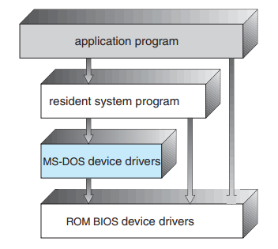


  인터페이스와 기능의 레벨이 잘 나눠져있지 않았다.

- 어플리케이션 프로그램이 I/O에 직접 접근가능
- 에러가 하나 발생하면 시스템 전체가 죽는다.
- 듀얼 모드(커널, 유저모드)가 없다.


### Non-simple Structure

#### Original UNIX

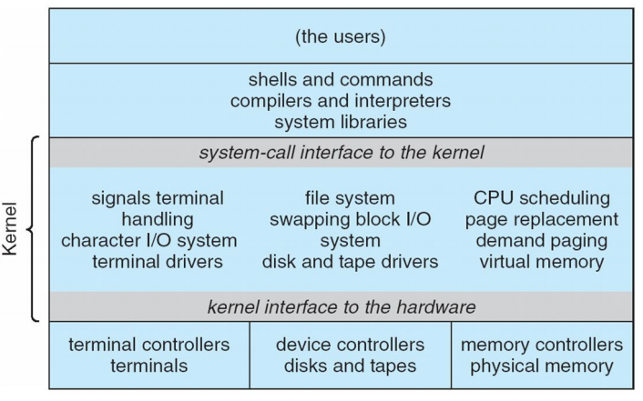 

- System programs: Shell, commands compiler, interpreter, system library ...

- Monolithic kernel (일체형 커널): 입출력, 네트워크, 장치 지원 등 일반적인 기능을 다 커널에다 집어넣은 형태

  - 구조: Kernel과 System Program으로 구성됨 

    ​		  커널은 System Call Interface 아래에 있고, 하드웨어 위에 위치해 있다. 

  - 파일 시스템 제공, 시스템 콜을 통한 CPU스케줄링 메모리 관리, 다른 OS 기능

    - 장점: 고성능
    - 단점: 유지 및 보수가 힘듬


#### Layered Approach

레이어의 형식으로 구성되어 있는 OS이고 각각의 레이어는 데이터 구조와 상위 수준 계층에서 호출 할 수있는 루틴 집합으로 구성됩니다.

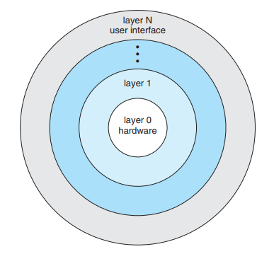


- layer 0: 하드웨어
- layer N:사용자 인터페이스 


- 특징
  - layer 0이 가장 핵심적인 부분이고 위로 올라갈수록 덜 중요하다.
  - 상위 레이어가 하위 레이어를 호출할 수 는 있지만 하위 레이어가 상위 레이어를 호출 할 수는 없다.


- 장점

  - 디버깅의 단순화

    한 레이어에서 문제가 발생하면 위, 아래 레이어를 볼 필요 없이 그 레이어만 보면 된다. 하위 레이어는 에러가 나지 않았고 상위 레이어는 접근을 하지 못하므로 그 레이어에만 문제가 있다는 뜻이다.

  - 캡슐화

    각 계층은 하위 계층에서 제공하는 작업으로만 구현됩니다. 계층은 이러한 작업이 어떻게 구현되는지 알 필요가 없습니다. 이러한 작업이 수행하는 작업만 알면 됩니다. 따라서 각 계층은 상위 계층에서 특정 데이터 구조, 작업 및 하드웨어의 존재를 숨깁니다.

    

- 단점

  - 오직 하위 레이어만 호출 할 수 있기 때문에 주의깊은 설계가 필요하다.
  - 다른 형식보다 비효율적이다. 한 프로세스를 실행 시켰을 때, 여러 레이어를 거쳐가기 때문에 느려진다.


#### Microkernels

: 반드시 필요한 것만 넣고 나머지는 User/System-level program으로 빼놓은 커널 -> Smaller kernel 

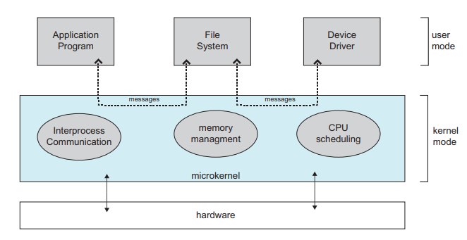

- 주요 기능

Message Passing Model을 사용해 클라이언트 프로그램과 사용자 공간에서 실행되는 서비스 간의 **통신**을 제공


- 장점

  - OS의 확장이 쉽다. user space에 붙어있어서 거기만 수정하면 된다.

  - 이식성이 좋습니다.

  - 유저 프로세스에서 대부분의 서비스가 실행되기 때문에 높은 안정성과 신뢰성

    

- 단점 

  - 프로세스를 실행 할 때마다 message passing을 해야하기 때문에 느리다.


#### Modules

Kernels with loadable modules

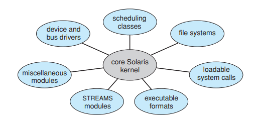

- 특징

  - 객체 지향 접근 Ex) 솔라리스, 리눅스
  - 각각의 코어는 분리되어 있고 각각은 인터페이스를 통해 다른 모듈과 통신한다.
  - 서비스를 동적으로 링크한다. 즉 모듈을 필요할 때만 로드해서 쓰고 모듈 모두가 커널 모드에서 작동한다.

  (만약 새로운 기능을 커널에 직접 추가하려면 변경 사항이 있을 때마다 커널을 다시 컴파일해야합니다.)


- 장점: 마이크로커널과 mologolithic 커널의 장점을 합쳐 놓은 것

  - 레이어 구조보다 더 유연하다

    각 커널 섹션에 정의되고 보호된 인터페이스가 있다는 점에서 layered kernel과 유사합니다만 모든 모듈이 다른 모듈을 호출 할 수 있기 때문에 계층화 된 시스템보다 더 유연합니다.

    

  - 마이크로 커널보다 빠르다. 

    기본 모듈이 다른 모듈을 로드하고 통신하는 방법과 핵심기 만 있다는 점에서 마이크로 커널 접근 방식과 유사하지만 모듈 전체가 커널에서 작동하기 때문에 통신을 위해 메시지 전달을 호출 할 필요가 없습니다. 즉 더 효율적입니다.


#### Hybrid Systems

여러 가지 커널유형을 혼합해서 쓰는 모델. 

- Linux, Solaris: 일체형 커널 + 모듈식
- Windows: 일체형 커널 + 마이크로 커널(하위 시스템) + 커널 모듈


##### Mac OS X Structure

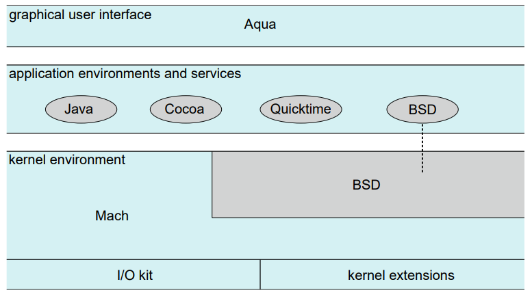

- Layered system
  - Aqua: 사용자 인터페이스
  - 어플리케이션 환경: Java, Cocoa, Quicktime, BSD
    - Cocoa: Mac OS X 애플리케이션을 작성하는 데 사용되는 Objective-C 프로그래밍 언어 용 API를 지정
    - BSD: BSD 커널이 있기 때문에 BSD기능을 직접적으로 사용할 수 있다.
  - 커널
    - Mach: 메모리 관리, RPC (원격 프로 시저 호출), IPC (프로세스 간 통신), 스레드 스케줄링 지원
    - BSD: 명령 줄 인터페이스, 네트워킹 및 파일 시스템 지원, Pthread를 포함한 POSIX API 구현을 제공
    - I/O kit, kernel extensions: 장치 드라이버 및 동적인 로드 가능한 모듈 개발 용도


##### iOS Architecture

iOS는 Apple이 스마트 폰, iPhone 및 태블릿 컴퓨터 인 iPad를 실행하도록 설계 한 모바일 운영 체제입니다. 

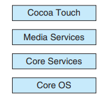

- iOS는 Mac OS X 운영 체제로 구성되어 있으며 모바일 장치와 관련된 기능이 추가되었지만 Mac OS X 응용 프로그램을 직접 실행하지는 않습니다. 

- 구조

  - Cocoa Touch

     iOS 기기에서 실행되는 애플리케이션 개발을 위한 여러 프레임 워크를 제공하는 Objective-C 용 API입니다.  앞에서 언급 한 Cocoa와 Cocoa Touch의 근본적인 차이점은 후자가 **터치 스크린과 같은 모바일 장치 고유의 하드웨어 기능을 지원**한다는 것입니다. 

  - 미디어 서비스 계층: 그래픽, 오디오 및 비디오에 대한 서비스를 제공

  - 코어 서비스 계층: 클라우드 컴퓨팅, 데이터베이스 지원을 포함하여 다양한 기능을 제공 

  - 코어 OS 계층: 커널 환경을 기반으로하는 핵심 운영 체제기능 제공


##### Android Architecture

Android 운영 체제는 구글에서 주도하는 Open Handset Alliance에서 설계했으며 Android 스마트 폰 및 태블릿 컴퓨터 용으로 개발되었습니다. iOS는 Apple 모바일 장치에서만 실행되도록 설계된 소스인 반면, Android는 다양한 모바일 플랫폼에서 실행되는 오픈 소스입니다. 

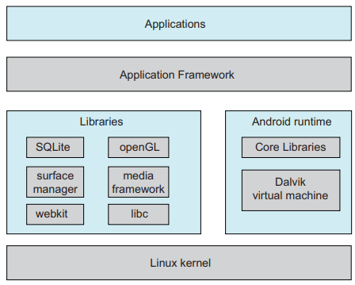

- Layered System

  -  Linux 커널

  Google에서 수정하여 현재 Linux 릴리스의 일반 배포 범위를 벗어났습니다. 

  

  - Android 런타임 환경

    - Core Libraries Sets

    - Dalvik 가상 머신

      Android 용 소프트웨어 디자이너는 Java 언어로 응용 프로그램을 개발합니다. 그러나 표준 Java API를 사용하는 대신 Google은 Java 개발을 위해 별도의 Android API를 설계했습니다. Java 클래스 파일은 먼저 Java 바이트 코드로 컴파일 된 다음 Dalvik 가상 머신에서 실행되는 실행 파일로 변환됩니다. Dalvik 가상 머신은 Android 용으로 설계되었으며 메모리 및 CPU 처리 기능이 제한된 모바일 장치에 최적화되어 있습니다. 

  - Android 애플리케이션에 사용할 수있는 라이브러리 세트

    - 웹 브라우저 (웹킷)

    - 데이터베이스 지원 (SQLite)

    - libc 라이브러리

      표준 C 라이브러리와 유사하지만 더 작고  느린 모바일 장치에 특화되어있는 CPU를 위해 설계되었습니다.


**Virtual Machines**

컴퓨터 플랫폼과 운영체제간에 가상화된 환경을 생성하는 소프트웨어. 즉, 운영 체제가 다른 운영 체제 내에서 응용 프로그램으로 실행될 수 있게 해주는 기술입니다.

※ Emulator: **리소스나 하드웨어를 사용하지 않고** 소프트웨어적으로 구현하여 특정 시스템을 구동하는 것


- 특징

  - 한 컴퓨터 내에서 여러 다른 실행환경 제공

    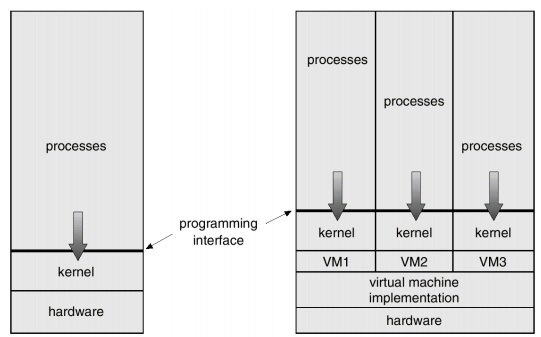

    

  - 각각의 VM은 고유의 CPU와 메모리를 가지고 있는 것처럼 보인다.


- 문제점

  - 디스크 크기

    만약, 컴퓨터 본체의 용량이 128GB라면 VM1, 2, 3에게 적당히 나눠서 디스크 용량을 분할해야한다.  

    

  - 구현 문제 (Virtual dual mode)

    VM은 기본적으로 User mode에서 돌아가는 프로세스인데 VM에도 커널모드와 User mode가 나뉘어 있다. 이때, VM의 커널모드는 결국 User mode에 있는 것이라 문제가 발생한다.

    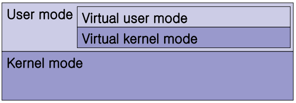

    

  - 느린 실행 속도
    만약, 컴퓨터 본체의 램이 8GB라면 VM1, VM2, VM3는 모두 RAM을 8GB로 가지고 필요에 따라 Timesharing으로 사용한다.


