[TOC]

# Process Concept

초기 컴퓨터에서는 한 번에 하나의 프로그램 만 실행할 수있었습니다. 이 프로그램은 시스템을 완전히 제어하고 모든 시스템 리소스에 액세스 할 수있었습니다. 대조적으로, 현대 컴퓨터 시스템은 여러 프로그램을 메모리에로드하고 동시에 실행할 수 있습니다. 이러한 진화에는 다양한 프로그램의 더 강력한 통제와 더 많은 구획화가 필요했습니다. 그리고 이러한 요구로 인해 실행중인 프로그램 인 프로세스라는 개념이 생겼습니다. 프로세스는 현대 시분할 시스템의 작업 단위입니다. 운영 체제가 복잡할수록 사용자를 대신하여 더 많은 작업을 수행 할 것으로 예상됩니다. 주요 관심사는 사용자 프로그램의 실행이지만 커널 자체 외부에 남겨진 다양한 시스템 작업도 처리해야합니다. 따라서 시스템은 프로세스 모음으로 구성됩니다. 운영 체제 프로세스는 시스템 코드를 실행하고 사용자 프로세스는 사용자 코드를 실행합니다. 잠재적으로 이러한 모든 프로세스는 CPU (또는 CPU)가 다중화되어 동시에 실행될 수 있습니다. 프로세스간에 CPU를 전환함으로써 운영 체제는 컴퓨터의 생산성을 높일 수 있습니다.

## Process

실행되고 있는 프로그램 + resource

프로세스는 **실행중인 프로그램**입니다.  또한 프로그램 카운터 값과 프로세서 레지스터의 내용으로 표시되는 현재 활동도 포함됩니다. 일반적으로 프로세스에는 임시 데이터 (예 : 함수 매개 변수, 반환 주소 및 로컬 변수)가 포함 된 프로세스 스택과 전역 변수가 포함 된 데이터 섹션이 포함됩니다. 프로세스에는 프로세스 런타임 동안 동적으로 할당되는 메모리 인 힙도 포함될 수 있습니다. 

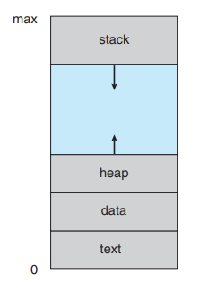

- stack: 임시데이터를 저장하는 공간  Ex) function parameters, return address, local variable
- heap: 프로세스 런타임 중 동적으로 할당되는 메모리 공간
- data: 전역 변수가 있는 공간

### Program vs Process

- program: 디스크에 저장된 명령어 목록을 포함하는 파일 (종종 실행 파일이라고 함)과 같은 수동 엔티티

- process: 실행할 다음 명령어와 관련 리소스 세트를 지정하는 프로그램 카운터가있는 활성 엔티티입니다. 

  

  **프로그램은 실행 파일이 메모리에 로드 될 때 프로세스가 됩니다.** 

  한 프로그램은 두 개를 실행하면 두 개의 개별 실행 시퀀스로 간주됩니다. 예를 들어, 여러 사용자가 메일 프로그램의 서로 다른 사본을 실행하거나 동일한 사용자가 웹 브라우저 프로그램의 여러 사본을 호출 할 수 있습니다. **이들 각각은 별도의 프로세스**입니다. 

### Process state

프로세스가 실행되면 상태가 변경됩니다. 프로세스의 상태는 해당 프로세스의 현재 활동에 의해 부분적으로 정의됩니다. 프로세스는 다음 상태 중 하나 일 수 있습니다. 

- New: 프로세스가 생성되고 있습니다. 
- Running: 명령이 실행되고 있습니다. 
- waiting: 프로세스가 이벤트 발생을 기다리고 있습니다 (예 : I / O 완료 또는 신호 수신). 

- Ready: 프로세스가 프로세서에 할당되기를 기다리고 있습니다. 
- terminated: 프로세스 실행이 완료되었습니다. 프로세스의 minimum 정보를 가지고 있는 상태

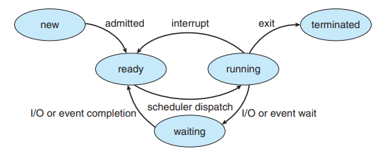

이러한 이름은 임의적이며 운영 체제에 따라 다릅니다. 그러나 그들이 나타내는 상태는 모든 시스템에서 찾을 수 있습니다. 특정 운영 체제는 또한 프로세스 상태를보다 세밀하게 설명합니다. 어떤 프로세서에서든 한 번에 하나의 프로세스 만 실행할 수 있다는 것을 인식하는 것이 중요합니다. 그러나 많은 프로세스가 준비되어 대기 중일 수 있습니다. 

### PCB (Process Control Block)

: 프로세스에 대한 모든 정보를 저장하는 임시저장소

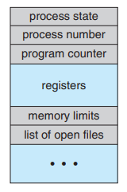

- Process state: new, ready, running, waiting, terminated

- Process number: pid(Process ID)

- CPU Registers

  - **Program Counter**: 프로그램에서 instruction을 순차적으로 진행할 때 어디까지 왔는지 가리키는 포인터
  - 누산기, 인덱스 레지스터, 스택 포인터 및 범용 레지스터와 모든 조건 코드 정보가 포함됩니다.

  **프로그램 카운터와 함께 이 정보는 인터럽트가 발생했을 때 저장되어야만 프로세스가 나중에 올바르게 계속 될 수 있습니다.**

  

- CPU Scheduling info. : 프로세스 우선 순위, 예약 대기열에 대한 포인터 및 기타 예약 매개 변수가 포함됩니다.

- Memory-management info: 기본 및 제한 레지스터의 값과 페이지 테이블 또는 세그먼트 테이블과 같은 항목이 포함될 수 있습니다.

- Accounting info: 사용 된 CPU 및 실시간, 시간 제한, 계정 번호, 작업 또는 프로세스 번호

- I/O status info: 프로세스에 할당 된 I / O 장치 목록, 열린 파일 목록

## Process Scheduling

CPU에서 실행할 프로세스를 선택하는 것

- 원칙: 한번에 한 프로세스만 한 프로세서에서 돌아간다. 나머지 프로세스들은 기다려야한다.

 다중 프로그래밍의 목적은 CPU 사용률을 최대화하기 위해 항상 일부 프로세스를 실행하는 것입니다. 즉, 사용자가 각 프로그램이 실행되는 동안 상호 작용할 수 있도록 프로세스간에 CPU를 자주 전환하는 것입니다. 이러한 목표를 달성하기 위해 프로세스 스케줄러는 CPU에서 프로그램 실행을 위해 사용 가능한 프로세스 (사용 가능한 여러 프로세스 집합에서 가능)를 선택합니다. 

- 목표
  - CPU사용률의 높이는 것
  - 사용자와 각각의 프로그램이 상호작용할 수 있는 것

### Scheduling Queue

- Job queue: 시스템에 있는 모든 프로세스가 상주하는 곳

- Ready Queue: 주 메모리에 상주하고 준비되어 실행 대기중인 프로세스

- Device queue: I/O 명령을 기다리는 프로세스들이 상주하는 곳

  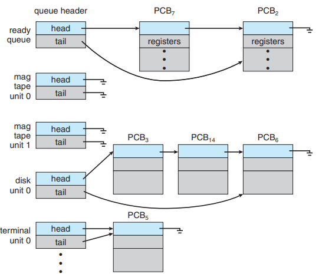 

  -  Linked list의 형태로 PCB에 저장되어 있다
  - 헤더에는 목록의 첫 번째 및 마지막 PCB에 대한 포인터가 포함됩니다. 
  - 각 PCB에는 준비 대기열에서 다음 PCB를 가리키는 포인터 필드가 있습니다.

**Queueing Diagram**

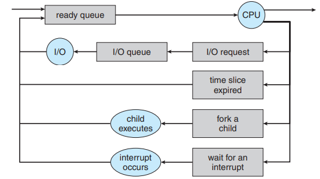

- 직사각형 상자: 대기열 

  - 준비 대기열
  - 장치 대기열 

- 원: 리소스

- 화살표: 시스템의 프로세스 흐름

  

새 프로세스는 처음에 준비 대기열에 배치됩니다. 실행을 위해 선택되거나 디스패치 될 때까지 대기합니다. 프로세스가 CPU에 할당되고 실행되면 다음과 같은 여러 이벤트 중 하나가 발생할 수 있습니다. 

1. 프로세스가 I / O 요청을 발행 한 다음 I / O 대기열에 배치 될 수 있습니다. 
2. 프로세스는 새로운 자식 프로세스를 생성하고 자식의 종료를 기다릴 수 있습니다. 
3. 인터럽트의 결과로 프로세스가 CPU에서 강제로 제거되고 준비 대기열에 다시 들어갈 수 있습니다. 

처음 두 경우에서 프로세스는 결국 대기 상태에서 준비 상태로 전환 된 다음 다시 준비 대기열에 놓입니다. 프로세스는 종료 될 때까지 이 주기를 계속합니다. 이 때 프로세스는 모든 대기열에서 제거되고 PCB 및 리소스 할당이 해제됩니다.

### Schedulers

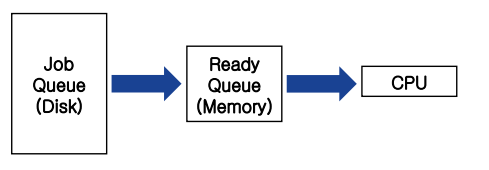

프로세스는 수명 동안 다양한 스케줄링 큐 사이에서 마이그레이션됩니다. 운영 체제는 일정을 잡기 위해 이러한 대기열에서 어떤 방식 으로든 프로세스를 선택해야합니다. 선택 프로세스는 적절한 스케줄러에 의해 수행됩니다. 종종 배치 시스템(하나의 작업이 끝나기 전까지는 다른 작업을 할 수 없다.)에서는 즉시 실행할 수있는 것보다 더 많은 프로세스가 제출됩니다. 이러한 프로세스는 대용량 저장 장치 (일반적으로 디스크)에 스풀링되어 나중에 실행하기 위해 보관됩니다.

#### CPU scheduler (Short-term scheduler)

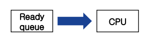

- Ready state -> Running state

- CPU에 대한 새 프로세스를 자주 선택해야합니다. 적어도 100ms 마다 한 번씩 실행됩니다. 

- 실행 사이의 짧은 시간 때문에 빨라야합니다. 

  100ms 동안 프로세스를 실행하기로 결정하는 데 10ms가 걸린다면 job scheduling을 위해 CPU의 10 / (100 + 10) = 9 %나 사용하게 됩니다. 

#### Job scheduler (Long-term scheduler)

장기 스케줄러는 훨씬 덜 자주 실행됩니다. 분은 하나의 새로운 프로세스 생성과 다음 프로세스를 분리 할 수 있습니다. 장기 스케줄러는 다중 프로그래밍 정도 (메모리의 프로세스 수)를 제어합니다. 다중 프로그래밍의 정도가 안정적인 경우 평균 프로세스 생성 속도는 시스템을 떠나는 프로세스의 평균 출발 속도와 같아야합니다. 따라서 장기 스케줄러는 프로세스가 시스템을 떠날 때만 호출되어야합니다. 실행 사이의 간격이 길기 때문에 장기 스케줄러는 실행할 프로세스를 결정하는 데 더 많은 시간을 할애 할 수 있습니다. 장기 스케줄러가 신중하게 선택하는 것이 중요합니다.

- New state -> Ready state

 - 멀티프로그래밍의 정도를 통제한다.
   즉, Ready queue의 크기를 적절하게 조절함으로서 performance를 증가시킨다.
 - Ready queue보다는 적게 실행됩니다. 프로세스가 시스템을 떠날 때만 실행 된다.

**※ I/O bound vs CPU bound**

일반적으로 대부분의 프로세스는 I/O 바운드 또는 CPU 바운드로 설명 될 수 있습니다. 

- I/O bound: 수행하는 컴퓨팅 작업이 데이터의 I/O가 끝나는데 기다리는 시간에 의해 결정되는 컨디션

  - I/O bound process : 주로 I/O장치에 접근하여 작업을 수행하는 프로세스로 **짧은 버스트**를 가진다.

  -> 메인메모리나 Secondary Storage에서 데이터가 Load or Unload되는 동안 CPU는 연산을 멈추고 기다려야 해서 컴퓨터의 스피드를 떨어뜨린다. 

  

- CPU bound: 수행하는 컴퓨팅 작업이 CPU의 속도에 의해 결정되는 컨디션

  - CPU bound process : 주로 복잡한 연산과 같은 CPU를 많이 사용하는 프로세스로 **긴 버스트**를 가진다

모든 프로세스가 I/O 바운드인 경우 Ready Queue는 비어 있고 단기 스케줄러는 할 일이 거의 없습니다. 반면 모든 프로세스가 CPU 바운드 인 경우 I/O Device Queue는 비어 있고 장치는 사용되지 않으며 시스템은 다시 불균형 상태가됩니다. 

I/O bound는 I/O를 요청하고 입력을 기다리는데 대부분의 시간을 사용하고, CPU 사용 시간이 짧기 때문에 일반적으로 **I/O bound process가 CPU bound process보다 우선순위가 높다.**

  -> Job scheduler는 적절한 I/O bound와 CPU bound 프로세스의 조합을 선택해야한다.

#### Medium-term scheduler

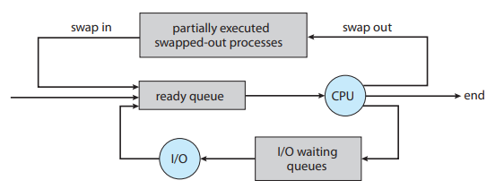

- Ready queue에 너무 프로세스가 많다면 Job queue로 다시 내려보낸다. 메모리에서 프로세스를 제거하여 다중 프로그래밍 정도를 줄이는 것이 유리할 수 있다는 것입니다. 
- Swapping
  - swap out: process를 메모리에서 제거하여 멀티프로그래밍의 상태를 조정합니다.
  - swap in: 어느 정도 degree가 안정되면 제거된 프로세스는 다시 메모리로 돌아오고 프로세스가 중단된 시점에서부터 다시 실행됩니다.

Windows, Linux는 Job queue가 없다. 왜냐하면 Job queue가 없어도 프로세스를 실행하는데 문제가 없기 때문이다. 다만 모든 프로세스가 ready queue에 있기 때문에 느려질 뿐인데 너무 느려지다 보면 알아서 사용자가 프로세스를 줄일 것이기 때문에 없는 것이다.

### Context Switch

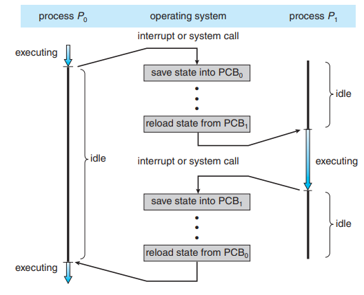

 인터럽트는 운영 체제가 현재 작업에서 CPU를 변경하고 커널 루틴을 실행하게합니다. 이러한 작업은 범용 시스템에서 자주 발생합니다. 인터럽트가 발생하면 시스템은 CPU에서 실행중인 프로세스의 현재 컨텍스트를 저장해야 처리가 완료 될 때 해당 컨텍스트를 복원하여 기본적으로 프로세스를 일시 중단 한 다음 다시 시작할 수 있습니다. 

 컨텍스트는 프로세스의 PCB에 표시됩니다. 여기에는 CPU 레지스터 값, 프로세스 상태 및 메모리 관리 정보가 포함됩니다. 일반적으로 커널 또는 사용자 모드에있는 CPU의 현재 상태에 대한 상태 저장을 수행 한 다음 작업을 재개하기 위해 상태 복원을 수행합니다. CPU를 다른 프로세스로 전환하려면 현재 프로세스의 상태 저장 및 다른 프로세스의 상태 복원을 수행해야합니다. 이 작업을 컨텍스트 전환이라고합니다. 

 컨텍스트 전환이 발생하면 커널은 이전 프로세스의 컨텍스트를 PCB에 저장하고 실행하도록 예약 된 새 프로세스의 저장된 컨텍스트를 로드합니다. 컨텍스트 전환 시간은 전환하는 동안 시스템이 유용한 작업을 수행하지 않기 때문에 순수한 오버 헤드입니다. 스위칭 속도는 메모리 속도, 복사해야하는 레지스터 수 및 특수 명령어 (모든 레지스터를 로드하거나 저장하는 단일 명령어)의 존재 여부에 따라 기기마다 다릅니다. 일반적인 속도는 몇 밀리 초입니다. 컨텍스트 전환 시간은 하드웨어 지원에 따라 크게 달라집니다. 예를 들어, 일부 프로세서는 여러 레지스터 세트를 제공합니다. 여기서 컨텍스트 전환은 현재 레지스터 세트에 대한 포인터를 변경하기만 하면 됩니다. 물론 레지스터 세트보다 더 많은 활성 프로세스가있는 경우 시스템은 이전과 같이 레지스터 데이터를 메모리에서 복사합니다. 또한 운영 체제가 복잡할수록 컨텍스트 전환 중에 수행해야하는 작업의 양도 많아집니다. 

CPU에서 프로세스가 바뀔 때 현재 상황을 PCB에 저장하고 다음프로세스를 준비하는 작업

## Operation on Processes

### process creation

`fork()`함수를 이용해 프로세스를 만들면 각각에 프로세스에는 pid가 할당된다.

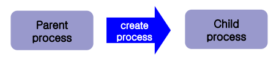

- 생성자 프로세스: 부모 프로세스
- 생성된 프로세스: 자식 프로세스

이러한 각각의 새로운 프로세스는 차례로 다른 프로세스를 생성하여 프로세스 트리를 형성 할 수 있습니다. 대부분의 운영 체제 (UNIX, Linux 및 Windows 포함)는 일반적으로 정수인 고유 프로세스 식별자 (또는 pid)에 따라 프로세스를 식별합니다. pid는 시스템의 각 프로세스에 대해 고유 한 값을 제공하며 커널 내에서 프로세스의 다양한 속성에 액세스하기 위한 인덱스로 사용할 수 있습니다. 

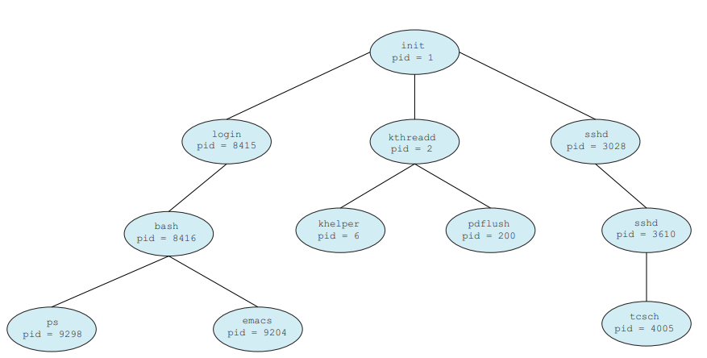

- init 프로세스 (항상 pid가 1)

  모든 사용자 프로세스의 루트 부모 프로세스 역할을합니다. 시스템이 부팅되면 init 프로세스는 웹 또는 인쇄 서버, ssh 서버 등과 같은 다양한 사용자 프로세스를 생성 할 수도 있습니다. 

  또한 Parent가 죽은 Orphan process들은 모두 init가 부모 프로세스가 됩니다.

- kthreadd 프로세스

  커널을 대신하여 작업을 수행하는 추가 프로세스를 생성합니다 (이 상황에서는 khelper 및 pdflush). 

- sshd 프로세스

  ssh를 사용하여 시스템에 연결하는 클라이언트를 관리합니다.

- 로그인 프로세스

  시스템에 직접 로그온하는 클라이언트를 관리합니다. 이 예시에서 클라이언트는 로그온했으며 pid 8416이 할당 된 bash 쉘을 사용하고 있습니다.이 사용자는 bash CLI를 사용하여 프로세스 ps와 emacs 편집기를 작성했습니다. 

 **`ps` command**

UNIX 및 Linux 시스템에서는 `ps` 커맨드을 사용하여 프로세스 목록을 얻을 수 있습니다.  `ps -el` 명령은 시스템에서 현재 활성화 된 모든 프로세스에 대한 전체 정보를 나열합니다. init 프로세스까지 부모 프로세스를 재귀 적으로 구성 할 수 있습니다.

**Some option to create a process**

- Resource

Child가 리소스를 자신고유의 리소스로 OS에게 직접 요청할 수 도 있고 parent의 리소스를 공유할 수 도 있습니다.

- Execution  

Parent와 동시에 child가 실행될수도 있고 child가 끝날 때까지 parent가 기다려줄 수 도 있습니다.

- Address space  

프로그램 코드와 데이터가 공유될 수 도 있고 child프로세스가 새로운 프로그램을 로드한다.

#### Process Creation System Call

##### `fork()` 

프로세스를 만들고 그 프로세스의 pid를 반환한다.

 - parent 프로세스의 경우 child의 pid를 반환한다.
 - child 프로세스의 경우 0을 반환한다.
   -> 프로세스의 parent/child구별이 반환 값으로 가능하다.

새로운 프로세스를 위한 메모리를 할당하고 fork()를 호출한 프로세스를 새로운 공간으로 전부 복사하게 되고, 원래 프로세스는 원래 프로세스 대로 작업을 실행한다.
fork()를 이용해서 생성된 프로세스 (자식 프로세스는 자신만의 PID를 가지게 되며, PPID는 부모프로세스의 PID를 가지게 된다. 부모 프로세스와 자식 프로세스는 메모리 주소만 다를 뿐 모든 자원을 공유한다.
프로그램 실행 ---> fork() 문 ---> 부모의 fork() 리턴이후 ----> 자식의 fork()

exec() family: 

1. l, v : argv인자를 넘겨줄 때 사용합니다. (l일 경우는 char *로 하나씩 v일 경우에는 char *[]로 배열로 한번에 넘겨줌) 

2. e : 환경변수를 넘겨줄 때 사용합니다. (e는 위에서 v와 같이 char *[]로 배열로 넘겨줍니다.)

3. p : p가 있는 경우에는 환경변수 PATH를 참조하기 때문에 절대경로를 입력하지 않아도 됩니다. 
   bin/ls를 실행하겠다. ls argv[0], NULL argv[0]에서 끝내겠다.

wait() 함수: 부모프로세스가 자식프로세스를 만들고 자식프로세스가 실행을 완료 할 때 까지 기다리는 함수

자식 프로세스의 리소스 (more about fork)

 - DATA: 변수 등을 부모 프로세스 것을 복사한다.
 - 메모리 주소: 자식프로세스는 자신만의 고유한 메모리 주소를 갖는다.
 - Files 

    1. fork()이전에 fopen을 하면 r/w pointer를 공유한다. (r/w pointer 1개)
    2. fork()이후에 fopen을 하면 r/w pointer를 공유하지 않는다. (r/w pointer 2개)
       wait에 대하여

pid_t wait(int *stat_loc);

stat_loc: 정수 포인터

1. 만약 NULL이라면 무시되지만

2. exit(code); code == (stat >> 8) & 0xff
   wait(&stat) 일 경우 child프로세스의 결과 값이 부모 프로세스에게 전달된다.

※ exit(int return_code): 자식 프로세스에 의해 호출된다.

 - 메모리 해제
 - 파일 닫기
 - 등등등등

위 return_code는 부모 프로세스에게 전달된다.
exit(code)의 리턴값이 0이라면 성공한 것이고 그 이외의 1-255까지의 값은 오류인 것이다.

win32 process creation

CreateProcess(): fork()랑 비슷함, 그러나 자식 프로세스의 속성을 구체화한 매개변수가 더 많음

WaitForSingleObject(): wait()와 비슷함

void ZeroMemory(PVOID Destination, SIZE_T Length); 메모리 블록을 0으로 채움

Inter-process communication(IPC)

IPC의 목표: 협력
정보공유
컴퓨팅 속도향상
모듈성: 시스템 기능을 나눔
편리성: 편집, 표시, 컴파일링을 동시에

Shared-memory model

Shared memory: OS가 여러 프로세스가 공유할 수 있는 메모리 공간을 할당해 준다. 카페 주인 같은 역할

장점: 빠르다, 많은 양의 데이터를 옮기기 적합

Producer – consumer

Producer: consumer를 위해 정보를 생산함
Consumer: producer에 의해 만들어진 정보를 소비함

예를 들면, 컴파일러-어셈블러, 서버-클라이언트 같은 관계가 있음

Shared memory는 두종류가 있다. 
unbounded buffer: 메모리 크기 제한이 없어서 producer가 마구마구생산 할수 있음
Bounded buffer: 메모리 크기 제한이 있어 꽉 차 있으면 기다려야 한다.

Bounded Buffer에 대표적인 예: Circular queue(FIFO)

Circular queue

위의 그림을 보면 (A)는 시작 부분이라 T(Tail)과 H(Head)가 동일한 위치에 있다. 즉, 이것은 큐가 비어있다는 것을 의미한다. 큐에 데이터를 삽입할 때 H가 가리키는 위치에 데이터를 삽입하게 되면 모든 큐에 데이터를 삽입했을 경우(=포화 상태) T와 H가 같은 곳을 가리키게 된다. 즉 포화 상태인지 큐가 비어있는 상태인지 알 수가 없다.
 따라서 H가 가리키는 위치가 아니라 H + 1의 위치에 데이터를 삽입한다. 그리고 항상 삽입 전에 H + 1의 위치가 T의 위치가 같은지 확인한다. 만약 H + 1과 T의 위치가 같다면 포화 상태로 간주하는 것이 원형 큐의 원리이다. 사실 상 큐가 비어있지만, 저 곳에 만약 데이터를 삽입하게 된다면 앞서 설명한 것과 같이 포화 상태와 빈 상태를 구분할 수가 없기에 데이터를 덮어씌워 손실이 생길 수 있다.

(D)를 보면 H + 1은 인덱스를 초과하므로 다시 큐의 0번 인덱스를 가리킨다. 즉 H + 1과 T의 위치가 같으므로 포화 상태로 간주하여 더 이상 큐에 데이터를 입력할 수 없다.

이번에는 (F - H) 과정을 거쳐 모든 큐의 데이터를 제거하게 되면, 다시 T와 H가 같은 위치를 가리키게 된다.(= 큐가 빈(empty) 상태)

동작원리

(1) 큐의 시작과 끝의 인덱스를 저장하는 head와 tail을 초기화한다. 0,0

(2 - 1) 삽입 명령이 있을 경우, 큐의 포화상태를 확인한다.

(2 - 2) 현재 (head의 위치 + 1) % MAX의 값이 tail이 가리키는 위치와 같다면 포화상태이다.

※  (head의 위치 + 1) % MAX 연산을 하는 이유는 큐의 크기를 벗어나면 다시 0부터 시작하기 위함이다.
현재 H가 3을 가리키고 있는 상황에서 + 1을 하면 4가 되므로 큐의 인덱스를 초과한다.
그러므로 큐의 크기로 나머지 연산을 해서 다시 0부터 시작하게끔 만드는 것이다.

(2 - 3) 포화상태가 아닐 경우 head의 위치를 1 증가시키고 해당 위치에 데이터를 삽입한다.
(3 - 1) 제거 명령이 있을 경우, 큐가 비어있는지 확인한다.
(3 - 2) head의 위치과 tail의 위치가 같다면 비어있다는 것이다.
(3 - 3) 큐에 데이터가 있다면 tail의 위치를 1 증가시키고, 기존 데이터를 반환한다.

#define BUFFER_SIZE 6
typedef struct { typedef전체가 shared memory 안에 있어야 한다.
...
} item;
item buffer[BUFFER_SIZE];
int in =0; // tail or rear
int out=0; // head or front

Producer
item nextProduced;

while(1) { 
// produce an item in nextProduced
while((in + 1) % BUUFER_SIZE) == out); //waiting, 가득 찼을 때
buffer[in] = nextProduced;
in = (in + 1) % BUFFER_SIZE;
}

Consumer
item nextConsumed;

while(1) {
while(in == out); // waiting, 버퍼가 비었을 때
nextConsumed = buffer[out];
out = (out + 1) % BUFFER_SIZE;
// consume the item in nextConsumed
}

2. Message-Passing Systems

-장점: 충돌이 없다. (소규모의 데이터 전공)
다른 컴퓨터 간의 통신 가능

-필수요건: sender, receiver
-구현방법
Direct/Indirect
syn/asyn
buffering (zero/bounded/unbounded capacity)

Direct/Indirect Communication

2. Synchronize/Asynchronize

syn: 메일을 주고 받아갈 때까지 기다림 / 줄 때 까지 기다림
asyn: 메일을 주고 다른 일함 / 다른 일 하다가 주면 받아감

3. buffering
   3-1. Zero capacity: 임시 저장공간이 없으므로 asyn불가능 
    3-2. bounded capacity: 
    3-3. unbounded capacity
   Example of IPC system

4. Shared memory (allocate – attach - deallocate)

Create
int shmget(key_t key, int size, int shmflg);
Ex) seg_id = shmget(IPC_private, size, S_IRISROS_IWUSR)
공유 메모리를 만들 땐, P1 밖에 만든다. get은 아직 사용하는 상태가 아니며 아직 프로세스에 속하지 않았기 때문에 리턴 값은 공유 메모리(자신)의 ID이다.

Attach
void *shmat(int shmid, char *shmaddr, int shmflg); 
 Ex) shared_mem = (char *)shmat(seg_id, NULL, 0)
P1의 메모리 값을 리턴한다. 왜냐하면 메모리에 붙였기 때문이다.

P2는 attach의 과정만 가진다. 
P2는 어떻게 SM의 ID를 아는가?
P1, P2는 거의 부모-자식 관계이다. 그렇지 않을 때는 메시지 패싱으로 알려준다.

Detach
int shmdt(cjar *shmaddr);
Ex) shmdt(shared_mem);
 프로세스 하나를 Attach 할 때, count를 한다. (shm_nattach++) detach할 때 count를 뺀다. 카운트가 0이면 해제한다.

Deallocation
Shmctl(shmid, IPC_RMID, NULL); // IPC_RMID는 지우라는 명령이다.
shm_nattach == 0일 때, 해제할 수 있다.
Communication in client-server systems

RPC: 별도의 원격 제어를 위한 코딩 없이 다른 주소 공간에서 함수나 프로시저를 실행할 수 있게하는 프로세스 간 통신 기술이다. 다시 말해, 원격 프로시저 호출을 이용하면 프로그래머는 함수가 실행 프로그램에 로컬 위치에 있든 원격 위치에 있든 동일한 코드를 이용할 수 있다. Function 단위

RMI: 로컬 컴퓨터에서 원격 컴퓨터의 메서드를 호출하는 기술이다 object 단위

- 소켓: 커뮤니케이션의 종착점, 기본적으로 소켓은 통신을 위한 일종의 통로라고 생각할 수 있습니다. 기본적으로 소켓은 상대방에게 데이터를 보내거나 받는 역할을 한다. 

이때, IP주소로 Socket이 연결되면 해당컴퓨터끼리 연결이 되지만 하나의 컴퓨터 안에서도 인터넷을 사용하는 여러 프로세스가 동시에 실행되고 있을 수 있기 때문에 정확한 프로세스에 도착하기 위해선 어떤 프로세스로 가야하는지에 대한 정보가 필요합니다.
예를 들자면, Socket으로 연결되는 IP주소는 건물이고 Port는 방 번호인 것이다. 

- 포트: 
  포트 정의: TCP 및 UDP 프로토콜에 의해 인식되는 컴퓨터에 대한 논리적 접촉점

쉽게 말해, TCP나 UDP 에서 어플리케이션(프로세스들)의 구분을 위해서 사용하는 번호
포트 번호는, 서버에서 들어오는 정보를 컴퓨터 내에서 실행되고 있는 적절한 프로세스에 분배시키기 위해 할당되는 숫자를 말한다. 이것은 물리적인 플러그나 소켓이 아니며, 다만 논리적인 할당일 뿐이다. 따라서 컴퓨터는 여러 개의 포트가 있을 수 있습니다. (0-65535)

1. 잘 알려진 서비스는 각각의 1024아래의 고유한 포트번호를 갖습니다.
   ex) talnet:23 ftp:21 http:80 미리 지정된 포트번호
   서버는 항상 위 포트를 수신하고 있는다.

2. 1024번 위의 포트는 네트워크 통신을 할 때 프로세스에게 랜덤으로 할당됩니다.
   다른 응용프로그램 프로세스들은 매번 접속할 때마다 포트번호가 동적으로 부여된다.

-소켓을 통한 연결과정
서버는 연결 요청을 수락하기 위해 포트를 연다.
임의의 클라이언트는 1024 이상의 포트를 할당한다. ex)146.86.5.20에 port 1625 할당
클라이언트가 서버에 연결을 요청한다. ex)웹 서버 161.25.19.8 port 80
서버가 요청을 수락하면 연결된다. ex) 146.86.5.20:1625 – 161.25.19.8:80
만약 너무 많은 클라이언트가 서버에 요청을 하면 거절될 수 있다.

자바소켓
소켓 클래스
 ServerSocket: 연결 요청을 받아드리는 소켓
 Socket: 실질적으로 통신을 담당하는 소켓

클라이언트가 ServerSocket으로 연결요청을 보낸다.
서버의 SeverSocket이 서버의 Socket에게 연결 성공 실패 여부를 리턴한다.
연결이 완료되면 서버는 클라이언트 소켓과, 클라이언트는 서버의 Socket과 통신한다.

소켓연결 예시코드
ServerSocket socket = new ServerSocket(6013); // ServerSocket생성 서버포트는 6013

Socket client = socket.accept(); 
// 클라이언트가 들어오는 것을 기다리기, 클라이언트가 해당 6013포트로 연결을 시도한다면 accept 메소드는 대기를 풀고, 클라이언트와 연결시키는 Socket클래스를 생성하여 반환 (여기서 생성되는 Socket은 client)

Socket sock = new Socket(“127.0.0.1”, 6013) // 내 소켓을 만든다.

연결이 된다면, 
서버는 클라이언트와 client소켓을 통해 통신하고
클라이언트는 서버와 sock소켓을 통해 통신한다.

데이터 전송 예시코드
PrintWriter pout = new PrintWriter(client.getOutputStream(),true);

// 텍스트를 출력하는 함수, 
여기서 OutputStream은 Binary 형식이다. 즉, 서버에서 클라이언트로 전달할 메시지를 작성하여 전달한다.

pout.println(new java.util.Date().toString());
// 현재 날짜를 출력, getOuputStream으로 현재 날짜를 스트링 형식으로 보낸다.

client.close();

InputStream in = sock.getInputStream(); // 서버에서 보낸 데이터를 읽어오기
BufferedReader bin = new BufferedReader(new InputStreamReader(in)) 
// BufferedReader 읽어오는 스트림을 인스턴스화 한 것, 여기서 읽어오는 데이터는 텍스트의 형식이다.
String line;
while((line = bin.readLine()) != null) // close 할 때 까지 읽어오기
System.out.println(line); 
sock.close();
Remote Procedure Call (RPC)
한 컴퓨터의 프로그램에서 다른 컴퓨터에서 동작하는 프로그램의 API를 호출

Stub: 원격지(Client의 원격지는 Server, Server의 원격지는 Client)에 위치해있는 프로그램을 대리하는 작은 루틴(어떤 프로그램이 실행될 때 불려지거나 반복해서 사용되도록 만들어진 일련의 코드). RPC(혹은 RMI)를 사용하는 프로그램이 컴파일 되면 요청된 절차를 제공하는 프로그램의 대역을 한다.

 - Marshal / unmarshal parameter: 
   클라이언트에서 작업을 요청하는 데이터를 Marshaling하고 작업이 완료된 데이터를 다시 UnMarshaling하는 역할

 - 포트에 위치한다.

Parameter marshaling

각 시스템마다 고유한 데이터 형식을 가져 시스템 간 데이터 형식의 차이가 있을 수 있다.
Ex) Client의 integer, char같은 데이터 형식이 Server의 intger, char형식과 다를 수 있다.
->데이터를 표준 규격으로 통합할 필요가 있다.
XDR : eXternal Data Representation (데이터 표준 규격)

Marshalling: native representation -> XDR
Unmarshalling: XDR -> native representation

Remote Method Invocation (RMI)
RPC의 자바 버전, 원격 메서드 호출로 네트워크상에서 떨어져 있는 객체의 메서드를 투명하게 호출하는 것, 다른 말로는 분산되어 존재하는 객체간의 메세지 전송(메쏘드를 부르는 것과 동일함)을 가능케 해주는 것이 바로 RMI 프로토콜이다. 

 여기서 네트워크상에 떨어져 있는 객체를 Remote객체(또는 원격객체)라 하고 이를 호출하는 것을 local 객체(또는 로컬 객체)라 한다

( Parameter marshalling 추가 설명:
메쏘드의 인자를 일정한 포맷으로 바꿔주는 것이다. 이렇게 인자를 일정한 포맷으로 바꿔주는 일을 parameter marshalling 이라고 한다. 즉, 인자를 조율하고 정리하는 역할을 하는 것이다. 왜 이런 parameter marshalling 이 필요한 것일까? 정수가 차지하는 메모리의 양도 다를 수 있다. 자바는 플랫폼과는 독립적으로 작동하는 언어이다. 만약 한 객체가 윈도우 시스템에서 작동하고 다른 객체는 유닉스 환경에서 작동하고 있다면 이러한 데이터의 구현 방법을 통일해 줄 필요가 있다. )

 Skeleton: RPC의 server stub와 비슷한 역할, Client의 stub을 통해 객체를 전달 받는다.

1.  원격 객체를 가지고 있는 서버의 JVM(자바 가상 머신)과 연결 상태를 만든다.
2.  Marshalling 후 전송
3.  원격 메서드의 실행 결과를 기다린다.
4.  다시 받고 Unmarshalling

Client에서 연결 요청이 올 때 까지 대기
Skeleton에서 전송받고 Unmarshalling
처리 후 marshalling 해서 Client로 전송

4단원 Thread

개요

왜 쓰레드가 필요했나?
 대부분의 최신 응용 프로그램은 다중 스레드
 응용 프로그램 내에서 스레드가 실행됩니다.
 응용 프로그램과 함께 여러 작업을 별도의 스레드로 구현할 수 있습니다
  디스플레이 업데이트, 데이터 가져 오기, 맞춤법 검사, 네트워크 요청에 응답
 스레드 생성이 가벼운 반면 프로세스 생성은 무겁습니다
 코드를 단순화하고 효율성을 높일 수 있습니다.
 커널은 일반적으로 다중 스레드

쓰레드란? : 프로그램이 두 개 이상의 동시에 실행되는 작업으로 나뉘는 방법
※ 프로세스 : 실행중인 프로그램
 각 프로세스는 실행에 필요한 리소스를 차지합니다.
 프로세스보다 작은 단위
 프로세스의 스레드는 리소스를 공유합니다.

구성: 스레드는 스레드 ID, 프로그램 카운터, 레지스터 세트, 스택 등으로 구성됩니다.

멀티 쓰레드의 장점
싱글 쓰레드와의 차이: 확장성과 반응성이 좋다.
멀티 프로세스와의 차이 : 
경제적이다, 프로세스 생성이 쓰레드 생성보다 30배정도 느리다.
리소스 쉐어링(Not IPC)

프로그래머를 힘들게 하는 멀티 코어 또는 멀티프로세서 시스템의 문제점은 
 Dividing activities
 Balance
 Data splitting
 Data dependency
 Test and debugging

<멀티코어 프로그래밍>

Parallelism
Data Parallelism: 동일한 데이터를 여러 코어에 분산 시키며 각 코어에서 동일한 작업을 수행합니다. (Operation은 같지만 data만 나눠서 일함)

Task Parallelism: 각각 다른 작업을 쓰레드에 분산시켜서 수행합니다. (Operation 자체가 다름)

스레드 수가 증가하면 스레딩에 대한 능률도 증가합니다.
 CPU에는 하드웨어 스레드 같이 코어가 있습니다.
 Oracle SPARC T4의 경우 8개의 코어가 있고, 각각 8개씩의 쓰레드를 가진다.

※ Concurrency, Parallelism
Concurrency: 하나 이상의 작업이 진행되는 것을 지원합니다. (흐름이 1개, 단지 스위칭을 빨리해서 흐름이 여러 개처럼 보이는 것 뿐이다.)
Parallelism: 시스템이 둘 이상의 작업을 동시에 수행 할 수 있음을 나타냅니다. (흐름이 2개)

<암델의 법칙>
코어를 추가하면 성능이 좋아진다.

여기서 S는 쪼갤수 없는 일(serial, 직렬적 구성), N은 CPU의 개수(코어의 개수)라고 ,P는 쪼갤 수 있는 일(Parallel, 병렬적 구성)이라고 정의하자 를 정의하자.

위 그림에서 S+P=1(전체 일)이고, P는 쪼갤 수 있는 일이므로 N개의 코어가 있다면 P의 시간은 P/N이 된다. P = 1-S이기 때문에, 1-S/N이 되고 S와 합친것의 역수는 처리 속도의 증가분이 된다.

Ex) 25%가 serial, 75%가 parallel 할 때, 코어의 개수가 1개에서 2개로 증가한다면, 위 공식에 의해 1.6배 빨라진다. 즉, 코어를 무한정 추가한다면 1/S에 수렴한다.
-> Serial portion는 코어를 추가한다고 해서 비례해서 성능이 좋아지지 않는다. 불균형하게 성능이 증가하는 면모를 보인다. 

쓰레드의 종류
공유기와 회사에서 나온 랜선의 비유

User Thread: 유저 레벨의 Thread library(Not system call)에서 제공되는 쓰레드
  유저 쓰레드간의 스위칭이 커널 스위치 간 스위칭보다 빠르다

Kernel Thread: 커널에서 제공되는 쓰레드

    1. 커널에 의해 관리되고 만들어진다.
    2. 프로세스보다 가볍지만 유저 쓰레드 보단 무겁다 (Ut < Kt < Process)

멀티쓰레딩 모델

유저쓰레드와 커널쓰레드는 어떻게 같이 사용되는가?

Many-to-one model

한 커널쓰레드를 여러 유저쓰레드가 공유한다.

이 쓰레드들은 당연히 유저레벨 쓰레드 라이브러리에서 관리(Branch)한다.

Ex) Green threads, GNU Portable Threads

2. One-to-one model

하나의 커널쓰레드 당 한 유저 쓰레드가 매핑

이 쓰레드들은 커널이 관리한다.

Ex) Linux, Windows, Solaris

->More concurrecy: 속도가 빠르다
->More overhead: 커널 스케줄러의 사용으로 오버헤드가 유저 쓰레드보다 빈번하다.

3. Many-to-Many model

 다수의 유저쓰레드를 더 적은수 혹은 같은 수의 쓰레드와 매핑(n:1모델과 1:1의 모델의 절충안)

만약 I/O모드가 실행될 때, 커널이 User Thread가 I/O모드로 간 것을 알지만 switching은 User library가 한다. 

스케줄링은 유저 라이브러리, 커널 둘다 관여한다.

4. Two-level model
   Many-to-many모델의 변형이다. 따라서 사실상 many-to-many모델과 비슷하다.

Ex) IRIX, HP-UX, Tru64, Solaris(old)

LWP(Lightweight process)

Scheduler activation
Many to many 모델과 two level 모델에서 커널과 쓰레드 라이브러리 간의 통신을 어떻게 할 것인지에 대한 해결방안

커널과 LWP는 1:1로 대응한다. (LWP를 커널로 볼 수도 있다.)
프로세스-커널의 관계와 LWP와 유저쓰레드의 관계가 유사하다.
예를 들면, 커널은 주방, LWP는 주문서, 유저쓰레드는 홀이라고 볼 수 있다.

커널은 일련의 LWP(가상 프로세스)를 제공한다.
유저 레벨 라이브러리는 유저 쓰레드를 LWP에 스케줄한다.
Upcall: 커널 쓰레드가 blocked of unblocked되면 커널이 유저쓰레드 라이브러리에게 알린다. (User Thread Library가 처리)
  만약 커널 쓰레드가 blocked 되면 다른 커널 쓰레드에 LWP를 할당한다
  만약 커널 쓰레드가 unblocked 되면 unblocked된 커널 쓰레드에 LWP를 할당한다.
Thread Libraries

POSIX Pthreads ex)LinuxThreads, NPTL, GNU Portable Threads, 
Win32 threads
Java threads

POSIX Pthread

- 쓰레드 만들기: int pthread_create(pthread_t *thread, const pthread_attr_t *attr, void * (*start_routine)(void *), void *arg);
- 쓰레드의 옵션 지정하기: int pthread_attr_init(pthread_attr_t *attr); 
- 쓰레드 wait: int pthread_join(pthread_t th, void **thread_return); 
  // th쓰레드가 종료될 때까지 기다린다..
- 쓰레드 종료: void pthread_exit(void *retval);

예시

Java Threads
일반적으로, 기본 OS가 제공하는 thread 모델을 사용해 구현됩니다.
Runnable class와 Thread Class로 구현할 수 있다.

첫 번째가 Thread class
두 번째가 Runnable class

묵시적 쓰레드
프로그래머가 아닌 컴파일러 및 런타임 라이브러리에 의해 수행되는 스레드 생성, 관리

Thread Pools
스레드가 필요할 때마다 할당하고 해제하기 번거롭고 비용도 많이 드니 스레드 풀을 이용해 미리 스레드를 만들어 놓는 것

장점:
 새로운 스레드를 만들어 쓰는 것 보다 약간 빠르다.
 전체 스레드를 관리하기 편하다.

2. OpenMP
   Thread의 개수만큼 반복해주는 C, C++, FORTRAN용 컴파일러 지시문

#pragma omp parallel 밑에 코드를 작성하면 쓰레드의 개수만큼 반복한다.

3. Grand Central Dispatch(다시 공부)
   멀티코어 프로세서를 위한 스레드 프로그래밍을 OS가 자동 관리, 분배해주는 C Library
   애플은 MAC OS X, iOS에 제공하고 있다.

- 시리일 디스패치 큐(Serial Dispatch Queue).
  큐에 추가된 순서 안에서 선입선출(FIFO) 방식으로 작업을 실행한다. 또한, 큐에 있는 작업 하나를 실행시킨 후에 실행이 끝날 때까지 큐에 있는 다른 작업들은 기다리고 있다. 즉, 스레드 하나로 순차 처리를 하고 있다.

- 콘커런트 디스패치 큐(Concurrent Dispatch Queue).
  시리얼 디스패치 큐와는 다르게 실행 중인 작업을 기다리지 않고 큐에 있는 다른 작업들을 동시에 별도의 스레드에 수행시킨다. 동시에 실행되는 작업 수는 시스템 상태에 따라 달라지며, 이것을 판단 및 관리는 XNU 커널이 알아서 해준다.

Thread issues
쓰레드 실행 프로세스 명령어들을 쓰면 어떻게 될까?
-fork, exec
fork(): 모든 쓰레드가 복사됨
 fork1(): 해당 쓰레드만 복사됨

exec(): 모든 쓰레드가 복사됨

-cancellation
스레드가 일을 다 하기 전에 종료시키면 다른 스레드와 리소스를 공유하기 때문에 미완성의 상태의 결과물이 나올 수 도 있고, 에러를 발생시킬 수도 있다.
cf> 프로세스는 자신의 고유한 리소스를 갖기 때문에 상관없다.

Asynchronous cancellation: 너 당장 죽어!
Deferred cancellation: 종료해도 문제가 되지 않는 시점에서만 종료할 수 있게 처리
Signal Handling

Signal: 특정 이벤트가 발생했을 때 프로세스에 알리는 유닉스에 의해 제공되는 메커니즘
프로세스로 전달되는 소프트웨어 인터럽트
like, user-mode-interrupt

Type
Synchronous: 동일한 프로세스에서 오는 신호
Ex) illegal memory access, division by 0

2. asynchronous: 외부에서 오는 신호 Ex) Ctrl + C

신호가 전달되어야하는 스레드는 무엇입니까?

신호를 전달할 쓰레드 지정
 POSIX의 pthread_kill (tid, signal)

Thread local storage
 스레드 로컬 저장소 (TLS)를 사용하면 각 스레드가 자체 데이터 복사본을 가질 수 있습니다

 스레드 생성 프로세스를 제어 할 수없는 경우 유용하다 (즉, 스레드 풀을 사용할 때)

 지역 변수와 다릅니다.
 단일 함수 호출 동안에만 볼 수있는 지역 변수
 함수 호출에서 TLS를 볼 수 있습니다.

 정적 데이터와 비슷합니다.
 TLS는 각 스레드마다 고유합니다.

그림
CPU 스케줄링

이 단원의 학습목표
CPU 스케줄링의 개념 소개
여러 가지 CPU 스케줄링 알고리즘 소개

Why? 멀티프로그래밍, 멀티태스킹 환경에서 CPU 사용률을 최대한 높이기 위해 

CPU, I/O burst

프로세스 실행은 CPU실행과 I/O wait으로 구성된다. 프로세스는 이 둘을 번갈아 가며 실행.

-CPU burst: 프로그램 실행 중 연속적으로 CPU를 사용하는 단절된 구간 (스케줄링 단위)
-I/O burst: 프로그램 실행 중 I/O의 완료를 기다리며 block되는 구간

-> I/O bound process: 많고 짧은 CPU burst로 이루어짐
-> CPU bound process: 적고 긴 CPU burst로 이루어짐

Cf> 프로세스의 실행과 종료는 CPU burst로 구성된다.

2. CPU scheduler (= short term scheduler)

: Ready queue에서 프로세스를 선택해 CPU에 할당해주는 역할

구현: FIFO, priority queue, tree, unordered linked list

Cf> 각각의 프로세스는 PCB로 표현됨

※ preemptive, non-preemptive scheduler

preemptive scheduler
: 우선순위가 높다면 프로세스가 Running state에서 실행되고 있어도 switching이 가능한 스케줄러

non-preemptive scheduler
: 우선순위에 관계없이 프로세스가 Running state에서 실행되면 스스로 나오지 않는 한 switching이 불가능한 스케줄러

Running state -> waiting state
Running state -> ready state    Ex) 인터럽트 발생
waiting state -> ready state     Ex) I/O 완료
Running state -> terminated

Non - Preemptive scheduler의 경우
1,4번의 경우는 running state가 비어 있기 때문에 switching이 무조건 발생해야한다.
하지만 2번의 경우(동일한 프로세스가 다시 running state로 들어올 수 있음)와 3번의 경우 (running state의 프로세스의 변화가 없음)에는 switching은 선택적이다.

Preemptive scheduler의 경우
1,2,3,4번의 경우 모두 프로세스의 이동이 일어나면서 우선순위가 바뀌어 switching이 일어날 수 있다.

※ preemptive, non-preemptive kernel

preemptive kernel: 시스템 콜 수행도중에 일정 포인트마다 인터럽트를 확인해서 인터럽트 수행을 우선시 합니다.

non-preemptive kernel: 시스템 콜 수행도중에는 인터럽트 처리 루틴으로 빠져나가지 않고 시스템 콜 수행 후에 인터럽트를 처리한다. -> 대부분의 OS가 이것을 쓴다.

※ Dispatcher
: CPU 스케줄러에 의해 선택된 프로세스를 CPU로 보내주는 역할

- Dispatcher의 역할
  • Switching Context
  • 사용자 모드로 전환
  • 이전에 실행되었던 instruction point로 점프하여 해당 프로그램을 다시 시작하게 도와줌.

Cf> Dispatch latency
디스패처는 프로세스 전환 중에 호출되므로 가능한 한 빨라야한다. 
디스패처가 한 프로세스를 중지하고 다른 프로세스를 시작하는 데 걸리는 시간
(=Context switching이 일어날 때 소요되는 시간)

좋은 스케줄링의 기준
CPU utilization (사용률): CPU를 얼마나 바쁘게 사용하는가?
Throughput(처리량): 단위 시간당 몇 개의 프로세스를 처리할 수 있는가?
Turnaround time(처리시간): 총 프로세스를 완료하기 까지 걸린 시간 (=대기 + 실행시간)
Waiting time (대기시간): Ready queue에서 총 얼마나 기다렸는가?
Response time(반응시간): 하나의 요청에 첫 번째 응답이 나올 때까지의 시간

Turnaround time(처리 시간)이 최상의 기준이 아닐 수도 있습니다.
종종 프로세스는 output을 상당히 빨리 내놓을 수 있고, 그 output이 출력되는 동안 다른 output을 위한 계산을 할 수 있습니다.

-> 하나의 요청에 첫 번째 응답이 나올 때까지의 시간
(응답을 출력하는 데 걸리는 시간이 아니라 응답을 시작하는 데 걸리는 시간입니다.)

기준의 기준: 평균값, 최솟값, 최댓값

3. Scheduling Algorithms

-FCFS(First Come, First Served)

먼저 온 프로세스부터 처리해주는 방식

Non-preemptive scheduling
CPU, I/O 사용률이 비효율적이다.

-SJF(Shortest Job First)

가장 burst time이 짧은 프로세스부터 처리해주는 방식
가장 효율적인 알고리즘
문제점: 어떤 프로세스가 가장 짧은가?
-> 예측해서 계산한다.

 한 프로세스를 n번째 돌렸을 때 실제 걸린 시간 (측정치)

 한 프로세스를 n번째 돌릴 때 얼마나 시간이 소요될지 예측한 시간 (예측치)

 측정치와 예측치의 연관성

만약, 0이라면 최근 기록은 영향을 미치지 않고
     1이라면 최근 기록에 의해서만 영향을 받는다.
            주로 0.5로 사용한다.
-> 오래된 기록일수록 예측치에 덜 영향을 미친다.

※ Preemptive Version Of SJF

a. P1이 제일 먼저 들어와서 Running state에 들어가서 실행되고 있다.
b. P2가 2초에 들어와서 P1의 남은 burst time보다 적기 때문에 switching된다.
P2의 burst time = 4, P1 burst time = 7-2=5

c. P3가 4초에 들어와서 P2의 남은 burst time보다 적기 때문에 switching된다. 
P3의 burst time = 1, P2의 burst time = 4-2 = 2
1초의 burst time을 사용하고 P3는 종료됨

d. P4가 5초에 들어오지만 P1, P2, P4중 남은 burst time이 가장 짧은 P2로 switching된다.
P1의 burst time = 5, P2의 burst time = 2, P4의 burst time = 4
2초의 burst time을 사용하고 P2는 종료됨

e. P1과 P4중 남은 burst time이 P4가 더 적기 때문에 P4로 switching된다.
4초의 burst time을 사용하고 P4는 종료됨

f. P1이 5초 동안 실행되고 모든 프로세스 종료

-Priority scheduling
프로세스에 우선순위를 매겨 그 순위대로 처리하는 방법

Cf> Priority
Priority의 숫자가 낮을수록 높은 우선순위를 가진다.
Priority는 CPU에 의해, 또는 사용자에 의해 정해진다.
Priority는 preemptive or non-preemptive 모두 가능하다.

    1. Preemptive
       새로 도착한 프로세스의 우선순위가 현재 실행중인 프로세스의 우선순위보다 높은 경우 CPU를 선점한다.
   2. Non-preemptive 
      새로운 프로세스가 들어와도 Ready queue에 넣어주기만 하면 된다.

->문제점
Indefinite blocking(=Starvation) 발생
 -->> Aging: 오래 기다릴수록 priority를 높혀준다.

-Round-robin scheduling

Preemptive FCFS, CPU time을 time quantum 혹은 time slice이라는 단위로 나눠서 프로세스를 실행시키는 방법

 -> Ready queue는 circular queue로 구현

a. P1은 burst time이 24이기 때문에, time slice가 4인 이 스케줄러에서 4만큼 밖에 실행되지 못한다.

b. 4초가 지나서 P2로 switching되고, P2는 burst time이 3이기 때문에 time slice를 다 쓰지 않고, 반환한다. 

c. 3초가 지나서 P3로 switching되고, P3는 burst time이 3이기 때문에 time slice를 다 쓰지 않고, 반환한다.

d. 남은 프로세스가 P1 하나이기 때문에 종료되기 전까지 실행된다. 

권장사항
평균 처리시간은 time slice의 크기에 비례하지도 반비례하지도 않지만, 대부분의 프로세스가 단일 time slice에서 CPU burst를 완료하면 평균 처리시간이 향상된다.

그렇다고 너무 time slice를 길게 한다면 FCFS와 같게 되기 때문에 좋지않다.

Rule of thumb: CPU burst의 80% 정도가 time slice보다 짧아야한다.

-Multi-level queue scheduling

•원리: 프로세스를 여러 그룹으로 분류하고 다른 스케줄링 적용
•기준: 메모리 요구 사항, 우선 순위, 프로세스 유형, ...

각 큐에는 고유 한 스케줄링 알고리즘이 있습니다.

＃ Fixed-priority preemptive scheduling
  우선순위가 낮은 큐의 프로세스는 우선순위가 높은 대기열이 모두 비어있는 경우에만 실행

＃ Time-slicing among queues
Ex) foreground queue (자주 사용, 가시적)80 % : background queue  (비가시적) 20 %

한번 프로세스가 큐에 할당이 되면 영구적으로 그 큐를 벗어나지 못한다.

- Multiple feedback queue scheduling

Multi-level Queue Scheduling과 비슷하지만 프로세스가 큐 간 이동이 가능
•원리 : CPU 버스트 시간에 따라 프로세스를 구분
  -> 프로세스가 CPU 시간을 너무 많이 사용하면 우선순위가 낮은 대기열로 이동시킴.
※ 일반적으로, I/O-bound, interactive processes는 우선 순위가 높은 대기열에 있다

예시) Time quantum = 8

i) T < 8 
highest priority에서 계속 실행

ii) 8 < T < 16
highest에서 8초를 사용하고, middle 에서 남은시간 쓰고 나감 (반복)

iii) T > 16
FCFS
Time quantum을 초과하면 우선순위가 낮은 큐로 이동시킴
• 고려사항

1. 큐의 개수
2. 각각의 큐에 대한 스케줄링 알고리즘
3. 언제 프로세스의 우선순위를 조정할지 정하는 기준
4. Method to determine which queue a process will enter when it nedds service
   ->가장 복잡한 알고리즘

4. Processor Affinity, Load Balancing

Processor Affinity (친화성)
: 한 프로세스가 CPU A에서 실행됐으면 다음에 실행될 때도, 동일한 CPU A에서 실행되는 것이 효율적이다. (because of Cache) 
  -> Migration overhead 방지

 • Soft Affinity: 웬만하면 동일한 CPU에서 실행시키지만, 다른 CPU로 이동할 수 있다.
 • Hard Affinity: 절대로 다른 CPU에서 실행시키지 않는다.

Load Balancing
: 계속 한 CPU에서 실행되다보면 하나의 CPU만 실행되니까 그 균형을 맞춰주는 것
※ 이 때, 각 CPU(프로세서)는 ready queue를 가지고 있어야 한다.

 • Push migration: 덜 바쁜 CPU가 자원해서 프로세스를 받아오는 것
 • Pull migration: 한쪽 CPU에 너무 몰리면 적당하게 다른 CPU에 분배하는 것
-> Push, Pull은 parallel하게 구현되어야 한다.

Load Balancing과 Processor Affinity는 상충관계(Counteract)이다.

※Multi-core Processors
: CPU 한 개에 여러 프로세스 코어를 사용한다.

Memory stall: 캐시에 없는 데이터에 접근하는 것 같은 이유로 메모리에 접근 해 데이터를 사용할 수 있을 때까지의 상당한 준비시간이 걸린다.
-> 멀티 쓰레드 사용

첫 번째 그림은 실행과 메모리 접근을 한 쓰레드가 번갈아 가면서 실행하기 때문에 Memory stall 중에는 실행을 하지 못한다.
하지만, 멀티쓰레드를 사용하여 한 쓰레드가 실행하는 도중에 다른 쓰레드는 메모리에 접근해 데이터를 읽어온다. 이러한 일을 두 쓰레드가 alternative하게 한다면 성능개선이 가능하다.

5. Thread Scheduling

※Thread

1. User thread (thread library에 의해 지원, 간접적으로는 LWP)
2. Kernel thread (OS kernel에 의해 지원)
   -> OS의 스케줄링 단위는 kernel thread이다.

- Thread Priority Contention
  • PCS(Process-contention scope): User thread간의 경쟁
  ex) Many-to-one model, Many-to-many model

 SCS(System-contention scope): Kernel thread간의 경쟁 = 전체 시스템차원의 경쟁
  ex) One-to-one model

code) SCS 범위의 쓰레드 생성
..... // 생략
pthread_attr_init(&attr); // default로 attribute를 채운다.
pthread_attr_setscope(&attr, PTHREAD_SCOPE_SYSTEM); // thread 경쟁범위 설정
pthread_attr_getscope(&attr, &scope); // set으로 설정한 thread 속성을 가져옴
.... // 생략
pthread_create(&tid, &attr, runner, NULL); // attr의 속성을 가져와서 thread 생성

6. Real example in various OS

Windows Scheduling

우선순위를 고려한 preemptive scheduling이다. (by Dispatcher)
 • Memory management(0)
 • Real time class(16~32)
 • Variable class(1~15)

0을 제외한 각 숫자가 클수록 우선순위가 높은 프로세스다  

우선순위 변경 함수
SetprioirtyClass(): 표에서 좌우 이동
SetThreadPriority(): 표에서 상하 이동

특징
우선순위가 아무리 밀려도 자기가 속해있는 class의 최저점보다 낮아지지 않는다.
 ex) real-time class에서 idle은 가장 우선순위가 낮지만 15아래로 떨어지지 않음

2. waiting 상태에서 해제된 스레드의 우선순위를 높여준다. 얼마나 기다렸는지에 따라 우선순위를 높이는 양이 달라진다.

3. 대충 foreground process에게 background process보다 3배의 time slice를 배정한다.