## 11729. 하노이 탑 이동 순서

PS 일반론에서 제시했던 방법으로 문제를 한번 풀어보고자 한다.

나는 이 문제를 재귀에 대해 어렴풋이 알고 있지만 정확히 어떻게 동작하는지 모르는 사람들을 위해 가장 최적화된 문제라고 생각한다.

내가 그랬고, 재귀에 대해 정확히 이해하고 있지 못하면 문제에 대한 접근조차 쉽지 않기 때문이다.


### 1. 문제를 읽고 요구하는 바를 명확히 이해한다.

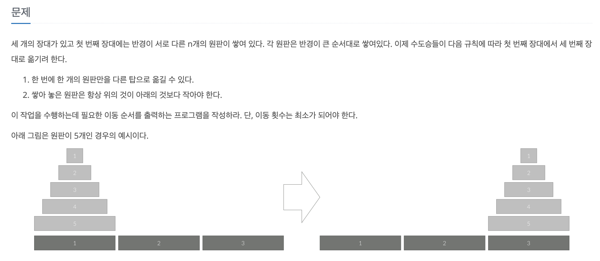


- 제약: 이때 원반을 옮기는 몇 가지 조건이 따른다.
  - **한 번에 움직일 수 있는 원반은 기둥 위에 놓인 원반 하나뿐이다.**
  - **어떤 원반 위에 그보다 더 큰 원반을 쌓을 수 없다.**
- 입력: 원판의 갯수 N
- 출력: 최소이동횟수와 이동 순서의 출력


문제의 입력과 출력, 제약을 알았으니 이런 정보들을 보다 함수에 가깝게 정의해보는 것이 좋다. **원반의 이동횟수를 최소화하고자 할 때, 각 원반을 옮기는 모든 순서를 출력하는 것으로 한다.** 이때 각 이동의 출력은 ‘3번 원반을 A에서 C’와 같이로 정하며, 입력은 원반의 개수로 받는다


이를 구현하는 함수 hanoi 를 대략적으로 정의하면 다음과 같다.

`hanoi(N)`: 원반의 개수 N을 입력 받아 모든 원반을 C 막대에 옮기는 각 움직임을 출력한다.


### 2. 알고리즘 설계

우선 원판을 2개부터 시작해서 3개, 4개 까지 확장해보면 규칙이 보일 것 같다. 위에서 문제를 `hanoi(N)` 이라는 것을 아주 대략적으로 정의했다. `hanoi(N)`을 통해 원반을 어디에서 어디로 옮기는지를 모두 출력해야 하며 그를 위해서는 실제로 한번씩 원반을 하나씩 옮겨보는게 좋은 방법이다. 

 그리고 모든 문제에서 중요한 것은 **언제나 문제를 작게 만들어(substructure) 해결하고 이후 확대하는 것**이다. 그런 의미에서 원반을 2개에서 시작해보자. 


2개인 경우

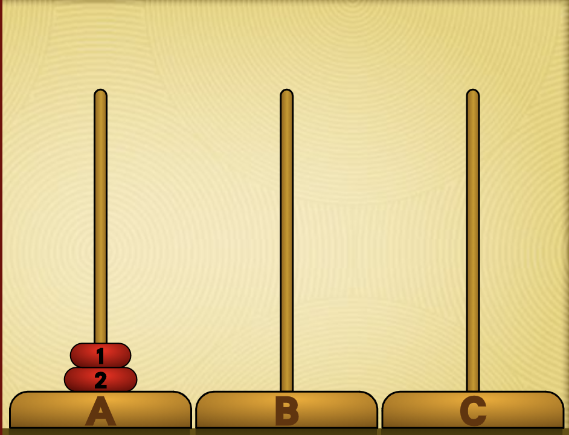 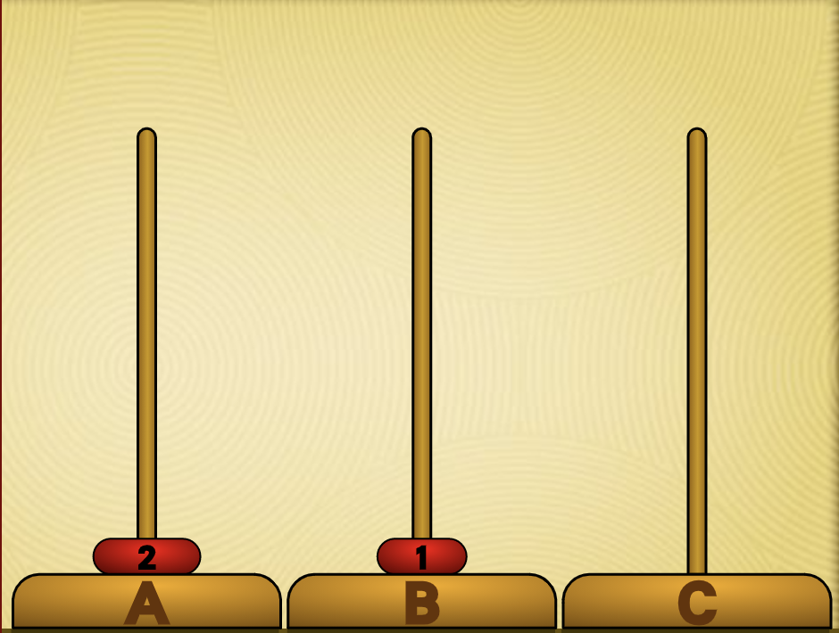 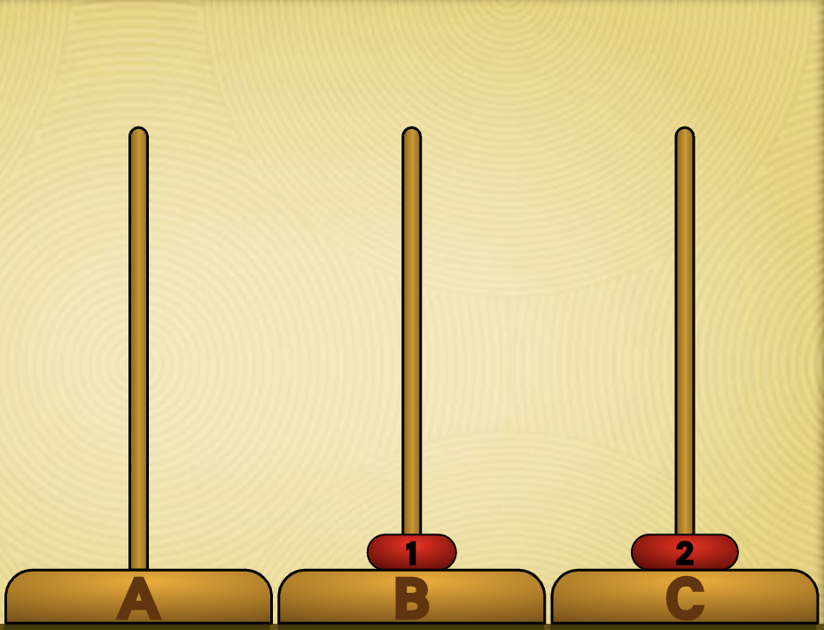  

```
1 2
1 3
2 3
```


3개인 경우

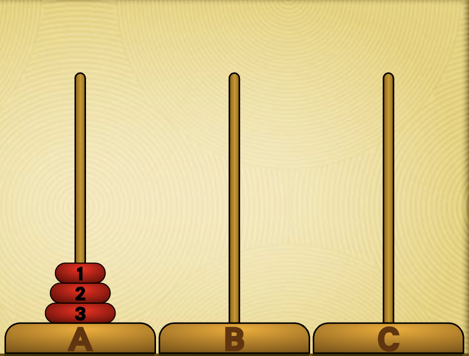 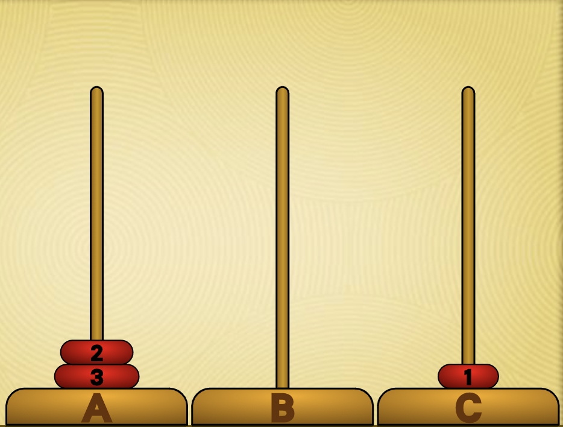 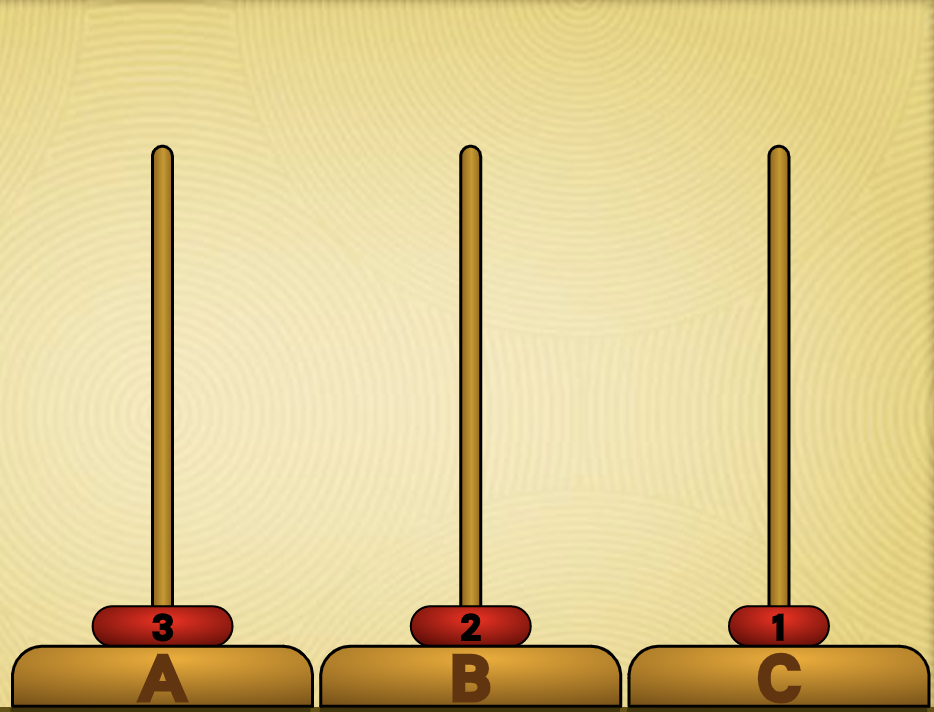

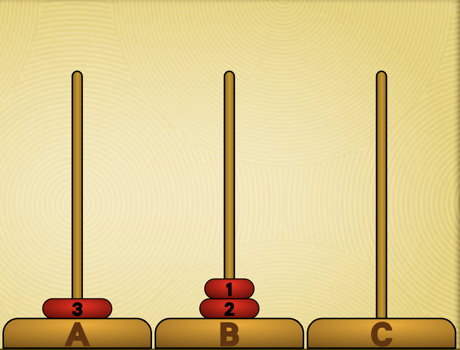 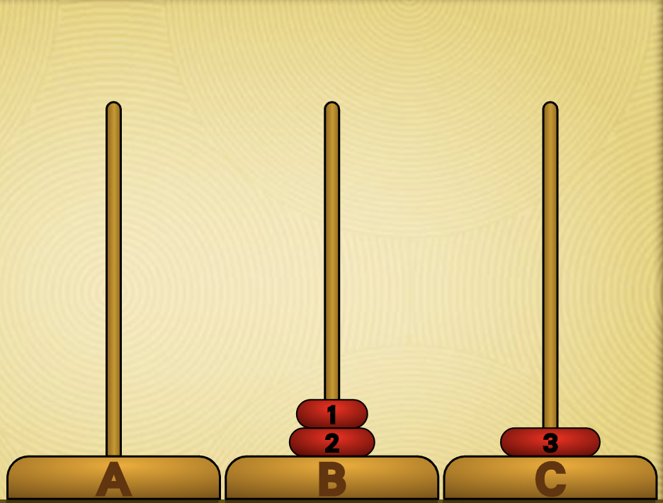 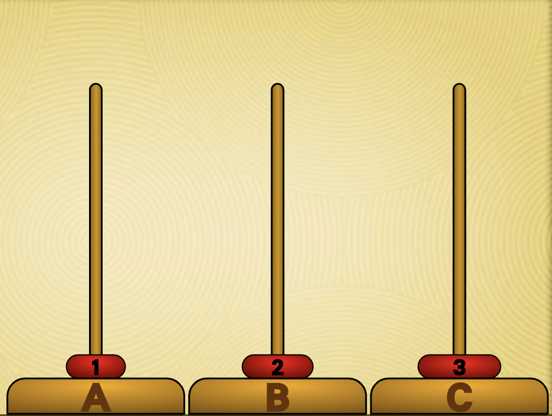

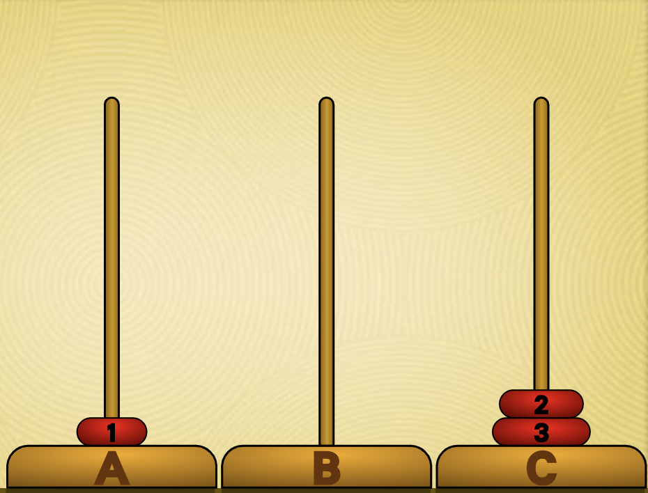 


원반의 개수가 3개일 때, 각 움직임을 표현하고 있다. 이동횟수를 최소로 할 때 총 7번을 이동해야 하며 정해진 규칙을 지키면서 최종적으로 ‘C’ 막대에 모든 원반이 위치하게 된다. 

이때 우리는 각 움직임을 한 문장씩 출력한다고 했다. 우리가 원하는 함수(`hanoi(3)`)의 실행결과는 다음과 같을 것이다.

```c
1 3		// 1
1 2		// 2
3 2		// 3
1 3		// 4
2 1		// 5
2 3		// 6
1 3		// 7
```


이 문제는 재귀를 사용하지 않고는 풀기 매우 힘들다. **재귀(recursion)란 같은 형태의 보다 작은 입력을 지닌 자기 자신을 호출하는 것이고, 이렇게 재귀적인 호출을 사용하는 함수를 재귀함수라고 한다.** 


이 문제 어디에서 재귀가 사용될 수 있을까? 일단 우리가 `hanoi(N)`에 대해 다시 살펴보자.

- **`hanoi(N)`: 원반의 개수 N을 입력 받아 모든 원반을 C 막대에 옮기는 각 움직임을 출력한다.**

이때 위의 7번의 움직임은 모두 `hanoi(N)` 의 과정이다. 


- **`hanoi(N-1)`: 원반의 개수 N-1을 입력 받아 모든 원반을 C 막대에 옮기는 각 움직임을 출력한다.**

 **`hanoi(N)` 에서 `hanoi(N-1)` 가 발견되는가?** **다시 말하면 `hanoi(3)` 에서 `hanoi(2)` 가 발견되는지가 될 것이다.**


이 조건을 충족할 때 재귀를 사용할 수 있다. 위 그림에서 찾아보자.

4번째 움직임 (1 3)에서 **규칙에 따라 크기가 3인 원반을 A에서 C로 옮기려면 위의 두 원반은 B 원반에 이미 꽂혀 있어야 한다.**  여기서 `hanoi(2)` 가 보인다.


또 4번째 움직임 이후, **이제 2개의 원반을 다시 B에서 C로 옮겨야 한다. 여기서도 `hanoi(2)` 가 쓰이고 있다.**


즉 **`hanoi(N)` 은 두 번의 `hanoi(N-1)` 재귀 과정으로 분할될 수 있다** 

한 번의 재귀 후 가장 큰 원반(N번째 원반)을 목적지로 옮기고, 다시 마지막 재귀를 통해 나머지 N-1개의 원반을 목적지에 옮긴다. **즉, hanoi(N)은 세 번의 과정으로 나눌 수 있다.**


**출발점, 도착점, 경유점**

근데 여기서 다가 아니고 추가적인 정보가 필요하다.

앞서 N개의 원반을 옮기는 작업에는 두 번의 재귀 과정이 있다고 했다. 이때 **각 재귀 과정이 의도하는 바가 조금씩 다르다.** 위의 그림을 참고하면 다음과 같이 구분할 수 있다.

- 첫 번째 재귀: N-1 개의 원반을 A에서 B로 옮긴다. (1~3)
- 두 번째 재귀: N-1 개의 원반을 B에서 C로 옮긴다. (5~7)


**두 재귀는 옮기는 원반의 개수는 같지만 원반을 움직이는 출발지와 목적지가 다르다.** 그리고 이 정보는 현재 간략하게 정의한 `hanoi(N)` 함수에서 추적하지 않고 있는 정보이기도 하다. **우리의 문제 정의에서 출력은 각 움직임의 출발지와 목적지도 같이 기술해야 하기 때문에 함수에서 이 두 정보를 같이 추적해줘야 한다.** 따라서 원 함수의 입력이 원반의 개수만 받았다면 이제는 최소 출발지, 도착지의 변수까지 추가로 받아야 한다.


여기에 더해 `경유점`이라는 개념도 사용하자. 만약 A에서 C로 3개의 원반을 이동할 때 B 막대도 결국 사용해야 한다. 이렇게 세 개의 입력을 같이 입력해줘야 원반을 하나씩 이동할 때 경유점을 지날 때도 문제없이 출력할 수 있다.


**`hanoi(N)` 재정의**


`hanoi(N, start, to, via)`: start에서 to로 via를 거쳐 총 N개의 원반을 운반할 때 각 이동 과정을 출력하라


- **hanoi(3, ‘A’, ‘C’, ‘B’)**

그리고 `hanoi` 함수는 두 번의 재귀와 한 번의 가장 큰 원반을 옮기는 과정이 필요하다고 했다. 즉, **전체 과정을 세 과정의 분해가능하다.** 이때 각 과정은 순차적으로 이루어지는데 그 순서는 다음과 같다. 

1. `hanoi(2, ‘A’, ‘B’, ‘C’)` : 1~3,  3번 원반을 C로 옮기기 위해서는 먼저 위의 두 원반을 B로 옮겨야 한다.
2. **이후 크기가 3인 원반을 C로 옮긴다** : 4
3. `hanoi(2, ‘B’, ‘C’, ‘A’)`: 5~7, 크기가 3인 원반을 C로 옮긴 후 B에 있는 두 개의 원반을 C로 옮긴다. 이때 ‘A’를 경유한다.


원반의 개수(N)가 몇 개가 되든 결국 이 과정을 거친다. 한 번의 재귀, 가장 큰 원반 옮기기 이후 다시 한 번의 재귀. 물론 이때 예외가 있다. N이 1일 때는 자신의 위에 원반이 없기 때문에 재귀가 필요없고 바로 원반을 옮기고 종료한다. 이것이 곧 재귀함수의 탈출 조건, 또는 기저 사례(base case)가 된다. 이제 이 식을 실제 수식으로 표현해보자.


`hanoi(N, start, to, via)`

```c
if N == 1 move(1, start, to) // print
else hanoi(N−1, start, via, to) + move(N, start, to) + hanoi(N−1, via, to, start)

```


각 재귀함수에서 인자의 순서가 헷갈리기 쉽다. 헷갈리지 말자.

1. 첫 번째 재귀에서는 맨 밑의 N번째 원반을 목적지로 옮기기 위해 위의 N-1 개의 원반을 경유지로 옮긴다.
2. 그 다음 N 번째 원반을 목적지로 옮긴다.
3. 경유지에 있는 N-1 개의 원반을 to로 옮긴다.

이게 핵심이다. 


#### 총 이동횟수

`hanoi(N)` = 2 * `hanoi(N-1)` + 1 이라는 것을 우리는 알고 있으니 총 이동 횟수는

$ T_n=2×(T_{n−1})+1 \\\
2×(2^{n−1}−1)+1 \\\
=2^n−2+1 \\\
=2^n−1 $


N개의 원반일 때, $ 2^N - 1 $ 번이 될 것이다.


### 3. 코드 구현 (BOJ 11729)

```c++
#include <cstdio>
#include <cmath>

using namespace std;


void hanoi (int N, int src, int dest, int via) {
    if (N == 1) printf("%d %d\n", src, dest);
    else {
        hanoi(N-1, src, via, dest);
        printf("%d %d\n", src, dest);
        hanoi(N-1, via, dest, src);
    }
}

int main() {
    int N;
    scanf("%d", &N);
    printf("%d\n", (int)pow(2, N)-1);
    hanoi (N, 1, 3, 2);
    return 0;

}
```


