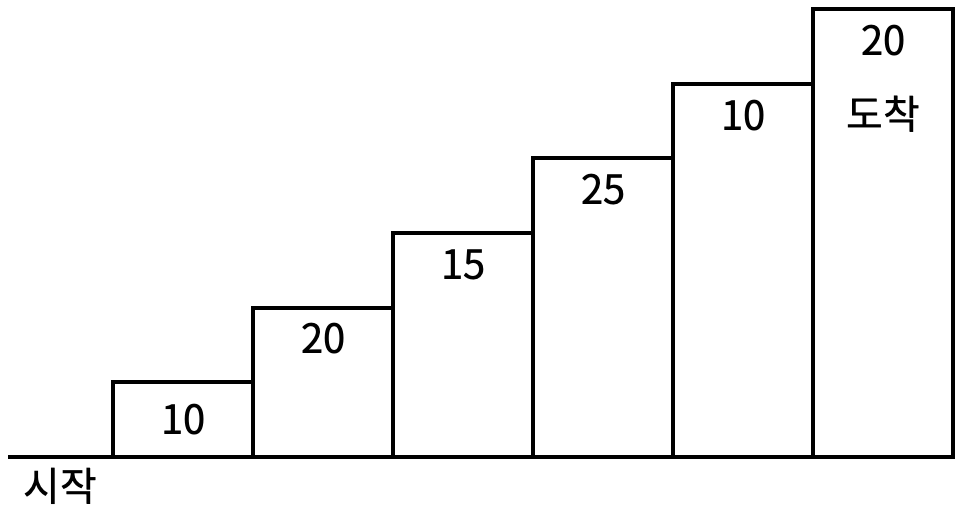

## 문제

계단 오르기 게임은 계단 아래 시작점부터 계단 꼭대기에 위치한 도착점까지 가는 게임이다. <그림 1>과 같이 각각의 계단에는 일정한 점수가 쓰여 있는데 계단을 밟으면 그 계단에 쓰여 있는 점수를 얻게 된다.



<그림 1>


예를 들어 <그림 2>와 같이 시작점에서부터 첫 번째, 두 번째, 네 번째, 여섯 번째 계단을 밟아 도착점에 도달하면 총 점수는 10 + 20 + 25 + 20 = 75점이 된다.


<그림 2>

계단 오르는 데는 다음과 같은 규칙이 있다.

1. 계단은 한 번에 한 계단씩 또는 두 계단씩 오를 수 있다. 즉, 한 계단을 밟으면서 이어서 다음 계단이나, 다음 다음 계단으로 오를 수 있다.
2. 연속된 세 개의 계단을 모두 밟아서는 안 된다. 단, 시작점은 계단에 포함되지 않는다.
3. 마지막 도착 계단은 반드시 밟아야 한다.

따라서 첫 번째 계단을 밟고 이어 두 번째 계단이나, 세 번째 계단으로 오를 수 있다. 하지만, 첫 번째 계단을 밟고 이어 네 번째 계단으로 올라가거나, 첫 번째, 두 번째, 세 번째 계단을 연속해서 모두 밟을 수는 없다.

각 계단에 쓰여 있는 점수가 주어질 때 이 게임에서 얻을 수 있는 총 점수의 최댓값을 구하는 프로그램을 작성하시오.


## 설계


다이나믹 프로그래밍으로 풀어보기로 했다.

다이나믹 프로그래밍이란 큰 문제를 동일한 구조의 더 작은 문제로 분할하여 기저가 되는 케이스부터 상향식으로 계산해서 결국 큰 문제를 해결하는 방식이다.


이 문제의 예제에 대입하자면 우리가 풀어야할 큰 문제는 6번째 계단까지 가면서 가장 많은 점수를 얻어야한다. 


큰 문제를 동일한 구조의 더 작은 문제로 분할해보자. 


용어의 용이성을 위해 $S_n$을 $n$번째 계단가지 가면서 가장 많은 점수를 획득한 경우 라고 정의하자.

그렇다면 $S_5$는 $S_6$에 하위 문제가 될 수 있는가 고민을 해보는 것이다.


**안다.** 이렇게 추상적으로  접근하면 머리만 아프고 해결은 되지 않는다.

문제에서 제시한 조건을 바탕으로 규칙을 세워보자.

- 계단은 한 번에 1개씩 혹은 2개씩 오를 수 있다.
- 계단은 연속해서 3개를 밟을 수 없다.
- 마지막 도착 계단은 반드시 밟아야 한다.


1, 2번 조건을 합치면 계단을 오를 수 있는 경우를 나눠볼 수 있다.


i. 계단 연속해서 한칸 한칸 두번 오르면 다음엔 무조건 두칸을 올라가야한다.

ii. 계단을 한번에 두칸 오르면 다음엔 한 칸을 올라가던 두칸을 올라가던 무방하다.


즉, 계단을 연속해서 두 계단을 밟아서 다음 번에는 꼭 두칸을 건너뛰어야 하는지(1), 아니면 한 칸을 올라가던 두칸을 올라가던 무방한지(2) 알아야한다.

같은 계단에 있더라도 (1), (2)번 상황에 따라서 경우의 수가 달라질 것이다.


이 정보를 종합해서 `memo[i][j]` 라는 변수를 생각해보자.


**`memo[i][j]`는 i번째 계단을 밟았을 때, 이때까지 얻은 총 최대 점수이다.** 

- `memo[i][0]`은 i번째 계단을 밟았을 때, 이 전 계단들을 연속해서 밟고와서 무조건 i+2번째 계단으로 2칸 뛰어야 하는 상황에서의 최대 점수를 나타낸다.


- `memo[i][1]`은 i번째 계단을 밟았을 때, 이 전 계단을 연속하게 밟고오지 않아서 i+1번째 계단으로 1칸 뛰던지 i+2번째 계단으로 2칸 뛰던지 무방한 상황에서의 최대 점수를 나타낸다.


즉, 예제에서 가장 작은 하위문제는 `memo[0][0]`와 `memo[0][1]` 일 것 이다. 아직 아무계단도 오르지 않았을 때, 따라서 0이 될 것이다.


#### 1. i = 0 일 때

 j = 0, 1 인것은 사실 크게 상관없다. 왜냐하면 아직 시작도 안했기 때문이다. 하지만 생각하기 편하기 위해서 `memo[0][1]`은 -2번째 계단에서 2칸 점프에서 온 경우이고 `memo[0][0]`은 -2번째 계단과 -1번째 계단을 연속해서 밟고 온 경우라고 생각하자.


#### 2. i = 1일 때

 `memo[1][0]`와 `memo[1][1]`이다. 이제부터 각 계단의 점수가 필요하다.

각 i번째 계단의 점수를 `score[i-1]`라고 정의하자


1번째 계단을 올랐을 때, 첫 번째 계단에 오르는 경우의 수는 0에서 1로 한칸 올라가는 것 뿐임으로 둘다 `score[0]` 일 것이다. 

i = 0 일때와 마찬가지로 생각하기 편하기 위해서 `memo[1][1]`은 -1번째 계단에서 2칸 점프에서 온 경우이고 `memo[1][0]`은 -1번째 계단과 0번째 계단을 연속해서 밟고 온 경우라고 생각하자.


#### 3. i = 2 일때 

우선  `memo[2][0]` 부터 생각해보자.


두가지 경우를 생각 해 볼 수 있다.

- 연속해서 1번째 계단, 2번째 계단을 밟은 경우:  `memo[2][0] = memo[1][1] + score[1]` 
- 0번째 계단에서 두칸 올라와서 2번째 계단을 밟은 경우:   `memo[2][0] = memo[0][0] + score[1]` 

이중 큰 값을 고르면   `memo[2][0]`의 값을 구할 수 있다.


두번째로   `memo[2][1]`


여기도 두가지 경우를 생각 해 볼 수 있다.

- -1번째, 0번째 계단을 밟아 어쩔 수 없이 두칸 올라온 경우:  `memo[2][1] = memo[0][0] + score[1]` 
- -1번째 계단을 밟지 않고, 0번째 계단에서 올라온 경우: `memo[2][1] = memo[0][1] + score[1]` 


2번째 계단이라 약간 억지스러운 면이 있지만 설명과 이해를 위한 것이니 이해를 부탁드립니다.


#### 4. i > 2 일 때

같은 방법으로 3번째 계단, 4번째 계단을 계산해 나가면 결국 6번째 계단까지 계산할 수 있게 되고 

위에서 언급한 큰 문제를 동일한 구조의 더 작은 문제로 분할하여 기저가 되는 케이스부터 상향식으로 계산해서 결국 큰 문제를 해결하는 방식입니다.


# 구현

```c++
#include <cstdio>
#include <vector>
#include <algorithm>

using namespace std;

int memo[300][2];

int main() {
    int N;
    scanf("%d", &N);

    vector <int> v;
    for (int i = 0; i < N; i++) {
        int input;
        scanf("%d", &input);
        v.push_back(input);
    }

    memo[0][0] = 0;
    memo[0][1] = 0;
    memo[1][0] = v[0];
    memo[1][1] = v[0];

    for (int i = 2; i <= N; i++) {
        memo[i][0] = max(memo[i-2][0], memo[i-1][1]) + v[i-1];
        memo[i][1] = max(memo[i-2][1], memo[i-2][0]) + v[i-1]; 
    }

    printf("%d\n", max(memo[N][0], memo[N][1]));
    return 0;

}
```

