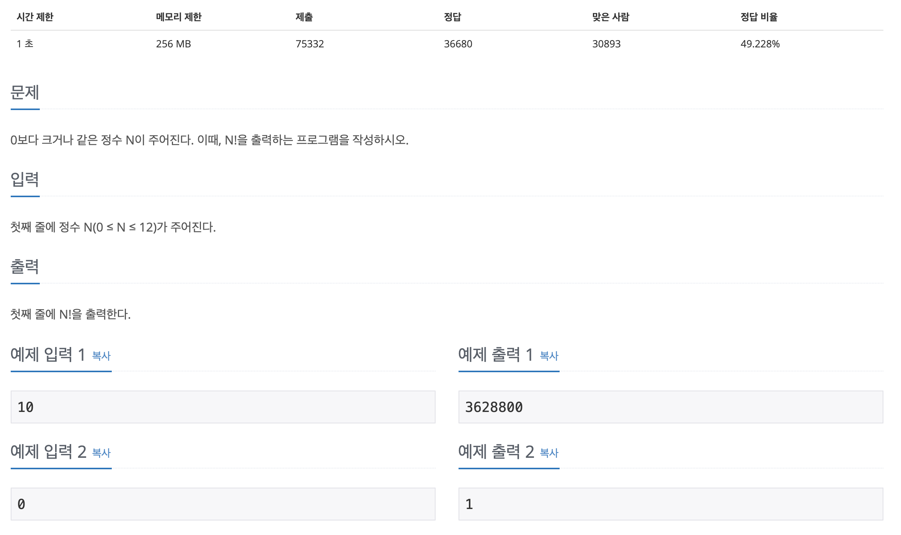

## PS 일반론

### 문제해결 프로세스

1. 문제를 읽고 요구하는 바를 명확히 이해해야합니다.

즉, 어떤 인풋을 받아 어떤 아웃풋을 내야하는지 정확히 이해해야합니다.

Ex) 백준 10872번: 팩토리얼

N이라는 인풋을 받았을 때, N!의 값을 출력하면 되는구나 라고 명확하게 이해해야합니다.

위의 문제는 비교적 짧고 간단하기 때문에 실수하지 않겠지만 문제가 복잡해질수록 실수하기 쉬우므로 항상 문제에 대한 정확한 이해가 가장 중요합니다.

2. 요구하는 바를 어떻게 해결할지 자신만의 알고리즘을 설계 합니다.

아웃풋을 내기 위해 어떻게 해야할지 고민하는 과정입니다. 이 과정에서 알고리즘은 우리가 배워야만 아는 BFS, DFS 같은 알고리즘일 수 있고, 단순히 구현일 수도 있습니다. 

위 팩토리얼 문제의 경우 재귀(recursive) 혹은 반복문으로 설계해야겠다. 라고 생각하는 과정입니다.

3. 설계한 알고리즘을 검증합니다.

- 주어진 테스트 케이스를 이용하거나 테스트 케이스를 직접 만들어 설계한 알고리즘이 요구하는 답을 충족시키는지 검증 합니다.

- 또한 설계한 알고리즘이 **제한된 자원 (실행 시간 / 메모리) 내**에서 유효한지 검증 합니다.
  - 이 부분은 데이터구조의 시간복잡도와 공간복잡도를 계산할 줄 알아야 어느정도 예측이 가능합니다.
  - 예측을 쉽게 해주기 위해 몇가지 외우면 좋은 프로그래머의 숫자들을 소개합니다.

이후, 만약 설계한 알고리즘이 틀렸다면 다시 설계하고 맞았다면 자신의 언어로 구현합니다.

4. 알고리즘 구현

구현한 알고리즘이 틀렸으면 잘못 구현했는지, 혹은 알고리즘 자체가 틀렸는지 확인하고 그에 맞는 항목으로 이동합니다.

구현한 알고리즘이 맞았으면, 다른 사람들은 어떻게 풀었는지 확인하며 회고 합니다.

### 외워두면 좋은 숫자

#### 1. 상용로그

밑이 10인 로그

$ log_{10}2 \approx 0.3010 $

왜 why, 

알고리즘의 시간복잡도가 $ O(2^n) $ 라고 할 때, 그리고 n의 상한이 100이라고 했을 때, 이 알고리즘은 일반적으로 실행할만한가? 

$ 2^{100} $ 을 계산하는 천재는 많이 없다. 이때 $ log_{10}2 $ 값을 이용해 큰 수의 자릿수 정도만 파악한다면 10진수로 변환했을 때의 자릿수를 다음과 같이 구할 수 있다.

$ log\_{10}2^{100} = 100\*\log_{10}2 \approx 100*0.3010 = 30.10 $

정확히는 $ 2^{100} $ 이라는 숫자가 얼마나 큰지는 모르겠지만  30자리의 숫자라는 것이다. ($ 10^{30} $이상) 따라서 현재의 입력 상한에서 현재의 시간복잡도를 갖는 해결책으로는 문제가 해결되지 않을 것이라고 합리적인 추측을 하고 다른 알고리즘을 생각해보는 것이 맞을 것이다.

$ log_{10}2 \approx 0.3010 $ 라는 것을 알고 있었다면 위 계산을 1초만에 끝내고 바로 다른 길로 돌아섰을 것이다. 숫자하나 외운거 치고 가성비가 괜찮다.

#### 2. 팩토리얼 상수 (n!)

완전탐색 알고리즘이 많은 경우 O(n!)의 시간복잡도를 갖는다는 것을 확인했다. 따라서 이 알고리즘을 사용하려면 문제의 입력의 상한을 확인해야 한다. (사실 문제를 보는 순간 입력의 조건을 어딘가에 기록하는 습관을 들여야 한다.)

외우고 있으면 좋은 입력의 크기(n)에 따른 팩토리얼 상수는 다음과 같다.

5! = 120,   8! =40,320

이 두 수는 무난해서 외울만하다. 내 경험상 이 두 팩토리얼은 간단한 수 계산을 할 때 필요했던 것 같다. 그리고 중요한 건 이 숫자다.

10! = 3,628,800

10!은 약 360만에 달하는 숫자이다. 내가 볼 때, **O(n!)의 시간복잡도를 갖는 알고리즘의 입력의 상한은 10 정도이다.** 그 이후부터는 너무너무 커져서 동적계획법이나 분할정복 같은 대안을 찾아봐야 한다. 하지만 10 이하까지는 어떻게 비벼볼만 하다.

#### 3. 지수 상수 ( $ 2^n $ )

C 언어 등에서 각종 자료형의 크기에 따른 데이터의 상하한, $ O(2^n) $의 시간복잡도를 갖는 알고리즘을 다룰 때, 특히 네트워크 IP 등을 공부할 때 지수 상수를 접하게 된다.

 2가 아닌 다른 밑수를 써본 기억이 없다.

[28=256]

우리는 일반적으로 1바이트는 8비트라고 알고 있다. 하지만 수십년 전에는 1바이트는 6, 7 등 8이 아닌 다른 수의 비트를 가진 때가 있었다. 그래서 **8비트를 의미할 때 전문적인 표현으로는 이를 옥탯(octet)이라고 한다.** C 언어의 *char* 자료형도 1바이트로 알고 있다. RGB의 각 색도 8비트로 표현된다.

그렇기 때문에 8비트의 표현범위를 아는 것은 의미 있다. 2의 8승은 256으로 총 256의 정보 상태를 저장할 수 있다.

[210=1,024]

**2의 10승은 1024로 1000에 근사한다.** 그래서 외울만한 가치가 있다. 그리고 외우기도 쉽다. 2의 10승인 1024이 ‘10’으로 시작하기 때문이다. **이 숫자가 1000에 근사한다는 것은 큰 장점이 있는데, 이를 통해 2의 20승은 1백만(106), 2의 30승은 10억(109) 정도로 근사할 것이라고 추측 가능하기 때문이다.**

참고로, 2의 20승은 1,048,576인데 엑셀에서 한 시트가 가질 수 있는 최대 행의 개수가 이 숫자와 같다. 확인해보라. 어떤 이유가 있을 것 같지 않은가?

[232=4,294,967,296]

그 중요한 2의 32승이다. C 언에서 *int* 자료형과 *float* 자료형 등은 4바이트의 크기를 갖는데 4바이트는 32비트다. IPv4의 IP 주소는 32비트 수로 표현될 수 있으며 따라서 이론상 할당될 수 있는 전세계 네트워크의 모든 기기의 수는 43억을 넘지 못한다. 이런 이유로 인터넷이 폭발적으로 성장한 현대 사회에서 IP 주소의 고갈의 문제가 대두되었고 NAT 등의 땜빵, IPv6라는 진지한 대안과 같은 여러 해결책이 제시되었다. 2의 32승의 활용은 이것말고도 더 많을 것이다.

이 수는 외우자. 나도 그냥 외웠다. 13자리의 수로 단박에 외워지지는 않는다. 중간과 끝에 ‘96’이 두 번 들어간다는 패턴을 이용해서 한 10번 되뇌이고 실수하다보니 외워지게 되었다.

[264=18,446,744,073,709,551,616log10264≈19.2659]

C 언어에서 *double* 자료형은 8바이트이다. 그래서 2의 64승도 찾아보면 좋겠지만 이 숫자는 너무 길다(1조 X 1천만)… 내 머리로는 다 외우지는 못할 것 같고, 대략 20자리 수라는 것만 기억하면 되겠다.

### 빠른 검증을 위한 상식

#### 1. PS에서 Time Limit 1초가 의미하는 것

백준이나 타 사이트에서 알고리즘 문제를 풀다보면 **'수행 시간'**이 1초로 정해져있고, 메모리가 정해져 있는 경우가 있다.

알고리즘 문제에서 **'1초'**란, **'간단한 연산을 1억번(100000000, 0이8개) 정도 수행할 수 있다'** 는 의미이다.

따라서 **N=10000(1만, 0이 4개) 인경우** 

1) O(N)의 알고리즘을 수행하는 데 

1만 * 10000 = 1억이기때문에 10000초안에 해결할 수 있다.

2) **O(N²)의 알고리즘을 수행하는 데** 

1만 * 1만 = 1억이기때문에 1초안에 해결할 수 있다.

이 경우, O(N²) 알고리즘을 사용해도 된다는 말이다.

 

그러나 **N= 100000(10만, 0이 5개)인 경우**

1) O(N)의 알고리즘을 수행하는 데 

10만 * 1000 = 1억이기때문에 1000초안에 해결할 수 있다.

2) **O(N²)의 알고리즘을 수행하는 데에는**

10만 * 10만 = 100억(0이 10개)이므로 약 100초안에 수행할 수 있다. 

이 경우, 1초를 훨씬 넘어가므로 O(N²) 알고리즘이 아닌 O(N lg N) 알고리즘으로 해결해야 한다.

#### 2. PS에서 Space Limit 256MB가 의미하는 것

메모리 512mb면 얼마만큼의 배열을 쓸 쑤 잇는지

log 계산, 시간복잡도 계산하는법

