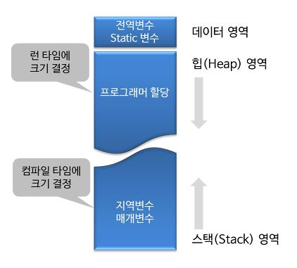

## PS 일반론

### 문제해결 프로세스

1. 문제를 읽고 요구하는 바를 명확히 이해해야합니다.

즉, 어떤 인풋을 받아 어떤 아웃풋을 내야하는지 정확히 이해해야합니다.

Ex) 백준 10872번: 팩토리얼


N이라는 인풋을 받았을 때, N!의 값을 출력하면 되는구나 라고 명확하게 이해해야합니다.

위의 문제는 비교적 짧고 간단하기 때문에 실수하지 않겠지만 문제가 복잡해질수록 실수하기 쉬우므로 항상 문제에 대한 정확한 이해가 가장 중요합니다.


2. 요구하는 바를 어떻게 해결할지 자신만의 알고리즘을 설계 합니다.

아웃풋을 내기 위해 어떻게 해야할지 고민하는 과정입니다. 이 과정에서 알고리즘은 우리가 배워야만 아는 BFS, DFS 같은 알고리즘일 수 있고, 단순히 구현일 수도 있습니다. 

위 팩토리얼 문제의 경우 재귀(recursive) 혹은 반복문으로 설계해야겠다. 라고 생각하는 과정입니다.


3. 설계한 알고리즘을 검증합니다.

- 주어진 테스트 케이스를 이용하거나 테스트 케이스를 직접 만들어 설계한 알고리즘이 요구하는 답을 충족시키는지 검증 합니다.

- 또한 설계한 알고리즘이 **제한된 자원 (실행 시간 / 메모리) 내**에서 유효한지 검증 합니다.
  - 이 부분은 데이터구조의 시간복잡도와 공간복잡도를 계산할 줄 알아야 어느정도 예측이 가능합니다.
  - 예측을 쉽게 해주기 위해 몇가지 외우면 좋은 프로그래머의 숫자들을 소개합니다.


이후, 만약 설계한 알고리즘이 틀렸다면 다시 설계하고 맞았다면 자신의 언어로 구현합니다.


4. 알고리즘 구현

구현한 알고리즘이 틀렸으면 잘못 구현했는지, 혹은 알고리즘 자체가 틀렸는지 확인하고 그에 맞는 항목으로 이동합니다.

구현한 알고리즘이 맞았으면, 다른 사람들은 어떻게 풀었는지 확인하며 회고 합니다.


### 빠른 검증을 위한 상식

#### 1. PS에서 Time Limit 1초가 의미하는 것

백준이나 타 사이트에서 알고리즘 문제를 풀다보면 **'수행 시간'**이 1초로 정해져있고, 메모리가 정해져 있는 경우가 있다.

알고리즘 문제에서 **'1초'**란, **'간단한 연산을 1억번(100,000,000, 0이 8개) 정도 수행할 수 있다'** 는 의미이다.


i. **N = 10,000(1만, 0이 4개) 인경우** 

- 시간복잡도가 **O(N)**인 알고리즘

10,000 < 100,000,000  => 1초안에 해결할 수 있다.


- 시간 복잡도가 **$ O(N^2) $** 인 알고리즘

$ {10,000}^2 \leq 100,000,000 $ => 1초안에 해결할 수 있다.

즉 $ N \leq 10,000 $ 인 경우, $ O(N^2) $ 알고리즘을 사용해도 된다는 말이다.

 


ii. **N= 100,000(10만, 0이 5개)인 경우**

- 시간복잡도가 **O(N)**인 알고리즘

100,000 < 100,000,000 => 1초안에 해결할 수 있다.


- 시간 복잡도가 **$ O(N^2) $** 인 알고리즘

$ {100,000}^2 = 1,000,000,000 $ (10억) > 100,000,000 => 1초안에 **해결 불가**

즉 $ N > 100,000 $ 인 경우, $ O(N^2) $ 알고리즘을 사용할 수 없고 $ N \log N $ 의 시간복잡도를 가진 알고리즘을 사용해서 풀어야한다.


| 시간복잡도             | 입력 상한 N           |
| ---------------------- | --------------------- |
| $O(1)$                 |                       |
| $O(\log N)$            |                       |
| $O(N)$: 1개의 for문    | $ N \leq100,000,000 $ |
| $O(N \log N)$          | $ N \leq 5,000,000 $  |
| $O(N^2)$: 2개의 for 문 | $ N \leq 10,000 $     |
| $O(N^3)$: 3개의 for문  | $ N \leq 500 $        |
| $O(2^N)$               | $ N \leq 20 $         |
| $O(N!)$                | $ N \leq 10 $         |


#### 2. PS에서 Space Limit 256MB가 의미하는 것

메모리 제한이 256MB or 512MB라고만 적혀있을 수 도 있고,

heap, global, static 총계 256MB, stack 1MB 이런 식으로 적혀있을 수도 있다.


2번째 명시에 대해 설명을 덧붙히자면 메모리 공간은 stack, heap, data 영역으로 나뉜다.

1. data 영역에는 **global(전역변수), static 변수**가 들어간다. 프로그램 시작하자마자 크기에 맞는 영역이 할당되고, 프로그램이 종료되어야 메모리에서 해제된다.

2. stack 영역은 함수 호출시에 할당되서 **함수에 대한 지역변수와 매개변수가 저장**된다. 함수 호출이 끝나면 메모리에서 해제된다. 크기는 컴파일 타임에 결정된다.

3. heap 영역은 **프로그래머에 의해 할당**되며 크기는 런타임에 결정된다. 할당해야 할 메모리의 크기를 런타임에 결정해야하는 때 사용되는 공간이다. 이렇게 할당하는 것을 동적할당이라고 한다.



main 함수에서 int 배열을 호출할 경우 stack 메모리에 배열이 할당된다. 1MB 제한에서는 

int한개는 4byte 이므로, 

int arr[256]은 1kb

int arr[262,144] = 1mb


26만개 정도 사용할 수 있다.


보통 문제에서 백 만개가 넘는 배열을 선언해야 할 경우가 많기 때문에 왠만하면 동적할당, 혹은 전역변수로 선언해야 메모리 제한으로 0점 맞는 것을 해결할 수 있다.

그 외 256, 512mb 제한에서는 

int arr[67,108,864] =  256mb

int arr[134,217,728] = 512mb 


```
메모리 용량 단위는 bit -> byte -> Kb -> Mb -> Gb -> Tb

8bit = 1byte
1024byte = 1kb
1024kb = 1mb
```


또한 재귀 호출에 따른 스택 크기는 계산이 어려우니 10,000번을 초과하지 않도록 한다.

메모리 제한은 N이 극단적으로 크거나 혹은 메모리 제한 자체를 극단적으로 낮게 주는 경우 자주 발생하기 때문에 쉽게 눈치를 챌 수 있다. 이 경우를 제외하고 메모리 제한이 되는 경우는 알고리즘 자체에 문제가 있을 가능성이 높다.


### 외워두면 좋은 숫자

#### 1. 상용로그

밑이 10인 로그

$ log_{10}2 \approx 0.3010 $


왜 why, 

알고리즘의 시간복잡도가 $ O(2^n) $ 라고 할 때, 그리고 n의 상한이 100이라고 했을 때, 이 알고리즘은 일반적으로 실행할만한가? 


$ 2^{100} $ 을 계산하는 천재는 많이 없다. 이때 $ log_{10}2 $ 값을 이용해 큰 수의 자릿수 정도만 파악한다면 10진수로 변환했을 때의 자릿수를 다음과 같이 구할 수 있다.


$ log\_{10}2^{100} = 100\*\log_{10}2 \approx 100*0.3010 = 30.10 $


정확히는 $ 2^{100} $ 이라는 숫자가 얼마나 큰지는 모르겠지만  30자리의 숫자라는 것이다. ($ 10^{30} $이상) 따라서 현재의 입력 상한에서 현재의 시간복잡도를 갖는 해결책으로는 문제가 해결되지 않을 것이라고 합리적인 추측을 하고 다른 알고리즘을 생각해보는 것이 맞을 것이다.

$ log_{10}2 \approx 0.3010 $ 라는 것을 알고 있었다면 위 계산을 1초만에 끝내고 바로 다른 길로 돌아섰을 것이다. 숫자하나 외운거 치고 가성비가 괜찮다.


#### 2. 팩토리얼 상수 (n!)

완전탐색 알고리즘의 경우 $ O(n!) $의 시간복잡도를 갖는다. 따라서 이 완전탐색으로 문제를 풀려면 문제의 입력에 따른 연산 횟수를 알고 있어야 한다.


`10! = 3,628,800`


10!은 약 360만에 달하는 숫자이다. 내가 볼 때, **O(n!)의 시간복잡도를 갖는 알고리즘의 입력의 상한은 10 정도이다.** 그 이후부터는 너무너무 커져서 동적계획법이나 분할정복 같은 대안을 찾아봐야 한다. 하지만 10 이하까지는 어떻게 비벼볼만 하다.


#### 3. 지수 상수 ( $ 2^n $ )

C 언어 등에서 각종 자료형의 크기에 따른 데이터의 상하한, $ O(2^n) $의 시간복잡도를 갖는 알고리즘을 다룰 때, 특히 네트워크 IP 등을 공부할 때 지수 상수를 접하게 된다.


$ 2^{10} = 1,024 $

**2의 10승은 1024로 1000에 근사한다.** **이 숫자가 1000에 근사한다는 것은 큰 장점이 있는데, 이를 통해 2의 20승은 1백만(10^6), 2의 30승은 10억(10^9) 정도로 근사할 것이라고 추측 가능하기 때문이다.**


$ 2^{32} = 4,294,967,296 $

C 언에서 *int* 자료형과 *float* 자료형 등은 4바이트의 크기를 갖는데 4바이트는 32비트다. 

IPv4의 IP 주소는 32비트 수로 표현될 수 있으며 따라서 이론상 할당될 수 있는 전세계 네트워크의 모든 기기의 수는 43억을 넘지 못한다. 이런 이유로 인터넷이 폭발적으로 성장한 현대 사회에서 IP 주소의 고갈의 문제가 대두되었고 NAT 등의 땜빵, IPv6라는 진지한 대안과 같은 여러 해결책이 제시되었다. 2의 32승의 활용은 이것말고도 더 많을 것이다.


$ 2^{64} = 18,446,744,073,709,551,616 $ 

$ log_{10}2^{64} \approx 19.2659 $

C 언어에서 *double* 자료형은 8바이트이다. 대략 20자리 수라는 것만 기억하면 되겠다.


