# Shortest Path

#### 최단거리 문제

입력으로 그래프의 정보(간선과 정점의 갯수)와 각 간선의 가중치가 주어질 때, 출발점에서 도착점까지의 가는데 드는 최소비용을 구하는 문제


##### 최단경로의 특성

i. **Optimal Substructure**를 가지고 있다. (Dynamic Programming)


`distance(n, m)`: n에서 m까지의 최단거리이라고 정의한다면

`distance(1, 4) = distance(1, 2) + distance(2, 3) + distance(3, 4) `로 정의할 수 있다.


증명) 

만약 각 구간 중 하나라도 구해진 최단경로보다 더 짧은 경로가 존재한다고 가정하자.

그러면 전체 최단경로는 더 짧아질 것이고, 기존에 구했던 최단경로는 더이상 최단경로가 아니게 된다.

이에 모순이 발생하므로 모든 구간의 최단경로의 합은 전체의 최단경로가 된다.


**ii. Triangle inequality: `w[u,v] <= w[u,x] + w[x,v]`** 

`w[u,v]`: 경로 u-v의 가중치

ex) 대전에서 서울을 갈때, 같은 속도로 움직인다면, 대전에서 태안을 갔다가 태안에서 서울을 가는 것이 대전에서 서울로 바로가는 것보다 느리다.

 


cf> **Negative-weight edge**

경로 가중치가 0보다 작다면?

- Negative-weight cycle: 그 사이클을 무한히 돈다면 w[u, v] = -INF가 되어버리기 때문에 계산이 안된다.
- Negative-weight edge: 사이클이 없는 음수 가중치가 있다면 계산은 가능할 것이다.

따라서 몇몇 알고리즘은 음이 아닌 정수의 가중치에서만 동작한다.


또한 **최단경로에서 cycle은 항상 포함될 수 없다.** 

음이던 양이던 사이클이 존재하면 거리계산이 부정확하고, 가중치가 0인 사이클은 아무 의마가 없기 때문이다.


## 1. Single-Source Path

임의의 정점 하나에서 시작해서 모든 정점까지의 거리를 구하는 문제

**설계모델**

- s: 출발점
- V: 출발점을 포함한 모든 정점
- d[v]: s에서 v 정점까지의 최단거리
- p[v]: v 정점의 parent, v 정점을 오기 전 어느 정점을 거쳐 왔는가를 나타냄


위의 정의를 이용해 최단경로를 구하는 과정을 서술하면 아래와 같다.

 i. 모든 정점 V에 대해서 d[v]를 무한대로 설정한다.

 ii. Relaxation을 거치면서 d[v]를 감소시킨다.


**Relaxation**

들어가기 앞서, Relaxation이란 최단경로 특성의 *optimal structure*을 이용한 것이다.


`d[v] > d[u] + w(u,v) `인 경우 `d[u] + w(u,v) `값이 더 작다면 값을 `d[v]`값을 낮춰주는 과정이다.


**의사코드**

```c++
INIT-SINGLE-SOURCE(V, s) {
    for each v : V {
        do d[v] = INF;
        p[v] = NIL;
    }
    d[s] = 0;
}

Relaxation(u,v,w) { 
    if (d[v] > d[u] + w) { /* w = w(u,v) */
   		d[v] = d[u] + w;
    	p[v] = u;
    }
}
```


### Bellman-Ford Algorithm

#### **개요**

- 간선 가중치가 음수여도 가능한 단일 출발점 최단경로 알고리즘이다.

- 반환 값으론 bool 값을 반환한다.
  - FALSE: negative-weight cycle

  - TRUE: No negative-weight cycle

    

그래프의 **vertex의 갯수만큼 모든 edge에 대해서 relaxation**을 진행한다.


#### **의사코드**

```c++
BELLMAN-FORD(V, E, w, s) {
  
   // INIT-SINGLE-SOURCE(V, s);
   for each v : V {
      do d[v] = INF;
      p[v] = NIL;
   }
   
  d[s] = 0;
    
    // why 1 to V-1?
    // 마지막 정점은 어차피 이전 정점을 relaxation 하면서 완료되었으니 건너 뛴다.
	for (i = 1; i < V-1; i++) {
 		for each edge (u,v) : E
        Relaxation(u, v, w)
    }
    
    // 왜 한번 더 체크할까?
    // 음의 사이클이 있는지 확인하기 위해서
    // 만약 음가중치 사이클이 있다면 최단경로 w(u, v) < 0 이므로
	for each edge (u,v) : E {
		if (d[v] > d[u] + w(u,v)) return false
    }
	return true;
}
```


#### **동작과정**

Relaxation을 통해 d[v]가 바뀌는 시점만 있습니다. 


#### **시간복잡도**: $ O (V*E) $ 		

why?  |V| - 1만큼 relaxation을 해주기 때문


#### **c++ 코드**

```c++
// 벨만포드 알고리즘은  따로 인접리스트나 인접행렬을 만들어 주지 않아도 된다.
// 왜냐하면 간선의 정보를 저장하기 때문에 그 정보안에 모든 것이 다들어있기 때문이다.
// tuple 자료구조 찾아보기

#include <cstdio>
#include <tuple>
#include <vector>

using namespace std;

#define MAX 99999999

vector < tuple <int, int, int> > Edge; // 0: src  1: dst  2: weight

int V, E, start;
int d[501]; // distance
int p[501]; // parents node


bool BellmanFord() {
    // init
    for (int v = 1; v <= V; v++) {
        d[v] = MAX;
    } 
    
    // relaxation
    d[start] = 0;
    for (int i = 1; i < V; i++) {
        for (int j = 0; j < E; j++) {
            int u = get<0>(Edge[j]);
            int v = get<1>(Edge[j]);
            int w = get<2>(Edge[j]);
            
            // 출발점의 거리가 무한대일때 탐색하는 것을 피하기 위해서 조건을 하나 더 넣어준다.
            if (d[u] != MAX && d[v] > d[u] + w) {
                d[v] = d[u] + w;
             	p[v] = u;   
            }    
        }
    }

    // check negative weighted cycle
    for (int i = 0; i < E; i++) {
         int u = get<0>(Edge[i]);
         int v = get<1>(Edge[i]);
         int w = get<2>(Edge[i]);

         if (d[v] > d[u] + w) 
            return false;
    }
    return true;
         
}

int main() {
    scanf("%d %d %d", &V, &E, &start);
    for (int i = 0; i < E; i++) {
        int u, v, w;
        scanf("%d %d %d", &u, &v, &w);
        Edge.push_back(make_tuple(u, v, w));
    }

    if (BellmanFord()) {
        for (int i = 1; i <= V; i++) {
            if (d[i] == MAX) printf("d[%d]: INF\n", i);
            else printf("d[%d]: %d\n", i, d[i]);
        }
    }

    else printf("It contains negative weighted cycle\n");
    return 0;
}
```


### Single Source in DAG

- DAG이기 때문에 싸이클이 없습니다.
- DAG의 모든 경로는 토폴로지로 정렬된 하위 시퀀스이므로 왼쪽에서 오른쪽으로 각 최단 경로의 정점을 처리한 다음 한 번에 수행됩니다.


#### 의사코드

```pseudocode
DAG-SHORTEST-PATHS(V, E, w, s)
	topologically sort the vertices 
	INIT-SINGLE-SOURCE(V, s)
	for each vertex u, take in topologically sorted order
		do for each vertex v in Adj[u] 
			do RELAX(u, v, w)
```


#### **시간복잡도**: $ \theta (V+E) $ 		


 ### Dijkstra Algorithm

#### **개요**

- 음이 아닌 정수인 가중치 그래프에 대해서만 사용 가능
- BFS와 비슷하다 (가중치 있는 버전의 BFS)
  - 큐에서 꺼내온 정점에서 시작하여 점차적으로 Tree를 확장시키는 느낌
  - FIFO queue 대신 Priority queue를 사용


#### 설계

```
두 개의 정점 세트가 있습니다.
– S = 최단 경로에 포함된 정점.
– Q = 우선순위 큐 = V – S.

그래프 G=(V,E)의 경우 최단 경로가 알려진 정점 집합 S를 유지합니다.

추정된 최소 최단 경로로 정점 u(u∈V-S)를 반복적으로 선택하고 u를 S에 추가하고 u를 떠나는 모든 가장자리를 완화합니다.
```


#### 의사 코드

```pseudocode
Dijkstra (G, w, s)

INITIALIZE-SINGLE-SOURCE (G, s)

set S = {};
priority_queue Q;
for (int i = 0; i < V; i++)
	Q.push(V[i]);
	
while (!Q.empty())
	u = EXTRACT-MIN (Q);
	S.insert(u);
	for each vertext v in adj[u]
		Relaxation(u, v, w)
```


#### 동작

s->t로 가는 최단경로 찾기


#### 코드

```c++
```


#### 시간복잡도

- 바이너리 힙: $ O (E \log V) $
- 피보나치 힙: $ O (V \log V + E) $


## 2. All Pairs Shortest Path

모든 정점에 대해 최단경로를 찾으려면 앞서 살펴본 다익스트라, 벨만포드 알고리즘을 정점의 갯수만큼 반복하면 될 것이다. 그렇다면 시간복잡도는 아래와 같다.

- Dijkstra: $ O (V \log V + E) \to O (V^2 \log V + VE) \because V \to V^2 \\
  on \ dense \ graph, \ O(V^3) \because E = V^2 $

  

- Bellman-Ford: $ O (V*E) \to O (V^2 *E) \because V \to V^2 \\
  on \ dense \ graph, \ O(V^4) \because E = V^2 $


너무 느린것 같다. 그래서 플로이드와 와샬이란 사람이 새로운 알고리즘을 제시했다.


### Floyd-Warshall Algorithm


#### 개요

- 음의 가중치 간선 허용
- 음의 가중치 사이클은 없다고 가정한다.
- 다이나믹 프로그래밍 패러다임


#### 설계

다이나믹 프로그래밍 패러다임

 i에서 j까지 갈 때 **다이렉트로 가는게 더 비용이 적은가** 아니면 **i와 j사이에 있는 어떤 정점 k를 들렀다 가는 것이 더 비용이 적은가** 비교하며 값을 저장하는 과정이다. 그리고 그 와중에 어떻게 다이나믹 프로그래밍을 접목시키는지 논리적으로 전개하는 과정이다.

출발점은 i, 도착점은 j라고 약속한다.


##### Intermediate vertex

경로 p ($ <v_1, ..., v_L> $)에서 $ v_1, v_L $을 제외한 모든 정점 ( $ \\{ v_2, ... v_{L-1} \\} $ )


1에서 N까지 번호가 매겨진 V를 정점 집합으로 갖는 그래프 G가 있다고 가정하자.

**shortestPath(i, j, k)**: i에서 j로 집합 {1, 2, ..., k} 의 꼭짓점들 만을 경유지로 거쳐 가는 최단 경로를 반환하는 함수


함수가 주어졌을 때, 목표는 {1, 2, ..., N} 에 있는 꼭짓점만을 이용해서 모든 꼭지점 i에서 모든 꼭짓점 j로 가는 최단 경로를 찾는 것이다.


각각 (i, j, k) 쌍에 대하여 **shortestPath(i, j, k)**는 다음 중 한개이다.

- Case1: k를 중간 정점으로 갖지 않는 경로 ( 집합 {1, ...., k-1}에 있는 꼭짓점만 거쳐간다.)

- Case2: k를 중간 정점으로 갖는 경로 i에서 k까지와, k에서 j까지 가는 경로 모두 {1, 2, ...., k-1}에 있는 꼭짓점만을 거쳐간다.


i에서 j까지 1에서 k-1의 꼭짓점 만을 거쳐가는 경로 중 최선의 경로는 shortestPath(i, j, k-1)에 의해 정의되고 만약 i에서 k를 거쳐 j로 가는 더 나은 경로가 있다면, 그 경로는 i에서 k까지 ({1, ..., k-1}만 거쳐서) 가는 경로와 k에서 j까지 ({1, ..., k-1}만 거쳐서) 가는 경로를 합친 것이라는 것은 자명하다.


##### Recursive Solution

shortestPath(i, j, k)를 $ d_{ij}^{(k)} $로 정의하자.

w(i, j)를 i와 j간의 변의 가중치라면 shortestPath(i, j, k)를 다음의 재귀적 공식으로 정의할 수 있다.

- 기본적인 경우는 $ d_{ij}^{(0)}  = w(i, j) $

- 재귀적인 경우는 $ d_{ij}^{(k)} $ = min(shorestPath(i, j, k-1), shortestPath(i, k, k-1) + shortestPath(k, j, k-1))

$ d\_{ij}^{(k)} = \left\{\begin{matrix}
 w\_{ij}& (k =0) \\\
 min(d\_{ij}^{(k-1)}, d\_{ik}^{(k-1)}+d_{kj}^{(k-1)})& (k \geq 1) \\\ 
\end{matrix}\right. $


이 공식은 플로이드-워셜 알고리즘의 핵심이다. 이 알고리즘은 처음에 모든 (i, j) 쌍에 대해서 k = 1일 때 shortestPath(i, j, k)를 계산하고 다음으로 k=2일 때를 계산하는 식으로 k=N이 될 때까지 계속하면, 모든 (i, j) 쌍에 대해서 최단 경로를 찾게 된다.


##### pred[i, j] (predecessor pointers): **i에서 j로 가는 경로의 중간 정점**


모든 pred[i, j]는 초기엔 nil 값으로 설정된다.

중간 정점 k를 지나는 i에서 j까지의 최단 경로가 발견될 때마다 pred[i,j] = k로 설정합니다.

- pred[i, j] = nil: 최단 경로가 존재하지 않는다.
- pred[i,j] = i: 최단 경로가 존재하고 최단 경로에 중간 정점이 없는경우, 즉 최단거리는 간선 (i, j)이다.

- pred[i,j] = k: 최단 경로가 존재하고 k는 i에서 j까지의 중간 정점


- pred[i,j] = i: 최단거리는 간선 (i, j)이다.

- pred[i, j] = i가 아닌 경우: (i, pred[i, j]) 와 (pred[i, j], j)를 재귀적으로 계산한다.

```pseudocode
Floyd-Warshall (w, n) {

	let dist be a |n| × |n| array of minimum distances initialized to ∞ (infinity)
	
	// initialize
	for i = 1 to n 
		for j = 1 to n
			do D(0)[i,j] = w[i,j];
			if (i == j) pred[i, j] = i;
			else pred[i,j] = NIL;
	
			

	for k = 1 to n
		for i = 1 to n
			for j = 1 to n
				if (d(k-1)[i,k] + d(k-1)[k,j] < d(k-1)[i,j]) {	// case 2
					d(k)[i,j] = d(k-1)[i,k] + d(k-1)[k, j];
          pred[i, j] = k;
				}
				
				else d(k)[i,j] = d(k-1)[i, j];									// case 1
				
				
	return d(n)[1...n, 1...n];
}
```


#### 동작

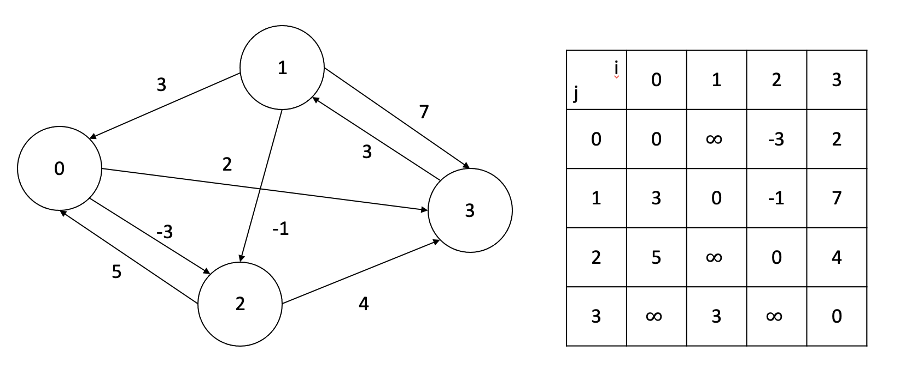


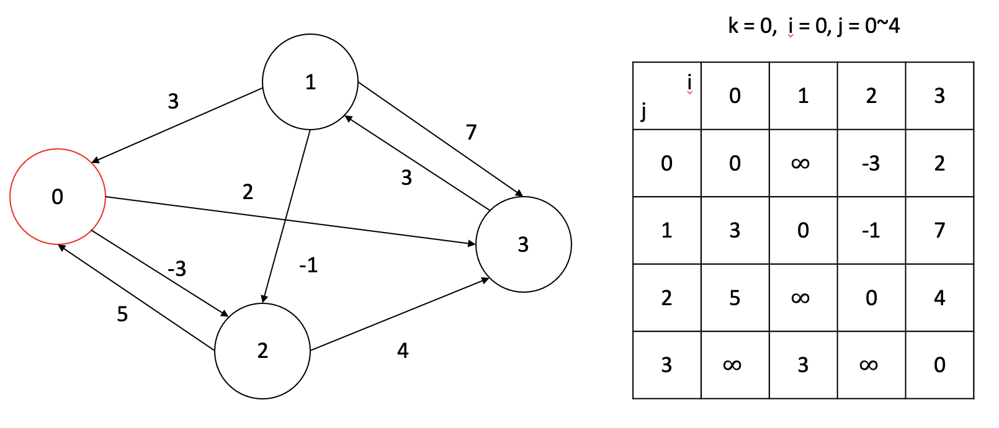


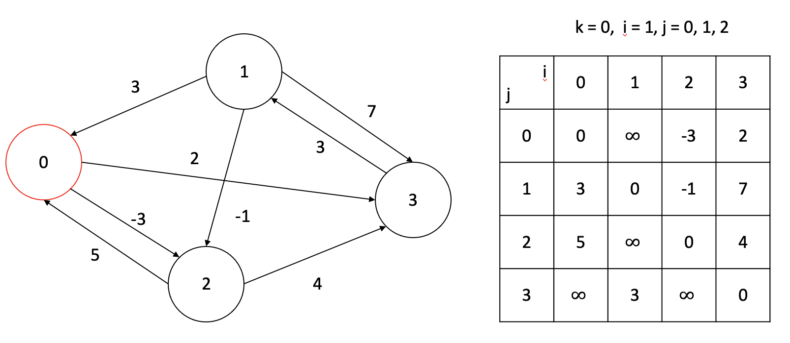


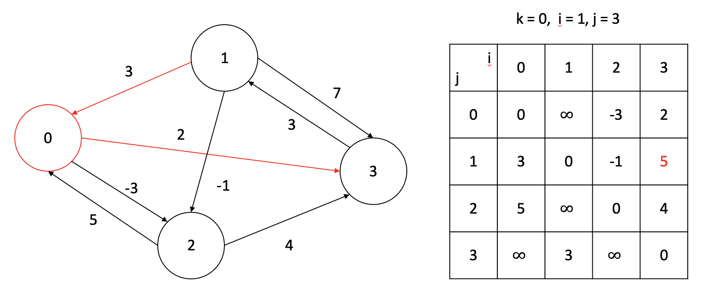

1번 정점에서 0번 정점을 중간정점으로 3번 정점으로 가니까 더 가중치가 낮은 간선이 되었으므로 업데이트 한다.


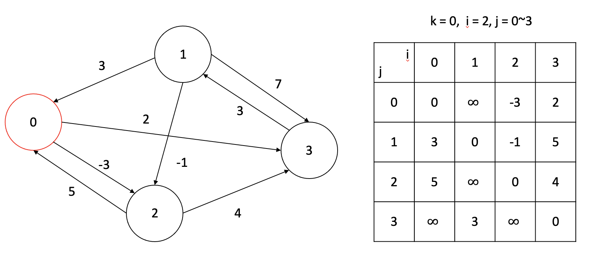


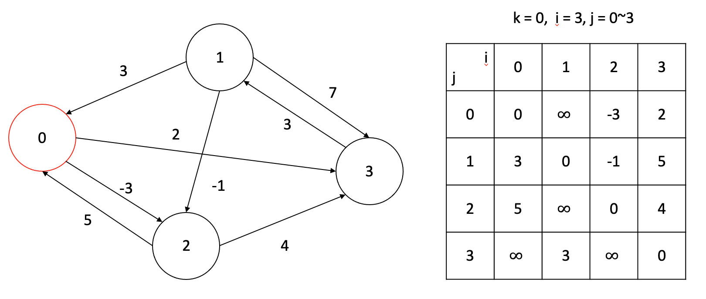

3번에서 0번으로 가는 간선이 없으므로 아무일도 일어나지 않았다.


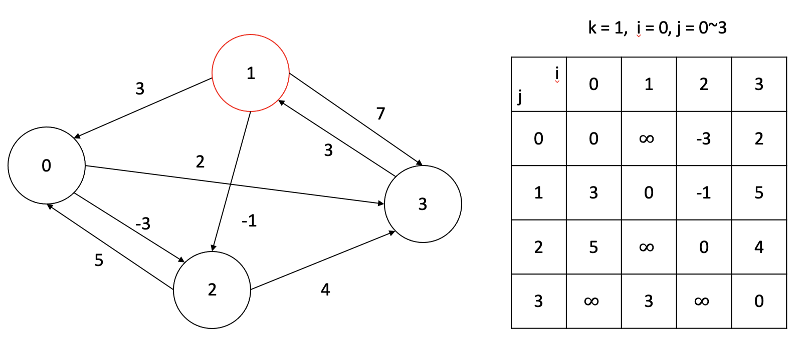

0번에서 1번으로 가는 간선이 없으므로 아무일도 일어나지 않았다.


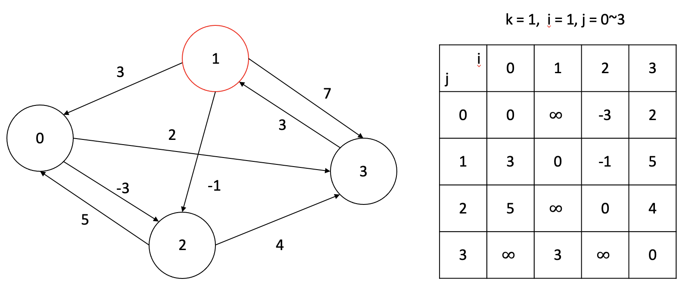


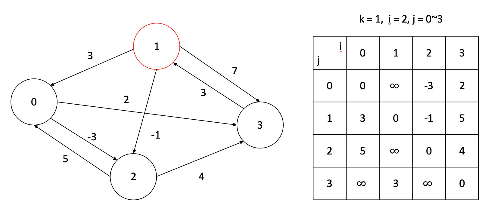


2번에서 1번으로 가는 간선이 없으므로 아무일도 일어나지 않았다.


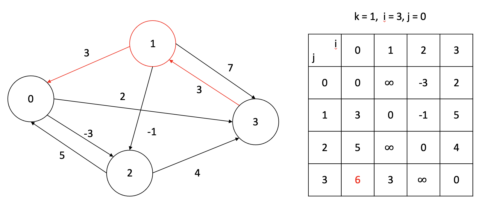


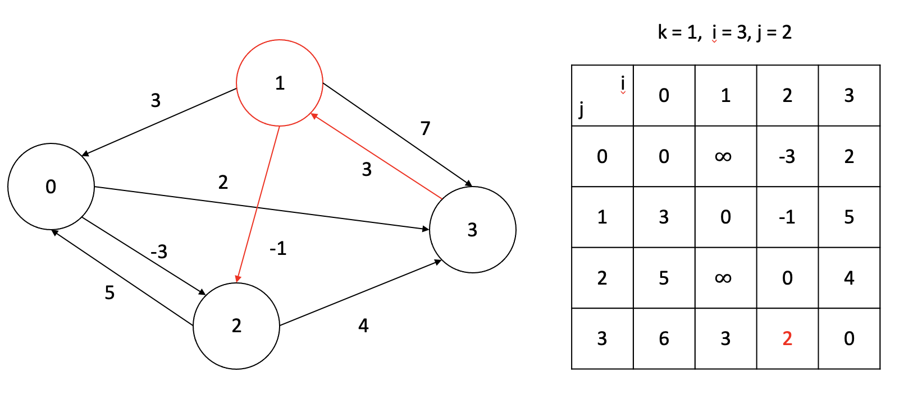


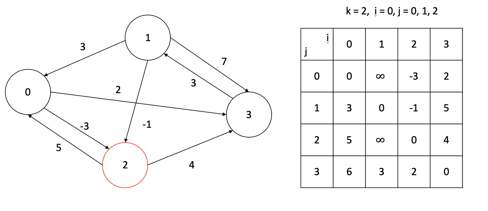

아무일도 없었고요


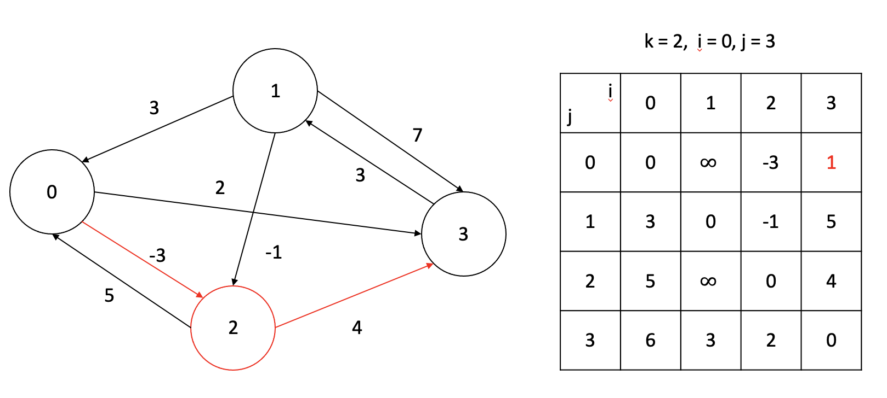


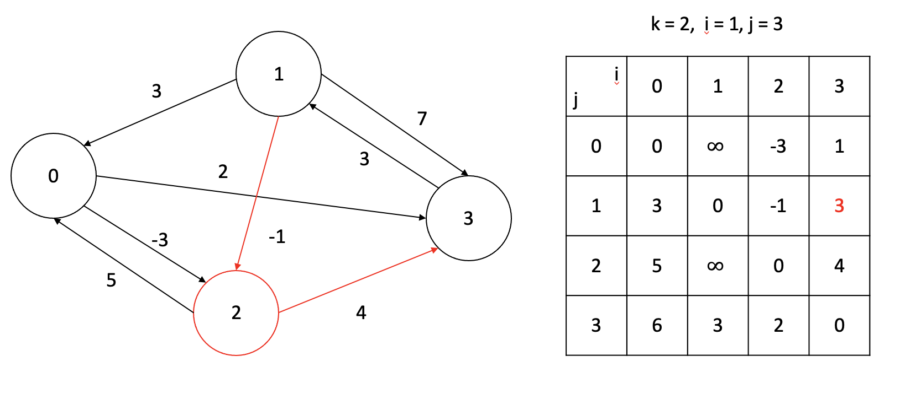


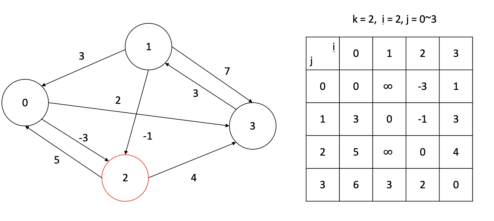

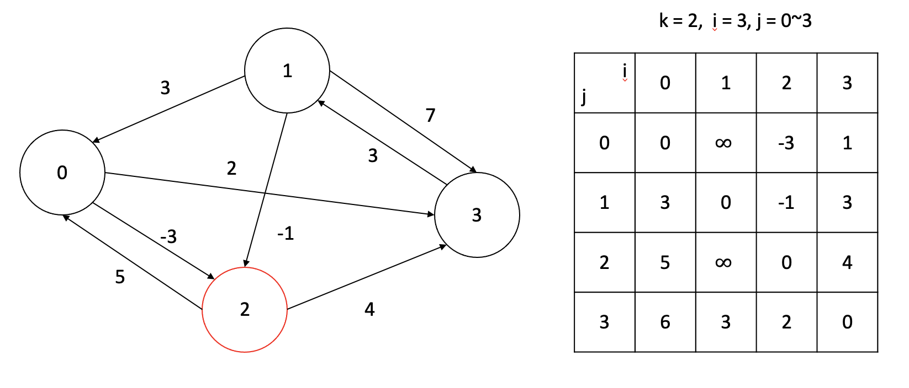

3번에서 2번으로 가는 간선이 없으므로 아무일도 일어나지 않았다.


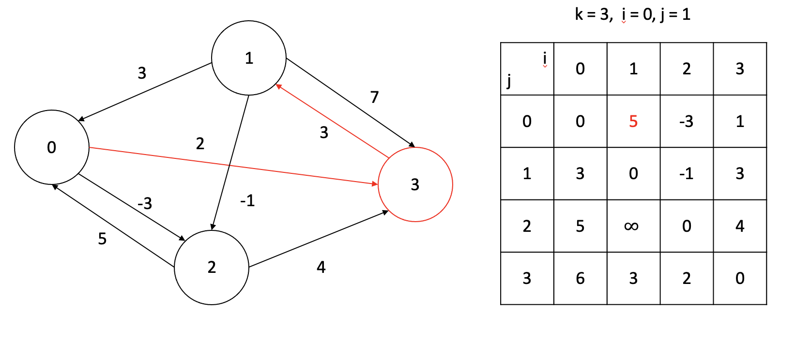

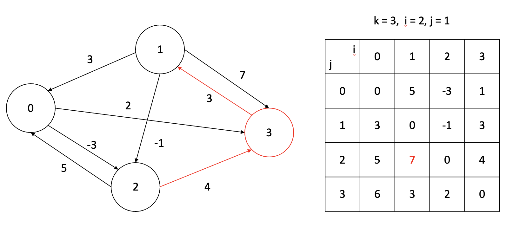


귀찮아서 못했는데 경로 가중치가 업데이트 될때마다 `pred[i][j] = k` 로 업데이트 하면 경로복원도 가능하다.


#### Negative cycle

**i번 노드에 대해 dist\[i][i] = 0으로 초기화**했었다.

자기 자신에서 출발해 자기 자신에게 돌아오는 경로의 가중치는 절대 0보다 작아질 수 없기 때문이다.

하지만 그래프에 음의 사이클이 존재한다면, 그 사이클에 포함된 노드를 k라 했을 때 dist[k][k]가 음수 값을 가지게 된다.

따라서, 플로이드 알고리즘을 적용한 후,

**모든 노드의 번호 i에 대해 dist[i][i]가 0인지 확인해줌으로써 음의 사이클 존재 여부를 판단**할 수 있다.


#### C++ 코드

```c++
#include <iostream>
#include <vector>
#include <algorithm>
 
#define INF 99999999
 
using namespace std;
typedef pair<int, int> p;
 
int dist[5][5];
 
void floyd() {
    for (int k = 0; k < 4; k++) {
        //가능한 모든 from, to 쌍에 대해 dist를 갱신한다.
        for (int i = 0; i < 4; i++) {
            for (int j = 0; j < 4; j++) {
                dist[i][j] = min(dist[i][j], dist[i][k] + dist[k][j]);
            }
        }
    }
}
 
 
void init() {
    for (int i = 1; i <= 4; i++)
        for (int j = 1; j <= 4; j++)
            dist[i][j] = INF;
 
    for (int i = 1; i <= 4; i++) dist[i][i] = 0;
 
    dist[1][3] = -3;
    dist[1][4] = 2;
 
    dist[2][1] = 3;
    dist[2][3] = -1;
    dist[2][4] = 7;
 
    dist[3][1] = 5;
    dist[3][4] = 4;
 
    dist[4][2] = 3;
}
 
int main() {
    init();
    floyd();
 
    for (int i = 0; i < 4; i++) {
        for (int j = 0; j < 4; j++) {
            if (dist[i][j] == INF) printf("- ");
            else printf("%d ", dist[i][j]);
        }
        printf("\n");
    }
 
    return 0;
}

```


#### 시간복잡도: $ \theta (|V|^3) $


#### cf> Transitive closure (공사중)

원하는 정점이 서로 직접 혹은 간접적으로 연결되어 있냐를 확인하는 그래프


```
• 주어진 방향 그래프 G = (V, E)
• 계산 G* = (V, E* )
• E* = {(i,j) : G에 i에서 j까지의 경로가 있음}
• 각 가장자리에 1의 가중치를 할당한 다음 FLOYD-WARSHALL을 실행할 수 있습니다.
• dij < n이면 i에서 j까지의 경로가 있습니다.
• 그렇지 않으면 dij = INF이고 경로가 없습니다.


논리 연산 (OR), (AND) 사용
• 각 모서리에 가중치 1을 할당한 다음 이 가중치로 FLOYD-WARSHALL을 실행합니다.


```


$ D^{(k)} $ 대신 $ T^{(k)} = (t_{ij}^{(k)}) $ 를 사용한다.
$$
t_{ij}^{(0)} = \left\{\begin{matrix} 
0 & i\not= j \ and \ (i, j) \notin E \\
1 & i=j\ or \ (i, j) \in E
\end {matrix}\right. 


\\ t_{ij}^{(k)} = \left\{\begin{matrix} 
1 \ \ \ (if \ there \ is \ a \ path \ from \ i \ to \ j \ with \ all \ intermediate \ vertices \ in \ \{1, 2,3, ..., k\}) \\
= (t_{ij}^{k-1} = 1) \ or (t_{ik}^{(k-1)} = 1 \ and \  t_{kj}^{k-1}=1)
\\
0 \ (otherwise)


\end {matrix}\right.
$$


```pseudocode
TRANSITIVE-CLOSURE(E, n) 

for i = 1 to n
	for j = 1 to n
		if (i=j or (i, j) in E) then tij(0) = 1 
		else tij(0) = 0

for k = 1 to n
	for i = 1 to n
		for j = 1 to n
			tij(k) = tij(k-1) or (tik(k-1) and tkj(k-1))

return T(n)
```


