## Articulation point (절단점)


### Bi-connected

Bi-connected란 만약 어떤 정점과 그 정점과 연결되어 있는 간선을 삭제해도 연결되어있는 상태를 말한다. 즉 Bi-connected Graph란 만약 어떤 정점과 그 정점과 연결되어 있는 간선을 삭제해도 connected 상태를 유지하는 그래프


### Articulation point

**절단점**(Articulation Point) 또는 **단절점**이라고도 불리며 **무향그래프**(Undirected Graph)에서 정점 하나를 삭제 했을 때 해당 정점이 포함된 그래프를 두 개 이상의 컴포넌트(component)로 분리시키는 정점을 말합니다.


이 Articulation point를 구하는 알고리즘을 공부해보자.


#### 설계 

- 무방향 그래프에서 모든 간선은 tree edge 혹은 back edge이다. (무향그래프는 cross edge를 가지지 않는다.)
- leaf는 절단점이 될 수 없다.
- 만약 w의 자손들이 v로 거슬러 올라갈 때 v로 가는 backward edge가 없으면 w는 절단점이다. 다시 말해 만약 w의 자손들이 모두 역방향 간선을 통해 v (w의 선조)로 올라갈 수 있다면 w는 절단점이 아니다.
- dfs탐색을 통해 back edge를 찾아낸다. 

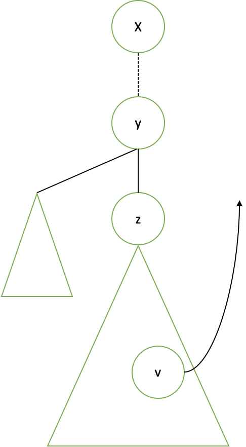


dfs를 통해 y보다 하위에 있는 모든 정점 v에 대해서 y의 선조 노드인 x으로 가는 back edge (v,x)를 체크한다.

i. back = d[v] (d[v]는 루트로부터의 거리)

ii.  back edge (v, x)를 만날 때, back<sub>v</sub> = min (back<sub>v</sub>, d(x))

iii. v에서 u(v의 부모)로 백트래킹을 할 때 back<sub>u</sub> = min(back<sub>u</sub>, back<sub>v</sub>)


z부터 y까지 올라갈 때 만약 모든 정점이 z의 하위 노드이고, back<sub>z</sub> $\geq$ d(y) 이면 y는 articulation point이다.

그렇지 않으면 (back<sub>z</sub> < d(y)) y는 articulation point가 아니다.


의사코드

```c++
int findArtpoint (int root) {
  dfs(root);
  
  int v = backEdges[0].first
  
  while (back[v] < d[v]) {
    back[v] = min(back[v], back[p[v]]);
    v = p[v];
  }
  
  return v; 
}
```


#### 동작


**초기상태**

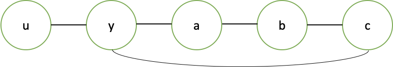 


##### **DFS 실행 후**, 초기화 작업

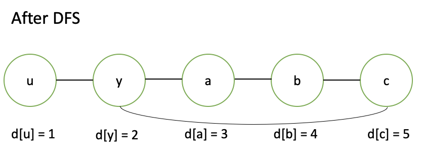 


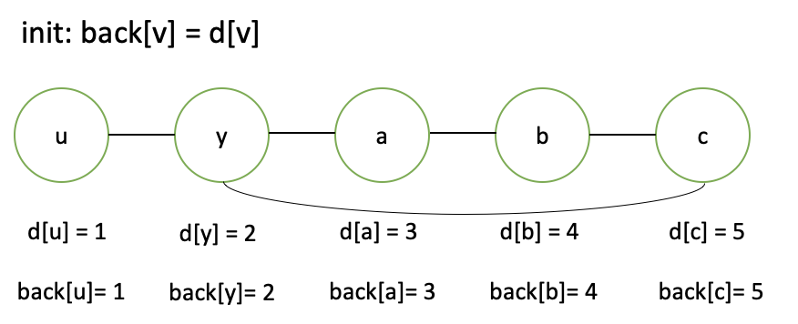 


**1. 정점 c 검사**

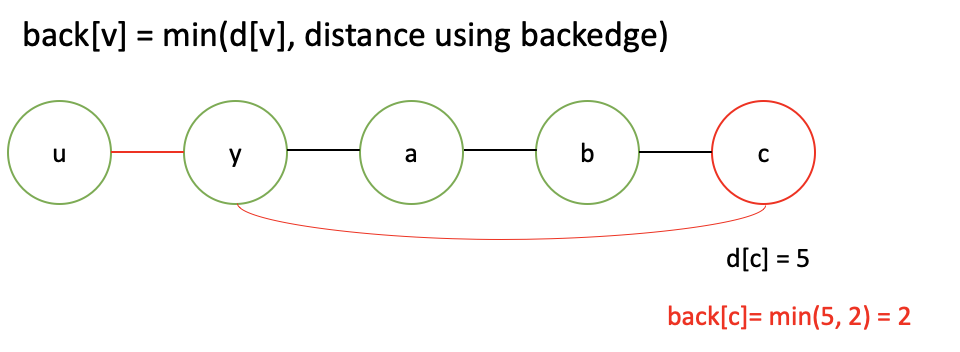 

d[c] < back[c] 이므로 c는 절단점이 아니다.


**2. 정점 b 검사**

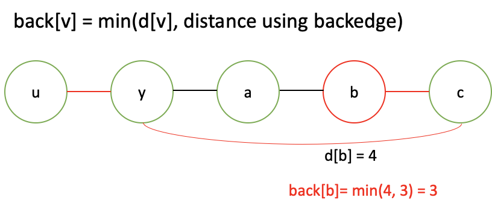 


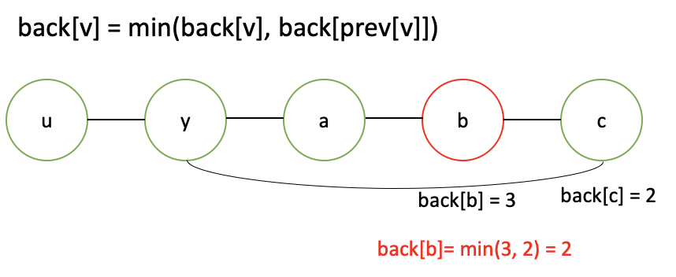  


d[b] < back[b] 이므로 b는 절단점이 아니다.


**3. 정점 a 검사**

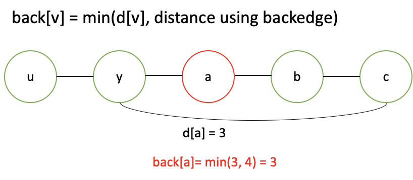 

 

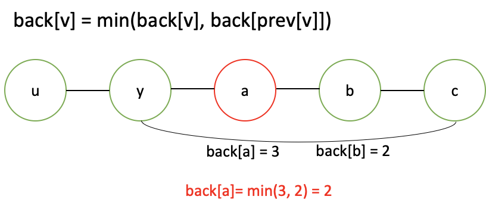  


d[a] <back[a] 이므로 a는 절단점이 아니다.


**4. 정점 y 검사**

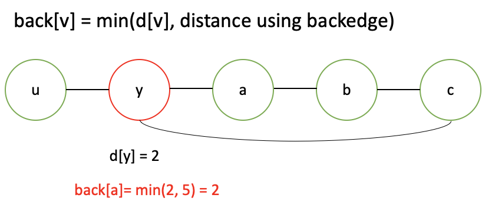 


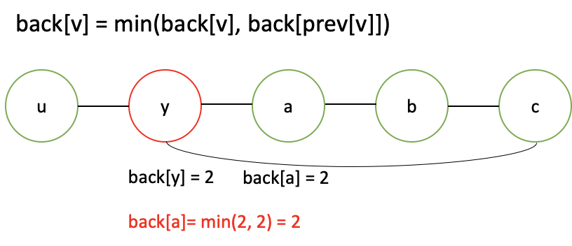 


d[y] >= back[y] 이므로 y가 절단점이다.

y정점을 위 그래프에서 지워보면 실제로 그래프가 두 컴포넌트로 나뉜다.


```c++
vector<vector<int>> adj; 
vector<int> discovered;
vector<bool> isCutVertex;
int counter = 0; 

int dfs(int here, bool isRoot) {
  discovered[here] = counter++; 
  int earliestByBackEdge = discovered[here];
  int child = 0;
  for(auto &there:adj[here]) {
    if(discovered[here] == -1) {
      child++;
      int subtree = dfs(there, false);
      if(!isRoot && subtree >= discovered[here]) {
        isCutVertex[here] = true;
      }
      earliestByBackEdge = min(earliestByBackEdge, subtree);
    } else {
      earliestByBackEdge = min(earliestByBackEdge, discovered[there]);
    }
  }
  if(isRoot) 
 		isCutVertex[here] = (child>=2);
  return earliestByBackEdge; 
}

```


### Articulation Edge

절단선, Bridge라고 부르며, 제거되었을 때 그래프의 컴포넌트 개수가 증가하게 되는 간선을 의미한다.

- 절단선은 무조건 `Tree edge`:  forward edge나 back edge가 있다는 것은 `tree edge` 가 존재한다는 의미이고 그러면 (u, v)를 연결하는 또 다른 간선이 있다는 의미이기 때문이다.
- (u, v)를 봤을 때 u에서 부모로 가는 간선을 제외하고 v의 subtree가 갈수있는 가장 위의 정점과 비교하여 더 크다면 bridge가 된다.


Code

```c++
vector<vector<int>> adj;
vector<int> discovered; 
int counter = 0;

int dfs(int here, int parent = -1) {
  discovered[here] = counter++;
  int earliest = discovered[here];
  for(auto &there:adj[here]) {
    if (there == parent) // edge 여러개인 경우 무시 
      continue; 
    if (discovered[there]==-1) {
      int subtree = dfs(there, here);
      if (subtree > discovered[here])
        IS_BRIDGE(here, there); 
      earliest = min(earliest, subtree);
    } else {
      earliest = min(earliest, discovered[there]);
    }
  }
  return earliest;
}
```

