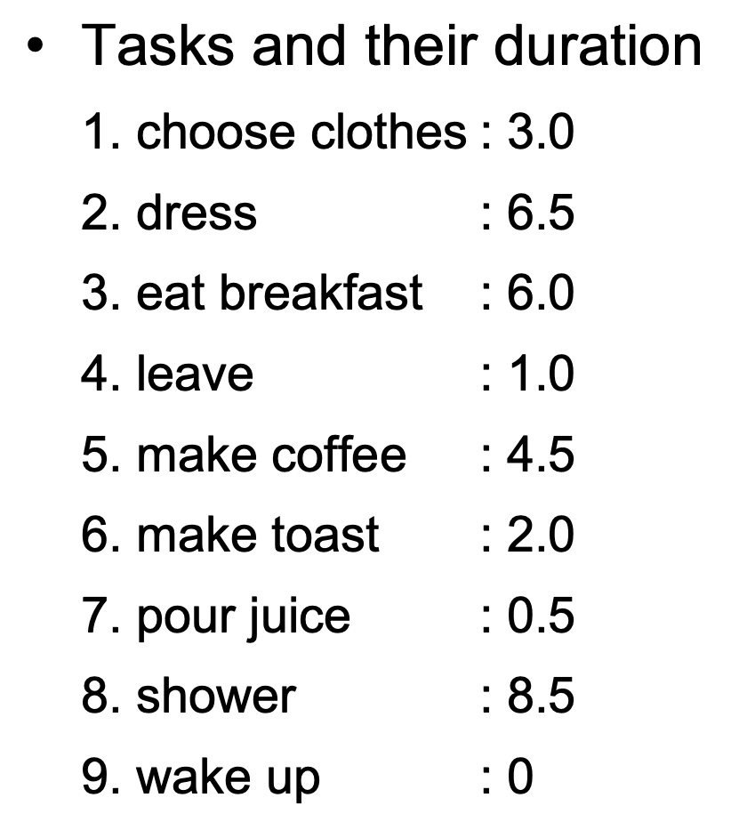
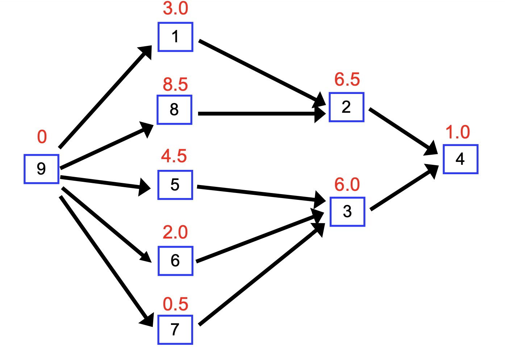

## Critical Path

```
DAG가 일련의 작업에 대한 종속성 그래프를 나타낸다고 가정해 보겠습니다.
– 각 작업에는 기간이 있습니다.
- 한 번에 하나 이상의 작업을 수행할 수 있습니다.
• 시작 노드에서 끝 노드까지 여러 경로가 있을 수 있습니다.
– 각각은 일정량의 총 시간이 필요합니다. 
– 하나가 가장 긴 것: 임계 경로
```


설계

DFS 변형

- EST(Earliest Start Time)
- EFT(Earliest Finish Time): EST +duration


How do we calculate *es*t?

– Depends on nodes dependencies!

– If no dependencies, start right away: *est*=0

– If depending on one other task, then *est* is that node’s *eft*.

– If depending on more than 1 task, then
 *est* = max. of *eft* of dependencies.


- Add a special task to the project, called *done*, with duration 0; it can be task number *n*+1.

- Every regular task that is not a dependency of any task (i.e., potential final task) is made a dependency of *done*.

  • TheprojectDAGhasaweightededge*vw*whenever *v* depends on *w* (reverse the direction), and the weight of this edge is the duration of *w*.


• DFS on project DAG. When backtracking edge *vw* if *eft*[*w*] > *est*[*v*]

*est*[*v*] = *eft*[*w*] *Crit_Dep*[*v*] = *w*

• At postorder processing time, insert *eft*[*v*] = *est*[*v*] + *duration*[*v*]


예시



 


동작

