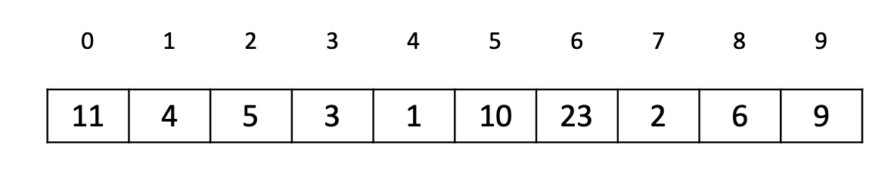
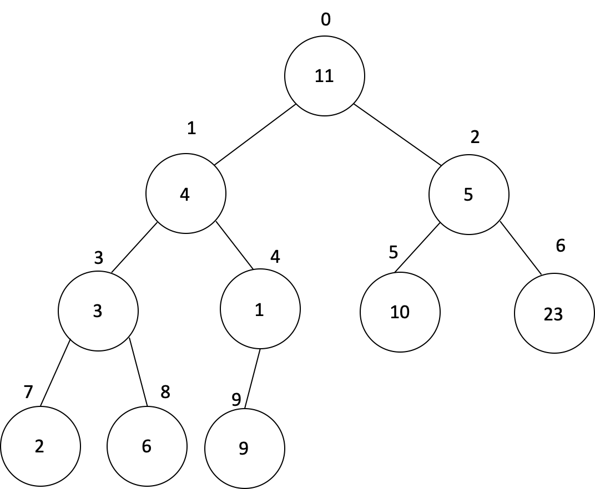
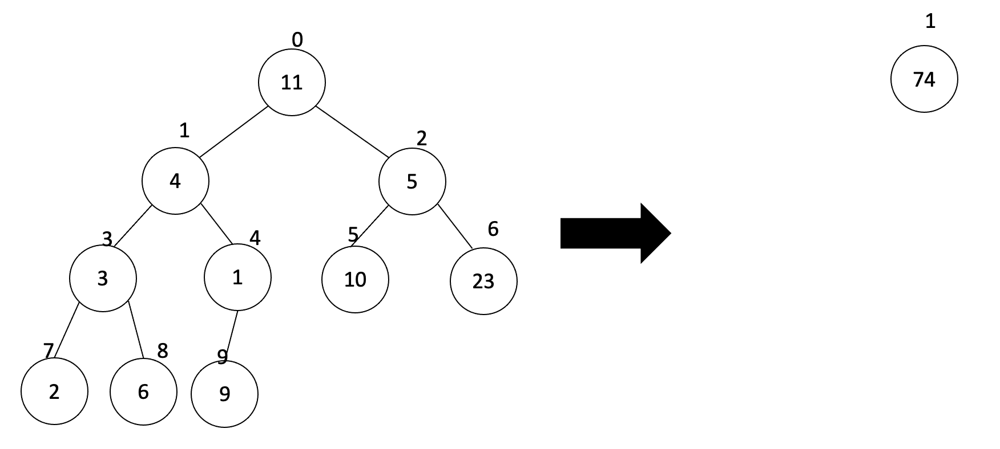
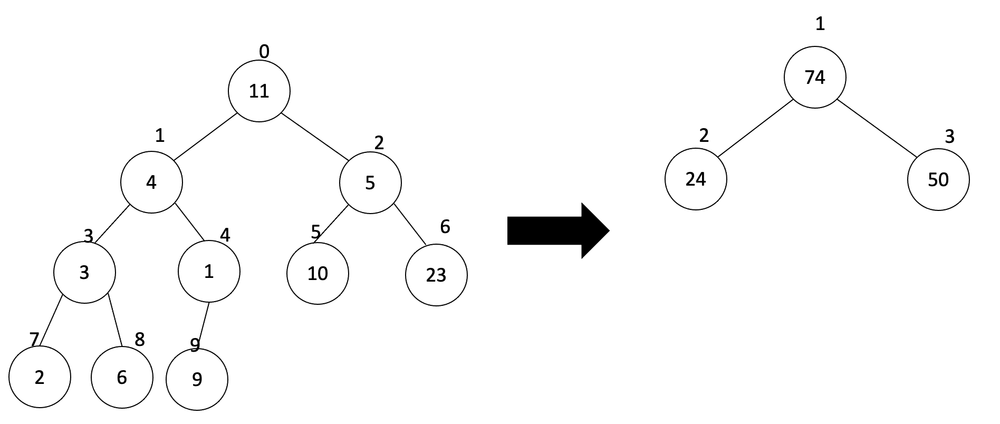
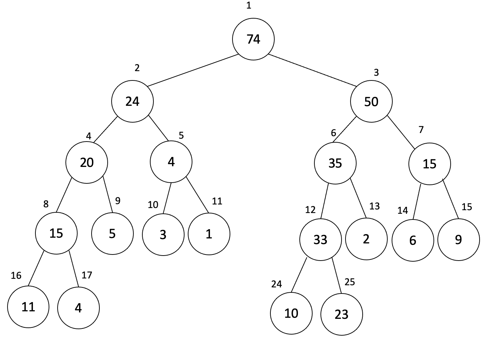
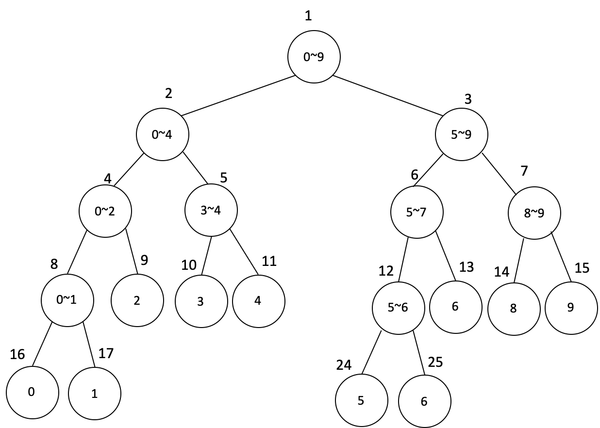
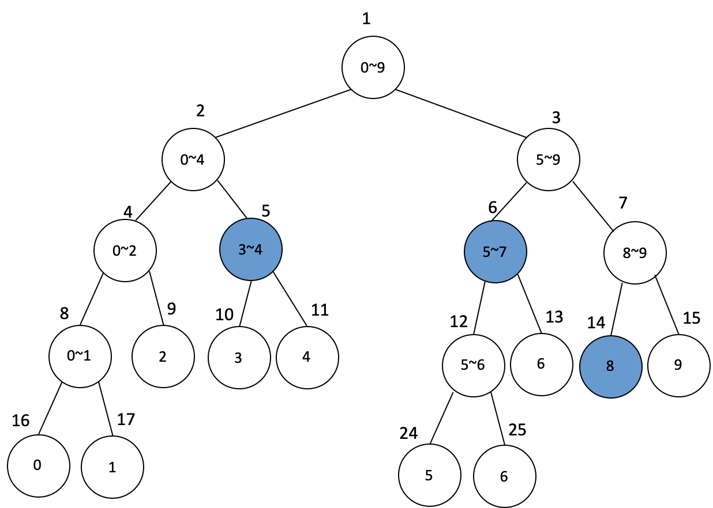
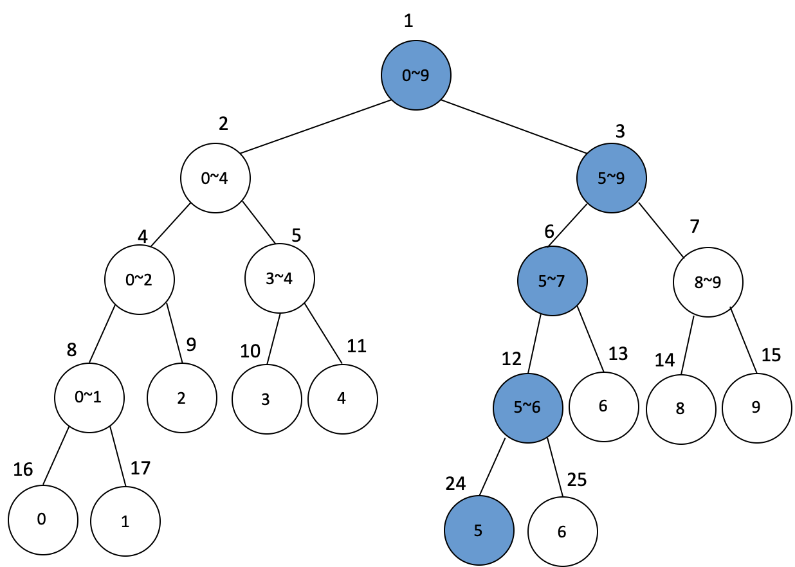

# Segment Tree

세그먼트 트리(Segment Tree)란 여러 개의 데이터가 연속적으로 존재할 때 특정한 범위의 데이터의 합을 구하는 방법에 관한 것입니다. 데이터의 합을 가장 빠르고 간단하게 구할 수 있는 자료구조입니다.


Ex) 3번 인덱스에서 8번 인덱스까지의 합을 구하는 방법은?




#### 설계

###### 방법 1. 배열을 이용해 무식하게 구하기

단순히 선형적으로 구하는 방법을 생각해봅시다.


인덱스 3부터 8까지 데이터의 범위를 하나씩 다 더하는 방법. 이러한 방식을 고려했을 때 앞에서 하나씩 더해가므로 데이터의 개수가 N이면 시간 복잡도는 $ **O(N)** $이 나옵니다. 따라서 구간 합을 N번 구해야한다면 시간복잡도는 $ O(N^2) $ 가 걸리고 이는 매우 불편한 복잡도이기 때문에 더 좋은 알고리즘이 필요합니다.


###### 방법 2. 세그먼트 트리를 이용해 효율적으로 구하기

트리 구조의 특성상 합을 구할 때 시간 복잡도 $ **O(logN)** $이면 됩니다. 위에서 언급한 단순히 더하는 방법보다 빠르게 구하기 위한 것입니다. 일단 기존의 배열을 다음과 같이 트리 구조라고 고려해보도록 합시다.




**① 구간 합 트리 생성하기**

 빠르게 합을 구하기 위해서 '**구간 합 트리**'를 새롭게 생성해주어야 합니다. 



먼저 최상단 노드에는 전체 원소를 더한 값이 들어갑니다.




두 번째 노드는 인덱스 0부터 인덱스 4까지의 원소를 더한 값을 가지고, 

세 번째 노드는 인덱스 5부터 인덱스 9까지의 원소를 더한 값을 가집니다. 

말 그대로 원래 데이터의 범위를 반씩 **분할**하며 그 구간의 합들을 저장하도록 초기 설정을 하는 것입니다. 이러한 과정을 반복하면 구간 합 트리의 전체 노드를 구할 수 있습니다.




데이터의 인덱스는 0부터이지만 구간 합 트리는 1부터 시작합니다. 그 이유는 트리의 인덱스에 **2를 곱했을 때 왼쪽 자식 노드를 가리키므로 효과적**이기 때문입니다.


```c++
int init(int start, int end, int node) { 
  if(start == end) return tree[node] = arr[start]; 
  int mid = (start + end) / 2; 
  
  // 재귀적으로 두 부분으로 나눈 뒤에 그 합을 자기 자신으로 합니다.  
  return tree[node] = init(start, mid, node * 2) + init(mid + 1, end, node * 2 + 1); }
```


구간 합 트리는 다음과 같이 매 노드가 구간의 합을 가지고 있는 형태입니다. 노드의 인덱스와 구간의 합은 별개의 값이므로 헷갈리지 않도록 합니다.




또한 구간 합 트리의 깊이는 5, $ (2^5 = 32) $ 임을 알 수 있습니다. 데이터의 개수가 N개일 때 $ \lfloor \log_2 N \rfloor + 2 $ 깊이의 이진 트리 배열을 미리 만들어놓아야 한다는 것입니다.

위 경우에서는 데이터의 개수가 10개이므로 $ \lfloor \log_2 10 \rfloor + 2 = 5 $의 깊이의 이진 트리 배열이 필요했던 것입니다. 그래서 실제로는 데이터의 개수 N에 4를 곱한 크기만큼 미리 구간 합 트리의 공간을 할당합니다. 이제 구간 합 트리 설정을 마쳤으므로 실제로 합을 구하는 함수를 작성해보도록 합시다.


**② 구간 합을  함수**

트리 구조를 가지고 있기 때문에 데이터를 탐색함에 있어서 들이는 비용은 O(logN)입니다. 따라서 구간 합을 항상 O(logN)의 시간에 구할 수 있습니다. **3~8의 범위에 대한 합**을 구하려고 해봅시다. 그러면 다음과 같이 세 노드의 합만 구해주면 됩니다.




아까 구간 합 트리에서 

인덱스 5 원소 값은 4, 

인덱스 6의 원소 값은 35, 

인덱스 14의 원소 값은 6였습니다.

 따라서 이 경우에서 구하고자 하는 답은 4 + 35 + 6 = 45이 되는 것입니다. 구간의 합은 '**범위 안에 있는 경우**'에 한해서만 더해주면 됩니다. 그 밖의 경우는 고려하지 않아도 됩니다.

```c++
// start: 시작 인덱스, end: 끝 인덱스 
// left, right: 구간 합을 구하고자 하는 범위  

int sum(int start, int end, int node, int left, int right) { 
  // 범위 밖에 있는 경우 
  if(left > end || right < start) return 0; 
  
  // 범위 안에 있는 경우 
  if(left <= start && end <= right) return tree[node]; 
  
  // 그렇지 않다면 두 부분으로 나누어 합을 구하기 
  int mid = (start + end) / 2; 
  return sum(start, mid, node * 2, left, right) + sum(mid + 1, end, node * 2 + 1, left, right);

}
```


**③ 특정 원소의 값을 수정하는 함수**

특정 원소의 값을 수정할 때는 해당 원소를 포함하고 있는 모든 구간 합 노드들을 갱신해주면 됩니다.

 예를 들어 원 배열 인덱스 5의 노드를 수정한다고 하면 다음과 같이 5개의 구간 합 노드를 모두 수정하면 됩니다.




```c++
// start: 시작 인덱스, end: 끝 인덱스
// index: 구간 합을 수정하고자 하는 노드
// new_value: 수정할 값  

void update(int start, int end, int node, int index, int dif) { 
  // 범위 밖에 있는 경우  
  if(index < start || index > end) return; 
  
  // 범위 안에 있으면 내려가며 다른 원소도 갱신  
  tree[node] += new_value; 
  if (start == end) return; int mid = (start + end) / 2; 
  
  update(start, mid, node * 2, index, new_value); 
  update(mid + 1, end, node * 2 + 1, index, new_value); 

}
```


#### 코드

```c++
#include <iostream>
#include <vector> 


using namespace std; 

vector <int> arr;
int tree[1000]; 


// start: 시작 인덱스, end: 끝 인덱스  
// index: 구간 합을 수정하고자 하는 노드
// left, right: 구간 합을 구하고자 하는 범위
// new_value: 수정할 값 


int init(int start, int end, int node) { 
  if(start == end) return tree[node] = arr[start]; 
  int mid = (start + end) / 2;  
  
  return tree[node] = init(start, mid, node * 2) + init(mid + 1, end, node * 2 + 1); } 


int sum(int start, int end, int node, int left, int right) { 
  // 범위 밖에 있는 경우 
  if(left > end || right < start) return 0; 
  
  // 범위 안에 있는 경우 
  if(left <= start && end <= right) return tree[node]; 
  
  // 그렇지 않다면 두 부분으로 나누어 합을 구하기 
  int mid = (start + end) / 2; 
  return sum(start, mid, node * 2, left, right) + sum(mid + 1, end, node * 2 + 1, left, right); 

} 

void update(int start, int end, int node, int index, int new_value) { 
  // 범위 밖에 있는 경우  
  if(index < start || index > end) return; 
  
  // 범위 안에 있으면 내려가며 다른 원소도 갱신  
  tree[node] += new_value; 
  if (start == end) return; int mid = (start + end) / 2; 
  
  update(start, mid, node * 2, index, new_value); 
  update(mid + 1, end, node * 2 + 1, index, new_value); 

}


int main(void) { 

  int N; // 배열의 크기
  cin >> N;
  for (int i = 0; i < N; i++) {
    int input;
    cin >> input;
    arr.push_back(input);
  }
  
  init(0, N - 1, 1); 
  
  int T;	// T: 쿼리의 갯수
  cin >> T;
  while (T--) {
    char query;
    int start, end;
    cin >> query;
    
    // 부분합
    if (query == 's') {
      int start, end;
      cin >> start >> end;
      
      int ans = sum(0, N - 1, 1, start, end);
      cout << start << "~" << end << "의 구간 합: " << ans << '\n'; 
    }
    
    // 값 수정
    else if (query == 'u') {
      int index, new_val;
      cin >> index >> new_val;

      cout << "arr[" << index << "] += " << new_val << '\n'; 
      update(0, N - 1, 1, index, new_val);  
    }
  }

	return 0;
}
```


#### 시간복잡도

- 구간 합 구하기: $ O(\log N) $
- 구간 업데이트: $ O(\log N) $