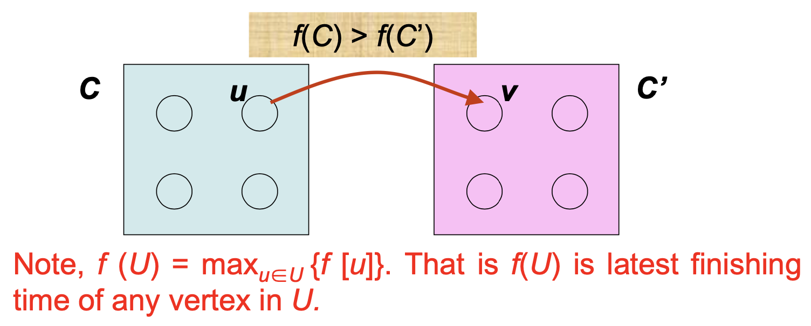

## 강한 연결 요소 (SCC)

Strong Connected Component라고 한다.

```
G의 두 정점 사이에 경로가 있으면 그래프 G가 연결됩니다.
그래프의 연결된 구성 요소는 최대 연결된 하위 그래프입니다.
```


```
무방향 그래프를 대칭 그래프로 변환합니다.
• 기능 DFS
- 발견되지 않은 정점을 찾고 발견되지 않은 각 정점에서 DFS-VISIT를 시작합니다.
- 발견되지 않은 정점 v의 id – label(v) –를 DFS-VISIT에 전달합니다.
• 기능 DFS-VISIT
- 현재 정점의 레이블을 label(v)로 결정하고 흰색 인접 정점에 전달합니다.
- 각 구성 요소에 대해 별도의 연결 목록을 만듭니다.
```


정의

A strongly connected component of a directed graph G=(V,E) is a *maximal* set of vertices
 C ⊆ V such that that for every pair of vertices *u* and *v* in C, *u* → *v* and *v* → *u*.

모든 정점이 다른 모든 정점에서 도달할 수 있는 최대 하위 그래프입니다.


G<sup>T</sup>도 완벽하게 동일한 SCC를 가지고 있다.


특성

- The component graph GSCC is directed acyclic graph.


SCC 찾기 알고리즘

1. call DFS(*G*) to compute finishing times *f* [*u*] for each vertex *u* 

2. compute *G*T
3. Call DFS(*G*T), but in the main loop of DFS, consider the vertices in order of decreasing *f* [*u*] (as computed in line 1)
4. Output the vertices of each tree in the depth-first forest formed in line 3 as a separate strongly connected component


동작

1. DFS(G) 호출


증명

Let *C* and *C*’ be distinct strongly connected components in directed graph *G* = (*V*, *E*), let *u*, *v* ∈ *C*, let *u’*, *v’* ∈ *C*’, and suppose that there is a path *u* → *u’* in *G*. Then there cannot also be a path*v’*→*v* in*G*.


Lemma 22.14

Let *C* and *C*’ be distinct strongly connected components in directed graph *G* = (*V*, *E*). Suppose that there is an edge (*u*, *v*) ∈ *E*, where *u* ∈ *C* and *v* ∈ *C*’. Then *f*(*C*) > *f*(*C*’).




Corollary


Theorem

STRONGLY-CONNECTED-COMPONENTS(*G*) correctly computes the strongly connected components of a directed graph *G*.


- When we do 2nd DFS on *G*T, start with SCC *C s*.*t*. *f*(*C*) is maximum. The second DFS from some *x*  *C*, and it visits all vertices in *C*. Corollary says that since *f*(*C*) > *f*(*C*’) for all *C*’  *C*, there are no edges from *C* to *C*’ in *G*T. Therefore DFS will visit only vertices in *C*. (DFS tree rooted at x contains exactly the vertices of *C*.)
- The next root chosen in the 2nd DFS is in SCC *C*’ s.t. *f*(*C*’) is maximum over all SCC’s other than *C*. DFS visits all vertices in *C*’, but the only edges out of *C*’ go to *C*, which we’ve already visited.

- Each time we choose a root for the 2nd DFS, it can reach only
  - –  vertices in its SCC – get tree edges to these,
  - –  vertices in SCC’s already visited in second DFS – get no tree edges to these.
- We are visiting vertices of (*G*T )**scc** in reverse of topologically sorted order.


시간복잡도

∴ **The running time of this algorithm is** Θ**(V+E)**