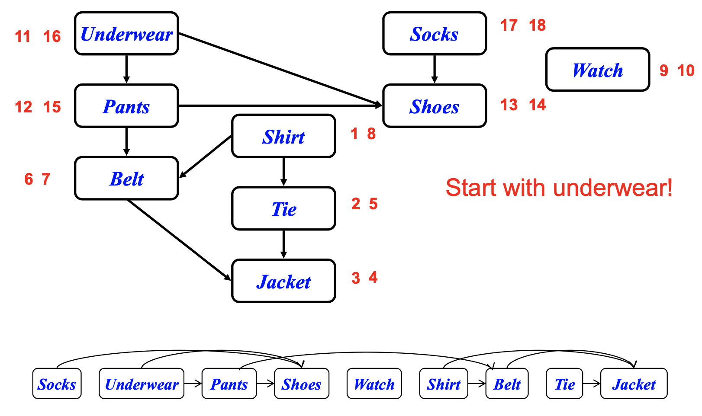

## Topological sort

위상정렬

```
– edge (u, v) \in G인 경우 정점 u가 정점 v보다 먼저 오도록 그래프 G의 모든 정점의 선형 순서
• 실제 사례: 옷 입기
```




```e
Topological-Sort()
{ 
1. Run DFS to compute finishing times f[v] for all v in V
2. As each vertex is finished, insert it into the front of a linked list. (Or output vertices in order of decreasing finish time.)
}
```

- Time: \theta(V+E)
- 정확성:  (*u,v*) in *G*이면  *f*[*u*] > *f*[*v*]


Claim: (*u,v*)  G  *f*[*u*] > *f*[*v*]
 – When (*u,v*) is explored, *u* is gray

• *v* = gray  (*u,v*) is back edge. Contradiction (*Why?*) We are dealing with DAG (no cycle) here.

• *v* = white  *v* becomes descendent of *u*  *f*[*v*] < *f*[*u*] (since must finish *v* before backtracking and finishing *u.*) • *v* = black  *v* already finished  *f*[*v*] < f[*u*]