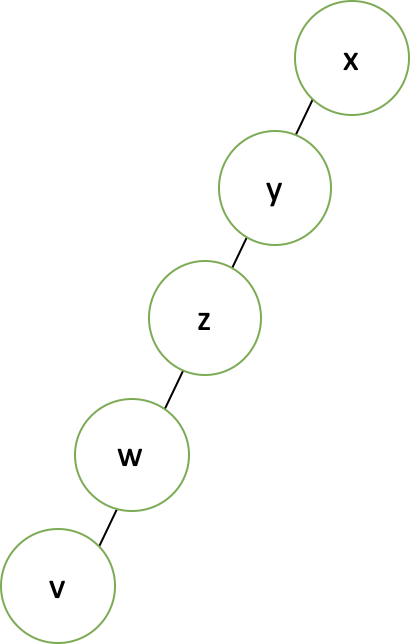
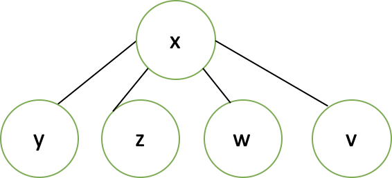

## Union Find

상호 배타적 집합, Disjoint-set. 

여러 노드가 존재할 때 어떤 두 개의 노드를 같은 집합으로 묶어주고, 다시 어떤 두 노드가 같은 집합에 있는지 확인하는 알고리즘입니다. 


1. **Find**: 노드 x가 어느 집합에 포함되어 있는지 찾는 연산
2. **Union**: 노드 x가 포함된 집합과 노드 y가 포함된 집합을 합치는 연산

 


#### 구현

##### 초기화

```c++
// parent[i] : i 노드의 부모 노드, parent[i] = i 인 경우 i는 루트 노드

int parent[MAX_SIZE];

for (int i=0; i<MAX_SIZE; i++)
  parent[i] = i;
```

 

##### find

```c++
int find(int x){
  if (x == parent[x]) return x;
  else return find[parent[x]];
}
```

`x == parent[x]` 라면 부모 노드가 자기자신, 즉 본인이 루트 노드라는 의미입니다. 따라서 이 자체를 그대로 return 해줍니다. 그렇지 않다면 재귀적으로 루트를 찾아 반환해줍니다.


하지만 위와 같이 find 를 구현하면 아래 같은 문제점이 발생합니다.




 

한 쪽으로만 tree 가 치우져진 경우, find 함수가 루트노드를 찾는데 $ O(N) $ 의 시간복잡도가 걸려 tree 로 구현하는 이점이 없습니다. 약간의 조정을 통해 개선이 가능합니다.

```c++
int find (int x) {
  if (x == parent[x]) return x;
  
  else{
    int y = find(parent[x]);
    parent[x] = y;
    return y;
  }
}
```

루트 노드인 y 를 찾았으면 x의 부모를 바로 루트 노드로 바꿔주어 아래와 같이 바꿔주면 우리가 기대하는 트리 모양이 나와 효율적이게 됩니다. 




 

 

##### union

union 함수는 매개변수로 두 개의 값을 받습니다. 두 노드가 각 포함되어있는 집합을 합쳐줘야 하는데 편의상 union(x, y) 에 대해 y 의 집합을 x 의 집합에 합치도록 하겠습니다. 즉, y의 parent가 x가 되는 것이죠.

```c++
void union(int x, int y){
  x = find(x);
  y = find(y);
  if (x != y)
    parent[y] = x;
}
```

find 를 통해 각각의 root 를 찾아준 후, 두 집합의 root 가 다른 경우 y 의 부모노드를 x 로 바꿔주도록 합니다.

 

하지만 이 경우도 문제점이 발생합니다.

높이가 더 높은 트리가 높이가 낮은 트리 밑으로 들어가게 되면 트리가 점점 깊어질 위험이 있습니다. 따라서 **트리의 높이가 낮은 트리가 높은 트리 밑으로 들어가야 하는데** 이를 위해서는 트리의 높이를 기록해두어야 합니다.


트리의 높이를 기억하는 `rank` 라는 배열을 선언하고 초기화 해줍니다.

```c++
int rank[MAX_SIZE];

for (int i=0; i<MAX_SIZE; i++)
	rank[i] = 1;
```

 

이제 `union` 할 시 크기를 비교해주고 합쳐줄 경우에는 크기를 갱신해주어야합니다.

```c++
void union(int x, int y){
  x = find(x);
  y = find(y);
  
  if (x == y)
    return;
  
  if (rank[x] > rank[y]){
    parent[y] = x;
    rank[x] += rank[y];
  }
  else {
    parent[x] = y;
    rank[y] += rank[x];
  }
}
```

 


#### Weighted Union Find

하지만 이럴 경우, `parent` 배열도, `size` 배열도 존재하여 메모리를 두 배로 사용하게 됩니다. 그래서 이를 개선하고자 `Weighted Union Find` 방법이 고안되었습니다. 이는 `find` 함수도 약간 바뀌므로 전체 코드로 알아보겠습니다.

우선 `parent` 배열은 음수일 경우, 부모노드로서 음수의 절대값은 size가 되고, 양수일 경우에는 부모노드를 가르키게 됩니다.

예를 들어서 `parent[2] = -3` 일 경우 2번 노드 밑에 두 개의 노드가 더 있어서 총 3개의 노드가 존재한다는 의미이고, `parent[3] = 5` 일 경우에는 3번 노드의 부모가 5번 노드라는 의미입니다.

```c++
int parent[MAX_SIZE];

for (int i=0; i<MAX_SIZE; i++)
  parent[i] = -1;

int find(int x){
  if (parent[x] < 0){
    return x;
  }
  else{
    int y = find(parent[x]);
    parent[x] = y;
    return y;
  }
}

void union(int x, int y){
  x = find(x);
  y = find(y);
  
  if (x == y)
    return;
  
  // parent[x], parent[y] 값은 음수이므로 값이 작은 경우가 더 높이가 큰 노드이다.
  if (parent[x] < parent[y]){
    parent[x] += parent[y];
    parent[y] = x;
  }
  else {
    parent[y] += parent[x];
    parent[x] = y;
  }
}
```