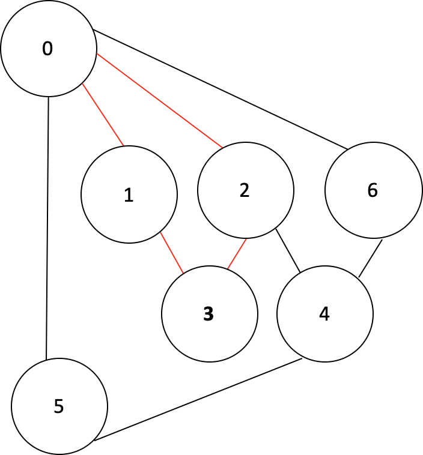

## 싸이클 찾기 

사이클은 첫 번째 정점과 마지막 정점이 동일한 경로입니다.

 

설계

DFS 스패닝 트리의 간선의 종류

간선의 종류 

\1. 트리 간선 (Tree Edge)

 \- DFS 스패닝 트리에 포함된 간선

 

\2. 순방향 간선 (Forward Edge)

 \- DFS 스패닝 트리의 선조(ancestor)에서 자손(descendant)으로 가는 간선이면서, 트리에 포함되지 않은 간선

 

\3. 역방향 간선 (Back Edge)

 \- DFS 스패닝 트리의 자손에서 선조로 가는 간선이면서, 트리에 포함되지 않은 간선

 

\4. 교차 간선(Cross Edge)

 \- 위의 세 분류에 포함되지 않은 간선. 즉, 트리의 선조와 자손의 관계가 아니면서 트리에 포함되지 않은 간선

 

## 이분그래프 (Bipartite)