## Two pointer

어떤 특정 조건을 만족하는 연속 구간을 구할 때  $ O(N) $ 으로 풀 수 있도록 도와주는 알고리즘

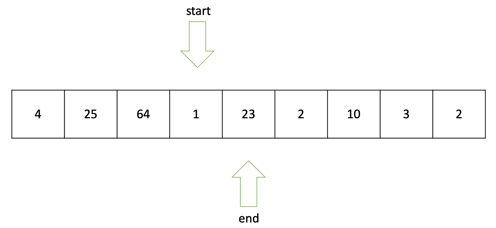

- 리스트에 순차적으로 접근해야 할 때 **두 개의 점의 위치를 기록하면서 처리**하는 알고리즘
- 정렬되어있는 두 리스트의 합집합에도 사용됨. 병합정렬(merge sort)의 counquer 영역의 기초가 되기도 합니다.


 2 개의 포인터를 사용하여 구간의 길이를 가변적으로 잡아가며 특정 조건을 만족하는 구간을 찾는다. 모든 연속 구간을 잡는다면 $ O(N^2)$ 이 될 것이지만 투 포인터 알고리즘을 사용하면 O(N) 의 시간복잡도로 풀 수 있다. 

두 포인터 각각 N번 움직이기 때문에 N + N = 2N 번의 연산이 있는 셈이다. 즉, $ O(2N) = O(N) $ 이 된다. 


(중요) : 항상 end를 증가시켰을 때 이에 해당하는 부분합 증가가 커진다는 전제 하에 사용할 수 있기 때문에 **모든 원소가 자연수라는 문제의 조건에서만 유효**하다. (만약 음수가 있다면 다음 sum이 증가할지 감소할지 모르기 때문에 안된다.)


#### 설계

i. 구간을 시작할 기점 (start), 구간을 끝내는 기점(end) 두개의 포인터를 준비한다.

ii. 구간 start~end까지의 합이 특정 조건 (ex 구간합이 5 이상) 을 만족할 때까지 end 포인터를 증가시킨다.

ii. 특정 조건을 만족시키면 start 포인터를 증가시키고 start와 end 포인터가 배열의 마지막에서 만날 때까지 실행한다.


#### 동작

- 리스트: (4, 25, 64, 1, 23, 2, -10, 3, 2)
- 조건: 부분합이 51 이상 (M > 50)


i. 시작점과 끝점이 첫번째 원소의 인덱스를 가리키도록 합니다.

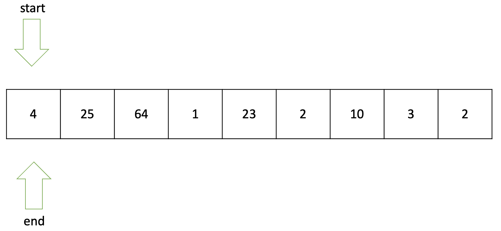

- 부분 합: 4
- 카운트 : 0


 

ii. 부분 합 < 51 이므로 end 포인터 이동

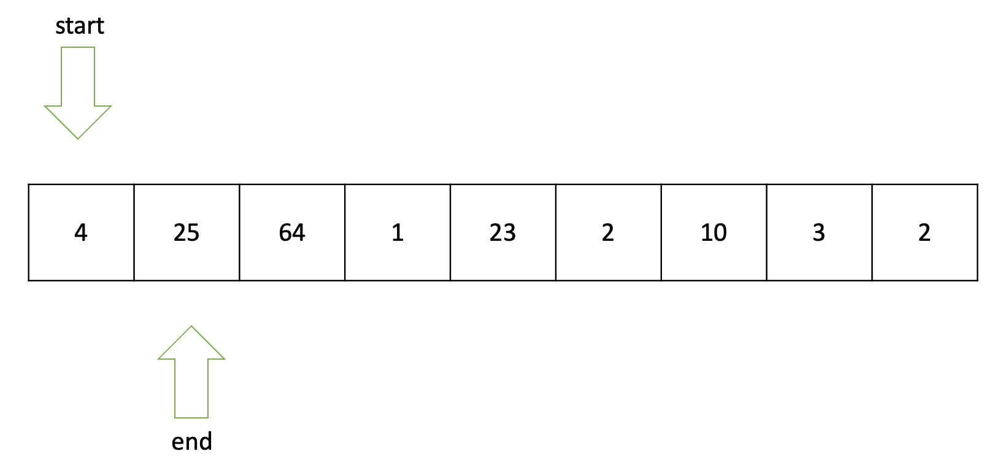

- 부분 합 : 29 (4 + 25)
- 카운트 : 0


 

iii. 부분 합 >= 51 이므로 start 포인터 이동

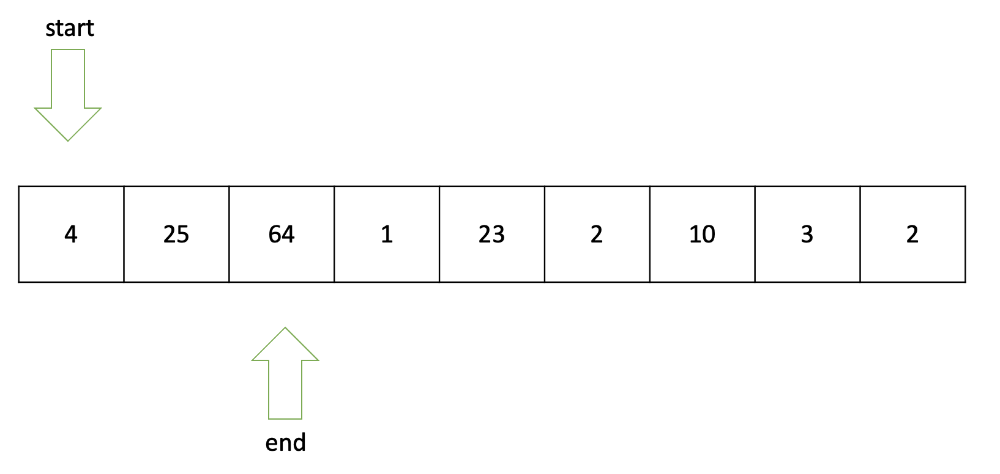

- 부분 합 : 93
- 카운트 : 1


iv. 부분 합 >= 51 이므로 start 포인터 이동

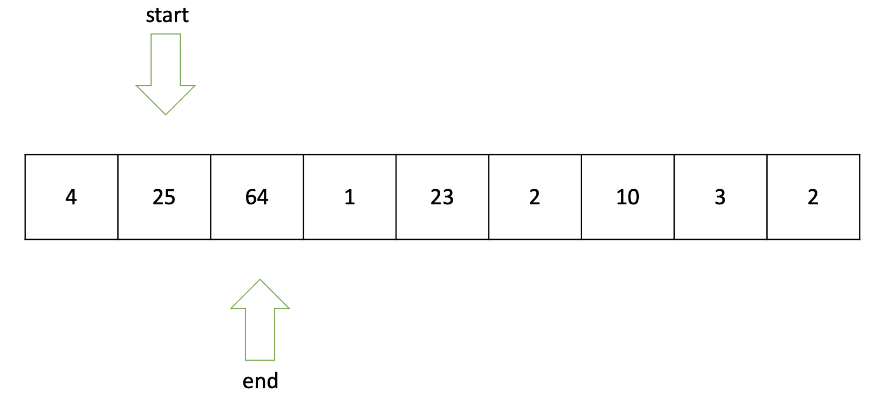

- 부분 합 : 89
- 카운트 : 2


v. 부분 합 >= 51 이므로 start포인터 1칸 이동

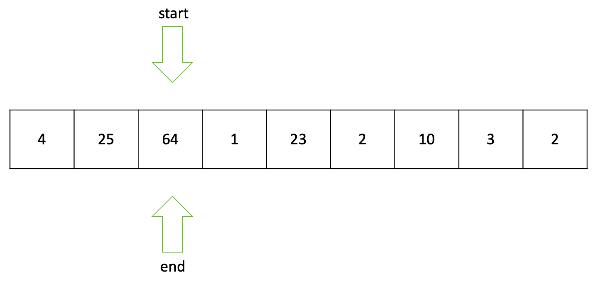

- 부분 합 : 64
- 카운트 : 3


vi. 부분 합 >= 51 이므로 start 포인터 이동

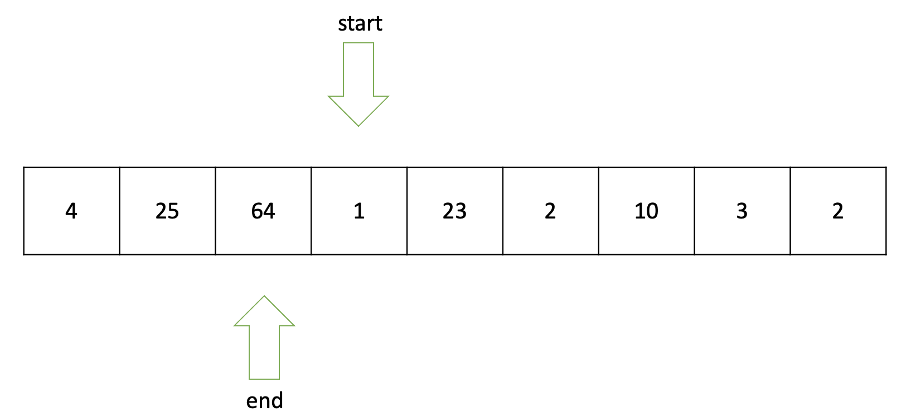

- 부분 합: 0 (start ~ end 까지의 값인데 모순이 발생했으므로 0)
- 카운트: 3


vii. 부분 합 < 51 이므로 end 포인터 이동

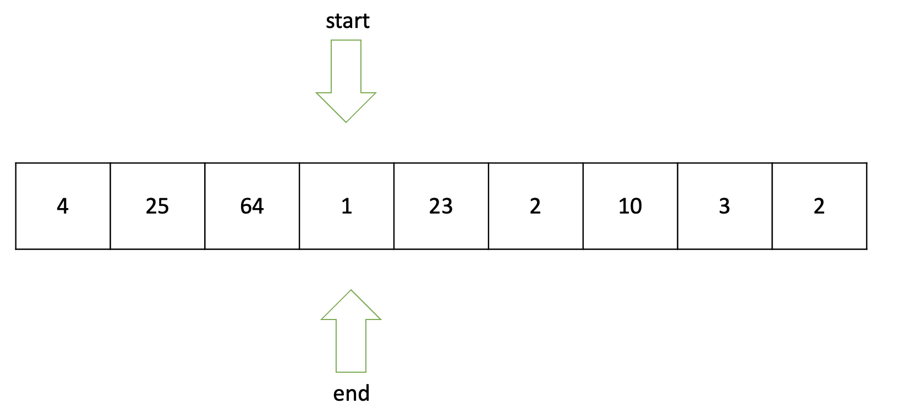

- 부분합: 1
- 카운트: 3


ix. 부분 합 < 51 이므로 end 포인터 이동

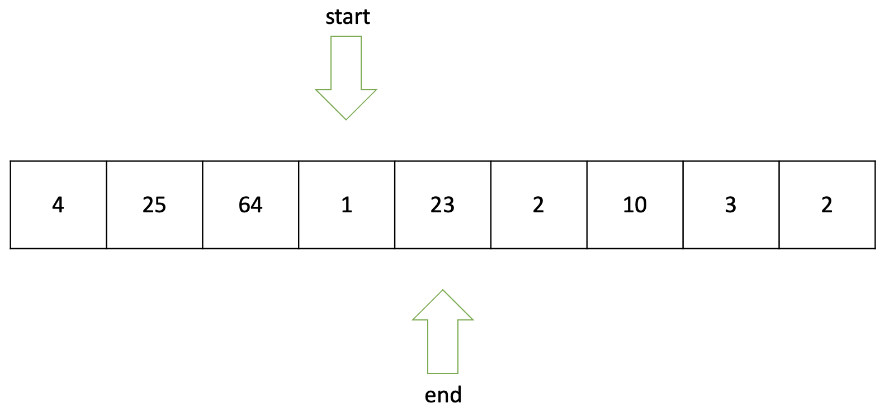

- 부분합: 24
- 카운트: 3


x. 부분 합 < 51 이므로 end 포인터 이동

 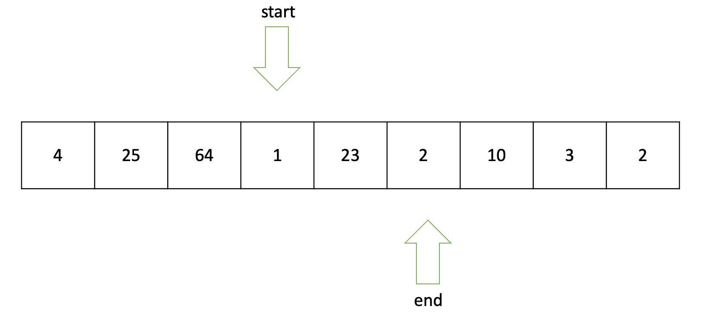

- 부분합: 26
- 카운트: 3


xi. 부분 합 < 51 이므로 end 포인터 이동

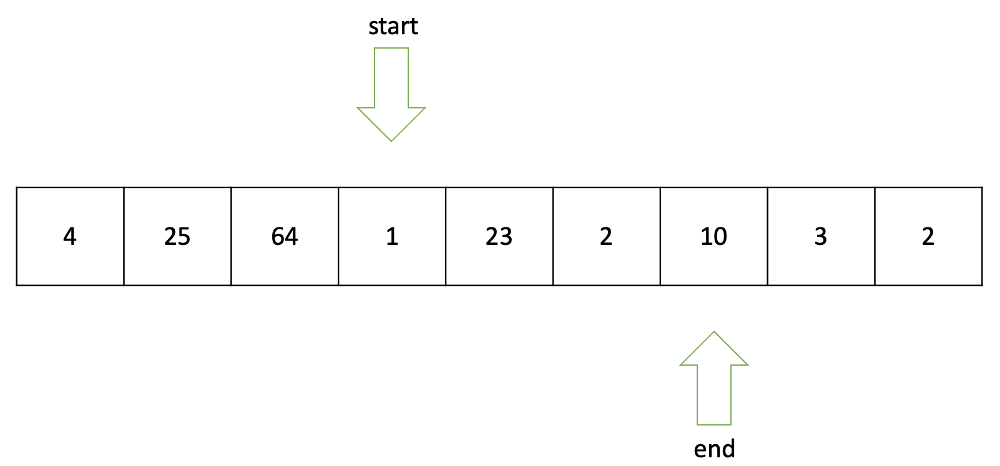

- 부분합: 36
- 카운트: 3


xii. 부분 합 < 51 이므로 end 포인터 이동

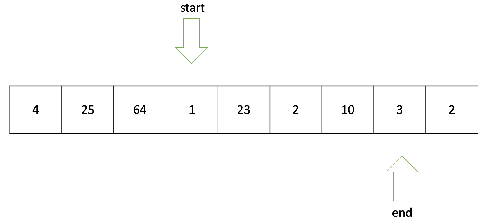

- 부분합: 39
- 카운트: 3


부분 합 < 51 이므로 end 포인터 이동

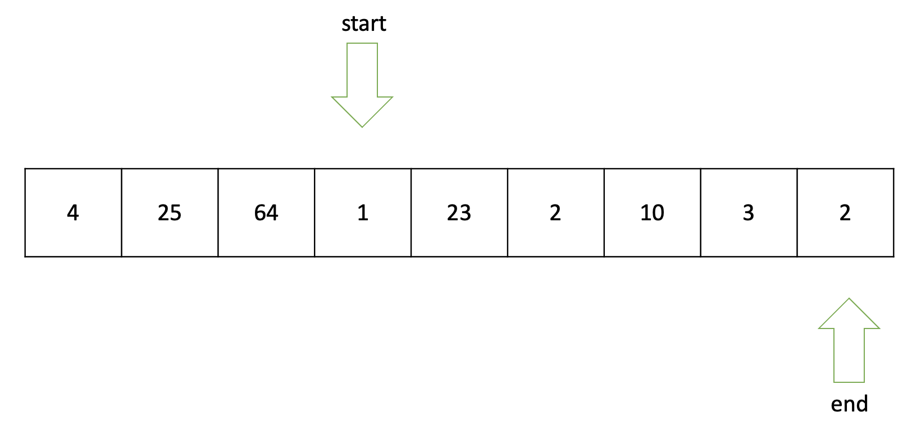

- 부분합: 41
- 카운트: 3

end point == array.size 이므로 함수 종료


#### 구현 (C++)

```c++
#include <iostream>

using namespace std;

int arr[10001];

int main()
{
    int N, M;
    cin >> N >> M;

    for (int i = 0; i < N; i++)
        cin >> arr[i];

    int answer = 0;

    int start = 0;
    int end = 0;
    int partial_sum = 0;

    while (end <= N)
    {
        // cout << start << " " << end-1 << "  sum: " << partial_sum;
        if (partial_sum >= M) {
            //cout << " v (만족하는 부분배열)";
            partial_sum -= arr[start++];

        }
        else if (partial_sum < M)
            partial_sum += arr[end++];
        
        // 구간합 == M , 구간합 > M 일때 수정해서 적용
        if (partial_sum >= M) 
            answer++;

        // cout << endl;
    }

    cout << answer << "\n";
    return 0;
}
```

 