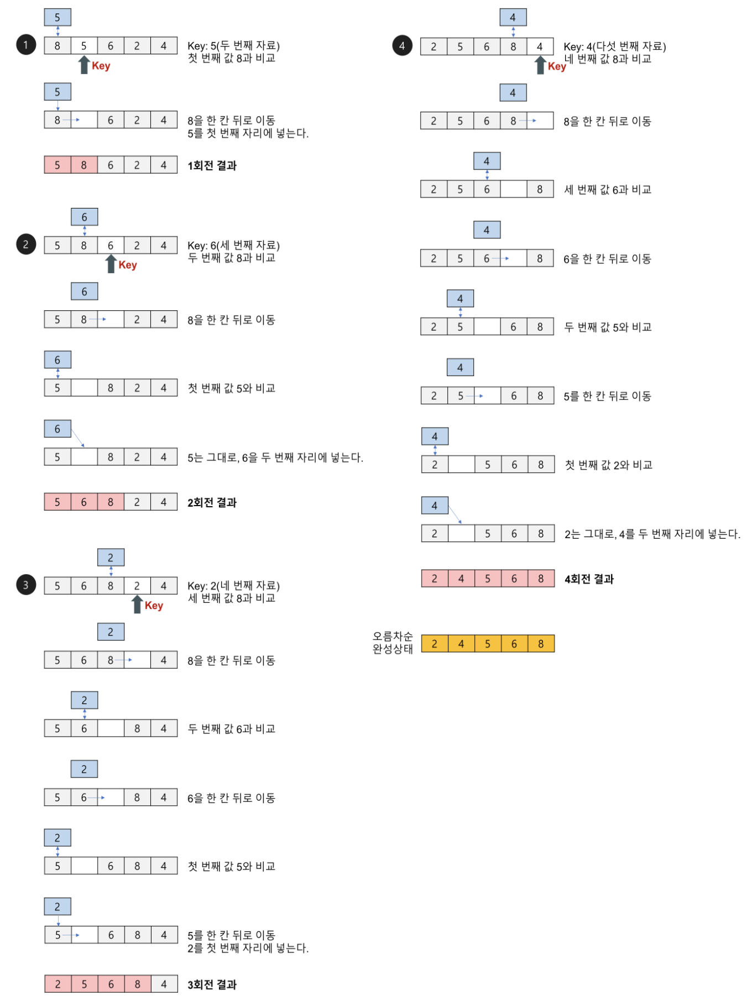

## $O(N^2)$ Sort 

### Selection Sort (선택정렬)

- 제자리 정렬(in-place sorting) 알고리즘의 하나
- 입력 배열(정렬되지 않은 값들) 이외에 다른 추가 메모리를 요구하지 않는 정렬 방법


#### 설계

- 주어진 배열 중에서 최솟값을 찾는다.
- 그 값을 맨 앞에 위치한 값과 교체한다(패스(pass)).
- 맨 처음 위치를 뺀 나머지 리스트를 같은 방법으로 교체한다.
- 하나의 원소만 남을 때까지 위의 1~3 과정을 반복한다.


#### 동작

 


**1회전**


**2회전**


**3회전**


**4회전**


#### 구현 (C++ code)

```c++
vector <int> v;

void selection_sort() {
  int N = v.size();
  
  for (int i = 0; i < N-1; i++) {
    int min = 999999;
    for (int j = i; j < N-1; j++) {
      if (min > v[j]) min = v[j];
    }
    int temp;
    temp = v[i];
    v[i] = v[j];
    v[j] = temp;
  }
}
```


#### 시간 복잡도 : $ O(N^2) $


### Bubble sort (버블 정렬)

버블 정렬(bubble sort) 알고리즘의 개념 요약
서로 인접한 두 원소를 검사하여 정렬하는 알고리즘
인접한 2개의 레코드를 비교하여 크기가 순서대로 되어 있지 않으면 서로 교환한다.
선택 정렬과 기본 개념이 유사하다.
버블 정렬(bubble sort) 알고리즘의 구체적인 개념
버블 정렬은 첫 번째 자료와 두 번째 자료를, 두 번째 자료와 세 번째 자료를, 세 번째와 네 번째를, … 이런 식으로 (마지막-1)번째 자료와 마지막 자료를 비교하여 교환하면서 자료를 정렬한다.
1회전을 수행하고 나면 가장 큰 자료가 맨 뒤로 이동하므로 2회전에서는 맨 끝에 있는 자료는 정렬에서 제외되고, 2회전을 수행하고 나면 끝에서 두 번째 자료까지는 정렬에서 제외된다. 이렇게 정렬을 1회전 수행할 때마다 정렬에서 제외되는 데이터가 하나씩 늘어난다.
버블 정렬(bubble sort) 알고리즘의 예제
배열에 7, 4, 5, 1, 3이 저장되어 있다고 가정하고 자료를 오름차순으로 정렬해 보자.


1회전
첫 번째 자료 7을 두 번째 자료 4와 비교하여 교환하고, 두 번째의 7과 세 번째의 5를 비교하여 교환하고, 세 번째의 7과 네 번째의 1을 비교하여 교환하고, 네 번째의 7과 다섯 번째의 3을 비교하여 교환한다. 이 과정에서 자료를 네 번 비교한다. 그리고 가장 큰 자료가 맨 끝으로 이동하므로 다음 회전에서는 맨 끝에 있는 자료는 비교할 필요가 없다.
2회전
첫 번째의 4을 두 번째 5와 비교하여 교환하지 않고, 두 번째의 5와 세 번째의 1을 비교하여 교환하고, 세 번째의 5와 네 번째의 3을 비교하여 교환한다. 이 과정에서 자료를 세 번 비교한다. 비교한 자료 중 가장 큰 자료가 끝에서 두 번째에 놓인다.
3회전
첫 번째의 4를 두 번째 1과 비교하여 교환하고, 두 번째의 4와 세 번째의 3을 비교하여 교환한다. 이 과정에서 자료를 두 번 비교한다. 비교한 자료 중 가장 큰 자료가 끝에서 세 번째에 놓인다.
4회전
첫 번째의 1과 두 번째의 3을 비교하여 교환하지 않는다.
https://gmlwjd9405.github.io/2018/05/06/algorithm-bubble-sort.html


### Insertion sort

손안의 카드를 정렬하는 방법과 유사하다.
새로운 카드를 기존의 정렬된 카드 사이의 올바른 자리를 찾아 삽입한다.
새로 삽입될 카드의 수만큼 반복하게 되면 전체 카드가 정렬된다.
자료 배열의 모든 요소를 앞에서부터 차례대로 이미 정렬된 배열 부분과 비교 하여, 자신의 위치를 찾아 삽입함으로써 정렬을 완성하는 알고리즘
매 순서마다 해당 원소를 삽입할 수 있는 위치를 찾아 해당 위치에 넣는다.
삽입 정렬(insertion sort) 알고리즘의 구체적인 개념
삽입 정렬은 두 번째 자료부터 시작하여 그 앞(왼쪽)의 자료들과 비교하여 삽입할 위치를 지정한 후 자료를 뒤로 옮기고 지정한 자리에 자료를 삽입하여 정렬하는 알고리즘이다.
즉, 두 번째 자료는 첫 번째 자료, 세 번째 자료는 두 번째와 첫 번째 자료, 네 번째 자료는 세 번째, 두 번째, 첫 번째 자료와 비교한 후 자료가 삽입될 위치를 찾는다. 자료가 삽입될 위치를 찾았다면 그 위치에 자료를 삽입하기 위해 자료를 한 칸씩 뒤로 이동시킨다.
처음 Key 값은 두 번째 자료부터 시작한다.
삽입 정렬(insertion sort) 알고리즘의 예제
배열에 8, 5, 6, 2, 4가 저장되어 있다고 가정하고 자료를 오름차순으로 정렬해 보자.



1회전: 두 번째 자료인 5를 Key로 해서 그 이전의 자료들과 비교한다.
Key 값 5와 첫 번째 자료인 8을 비교한다. 8이 5보다 크므로 8을 5자리에 넣고 Key 값 5를 8의 자리인 첫 번째에 기억시킨다.
2회전: 세 번째 자료인 6을 Key 값으로 해서 그 이전의 자료들과 비교한다.
Key 값 6과 두 번째 자료인 8을 비교한다. 8이 Key 값보다 크므로 8을 6이 있던 세 번째 자리에 기억시킨다.
Key 값 6과 첫 번째 자료인 5를 비교한다. 5가 Key 값보다 작으므로 Key 값 6을 두 번째 자리에 기억시킨다.
3회전: 네 번째 자료인 2를 Key 값으로 해서 그 이전의 자료들과 비교한다.
Key 값 2와 세 번째 자료인 8을 비교한다. 8이 Key 값보다 크므로 8을 2가 있던 네 번째 자리에 기억시킨다.
Key 값 2와 두 번째 자료인 6을 비교한다. 6이 Key 값보다 크므로 6을 세 번째 자리에 기억시킨다.
Key 값 2와 첫 번째 자료인 5를 비교한다. 5가 Key 값보다 크므로 5를 두 번째 자리에 넣고 그 자리에 Key 값 2를 기억시킨다.
4회전: 다섯 번째 자료인 4를 Key 값으로 해서 그 이전의 자료들과 비교한다.
Key 값 4와 네 번째 자료인 8을 비교한다. 8이 Key 값보다 크므로 8을 다섯 번째 자리에 기억시킨다.
Key 값 4와 세 번째 자료인 6을 비교한다. 6이 Key 값보다 크므로 6을 네 번째 자리에 기억시킨다.
Key 값 4와 두 번째 자료인 5를 비교한다. 5가 Key 값보다 크므로 5를 세 번째 자리에 기억시킨다.
Key 값 4와 첫 번째 자료인 2를 비교한다. 2가 Key 값보다 작으므로 4를 두 번째 자리에 기억시킨다.
https://gmlwjd9405.github.io/2018/05/06/algorithm-insertion-sort.html

