## String Matching


#### Notation & Terminology

-  T [1 .. n]: n개의 문자의 텍스트
- P [1 .. m]: m개의 문자의 패턴
- 1≤ j ≤m에 대해 T[s+j] = p[j]인 경우 T에서 시프트 s와 함께 P가 발생합니다.
- P가 T의 시프트 s와 함께 발생하면 s를 유효한 시프트라고 합니다. 그렇지 않으면 잘못된 시프트입니다.

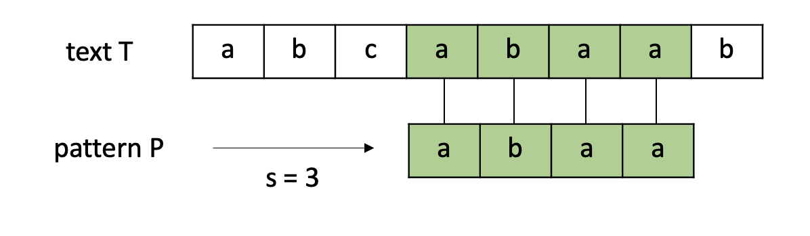


### Navie algorithm

패턴을 한칸을 옮기며 텍스트가 끝날 때 까지 비교해 보는 방식


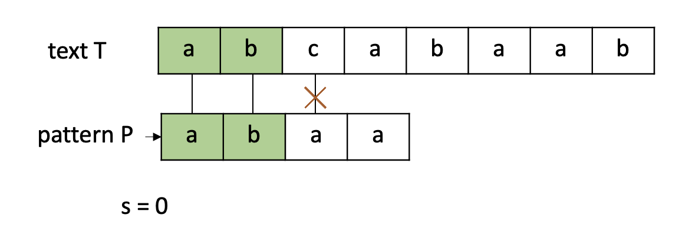


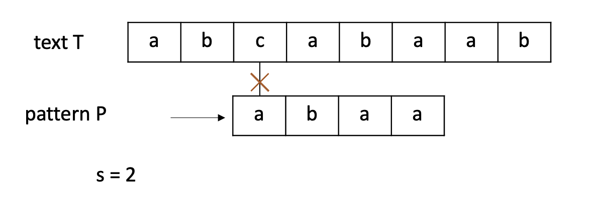


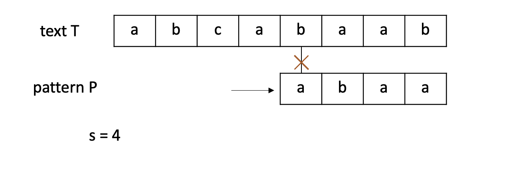


#### 의사코드

```pseudocode
Navie-String-Matching (T, P)
  n <- |T|
  m <- |P|
  for s<-0 to n-m
    do if P[1..m] = T[s+1..s+m]
      then print "P occurs with shift" s
```


#### 시간복잡도

$ (O (n-m+1)*m) $


shift가 발생했을 때의 정보가 다음번 shift에 전혀 사용되지 않으므로 비효율적입니다.


#### C++ code

```c++
```


### Rabin-Karp algorithm

길이가 m인 문자열을 m자리 숫자로 취급하는 것

- P[1..m]: m자리 수 정수 p로 치환
- 부분문자열 T[s+1 .. s+m]: m자리 수 정수 $t_s$로 치환

문자열 매칭 문제를 숫자비교 문제로 치환하는데 의의가 있다.


Ex) $ \sum = \\{ 0, 1, 2, ..., 9 \\} $, P[1 .. m] = 31425 일 때, p = 31, 425


#### **String to Number**

Horner's rule

p = P[m] +10(P[m-1] + 10(P[m-2] + .... + 10(P[2] + 10P[1]) ... ) ) 


Ex) P[1..m] = 31425,  p= 5+10(2+10(4+10( 1+10(3) ) ) ) = 31,425


$t_s$를 빨리 계산하는 방법이 있을까?

$ t_{s+1} = 10\*(t_s - 10^{m-1}*T[s+1]) +T[s+m+1] $


ex) s = 7, $t_7$=31415일 때, 

$t_{7+1}$ = 10*(31415 - 10000\*3) + 2 = 14152 ($ \because T[s+5+1] = 2 $)


##### 시간복잡도

p, $t_0$를 계산하는 비용: $ \theta(m) $

$t_1, ... , t{n-m}$을 계산하는 비용: $\theta(n-m) \ or \ \theta(n) $


m이 매우 작다면 p와 $t_s$를 구하는데 상수의 시간이 걸리겠지만 큰 경우에는 시간이 꽤 걸린다.


#### modulo operation

두 수를 비교할 때, 직접 두수를 비교하지 않고 나머지연산을 통해 비교할 수 있다.

하지만 $ t_s \equiv p (mod q) $가 $t_s = p$를 항상 보장하지는 않는다.

- valid: $ t_s \equiv p (mod q) $ and $t_s = p$
- spurious hit: $ t_s \equiv p (mod q) $가 $t_s \not= p$

=> $ t_s \not= p (mod q) $이면 절대로 $t_s = p$는 될 수 없다.

여기서 q는 **적당한 소수**를 선택한다.


따라서 $t_s$ 를 구성할 때 modulo operation을 거친 값으로 구성한다.

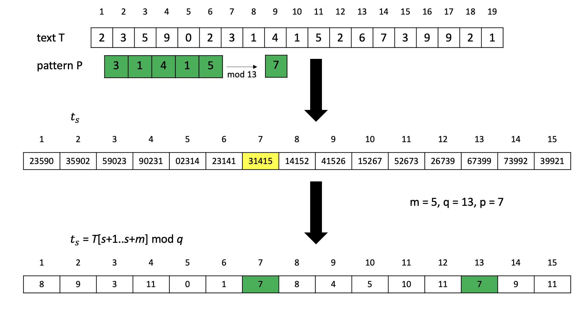


- s = 7 일때: T[7 .. 11] = P (valid match)
- s = 13 일때: T[13 .. 17] $ \not= $ P (invalid, spurious hit)


Recalculation of p and t
 – p = original p (mod q)
 – t_{s+1} = (d*(ts-T[s+1]h)+T[s+m+1]) (mod q)


#### 시간복잡도

$ \theta (m) $ : 전처리과정 (p와 $t_0$ 계산)

$ \theta((n-m+1)*m) $: worst case

- $ \theta(n-m+1) $: p = $t_s$를 찾는데 걸리는 시간
- $ \theta(m) $: 유효한 s를 검증하는 시간


#### C++ 코드

```c++
```


### KMP algorithm


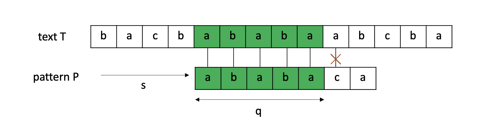

navie string matcher를 다시 생각해보면, 위의 사진 같이 앞에 **5개의 문자는 일치하지만** 마지막 6번째 문자가 달라서 같지 않다고 나오는 경우, 앞에 5개의 **문자는 일치한다는 정보**를 버리고 한칸을 shift하고 처음부터 다시 비교하게 된다.

KMP알고리즘은 앞에 **5개는 일치한다라는 정보**를 저장하여 더욱 효율적으로 검색한다는 메인 아이디어로 시작한다.


#### 설계

패턴 자체를 비교하여 필요한 정보를 미리 계산할 수 있습니다. 

전체 문자열은 같지 않지만 부분문자열은 같은 경우, 얼마만큼 비교를 skip할 수 있을지 정보를 제공해주는 함수입니다. 

위 예시의 경우 ababa까지 일치하였고 앞뒤로 <span style="color:white; background:black">aba</span>ba /  ab<span style="color:white; background:black">aba</span> 3개의 문자가 일치하고 2개의 문자가 일치하지 않으므로 2칸을 건너뛰어서 다음 비교를 실행하면 됩니다.

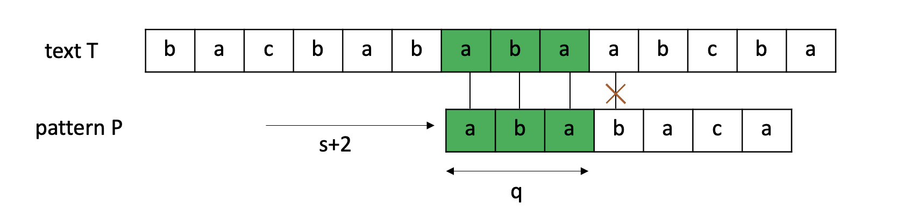

좀 더 체계적인 용어를 사용하여 정리해보겠습니다.


##### 접두사(prefix)와 접미사(suffix)

- 접두사: 문자열의 첫 문자부터 차례대로 나열한 부분 문자열

Ex) banana의 접두사: b, ba, ban, bana, banan, banana


- 접미사: 문자열의 마지막 문자부터 차례대로 나열한 부분문자열

Ex) banana의 접미사: a, na, ana, nana, anana, banana


##### prefix (failure) function

문자 매칭에 실패했을 때, 얼만큼 건너뛰어야 하는가에 대한 정보.

 즉, 문자 매칭에 실패하기 직전 상황에서, 접두사 / 접미사가 일치한 최대 길이


**2개의 인덱스 (i, j)** 를 활용해서 실패함수를 구할 것입니다.

- 인덱스를 증가시켜나가며 **두 문자가 일치하면 두 인덱스를 증가**시키고,

- 일치하지 않으면 **이전까지의 상황의 실패함수를 참고**해나가며, 참고할 값이 없으면 0 이 됩니다.


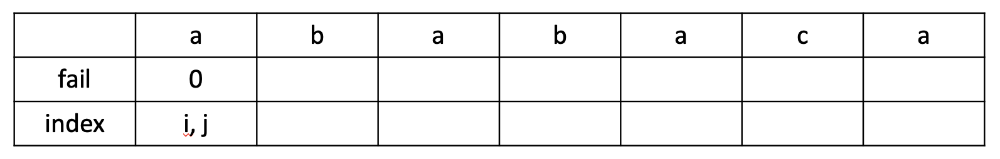

실패함수의 첫번째 항목은 0 입니다. 첫번째는 항상 0으로 생각하시면 됩니다.


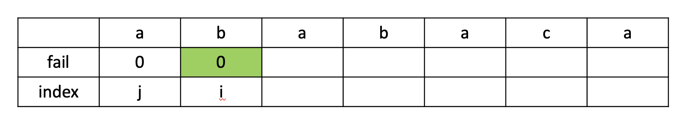

현재 **i 와 j 인덱스에서 문자가 불일치**하므로, **이전까지의 실패함수를 참고**를 시도합니다.

하지만 이전 상태에서의 실패함수의 값은 0 입니다.

그러므로, i 번째 Fail 함수의 값도 다음과 같이 0 으로 갱신되고, i 가 증가합니다.

 


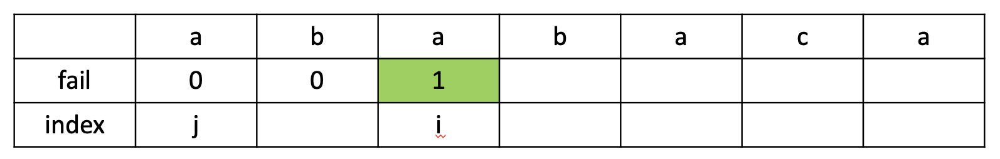

i 와 j 에서 문자열이 일치하므로, 다음과 같이 j + 1의 값이 i번째 실패함수의 값으로 입력되며,

i와 j의 값이 모두 증가합니다.

 

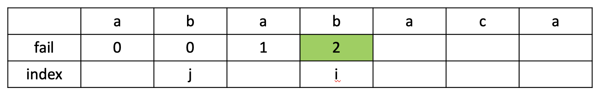

여기에서도 역시, 'b' 와 'b' 로 일치하기 때문에

i 번째 실패함수의 값은 j + 1인 2로 변경됩니다. i와 j의 값이 모두 증가합니다.

 

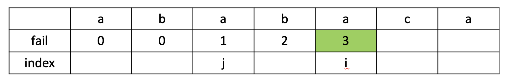

여기에서도 역시, 'a' 와 'a' 로 일치하기 때문에

i 번째 실패함수의 값은 j + 1인 3로 변경됩니다. i와 j의 값이 모두 증가합니다.


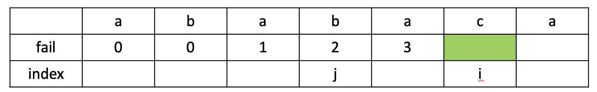

'b'와 'c'로 불일치하기 때문에, 이전까지의 실패함수를 참고합니다.

다시 말해 이전 인덱스의 실패함수의 값으로 j를 옮겨서, 다시 문자를 비교합니다.

지속해서 불일치한다면 j가 0이 될 때까지 반복합니다.

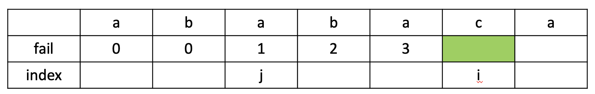

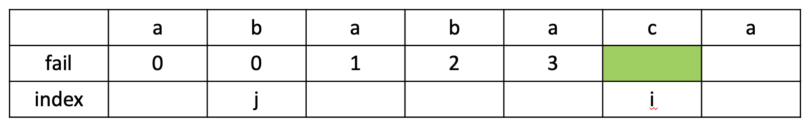

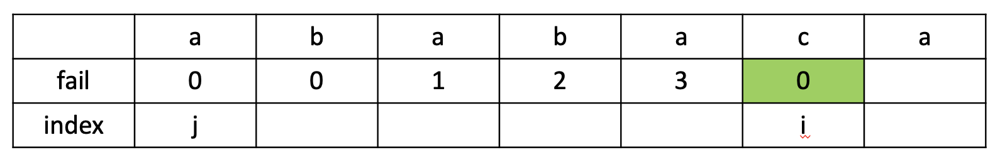

모든 인덱스와 불일치 했으므로, i번째 Fail 함수의 값이  0으로 갱신되고, i가 증가합니다.


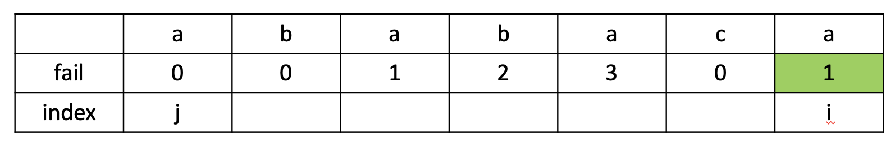

'a' 와 'a' 로 일치하기 때문에 i번째 실패함수의 값은 j + 1인 1로 변경됩니다.

최종적으로 위와 같은 실패함수가 만들어졌습니다. 이 실패함수로 알수 있는 사실은 다음과 같습니다.

 

**- 'a'** 까지 일치하는 접두사/접미사 최대 길이 : **0 (없음)** 

**-** **'ab'** 까지 일치하는 접두사/접미사 최대 길이 : **0** (**없음)**

**- 'aba'** 까지 일치하는 접두사/접미사 최대 길이 : **1 ('a')**

**- 'abab'** 까지 일치하는 접두사/접미사 최대 길이 : **2** **('ab')**

**- 'ababa'** 까지 일치하는 접두사/접미사 최대 길이 : **3 (aba)**

**- 'ababac'** 까지 일치하는 접두사/접미사 최대 길이 : **0 (없음)**

**- 'ababaca'** 까지 일치하는 접두사/접미사 최대 길이 : **1 ('a')**


#### 동작

전체 문자열은 **'babaabaababaca'** 이고,

찾는 문자열은 **'ababaca'** 입니다.


 그리고 정확한 이해를 위해 변수 `begin`을 T의 시작 인덱스로, 일치하는 개수를 `m`이라고 하면 아래와 같은 방식으로 동작한다.

- T[begin+m]==P[m]: 일치할 경우, m++
- T[begin+m]!=P[m]: 불일치할 경우, begin이 스킵하는 만큼 증가하고 m이 실패 함수값이 된다.


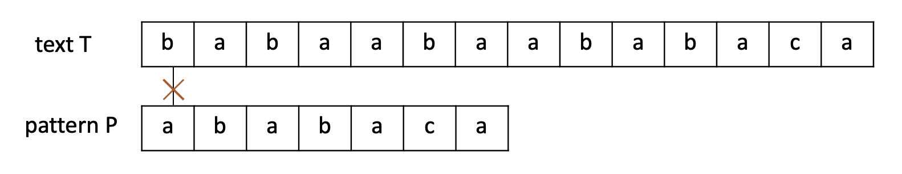

- begin: 0
- m = 0

m=0, 0번째 항목에서 **불일치가** 발생했습니다. 하나도 일치하지 않은 경우이므로 바로 한칸만 건너뜁니다.

 


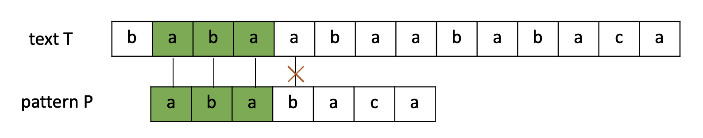

- begin: 1
- m = 3

3번째 index에서 불일치가 발생했습니다. (0부터 시작하므로 0,1,2,3 3번째 Index) 

이 경우엔 m−1의 실패 함수 값 (`fail(m-1`)을 확인하는데 m개가 일치했다는 것은 인덱스 m−1까지 일치했다는 말과 동일하기 때문이다. 위에서 구했던 것처럼 `fail(2)` = 1이기 때문에 다시 T의 1번째 인덱스부터 비교하면 된다.

왜냐하면 `fail(2)`=1이란 의미가 이전에 일치한 문자열 중에 접두사와 접미사가 일치하는 부분이 1개라는 뜻이기 때문에 0번째 인덱스가 일치한다는 것이 보장되기 때문이다. 

 또한 begin 값을 옮겨주어야 하는데 begin에 `m − fail(m−1)`만큼 더해주면 된다. 일치하는 만큼(m) 옮긴다음 반복되는 문자열의 길이 만큼( `fail(m−1)` ) 빼주는 개념이다. 

begin = begin + m - fail(m-1) = 3이므로 3번째 index부터 다시 비교하면 된다.


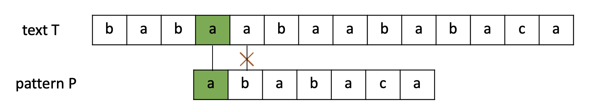

- begin: 3
- m = 1

이번에는 1번째 index에서 불일치가 일어났습니다. 

마찬가지로 m = 1 이므로 fail(0) 값을 확인하고 begin = begin + m - fail(m-1) = 4이므로 4번째 index부터 다시 비교합니다.


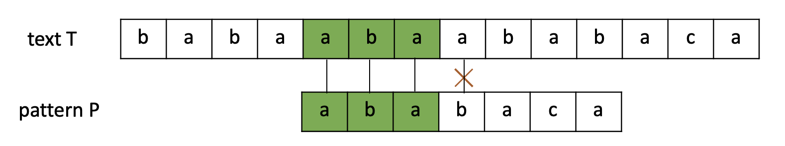

- begin: 4
- m = 3

3번째 index에서 불일치가 발생했습니다. 마찬가지로 m = 3 이므로 fail(2) 값을 확인하고 begin = begin + m - fail(m-1) = 6이므로 6번째 index부터 다시 비교합니다.


 

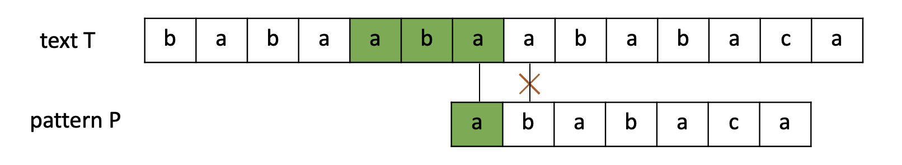

- begin: 6
- m = 1

1번째 index에서 불일치가 발생했습니다. 마찬가지로 m = 1 이므로 fail(0) 값을 확인하고 begin = begin + m - fail(m-1) = 7이므로 7번째 index부터 다시 비교합니다.


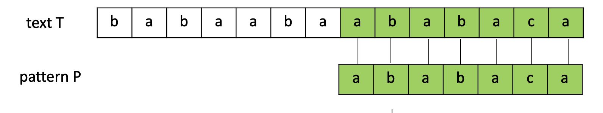 

- begin: 7
- m = 7

드디어 T를 찾았는데 이 경우에는 단순히 완전히 건너뛰면 되는 것일까?

 **완전히 일치하는 경우에도 접두사와 접미사가 일치하는 부분이 존재한다.** 즉, 현재 m = 7, fail(6) = 0이므로 begin = begin + m -fail(m-1) = 14이므로 14번째 index부터 다시 비교하면 된다. 

하지만 14번째 인덱스부터 남은 문자의 갯수(0)가 패턴의 길이(7)보다 작으므로 함수를 종료하면된다.


#### 의사코드

```pseudocode
KMP-MATCHER(T, P)
	n = T.length, m = P.length
	pi = COMPUTE-PREFIX-FUCNTION(P)
	q = 0
	
	for i = 1 to n
		while (q > 0 && P[q+1] != T[i])
			q = pi[q]
			
		if (P[q+1] == T[i]) q++;
		if (q == m) {
			print "Pattern occurs with shift" i-m
			q = pi[q]
		}
```


#### **구현 (C++)**

```c++
#include <iostream>
#include <string>
#include <vector>

using namespace std;


int fail[1000];

vector <int> result;


void getFailFunc(string P) {
	int M = 0;
	while (P[M]) M++;

	for (int i = 1, j = 0; i < M; i++) {
		while (j > 0 && P[i] != P[j]) 
            j = fail[j - 1];

		if (P[i] == P[j]) {
			fail[i] = ++j;
		} else {
			fail[i] = 0;
		}
	}
}

void KMP(string text, string pattern) {
    int t_len = text.length();
    int p_len = pattern.length();


    int begin = 0, m = 0;
    while(begin <= t_len - p_len) {
        // 일치개수(m)가 P의 길이보다 작고
        // T[begin+m]과의 문자가 일치하는 경우
        if(m < t_len && text[begin+m] == pattern[m]){
            m++;
            // P를 찾은 경우에 begin값을 저장한다.
            if(m == p_len) result.push_back(begin);
        }
        // 불일치하거나 P를 찾은 경우
        else {
            // 일치한적이 한번도 없고 불일치했다면 단순히 begin 옮기면 된다.
            if(m == 0)
                begin++;
            // 그게 아니라면 begin과 m을 위에서 말한 것처럼 초기화!
            else {
                begin += (m - fail[m-1]);
                m = fail[m-1];
            }
        }
    }
}


int main(void) {
    string T, P;
	cin >> T >> P;

    getFailFunc(P);

    KMP(T, P);
    if (result.empty()) cout << P << " 는 없는 단어입니다.\n";
    else {
        for (int i = 0; i < result.size(); i++) {
            cout << result[i] << "인덱스부터 일치합니다.\n";
        }
    }
	

	return 0;
}
```


#### 시간복잡도

- 실패함수 계산 : Θ(*m*)
- KMP-MATCHER : Θ(*n*)

