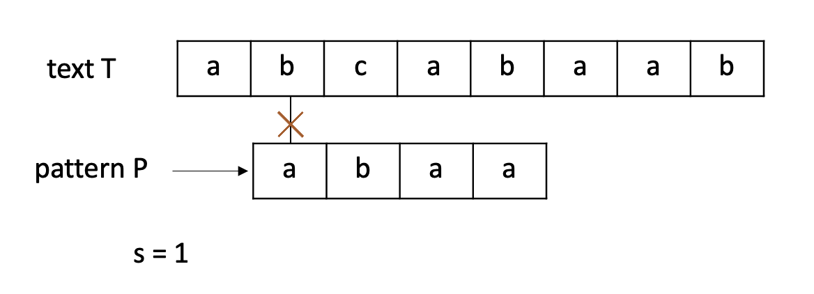
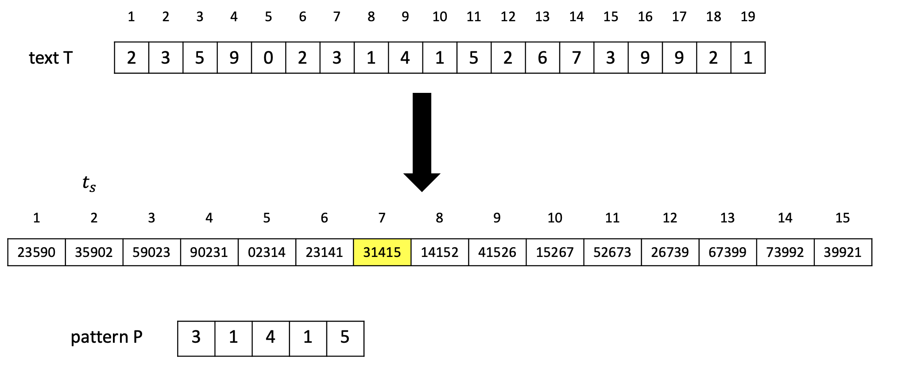

## String Matching


#### Notation & Terminology

-  T [1 .. n]: 텍스트
- P [1 .. m]: 패턴
- 1≤ j ≤m에 대해 T[s+j] = p[j]인 경우 T에서 시프트 s와 함께 P가 발생합니다.
- P가 T의 시프트 s와 함께 발생하면 s를 유효한 시프트라고 합니다. 그렇지 않으면 잘못된 시프트입니다.


### Navie algorithm

패턴을 한칸을 옮기며 텍스트가 끝날 때 까지 비교해 보는 방식





#### 의사코드

```pseudocode
Navie-String-Matching (T, P)
  n <- |T|
  m <- |P|
  for s<-0 to n-m
    do if P[1..m] = T[s+1..s+m]
      then print "P occurs with shift" s
```


#### 시간복잡도

$ (O (n-m+1)*m) $


shift가 발생했을 때의 정보가 다음번 shift에 전혀 사용되지 않으므로 비효율적입니다.


#### C++ code

```c++
```


### Rabin-Karp algorithm

길이가 m인 문자열을 m자리 숫자로 취급하는 것

- P[1..m]: m자리 수 p로 치환
- 부분문자열 T[s+1 .. s+m]: m자리 수 $t_s$로 치환

문자열 매칭 문제를 숫자비교 문제로 치환하는데 의의가 있다.


Ex) $ \sum = \\{ 0, 1, 2, ..., 9 \\} $, P[1 .. m] = 31425 일 때, p = 31, 425




#### **String to Number**

Horner's rule

p = P[m] +10(P[m-1] + 10(P[m-2] + .... + 10(P[2] + 10P[1]) ... ) ) 


Ex) P[1..m] = 31425,  p= 5+10(2+10(4+10( 1+10(3) ) ) ) = 31,425


$t_s$를 빨리 계산하는 방법이 있을까?

$ t_{s+1} = 10\*(t_s - 10^{m-1}*T[s+1]) +T[s+m+1] $


ex) s = 7, $t_7$=31415일 때, 

$t_{7+1}$ = 10*(31415 - 10000\*3) + 2 = 14152 ($ \because T[s+5+1] = 2 $)


##### 시간복잡도

p, $t_0$를 계산하는 비용: $ \theta(m) $

$t_1, ... , t{n-m}$을 계산하는 비용: $\theta(n-m) \ or \ \theta(n) $


m이 매우 작다면 p와 $t_s$를 구하는데 상수의 시간이 걸리겠지만 큰 경우에는 시간이 꽤 걸린다.


#### modulo operation

두 수를 비교할 때, 직접 두수를 비교하지 않고 나머지연산을 통해 비교할 수 있다.

하지만 $ t_s \equiv p (mod q) $가 $t_s = p$를 항상 보장하지는 않는다.

- valid: $ t_s \equiv p (mod q) $ and $t_s = p$
- spurious hit: $ t_s \equiv p (mod q) $가 $t_s \not= p$

=> $ t_s \not= p (mod q) $이면 절대로 $t_s = p$는 될 수 없다.

여기서 q는 **적당한 소수**를 선택한다.


따라서 $t_s$ 를 구성할 때 modulo operation을 거친 값으로 구성한다.


- s = 7 일때: T[7 .. 11] = P (valid match)
- s = 13 일때: T[13 .. 17] $ \not= $ P (invalid, spurious hit)


Recalculation of p and t
 – p = original p (mod q)
 – t_{s+1} = (d*(ts-T[s+1]h)+T[s+m+1]) (mod q)


#### 시간복잡도

$ \theta (m) $ : 전처리과정 (p와 $t_0$ 계산)

$ \theta((n-m+1)*m) $: worst case

- $ \theta(n-m+1) $: p = $t_s$를 찾는데 걸리는 시간
- $ \theta(m) $: 유효한 s를 검증하는 시간


#### C++ 코드

```c++
```


### KMP algorithm


navie string matcher를 다시 생각해보면, 위의 사진 같이 앞에 **5개의 문자는 일치하지만** 마지막 6번째 문자가 달라서 같지 않다고 나오는 경우, 앞에 5개의 **문자는 일치한다는 정보**를 버리고 한칸을 shift하고 처음부터 다시 비교하게 된다.

KMP알고리즘은 앞에 **5개는 일치한다라는 정보**를 저장하여 더욱 효율적으로 검색한다는 메인 아이디어로 시작한다.


#### 설계

패턴 자체를 비교하여 필요한 정보를 미리 계산할 수 있습니다. 

전체 문자열은 같지 않지만 부분문자열은 같은 경우, 얼마만큼 비교를 skip할 수 있을지 정보를 제공해주는 함수입니다. 

위 예시의 경우 ababa까지 일치하였고 앞뒤로 <span style="color:white; background:black">aba</span>ba /  ab<span style="color:white; background:black">aba</span> 3개의 문자가 일치하고 2개의 문자가 일치하지 않으므로 2칸을 건너뛰어서 다음 비교를 실행하면 됩니다.


좀 더 체계적인 용어를 사용하여 정리해보겠습니다.


##### 접두사(prefix)와 접미사(suffix)

- 접두사: 문자열의 첫 문자부터 차례대로 나열한 부분 문자열

Ex) banana의 접두사: b, ba, ban, bana, banan, banana


- 접미사: 문자열의 마지막 문자부터 차례대로 나열한 부분문자열

Ex) banana의 접미사: a, na, ana, nana, anana, banana


##### prefix (failure) function

문자 매칭에 실패했을 때, 얼만큼 건너뛰어야 하는가에 대한 정보.

 즉, 문자 매칭에 실패하기 직전 상황에서, 접두사 / 접미사가 일치한 최대 길이


**2개의 인덱스 (i, j)** 를 활용해서 실패함수를 구할 것입니다.

인덱스를 증가시켜나가며 **두 문자가 일치하면 두 인덱스를 증가**시키고,

일치하지 않으면 **이전까지의 상황의 실패함수를 참고**해나가며, 참고할 값이 없으면 0 이 됩니다.


실패함수의 첫번째 항목은 0 입니다.

위에서 자기 자신은 제외한다고 했으므로 항상 0 으로 생각하시면 됩니다.

현재 **i 와 j 인덱스에서 문자가 불일치**하므로, **이전까지의 실패함수를 참고**를 시도합니다.

하지만 이전 상태에서의 실패함수의 값은 0 입니다.

그러므로, i 번째 Fail 함수의 값도 다음과 같이 0 으로 갱신되고, i 가 증가합니다.

 


이번엔 어떤가요?

i 와 j 에서 문자열이 일치하므로, 다음과 같이 j + 1의 값이 i번째 실패함수의 값으로 입력되며,

i와 j의 값이 모두 증가합니다.

 


여기에서도 역시, 'b' 와 'b' 로 일치하기 때문에

i 번째 실패함수의 값은 j + 1인 2로 변경됩니다.

 


이제는 어떤가요?

'b'와 'c'로 불일치하기 때문에, 이전까지의 실패함수를 참고합니다.

자세하게는, 이전 인덱스의 실패함수의 값으로 j를 옮겨서, 다시 문자를 비교합니다.

지속해서 불일치한다면 j가 0이 될 때까지 반복합니다.

 


최종적으로 위와 같은 실패함수가 만들어졌습니다.

이 실패함수로 알수 있는 사실은 다음과 같습니다.

 

**- 'a'** 까지 일치하는 접두사/접미사 최대 길이 : **0 (없음)** 

**-** **'ab'** 까지 일치하는 접두사/접미사 최대 길이 : **0** (**없음)**

**- 'aba'** 까지 일치하는 접두사/접미사 최대 길이 : **1 ('a')**

**- 'abab'** 까지 일치하는 접두사/접미사 최대 길이 : **2** **('ab')**

**- 'ababc'** 까지 일치하는 접두사/접미사 최대 길이 : **0 (없음)**


## **KMP 알고리즘의 동작 원리**

아래와 같은 상황을 가정해보겠습니다.

전체 문자열은 **'ababdababc'** 이고,

찾는 문자열은 **'ababc'** 입니다.

 


5번째 항목에서 **불일치**가 발생했습니다.

그러므로, 우리는 4번째의 실패함수 값을 참조합니다.

 


**'abab'** 까지는 실패함수가 **2** 라는 값임을 보여줍니다.

이 값이 무슨 값인지 기억하시나요?

**'abab'** 에서는 **'ab'**로 최대 접두사/접미사 길이가 2 라는 것입니다.

그러므로 이 값을 참고해서, 우리는 2 만큼 패턴을 이동할 수 있게 됩니다.

 


이번엔 어떤가요?

6번째 항목에서 **불일치**가 발생했습니다.

위와 동일하게, 3번째의 실패함수 값을 참고하면 1 만큼 이동할 수 있겠습니다.

 


역시 동일하게, 이 상황에서는 4번째 실패함수의 값을 참고합니다.

2 칸을 이동합니다.

 


드디어 원하는 패턴을 찾았습니다.

 

 

 

## **구현 (C++)**

```
#include <iostream>

#define MAX_STRING	1000000
#define MAX_WORD	1000

using namespace std;

char S[MAX_STRING + 1];
char W[MAX_WORD + 1];
int fail[MAX_WORD];
int result[MAX_WORD];
int N, M, R;

void getFailFunc() {
	M = 0;
	while (W[M]) M++;

	for (int i = 1, j = 0; i < M; i++) {
		while (j > 0 && W[i] != W[j]) j = fail[j - 1];

		if (W[i] == W[j]) {
			fail[i] = ++j;
		} else {
			fail[i] = 0;
		}
	}
}

void KMP() {
	getFailFunc();
	N = 0, R = 0;
	for (int i = 0; i < MAX_WORD; i++) result[i] = 0;
	while (S[N]) N++;

	for (int i = 1, j = 0; i < N; i++) {
		while (j > 0 && S[i] != W[j]) j = fail[j - 1];

		if (S[i] == W[j]) {
			if (j == M - 1) {
				result[R++] = i - M + 1;
				j = fail[j];
			}
			else j++;
		}
		else j = 0;
	}
}

int m_strcmp(const char* str1, const char* str2) {
	int i = 0, j = 0;

	while (str1[i] != '\0' || str2[j] != '\0') {
		if (str1[i] != str2[j]) return str1[i] - str2[j];
		else {
			i++; j++;
		}
	}

	return 0;
}

int main(void) {
	cin.tie(NULL);
	ios::sync_with_stdio(false);

	cin >> S;
	
	while (true) {
		cin >> W;
		if (!m_strcmp(W, "q")) break;

		KMP();
		if (R == 0) cout << W << " 는 없는 단어입니다.\n";
		else
			for (int i = 0; i < R; i++) {
				cout << result[i] + 1 << "번째 위치에서 발견하였습니다.\n";
			}
	}

	return 0;
}
```