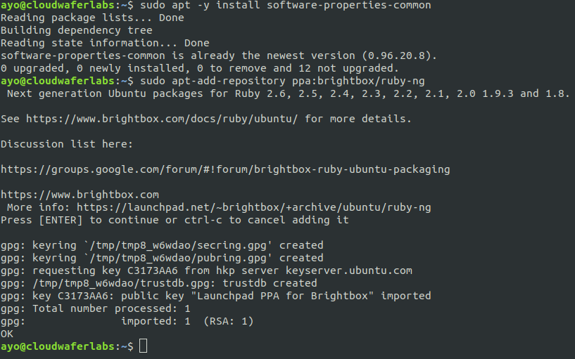
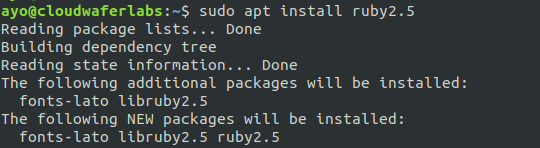
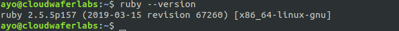
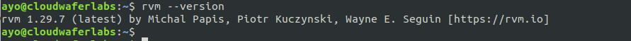
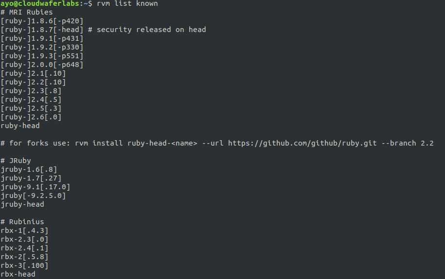
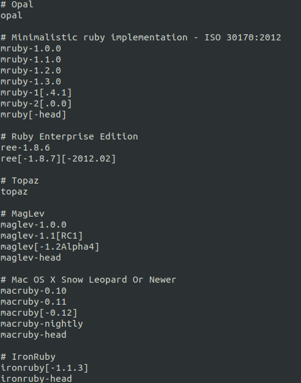

루비설치

# Installing Ruby on Ubuntu 16.04/18.04

[ CloudwaferHQ ](https://cloudwafer.com/blog/author/cloudwaferhq/)- April 05, 2019

[**Ruby**](https://www.ruby-lang.org/en/) is a dynamic, interpreted, reflective, object-oriented, general-purpose programming language. According to the creator, Ruby was influenced by Perl, Smalltalk, Eiffel, Ada, and Lisp. It supports multiple programming paradigms, including functional, object-oriented, and imperative. It also has a dynamic type system and automatic memory management.

In this guide, we will explain how to install Ruby on an Ubuntu 16.04/18.04 server.

We will be using two methods of installing Ruby on Ubuntu 18.04:

- Install Ruby on Ubuntu 18.04 from the Brightbox PPA repository.
- Install Ruby using RVM

**Install Ruby from Brightbox PPA repository:**
Issue the command below to add the Brightbox PPA to your Ubuntu system.

```
sudo apt -y install software-properties-common
sudo apt-add-repository ppa:brightbox/ruby-ng
```



Next, update your packages list using the command below:

```
sudo apt update
```

Next, install the specific version of Ruby you want. Among the versions supported by the Brightbox PPA are the following versions: **Ruby 2.6, 2.5, 2.4, 2.3, 2.2, 2.1, 2.0 1.9.3 and 1.8.**

**For Ruby 2.5**

```
 sudo apt install ruby2.5
```



**For Ruby 2.4**

```
sudo apt install ruby2.4
```

After installation, issue the command below to check the version:

```
ruby --version
```



**Install Ruby using RVM:**
[**Ruby Version Manager**](https://rvm.io/) (**RVM**) is a command-line tool which allows you to easily install, manage, and work with multiple ruby environments from interpreters to sets of gems. First, we need to install the RVM GPG keys using the command below:

```
gpg2 --recv-keys 409B6B1796C275462A1703113804BB82D39DC0E3 7D2BAF1CF37B13E2069D6956105BD0E739499BDB
```

**Note:** You need to have the GNU Privacy Guard 'gnupg2' package installed before using the above command. If absent, install using **`sudo apt-get install gnupg2`** Next, install RVM by issuing the command below:

```
curl -sSL https://get.rvm.io | bash -s stable
```

Next, issue the command below:

```
source /etc/profile.d/rvm.sh
```

To view the version of RVM installed, issue the command below:

```
rvm --version
```



Next, install dependencies by issuing the command:

```
rvm requirements run
```

To list available Ruby interpreters, issue the command below:

```
rvm list known
```





To install a specific version, issue the command like below:

```
rvm install 2.5.3
```


colorls 적용


```shell
sudo apt-get install ruby-full
```

restart the shell and run

```shell
sudo gem install colorls
```

and add to **~/.zshrc** near the bottom of the file

```shell
source $(dirname $(gem which colorls))/tab_complete.sh
```

to have it replace your standard ls command, you can append to **~/.zshrc**

```shell
alias ls=colorls
```


폰트 설치


## . 데이터베이스와 사용자를 생성하고 (컨테이너 내에서) MySQL에서 권한을 부여한다.

- jmlim이라는 사용자를 생성하고, 모든 권한을 부여한다.
- 변경된 권한 적용

> 중요 : 컨테이너 외부에서 MySQL에 로그인도 가능해야 하므로 jmlim@localhost에서 localhost 대신 %를 사용한다.

```
mysql> CREATE USER 'jmlim'@'%' IDENTIFIED BY 'password';
Query OK, 0 rows affected (0.00 sec)

mysql> GRANT ALL PRIVILEGES ON *.* TO 'jmlim'@'%';
Query OK, 0 rows affected (0.00 sec)

mysql> flush privileges;
Query OK, 0 rows affected (0.00 sec)

mysql> quit
```


```
sudo curl -L https://github.com/docker/compose/releases/download/1.25.0-rc2/docker-compose-`uname -s`-`uname -m` -o /usr/local/bin/docker-compose
```

요 위는 한줄입니다. 입력하면


도커 컴포즈 설치


요렇게 나오는데 만약 sudo 를 잊거나 하면 바로 권한 오류가 뜨니 꼭 넣어주세요.

 

그 다음에

```
sudo chmod +x /usr/local/bin/docker-compose
```

요렇게 권한 설정도 해줍시다.

 

\7. 도커 컴포즈 설치 확인

그러면 이제 확인을 해봅시다.

```
docker-compose --version
```

를 입력하면


컴포즈 설치 확인


요렇게 버전이 나옵니다.


출처: https://hcnam.tistory.com/25 [segmentation fault (core dumped)]


**도커허브에 로그인 (도커허브에 이용자 등록하고 아이디, 암호를 여기서 사용한다)**

PS C:\Users\TJ> **docker login -u <이용자ID> -p <이용자암호>**

**WARNING! Using --password via the CLI is insecure. Use --password-stdin.**

Login Succeeded

PS C:\Users\TJ>


위와 같은 경고가 안나오게 하려면 암호가 노출되지 않도록 다음과 같은 방법을 사용하면 된다

PS C:\Users\TJ> **docker login -u <이용자ID>**

Password: **<여기에 암호를 입력하면 암호가 노출되지 않는다><엔터>**

Login Succeeded

PS C:\Users\TJ>


**도커허브에 업로드할 이미지의 ID를 확인한다**

PS C:\Users\TJ> **docker images**

REPOSITORY           TAG         IMAGE ID      CREATED       SIZE

jupyter/datascience-notebook  latest       efed89887eb2    7 days ago     6.11GB

continuumio/miniconda3     latest       **ae46c364060f**    5 weeks ago     460MB

hello-world          latest       fce289e99eb9    5 weeks ago     1.84kB

docker4w/nsenter-dockerd    latest       2f1c802f322f    3 months ago    187kB

PS C:\Users\TJ>


**로컬 이미지에 태그 설정(위에서 생성한 리파지토리 이름을 사용함)**

**docker tag <업로드할 이미지의 ID> <이용자ID>/<생성된 리파지토리 이름>:<임의의 태그이름>**


PS C:\Users\TJ> **docker tag** **ae46c364060f** **smith/mconda-plus:base**

PS C:\Users\TJ> **docker images**

REPOSITORY           TAG         IMAGE ID      CREATED       SIZE

jupyter/datascience-notebook  latest       efed89887eb2    7 days ago     6.11GB

continuumio/miniconda3     latest       ae46c364060f    5 weeks ago     460MB

**cwisky/mconda-plus**       **base**        ae46c364060f    5 weeks ago     460MB

hello-world           latest          fce289e99eb9    5 weeks ago     1.84kB

docker4w/nsenter-dockerd    latest       2f1c802f322f    3 months ago    187kB


**docker hub의 이용자 계정/리파지토리에 업로드하기**

**docker push <이용자ID>/<생성된 리파지토리 이름>:<임의의 태그이름>**

아래에서 사용된 청색부분은 현재 도커에 생성된 이미지이며 이미지를 도커허브에 업로드하려면 도커허브에 그 이름과 동일한 리파지토리가 생성되어 있어야 한다.


**도커허브의 smith 계정 mconda-plus 리파지토리에 도커 이미지를 업로드할 때 base 태그를 사용한 경우**

PS C:\Users\TJ> **docker push smith/mconda-plus:base**

The push refers to repository [docker.io/cwisky/mconda-plus]

38376384d46a: Pushed

98768fbc5764: Pushed

0809828fac1a: Pushed

0a4aae060f2d: Pushed

b28ef0b6fef8: Pushed

base: digest: sha256:e7bcbd77dd014025169f7ac698c40b7a036c97372ce80c60bb8970450a329db0 size: 1370

PS C:\Users\TJ>


**업로드된 이미지가 검색되는지 확인하기**

PS C:\Users\TJ> **docker search smith/mconda**

NAME               DESCRIPTION                   STARS        OFFICIAL      AUTOMATED

**smith/mconda-plus        Just Practicing**                 0

kargreat/cent7-mconda3-spark2.3  flavor: centos 7, miniconda 3, apache spark …  0

PS C:\Users\TJ>


**Docker hub 웹사이트에서 자신의 계정에 속한 리파지토리 삭제하기**

웹사이트 접속/로그인

Repositories 메뉴 선택 > 삭제할 리파지토리 선택 > Settings 메뉴 선택 > Delete repository 선택

위의 화면에서 [Make public] 혹은 [Make private] 버튼을 누르면 공개/비공개를 변경할 수도 있다