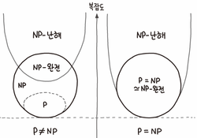

## P-NP problem

- Graph coloring  - no one knows

- Euler tour - typical

- Hamiliton cycle - intractable, classic NP-complete problem

- Graph isomorphism - no one knows

- lay out a graph in the plane without crossing edges - hire an expert, 

  linear time ifs-based planarity alogrithm discovered by Tarjan in 1970s (too complicated for most practitioners)

how difficult?

- any programmer could do it
- typical diligent alogrithms student could do it
- hire an expert
- intractable.
- no one knows.
- Impossible

P versus NP problem

**P 집합과 NP 집합이 같은지 다른지를 증명**하고자 한다. P집합은 이미 NP의 부분집합이므로, 모든 NP 문제가 P 문제라는 것을 증명하면 P 집합과 NP 집합이 같은 것이 된다.

위 말을 일상적인 표현으로 바꾸면 "쉽게 검산할 수 있는 모든 문제들은 모두 쉽게 풀리는가?"이다. 만일 어느 한쪽으로 증명이 된다면 셋 중 하나의 결론을 도출하게 된다.

- 같다: 쉽게 검산할 수 있는 풀기 어려운 공식은 풀기 쉬운 공식으로 변형될 수 있다.
- 다르다: 풀기 쉬운 공식으로 변형될 수 없는 어려운 문제가 존재한다.
- 증명할 수 없다.

## 설명

### 알고리즘의 시간 복잡도

컴퓨터를 사용하여 특정한 계산 문제를 풀기 위해서는, 바로 그 문제에 해당되는 알고리즘을 컴퓨터에게 알려주어야 한다. 그리고 컴퓨터공학자들의 주된 관심사는 **그 알고리즘이 문제를 얼마나 빨리 해결할 수 있느냐**는 것이다. 물론, 알고리즘에 넣어주는 입력의 크기가 커질수록 일반적으로 알고리즘의 수행 시간은 점점 오래 걸린다. 예를 들어 숫자 100개를 더하는 문제를 푸는 데에 100 나노초가 걸렸다면, 숫자 1000개를 더하는 문제를 풀 때에는 1000 나노초가 소요될 것이다. 그리고 보다 일반적으로 말해서, n자리의 두 수를 더하는 데에는 약 n나노초가 소요될 것이다. 이러한 경우에는 알고리즘의 시간복잡도를 O(n)이라고 표기하는데, 간단히 말해 n앞에 곱해질 비례상수에 대해서는 별로 신경 쓰지 않겠다는 의미이다. 어떤 문제가 O(n) 알고리즘을 가진다는 것은 그 문제가 컴퓨터에게 아주 쉬운 문제라는 것을 의미한다.

조금 더 복잡한 문제를 생각해보자. 만약 n자리의 두 자연수를 곱하려고 한다면 얼마나 많은 계산이 필요할까? 손으로 이를 푼다고 생각해보면, 그 중간 과정에서는 n개의 행이 필요할 것이고, 각각의 행은 다시 n개의 숫자로 구성되어 있을 것이다. 따라서 n자리의 두 자연수를 곱하는 문제를 손으로 푸는 방식으로 푼다면, 이는 거의 n^2에 비례하는 시간을 요구할 것이다. 따라서 이 때는 알고리즘의 시간복잡도가 O(n^2)이라고 한다. 즉, 100자리 수의 곱셈을 하는 것은 10자리 수의 곱셉을 하는 것에 비해 10배 어려운 문제가 아니라 실은 100배나 어려운 문제라는 것이다. 따라서 곱셈은 덧셈보다는 비교적 어려운 문제이다. 그렇지만 이 정도로는 그렇게 어려운 문제라고 할 수 없다.

만약 a~z까지의 알파벳으로 랜덤하게 구성된 10자리의 비밀번호를,  브루트 포스로써 뚫고자 한다면 얼마나 많은 시도가 필요할까? 잘 알다시피 26^{10}번의 시도가 필요할 것이다. 이것도 141조라는 어마어마한 숫자이다. 하지만 현대의 슈퍼 컴퓨터를 사용한다면, 141조 번 정도의 대입 작업은 실제로 가능한 일의 범위 내에 있다. 그러면 100자리의 패스워드를, 모든 가능성을 다 대입하여 풀려면 얼마나 많은 시도가 필요할까? 26^{100} 정도이다. 즉, 100자리 수의 패스워드를 뚫는 것은 10자리 수의 패스워드를 뚫는 것과는 비교할 수도 없을 정도로 어려운 문제가 된다. 이것은 n자리 수의 곱셈의 경우와는 확실히 다른, 어마어마하게 어려운 문제임을 쉽게 짐작할 수 있다. 이 때의 시간복잡도는 O(26^n)이 될 것이다.

앞의 쉬운 문제 두 개와 뒤의 어려운 문제의 차이점은 간단하다. 앞의 문제들에 대한 알고리즘은 O의 괄호 안에 들어있는 식이 n에 대한 **다항식**이었고, 뒤의 어마어마하게 어려운 문제는O의 괄호 안에 n에 대한 **지수함수**가 들어있다는 것이 중요한 차이점이다. 다항식도 n이 커지면 값이 빠르게 증가하는 것 같지만, 지수함수의 증가 속도에 비하면 그것은 새 발의 피에 불과하다. 그래서 우리는 어떤 문제가 쉬운지 어려운지를 간단하게 구분할 수 있다. 다항식 시간 알고리즘이 존재하는 문제는 쉬운(tractable) 문제이고, 다항식 시간 알고리즘이 존재하지 않는 문제는 온 우주가 힘을 모아도 풀기 어려운(intractable) 문제이다. 만약 당신이 어떤 알고리즘을 개발하였다고 해도, 그 알고리즘이 다항식 시간에 작동하지 않는 너무나도 비효율적인 알고리즘이라면, 그 알고리즘은 **어떠한** 공학적 흥미도 끌 수 없을 것이다.

다행히도 수학/과학적으로 중요한 많은 문제들이 다항식 시간 알고리즘을 가지는 것으로 확인되었다. n개의 숫자를 입력 받고, 그들을 크기순으로 정렬하는 정렬 문제가 대표적이다. 그 외에도 어떤 도로망의 지도가 주어졌을 때, 주어진 출발지와 목적지 사이의 최단경로 문제 다항식 시간에 풀 수 있다. 그러나 어떤 n자리 자연수를 소인수분해하는 다항식 시간 알고리즘은 아직까지 아무도 찾아내지 못하였다.

서로 다른 두 문제의 난이도를 비교하는 데에는 환원(reduction)이라고 불리는 기법이 자주 사용된다. 예를 들어, 다음의 두 가지의 문제가 주어졌다고 생각하자.

> 문제 A: 주어진 n개의 숫자를 크기 순서로 정렬하는 문제
> 문제 B: 주어진 n개 숫자의 중간값을 계산하는 문제

어떤 사람이 문제 A를 쉽게 풀 수 있다면, 그 사람은 문제 B도 쉽게 풀 수 있는 것이 당연하다. 왜냐하면 주어진 숫자들을 정렬하고 나면, 그 중 정가운데에 있는 수를 뽑기만 하면 그것이 중간값이 될 것이기 때문이다. 이와 같은 일이 벌어진다면, 문제 B를 문제 A로 환원시킬 수 있다고 표현하며, 문제 B의 난이도는 문제 A의 난이도보다 어려울 수 없다는 것을 알 수 있다.

### P 문제와 NP 문제

답이 YES 아니면 NO로 반환되는 문제를 결정 문제라고 한다. 예를 들어, 'a는 b의 배수인가?'와 같은 질문은 결정 문제이다. P와 NP 모두 결정 문제의 분류에 해당한다.

P 문제는 결정 문제들 중에서 쉽게 풀리는 것을 모아 놓은 집합이다. 어떤 결정 문제가 주어졌을 때, 다항식(Polynomial) 시간 이내에 그 문제의 답을 YES와 NO 중의 하나로 계산해낼 수 있는 알고리즘이 존재한다면, 그 문제는 P 문제에 해당된다. n자리 이하의 수 a와 b가 주어졌을 때, a가 b의 배수인지를 판정하는 것은 유클리드 호제법을 사용하면 n에 대한 다항식 시간에 계산할 수 있으므로, 'a는 b의 배수인가?'하는 문제는 P 문제에 해당된다.

위의 정의는 결정적 알고리즘(deterministic algorithm), 즉 계산의 각 단계에서 단 한가지의 가능성만을 고려할 수 있는 알고리즘이 다항시간이 걸리는 문제가 P 문제라는 뜻이다.

NP 문제는 형식적으로는, 문제를 푸는 각 단계에서 여러 가지의 가능성을 동시에 고려할 수 있는 비결정적 알고리즘(non-deterministic algorithm)으로, 다항시간 내에 문제를 해결할 수 있는 문제라고 정의한다. 즉 NP는 Non-deterministic Polynomial의 약자이다. 하지만 인간의 머리는 비결정적 알고리즘의 작동을 잘 이해 못하는 경우가 많아서인지, 검산 위주의 정의가 쓰일 때도 많다.

NP 문제는 결정 문제들 중에서 적어도 검산은 쉽게 할 수 있는 것을 모아 놓은 집합으로도 정의할 수 있다. 정확히 말하면, 어떤 결정 문제의 답이 YES일 때, 그 문제의 답이 YES라는 것을 입증하는 힌트가 주어지면, 그 힌트를 사용해서 그 문제의 답이 정말로 YES라는 것을 다항식 시간 이내에 확인할 수 있는 문제가 바로 NP 문제에 해당된다. 

예를 들어, \{-5, 6, 1, 2, -10, -7, 13}과 같이 정수 n개로 이루어진 집합이 주어졌다고 할 때, '이 집합의 부분집합들 중에서 원소의 합이 0이 되는 집합이 존재하는가?'라는 문제는 아직까지 다항식 시간 알고리즘이 알려져 있지 않다. 곰곰히 생각해보아도, 그냥 모든 부분집합을 다 테스트해보지 않는 이상 답이 YES인지 NO인지 답하기가 어렵다는 것을 알 수 있다. 그렇지만 누군가가 우리에게 {6, 1, −7}이라는 힌트를 제공하였다면, 우리는 먼저 이 집합이 원래 집합의 부분집합이라는 사실을 확인하고, 이 집합의 원소의 합이 0이라는 사실을 확인함으로써 원래 문제의 답이 YES라는 것을 어렵지 않게 확인할 수 있다.

 따라서 '크기가 n인 어떤 정수 집합이 주어졌을 때, 이 집합의 부분집합들 중에서 원소의 합이 0이 되는 집합이 존재하는가?'라는 문제는 적어도 NP 문제인 것은 확실하지만, 이것이 P 문제인지 아닌지는 아직 모르는 상황이라고 할 수 있다.

만약 어떤 P 문제가 주어졌고, 그 문제의 답이 YES라면, 우리는 그 문제의 답에 관한 힌트가 주어지면 곧바로 그 문제의 답이 YES라는 것을 쉽게 확인할 수 있을 것이므로, 모든 P 문제는 저절로 NP 문제도 된다. 즉, P⊂NP임을 알 수 있다. 하지만 그 역방향인 NP⊂P에 대해서는 참인지 거짓인지 아직 알려져 있지 않다. 만약 모든 NP 문제가 P 문제인 경우, 즉 모든 NP 문제가 다항 시간에 풀 수 있는 알고리즘이 존재함을 증명할 경우 P=NP라는 결론이 된다. 그래서 P=NP인지, 아니면 P≠NP인지를 묻는 것이 바로 P-NP 문제이다. 

사실 많은 컴퓨터공학자들은 절대로 P=NP일 리가 없다고 믿고 있다. 왜냐하면, P=NP가 의미하는 바는, 만약 어떤 문제가 주어졌을 때 그 문제의 답안을 쉽게 검산할 수 있다면 그 문제 자체도 쉽게 풀 수 있다는, 너무나도 강력한 주장이기 때문이다. 이는 우리가 지금까지 열심히 수학을 공부하면서 몸에 체득해온 직관과는 배치되는 일이다. 일부 방정식의 경우 해를 직접 구하는 것은 어렵지만, 남이 미리 풀어서 구한 답을 방정식에 대입해서 그게 맞는지 확인하는 일은 훨씬 쉬운 경우가 많다. 따라서 P≠NP라는 것을 쉽게 입증할 수 있을 것 같지만, 불행히도 아직까지는 아무도 올바른 증명을 찾아내지 못하였고, 이것을 증명하는 것이 왜 어려운 일인지를 암시하는 간접적인 결과만이 조금 밝혀져 있을 뿐이다.

#### 이해

NP 문제에 대해 쉽게 이해하기 위해서 예를 들어보자. 어떤 그래프가 주어졌을 때, "그 그래프의 모든 점을 정확하게 한 번씩만 지나는 경로가 존재하는가?" 하는 문제를 '해밀턴 경로 문제'라고 하는데, 만약 그 답이 Yes이고 모범답안으로서 그 그래프상의 모든 점을 정확하게 한 번씩만 지나는 경로가 주어진다면, '그런 경로가 존재한다'는 것을 확인할 수 있을 것이다. 즉, 적절한 모범답안이 주어진 경우 Yes라는 대답은 확인할 수 있다. 따라서 '해밀턴 경로 문제 = NP 문제'이다.

그러나 그 답이 No라면, 설사 '그런 조건을 만족하지 않는 경로'가 주어진다고 하더라도 '그런 경로가 존재하지 않는다'는 것을 확인할 수는 없을 것이다. 다시 말해서 No라는 답을 다항식 시간 내에 확인할 수 있게 해주는 종류의 모범답안은 알려져 있지 않다. 따라서 '해밀턴 경로 문제 = co-NP 문제'가 아니다. 보다 정확하게는, 'co-NP 문제'라고 증명되지 않았다. 반대로 어떤 그래프가 주어졌을 때, "그 그래프의 모든 점을 정확하게 한 번만 지나는 경로는 없는가?"라는 문제라면 이는 co-NP 문제일 것이다.

- 참고로 '바둑같은 게임에서 필승법이 존재하는가?'는 NP 문제도 co-NP 문제도 아니다. 예컨대 바둑에서 '흑이 이기는 어떤 수순'이 주어진다고 하더라도 다른 모든 수순들을 검토해서 서로 비교하지 않는 한 그것이 '흑'에게 필승법이 존재한다는 의미인지 검증할 방법이 없다. 즉, '필승법이 존재하는가?' 라는 질문에 대해서는 어떤 기보가 주어지더라도 Yes라는 대답도 No라는 대답도 다항식 시간 내에 확인할 수 없는 것이다.
- 이와 같은 문제에서 '다항식 시간 내에' 해결 가능하다는 것은 다음과 같은 뜻이다. 바둑판에는 19x19개의 격자가 있는데, 이 격자의 수가 x개가 있을 때, 문제 풀이에 걸리는 시간의 최대치가 x에 대한 다항식으로 주어진다는 뜻이다. 바둑판 문제의 경우에는 대략 3^{x^2}3*x*2개의 경우를 확인하게 되므로, P 문제가 아니다. 이 문제는 'EXP 완전 문제'임이 증명되어 있다. 즉, 이 문제를 T의 시간 내에 풀 수 있으면, 모든 지수함수적(exponential) 시간이 걸리는 문제를 'T + 다항식' 시간 내에 풀 수 있다.

종종 NP 문제에 대해서 "P 문제가 아닌 것"으로 설명하는 경향이 있지만, P 문제는 다항식 시간 동안 '답을 찾을 수 있는' 문제이고 NP 문제는 다항식 시간 동안 '주어진 답이 맞는지 확인할 수 있는' 문제이므로 이 둘은 상호배타적인 관계가 아니다. 다항식 시간 내에 직접 답을 구할 수 있다면 당연히 주어진 답이 맞는지 역시 확인할 수 있으므로, '모든 P 문제는 NP 문제이며 그와 동시에 co-NP 문제'이기도 하다.

사실 더 짧게 설명할 수 있다. 빅오 표시 기준으로 비결정론적 튜링머신으로 O(n^p)만큼 시간이 걸리는 문제를 결정론적 튜링머신으로 풀면  O(n^{(p+q)})만큼의 시간이 걸리는지, 또한 '모든 NP 문제를 이런 식으로 환원할 수 있는지를 확인'하는 것이다. 참고로 P 문제는 이미O(n^p)이기 때문에 NP 문제로 풀면 아무리 못 해도 O(n^p)는 나온다. 이렇게 환원되는 알고리즘(그리고 문제)을 찾기 위해 지금도 많은 수학자들이 고심하고 있지만대부분은 명확한 답을 내놓지 못하고 있다.

더 쉽게 설명하자면, 앞서 언급했듯 '검산'은 하나의 경우에 대해서 옳은지 그른지 보는 것이고, '해결'은 해답이 되는 경우를 찾을 때까지 모든 경우에 대해 옳고 그름을 따지는 것이다. 따라서 이 문제의 초점을 '문제에서 조합 가능한 경우의 수'로 맞춰서 보면, 문제를 푸는 시간은 최악으로 어림잡아 (중복되지 않는 모든 경우의 개수) × (경우 하나를 검증하는 데 걸리는 최악의 시간)으로 볼 수 있다. 여기서 '중복'이라 하는 것은 부분적인 중복도 포함하는 것이으로, 결국 P-NP 문제의 가장 중요한 쟁점은 이 수학적 귀납법으로 경우의 수를 P의 영역으로 넣을 수 있는지의 여부를 묻는 것으로 볼 수 있다. 대표적인 예로, 정렬 문제의 경우 경우의 수가 n!이지만, 이미 수학적 귀납법으로 O(n^2), 나아가 O(nlogn)으로 수렴된 바 있다.

앞서 언급한 수학적 귀납법으로 설명할 경우, n의 문제를 푸는 데 T시간 만큼 걸렸다 가정하면 n+1의 문제를 푸는 데 아무리 못해도 T + O(n^k)의 시간만큼은 나와야 P 문제라 말할 수 있다. 반대로 kT + O(n^k)의 시간이 걸렸거나 T + +O(2^n)의 시간이 걸렸다면 최종적으로는 O(2^n)만큼이 걸리는 것이므로, 이 문제는 P 문제라 말할 수 없으며, 오히려 'EXP (완전) 문제'라 보는 것이 타당하다. 거기에 수학적 귀납법은 그 특성상 이전까지의 답이 그 다음 요소를 포함한 해답을 보증해야 한다는 전제를 깔기 때문에, 이것을 보장할 수 없는 경우 결국 처음부터 다시 풀어야 한다. 실제로 대부분의 NP 문제는 수학적 귀납법을 적용할 수 없기 때문에 규모가 하나만 늘어나도 시간은 기하급수적으로 증가하게 된다. 이 때문에 P≠NP에 대한 믿음이 굳건해지고 있는 것이다.

### NP-난해 문제

모든 NP 문제를 다항식 시간 내에 'A' 문제로 환원(reduction 또는 transformation)할 수 있는 경우, 이 'A'문제를 'NP-난해(NP-hard) 문제'라고 부른다. 물론 NP-난해 문제 중에는 NP 문제가 아닌 것도 있다. 즉, NP보다 풀기 어려운 문제도 NP-난해 문제일 수도 있다. 2016년 MIT 연구진이 슈퍼마리오 브라더스가 NP-난해 문제임을 증명해냈다.

### NP-완전 문제

NP-난해임과 동시에 NP인 문제, 즉 모든 NP 문제를 환원시킨 문제가 다시 NP가 될 때, 그 문제를 'NP-완전(NP-complete) 문제'라고 부른다. NP-완전 문제를 풀 수 있으면 모든 NP 문제를 풀 수 있게 되는 셈이므로 NP 문제들 중에서는 가장 핵심이 되는 문제들인 셈이다. 위에서 예로 든 해밀턴 경로 문제도 대표적인 NP-완전 문제들 중 하나이다. 참고로, 쿡-레빈 정리에 의해 모든 NP-완전 문제는 SAT 문제와 어려운 정도가 같다고 볼 수 있다고 한다.

만약 NP-완전 문제가 P 문제라면 '모든 NP 문제가 P 문제'라는 것이 증명되는 셈이다. 바로 이것이 포인트이다. "모든 NP 문제가 사실은 P인데 우리가 변환법을 찾지 못하는 것인가?"라는 명제, 즉 NP=P가 옳으냐 그르냐에 대한 답을 찾는 것. 만약 NP=P라고 증명되면 그 동안의 알고리즘에 대한 연구가 완전히 바뀌는 대격변이 일어나므로, 이 증명은 수학계 뿐만이 아닌 여러 학술 계열의 주목을 받고 있다.

참고로 '어떤 문제를 다항식 시간 내에 해결할 수 있는가 아닌가'는 '그 문제를 해결하는데 평균적으로 얼마나 시간이 걸리는가?'가 아니라 '최악의 경우(worst case)에 시간이 얼마나 걸리는가?'를 기준으로 한다. 즉, '다항식 시간 내에 해결할 수 없는 경우'가 하나라도 있으면 그것은 P 문제가 아니며, P 문제가 아니라고 생각되는 NP 문제라고 하더라도 평균적으로는 다항식 시간 내에 해결할 수도 있다.

## NP 문제의 예시

- 유명한 NP 문제 중 하나인 '거대한 자연수의 약수를 찾는 문제'의 경우를 보자. 그 자연수가 거대한 두 소수의 곱인 경우는 소인수분해를 할 방법이 알려져 있지 않다. 그러나 만약 자연수를 무작위로 뽑는 경우라면 높은 확률로 그 자연수의 약수를 적어도 하나는 찾을 수 있다. 우선 '2로 나누어질 확률'부터가 1/2이며, '2, 3, 5, 7 중 적어도 하나로 나누어질 확률'은 3/4이 넘기 때문이다. 즉, 대부분의 경우에는 약수를 찾을 수 있지만, 그 자연수가 거대한 두 소수의 곱인 경우에는 약수를 찾을 수 없기 때문에 (즉, 약수를 찾을 수 없는 경우가 '존재'하기 때문에) 이 문제는 (현재로서는) P 문제가 아닌 것이다.
- 외판원 순환 문제 (Travelling Salesman Problem, TSP)의 경우 'NP-완전 문제'이지만, '무작위 알고리즘'을 이용하면 많은 경우에 비교적 높은 확률로 최적의 해답이나 그에 가까운 것을 찾을 수 있다. 그러나 무작위 알고리즘으로는 모든 경우에 항상 최적의 해답을 찾을 수 있는 것은 아니기 때문에 이 문제는 P 문제가 아니다.
- 스도쿠: 풀이법 자체는 초등학생도 이해할 수 있을 만큼 직관적이나, 다항 시간 내에 풀 수 있는 풀이법이 없다.
- 

흔히 알려진 "NP 문제 = P 문제 + NP-완전 문제"라는 공식은 옳지 않다. P 문제라고도 NP-완전 문제라고도 증명되지 않은 NP 문제들도 있기 때문이다. 대표적인 것이 '거대한 자연수의 소인수분해 문제'와 '이산 로그 문제'이다. 물론 이런 문제들이 NP-완전 문제가 아니라는 것도 증명되지 않았다.

다만, P≠NP라고 가정하는 경우 NP-완전 문제가 아닌 NP 문제가 존재한다는 것은 증명되어 있다. 그러나 이것도 특수하게 만들어진 문제를 이용한 존재 증명만이 되어 있을 뿐, P=NP가 아니라는 가정하에서도 실제로 의미가 있는 NP 문제 중에서 어떠한 것도 NP-완전 문제가 아니라고 증명하지는 못하고 있다.

2017년 9월 1일 이안 겐트 영국 세인트앤드루스대학교 교수팀이 8-Queen 문제를 일반화한 'N-퀸 완전 문제'가 NP-완전에 속한다고 발표하면서 무려 10억 원의 상금이 걸린 체스 문제가 탄생했다. N-퀸 문제는 크기 n×n 체스판에 n개의 퀸을 서로 공격하지 않는 위치에 배치하는 문제다. 규칙은 간단하지만 8x8부터는 풀기가 만만치 않다. 교수팀이 선보인 문제는 N개 중 일부가 이미 자리를 잡고 있을 때, 나머지를 올려놓는 방법에 대한 것이다. 문제는 반복되는 규칙이 없어 슈퍼컴퓨터로 일일이 퀸의 위치를 대입해도 답을 찾는 데 수천 년이 걸리게 되며, 교수팀은 이 문제가 NP-완전이라는 걸 밝혔다. 따라서 만약 이 문제를 다항 시간 안에 푸는 알고리즘을 만든다면 'P=NP'라는 수학계 7대 난제를 해결하는 셈이 되므로, 미국 클레이 수학연구소가 주는 상금을 받을 수 있게 된다.

 

### 상금과 명예

이 문제는 100만 달러가 걸린 밀레니엄 문제 중 하나긴 하나 이 문제에 걸린 세계적인 명성에 비하면 100만 달러 따위는 푼돈이라 할 정도다. P≠NP라는 것을 증명했을 경우 당신의 이름이 수학, 통계학, 암호학 관련 분야의 전공 교과서에 실리게 될 것이다.

만에 하나 P=NP라는 것을 증명이라도 하는 날이면 대학교 교과서는 말할 것도 없고, 꼬꼬마들 보는 위인전에도 당신의 이름이 실리게 된다. NP 문제 중에서는 이론적, 실용적으로 상당히 중요한 문제들이 많은데(예컨대, 후술하겠지만 암호화 알고리즘들은 NP 문제에 의존한다.), 이런 문제에 효율적인 솔루션이 발견될 수 있다는 의미가 되기 때문이다. 맞다는 증명이 성공할 경우 당 해의 관련된 상이란 상은 죄다 쓸어담을 수 있을 것이며, 엄청나게 비싼 강연 요청이 전 세계에서 쇄도할 것이다. 아니, 어쩌면 수학 부문에서 당신의 이름을 따서 튜링상이나 노벨상에 버금가는 위상의 새로운 상이 만들어질지도 모른다.

### 암호계

참고로 모든 암호계는 NP 문제이다. 적어도 비밀키를 아는 사람은 해독할 수 있어야 하므로, 비밀키가 주어지는 경우 그 비밀키가 맞는지 당연히 확인할 수 있기 때문이다. 따라서 모든 암호 해독은 NP 문제일 수밖에 없고, P=NP라면 거의 모든 종류의 암호는 안전할 수 없게 된다. 그나마 암호의 사용 방법을 제한해서 비밀키 하나당 암호화를 딱 한 번만 하는 OTP등이 해결책이 되겠지만, P= NP이기 때문에 이마저도 조건이 까다로워져 평문 n 바이트를 보내려면 비밀키 n 바이트를 미리 안전한 경로로 보내야 한다.

양자컴퓨터가 주목을 받는 이유는 거대한 수의 소인수분해와 이산 로그 문제라는, 암호에서 흔히 사용되는 두 NP 문제를 다항식 시간 내에 해결할 수 있기 때문이다. 그러나 양자컴퓨터라고 모든 NP 문제를 해결할 수 있는 것은 아니다. 소인수분해 문제와 이산 로그 문제를 제외한 NP 문제들, 특히 NP-완전 문제들은 현재로서는 해결할 양자 알고리즘이 없기 때문에, 지금 당장 양자컴퓨터가 실용화된다고 하더라도 대부분의 NP 문제들은 풀 수 없다.

알고보면 쉬운 문제가 답을 알기전에도 쉬운문제인가?

쉽게 검산 할 수 있는 모든 문제들은 모두 쉽게 풀리는가?

예시) 지뢰 찾기, 지뢰찾기 게임은 시간이 많이 걸리지만 지뢰의 위치를 모두 알고 있으면 길을 만드는건 단순 계산 작업이된다. 그렇다면 지뢰찾기는 쉬운 문제라고 할 수 있는가?

컴퓨터공학적으로 보면 어떤 문제를 풀어내는 알고리즘이 다항식 (Polynomial) 시간인 문제들의 집합을 P라고 하고 다항식으로 풀리는지 알려지지 않은 문제집합을 NP라고 할때 NP문제들이 P문제로 바뀌고자함을 증명하고자 한다.

수학적으로 P집합은 이미 NP의 부분집합이므로 모든 NP문제가 P문제인지가 증명되면 P=NP라는 것이 성립된다.

만일 같다면 쉽게 검산할 수 있는 풀기 힘든 어려운 문제가 풀기 쉬운 공식으로 변형될 수 있게 된다. 그렇게 된다면 암호체계는 무너진다.

대부분의 학자들은 P≠NP일 것이라고 믿는다. 이유는 간단한데, 수많은 학자들이 여러 NP 문제들에 대해서 '다항식 시간 내에 풀 수 있는 알고리즘'을 찾으려고 노력해 왔지만 전혀 성과가 없었기 때문이다. 또 다른 이유로는, 임의의 명제를 증명하는 문제는 NP이고, 검증하는 문제는 P인데, 증명은 검증보다 본질적으로 어려운 문제일 것이므로 NP와 P가 같을 수 없다는 믿음이 있다.

