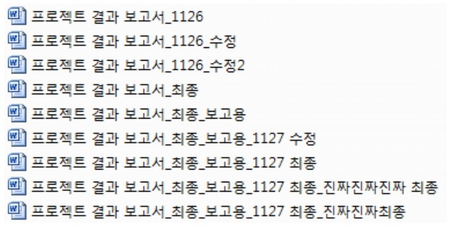
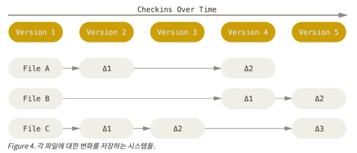
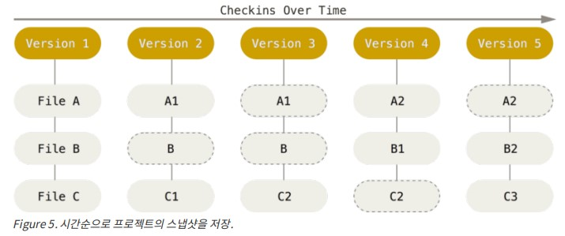
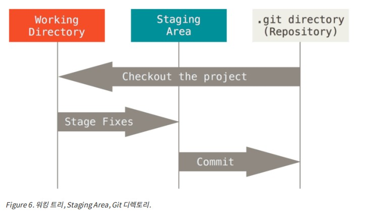

[TOC]

# Git VCS

reference: *ProGit – Everything You Need to Know About Git* by Chacon and Straub https://git-scm.com/book/en/v2

한글판: https://git-scm.com/book/ko/v2


## 1. Git 이란?

 

위와 같은 경험이 있다면 VCS(Version Control System)이 얼마나 중요한지 인지하고 있을 것입니다.


### VCS란? 

시간이 지남에 따라 파일의 변경 사항을 기록하는 시스템.

**백업**, **분기 개발**, **협력 개발**, **버전 관리** 를 위해 사용됩니다.


### Github

원래 Git은 리눅스 커널의 버전 관리를 위해 제작되었지만 이제는 어떠한 공동작업을 위해서도 사용될 수 있습니다.

- Github https://github.com
- Github Education:  https://education.github.com/


### Why Git?

개념적으로 대부분의 다른 시스템은 정보를 **파일 기반 변경 목록**으로 저장합니다. 이러한 다른 시스템 (CVCS, Subversion, Perforce, Bazaar 등)은 파일 세트로 저장 한 정보와 시간이 지남에 따라 각 파일에 대한 변경 사항을 생각합니다 (일반적으로 델타 기반 버전 제어라고합니다).

 


대신 Git은 데이터를 **일련의 스냅샷**처럼 생각합니다. Git을 사용하면 프로젝트 상태를 커밋하거나 저장할 때마다 Git은 기본적으로 해당 시점의 모든 파일을 캡처하고 해당 스냅샷에 대한 참조를 저장합니다.

 한 프로젝트에 여러 파일이 있을 때, 모든 파일이 변경되지 않은 경우 Git은 모든 파일을 다시 저장하지 않고 변경되지 않은 파일에 대해선 이미 저장된 이전의 동일한 파일에 대한 링크만 제공합니다. Git은 데이터를 **스냅샷 스트림**처럼 생각합니다.

 


**장점 1**: 거의 모든 작업이 로컬이다.

Git의 대부분의 작업에는 로컬 파일과 리소스만 있으면 되기 때문에 (일반적으로) 네트워크가 필요하지 않습니다. 로컬에 프로젝트의 전체 히스토리가 있으므로 대부분의 작업은 거의 즉각적으로 처리되기 때문입니다. 

즉, 프로젝트 history를 탐색하기 위해 서버에 접속할 필요가 없습니다. 로컬 데이터베이스에서 직접 읽습니다. 한 달 전에 파일의 현재 버전과 파일 사이에 도입 된 변경 사항을 보려면 Git은 한 달 전에 파일을 조회하고 원격 서버에 요청하지 않고 로컬 차이 계산을 수행 할 수 있습니다.
 이는 오프라인 상태이거나 VPN을 사용하지 않아도 사용할 수 있음을 말합니다.


**장점 2**: 무결성

Git의 모든 것은 저장되기 전에 체크섬 된 다음 해당 체크섬에 의해 참조됩니다. 즉, 체크섬 없이는 파일이나 디렉토리의 내용을 변경할 수 없습니다. 
Git이 이 체크섬에 사용하는 메커니즘을 SHA-1 해시라고합니다. 이것은 16 진수 문자로 구성된 40자 문자열이며 Git의 파일 또는 디렉토리 구조의 내용을 기반으로 계산됩니다. SHA-1 해시는 다음과 같습니다.

 ` 24b9da6552252987aa493b52f8696cd6d3b00373`

실제로 Git은 파일 이름이 아니라 내용의 해시 값으로 데이터베이스에 모든 것을 저장합니다.


**장점 3**: 일반적으로 데이터**만** 추가

Git에서 작업을 수행하면 모든 작업이 Git 데이터베이스에만 데이터를 추가합니다. 스냅 샷을 Git에 커밋 한 후에는 데이터를 잃어버릴 수가 없습니다.
 우리가 일을 심각하게 망칠 위험없이 실험 할 수 있다는 것을 알기 때문에 Git은 이런 측면에 대해서 매우 혁신적입니다. Git이 데이터를 저장하는 방법과 손실 된 것으로 보이는 데이터를 복구 할 수있는 방법에 대한 자세한 내용은 Undoing Things를 참조하십시오.


#### Git의 동작 원리 

**\- The Three States**

* **modified**: 파일을 변경했지만 아직 데이터베이스에 커밋하지 않았음을 의미합니다.
* **staged**: 다음 커밋 스냅 샷으로 이동하기 위해 수정 된 파일을 현재 버전으로 표시했음을 의미합니다.
* **committed**: 데이터가 로컬 데이터베이스에 안전하게 저장됨을 의미합니다.


**\- The Three section**

- **Working Directory**:  Git 디렉토리에서 꺼내져 사용하거나 수정할 수 있도록 파일로 존재하게 됩니다. 

  사실 크게 보면 Working directory의 파일은 2가지 상태`(Tracked, Untracked)`가 있고 `Tracked`에서 3가지 상태가 있는 형식이다.

  - `Untracked`: 프로젝트 폴더에는 같이 있지만 Git에서 관리하지 않는 파일들이다. 주로 새로운 파일을 만들었을 때 Untracked으로 시작하며 Git이 관리해주기 위해선 `git add filename` 명령어로 `Tracked State`로 바꿀 수 있다. 
  - `Tracked`(git의 관리대상): 
    - Unmodified
    - Modified 

  

   처음 저장소를 Clone 하면 모든 파일은 `Tracked`이면서 `Unmodified` 상태이다. 파일을 Checkout 하고 나서 아무것도 수정하지 않았기 때문에 그렇다.

   마지막 커밋 이후 어떤 파일을 수정하면 Git은 그 파일을 `Modified` 상태로 인식한다. 

   `Modified` 상태의 파일을 `commit` 하기 위해서는 `Staged` 상태에 진입을 해야한다. 왜냐하면 `Staged` 상태에 있는 파일들만 `commit` 을 할 수 있게 되어있기 때문이다.

  이 때 `Modified` 상태에 있는 파일을 `Staged` 상태로 만드려면 `git add filename` 명령어를 사용한다.

  

  그 후에 `Staged` 상태의 파일들을 `git commit` 명령어로 `.git directory` 에 저장하고 `Unmodified` 상태로 되돌아간다. 

  이것이 Git의 Commit Cycle이다.

   

  

- **Staging Area**: working directory에서 commit 시킬 파일들이 모여 있는 단계
- **.git(repository)**: Git이 프로젝트의 메타 데이터와 객체 데이터베이스를 저장하는 곳입니다. 이 곳에서 working directory로 데이터를 꺼내 코드를 수정하거나 추가합니다. 다른 컴퓨터에서 저장소를 복제 할 때 복사되는 부분입니다. 


**\- Work Flow**

1. Working Directory에서 파일을 수정합니다. 
2. 다음 커밋에 포함시킬 변경 사항만 선택적으로 준비합니다.  (staging area에 저장)
3. 커밋을 수행하면 staging area에있는 그대로 파일을 가져 와서 Git 디렉토리에 영구적으로 해당 스냅 샷을 저장합니다.


 (Unmodified -> Modified,  코드수정)            (Staged , git add filename)                    (Unmodified, git commit) 

 


#### Git 설치와 설정

- 설치: https://git-scm.com/downloads

- 설정

  - 설정 파일
    - `/etc/gitconfig`: 시스템에 있는 모든 유저에 대한 설정
    - `~/.gitconfig` : 특정한 유저에 대한 설정
    - `.git/config`: 특정한 프로젝트에 대한 설명
  - 설정 명령어

  ```bash
  git config --list --show-origin
  git config --global user.name "John Doe"
  git config --global user.email "johndoe@example.com"
  ```


## 2. Git Basics

### Git 저장소 만들어보기

- Local Directory를 git 저장소로 만들기

우선 git repository로 만들고 싶은 폴더로 이동해 아래의 명령어를 입력합니다.

```bash
git init
```

필요한 모든 리포지토리 파일 (Git 리포지토리 스켈레톤)이 포함 된 `.git`라는 새 하위 디렉토리가 생성됩니다. 이 시점에서 프로젝트의 어떤 것도 아직 추적되지 않습니다


빈 파일이 아닌 기존 파일의 버전 제어를 시작하려면 해당 파일 추적을 시작하고 초기 커밋을 수행해야합니다.

```bash
git add README.md // README.md를 지정
git commit -m "initial commit" // inital commit이라는 커밋 메세지와 함께 커밋
```

 이제 추적된 파일과 초기 커밋이있는 Git 리포지토리가 있습니다. 이 결과에 대해선 나중에 다룹시다.


- git 레파지토리를 clone해서 git 저장소 만들기

기존 Git 저장소 (예 : 기여하려는 프로젝트)의 사본을 얻으려면 git clone 명령이 필요합니다. Subversion과 같은 다른 VCS 시스템에 익숙한 경우 명령이 "checkout"이 아니라 "clone"인 것을 알 수 있습니다. 

Git은 서버에 있는 거의 모든 데이터의 전체 사본을 받습니다. git clone을 실행하면 프로젝트 히스토리에 대한 모든 파일의 모든 버전이 기본적으로 얻을 수 있습니다.  


git clone <url>을 사용하여 리포지토리를 복제합니다. 

예를 들어 libgit2라는 Git 연결 라이브러리를 복제하려는 경우 다음과 같이 할 수 있습니다.

```bash
git clone https://github.com/libgit2/libgit2
```

그러면 libgit2라는 디렉토리가 생성되고 그 안에 .git 디렉토리가 초기화되고 해당 리포지토리의 모든 데이터가 풀다운되고 최신 버전의 작업 복사본이 체크 아웃됩니다. 


libgit2 이외의 다른 디렉토리에 저장소를 복제하려는 경우 새 디렉토리 이름을 추가 인수로 지정할 수 있습니다. 

```bash
git clone https://github.com/libgit2/libgit2 mylibgit
```

mylibgit 이 명령은 이전 명령과 동일하지만 다운로드 된 폴더의 이름은 mylibgit입니다. 

또한 Git에는 사용할 수있는 다양한 전송 프로토콜이 있습니다. 이 예제는 https 프로토콜을 사용하지만 SSH 전송 프로토콜을 사용하는 git : // 또는 user @ server : path / to / repo.git도 볼 수 있습니다. 이는 추후에 다룹니다.


### Git 파일 상태 관리

#### -`.gitignore`: 파일 무시하기

어떤 파일은 Git이 관리할 필요가 없다. 보통 로그 파일이나 빌드 시스템이 자동으로 생성한 파일이 그렇다. 그런 파일을 무시하려면 .gitignore 파일을 만들고 그 안에 무시할 파일 패턴을 적는다. 아래는 .gitignore 파일의 예이다.

  1. 패턴

      • 아무것도 없는 라인이나, `#`로 시작하는 라인은 무시한다.

      • 표준 Glob 패턴(정규표현식을 단순하게 만든 것)을 사용한다.

      • 슬래시(/)로 시작하면 하위 디렉토리에 적용되지(Recursivity) 않는다. 

      • 디렉토리는 슬래시(/)를 끝에 사용하는 것으로 표현한다.

      • 느낌표(!)로 시작하는 패턴의 파일은 무시하지 않는다.

2. 예시 ( https://github.com/github/gitignore )

```python
# 확장자가 .a인 파일 무시
*.a

# 윗 라인에서 확장자가 .a인 파일은 무시하게 했지만 lib.a는 무시하지 않음 
!lib.a

# 현재 디렉토리에 있는 TODO파일은 무시하고 subdir/TODO처럼 하위디렉토리에 있는 파일은 무시하지 않음
/TODO

# build/ 디렉토리에 있는 모든 파일은 무시 
build/

# doc/notes.txt 파일은 무시하고 doc/server/arch.txt 파일은 무시하지 않음 
doc/*.txt

# doc 디렉토리 아래의 모든 .pdf 파일을 무시 
doc/**/*.pdf
```


#### -`git status`: status  확인하기

Clone 한 후에 바로 `git status` 명령을 실행하면 아래과 같은 메시지를 볼 수 있다.

```bash
$ git status
On branch master
Your branch is up-to-date with 'origin/master'. 
nothing to commit, working directory clean //  Tracked 파일은 하나도 수정되지 않았다
```


새로운 README라는 파일을 하나 만들어 보자

```bash
$ echo 'My Project' > README
$ git status
On branch master
Your branch is up-to-date with 'origin/master'. 
Untracked files:
(use "git add <file>..." to include in what will be committed)
		
		README

nothing added to commit but untracked files present (use "git add" to track)
```

README 파일이 untracked files: 라고 알려준다.


Cf> 간단한 내용만으로 현재 status 표시하기

: `git status -s or --short`

```bash
 $ git status -s M README
MM Rakefile 
A lib/git.rb
M lib/simplegit.rb 
?? LICENSE.txt
```

\- M: 수정된 파일

\- A: 추적하는 새로 추가된 파일

\- ??: 아직 추적하지 않는 새 파일 

문자가 두개 일 때: 왼쪽 - staging area, 오른쪽 - working tree


#### - status에 관한 모든 것

##### 1. `git add <argument>`

`git add` 명령어의 용도는 두 개 이다.

첫째, `Untracked`을 `git add`를 사용하여 `Tracked` 로 변경할 수 있다.

```bash
$ git add README

$ git status
On branch master
Your branch is up-to-date with 'origin/master'. 
Changes to be committed:
	(use "git reset HEAD <file>..." to unstage) 

	new file: README
```

`git status`를 사용하여 위와 같은 결과를 얻었다.

`git add` 명령은 파일 혹은 디렉토리를 \<argument>로 받으며, 디렉토리인 경우 재귀적으로 하위 파일까지 모두 추가한다.


두번째, `Tracked` 파일의 수정 내용을 `Staged` 상태에 추가할 수 있다.

아래는 파일을 수정만 했을 때의 상태이다.

``` bash
$ git status
On branch master
Your branch is up-to-date with 'origin/master'. 
Changes to be committed:
(use "git reset HEAD <file>..." to unstage) 

	new file: README

Changes not staged for commit:
(use "git add <file>..." to update what will be committed) 
(use "git checkout -- <file>..." to discard changes in working directory)

	modified: CONTRIBUTING.md
```

수정은 되었지만 not staged 상태로 커밋을 하지 못하는 상태로 남아 있다. 

`git add CONTRIBUTING.md`를 사용하여 staged로 status를 바꿔줄 수 있다.

```bash
$ git add CONTRIBUTING.md
$ git status
On branch master
Your branch is up-to-date with 'origin/master'. 
Changes to be committed:
(use "git reset HEAD <file>..." to unstage)

	new file: README 
	modified: CONTRIBUTING.md
```

여기서 `CONTRIBUTING.md`를 한번 더 수정한다면 어떻게 될까?

```bash
$ vim CONTRIBUTING.md
$ git status
On branch master
Your branch is up-to-date with 'origin/master'. 
Changes to be committed:
(use "git reset HEAD <file>..." to unstage)

	new file: README modified: CONTRIBUTING.md

Changes not staged for commit:
(use "git add <file>..." to update what will be committed) 
(use "git checkout -- <file>..." to discard changes in working directory)

	modified: CONTRIBUTING.md

```

`git commit`을 실행하는 시점의 버전이 커밋되는 것이 아니라 마지막으로 `git add` 명령을 실행했을 때의 버전이 커밋되기 때문이다. 따라서 변경사항이 있다면 다시 `git add`로 추가를 해주어야 한다. 


##### 2. `git diff`: status 비교  및 변경내용 보기

Working Directory에 있는 것과 Staging Area에 있는 것을 비교한다. 즉, 수정하고 아직 Stage 하지 않은 것을 보여준다.

```bash
$ git diff

diff --git a/CONTRIBUTING.md b/CONTRIBUTING.md
index 8ebb991..643e24f 100644
--- a/CONTRIBUTING.md
+++ b/CONTRIBUTING.md
@@ -65,7 +65,8 @@ branch directly, things can get messy.
   Please include a nice description of your changes when you submit your PR;

if we have to read the whole diff to figure out why you're contributing in the first place, you're less likely to get feedback and have your change
-merged in.
+merged in. Also, split your changes into comprehensive chunks if your patch is
+longer than a dozen lines.
   If you are starting to work on a particular area, feel free to submit a PR
that highlights your work in progress (and note in the PR title that it's ...
```

마지막으로 커밋한 후에 수정한 것들 전부를 보여주지 않는다. `git diff` 는 **Unstaged 상태인 것**들만 보여준다. 


###### `--staged or --cached` 옵션 : staged 상태의 수정된 내용을 보고 싶을 때 사용한다.

즉, **저장소에 커밋한 것과 Staging Area에 있는 것을 비교**한다.

```bash
 $ git diff --staged
diff --git a/README b/README new file mode 100644
index 0000000..03902a1
--- /dev/null
+++ b/README
@@ -0,0 +1,4 @@
+My Project
```


##### 3. `git commit`: 변경 사항을 `.git` 폴더에 저장하기

```bash
$ git commit
```

커밋을 실행하면 Git 설정에 지정된 편집기가 실행되고, 아래와 같은 텍스트가 자동으로 포함된다.

```vis
# Please enter the commit message for your changes. Lines starting
# with '#' will be ignored, and an empty message aborts the commit. # On branch master
# Your branch is up-to-date with 'origin/master'.
  # Changes to be committed:
  # new file:
#   modified:
#
~
~
~
README CONTRIBUTING.md
".git/COMMIT_EDITMSG" 9L, 283C
```

자동으로 생성되는 커밋 메시지의 첫 라인은 비어 있고 둘째 라인부터 `git status` 명령의 결과가 채워진다. 커밋한 내용을 쉽게 기억할 수 있도록 이 메시지를 포함할 수도 있고 메시지를 전부 지우고 새로 작성할 수 있다 (정확히 뭘 수정했는지도 보여줄 수 있는데, `git commit` 에 `-v` 옵션을 추가하면 편집기에 diff 메시지도 추가된다). 내용을 저장하고 편집기를 종료하면 Git은 입력된 내용 (#로 시작하는 내용을 제외한)으로 새 커밋을 하나 완성한다.


###### `-m` 옵션: 커밋 인라인 메시지 추가

```bash
$ git commit -m "Story 182: Fix benchmarks for speed" 

// (master) 브랜치에 커밋했고 체크섬은 (463dc4f)이다
[master 463dc4f] Story 182: Fix benchmarks for speed 

//수정한 파일이 2개이고 삭제됐거나 추가된 라인이 몇 라인인지 알려준다.
   2 files changed, 2 insertions(+)
   create mode 100644 README
```

`-m`옵션을 사용하여 편집기를 열지 않고 바로 커밋메시지를 첨부하여 커밋할 수 있다.


###### `-a`옵션: staging Area 생략하기

`-a` 옵션을 추가하면 Git은 Tracked 상태의 파일을 자동으로 Staging Area에 넣는다.  `git add` 명령을 실행하는 수고를 덜 수 있다.

```bash
$ git commit -a -m 'added new benchmarks'
[master 83e38c7] added new benchmarks
1 file changed, 5 insertions(+), 0 deletions(-)
```


##### 4. `git rm`: 파일 삭제하기

Git에서 파일을 제거하려면 git rm 명령으로 Tracked 상태의 파일을 삭제한 후에(정확하게는 Staging Area에서 삭제하는 것) 커밋해야 한다. 이 명령은 워킹 디렉토리에 있는 파일도 삭제하기 때문에 실제로 파일도 지워진다.

Git 명령을 사용하지 않고 단순히 워킹 디렉터리에서 파일을 삭제하고 git status 명령으로 상태를 확인하면 Git은 현재 "Changes not staged for commit"(즉, Unstaged 상태)라고 표시해준다.

```bash
$ rm grit.gemspec
$ git status
On branch master
Your branch is up-to-date with 'origin/master'. 
Changes not staged for commit:
(use "git add/rm <file>..." to update what will be committed)
(use "git checkout -- <file>..." to discard changes in working directory)
deleted: grit.gemspec
no changes added to commit (use "git add" and/or "git commit -a")
```


그리고 git rm 명령을 실행하면 삭제한 파일은 Staged 상태가 된다.

```bash
$ git rm grit.gemspec
rm 'grit.gemspec'
$ git status
On branch master
Changes to be committed:
(use "git reset HEAD <file>..." to unstage) 

	deleted: grit.gemspec
```


###### `--cached` 옵션: Working directory에는 남기고 staging area에서만 삭제하기

하드디스크에 있는 파일은 그대로 두고 Git만 추적하지 않게 한다. 이것은 .gitignore 파일에 추가하는 것을 빼먹었거나 대용량 로그 파일이나 컴파일된 파일인 .a 파일 같은 것을 실수로 추가했을 때 쓴다. --cached 옵션을 사용하여 명령을 실행한다.

```bash
$ git rm --cached README.md
```


##### 5. `git mv`: 파일 이름 변경하기

```bash
$ git mv README.md README
$ git status
On branch master
Your branch is up-to-date with 'origin/master'. 
Changes to be committed:
(use "git reset HEAD <file>..." to unstage) 

	renamed: README.md -> README

```


##### 6. `git log`: 커밋 기록 확인하기

특별한 아규먼트 없이 git log 명령을 실행하면 저장소의 커밋 히스토리를 시간순으로 보여준다. 즉, 가장 최근의 커밋이 가장 먼저 나온다. 그리고 이어서 각 커밋의 SHA-1 체크섬, 저자 이름, 저자 이메일, 커밋한 날짜, 커밋 메시지를 보여준다.

```bash
 $ git log
commit ca82a6dff817ec66f44342007202690a93763949 
Author: Scott Chacon <schacon@gee-mail.com> 
Date: Mon Mar 17 21:52:11 2008 -0700
      
      changed the version number // commit message
      
commit 085bb3bcb608e1e8451d4b2432f8ecbe6306e7e7 
Author: Scott Chacon <schacon@gee-mail.com> 
Date: Sat Mar 15 16:40:33 2008 -0700

      removed unnecessary test
      
commit a11bef06a3f659402fe7563abf99ad00de2209e6 
Author: Scott Chacon <schacon@gee-mail.com> 
Date: Sat Mar 15 10:31:28 2008 -0700

			first commit
```


###### `-p -n` 옵션: n개 커밋의 diff 결과를 보여준다. 

###### `-stat` 옵션

###### `-pretty` 옵션: format 옵션과 같이 사용

이 부분은 too much 해서 패스

###### `--since, --until` 옵션: 기간 제한 커밋기록 확인


###### `--amend` 옵션: 커밋 덮어쓰기

종종 완료한 커밋을 수정해야 할 때가 있다. 너무 일찍 커밋했거나 어떤 파일을 빼먹었을 때 그리고 커밋 메시지를 잘못 적었을 때 한다. 다시 커밋하고 싶으면 --amend 옵션을 사용한다.

```bash
$ git commit -m 'initial commit' 
$ git add forgotten_file
$ git commit --amend
```


##### *7. `git reset`: 파일 상태를 Unstage로 변경하기

```bash
$ git reset HEAD <file>
```

reset은 다음에 더욱 깊게 알아보자.


##### *8. `git checkout -- [file]`: 수정한 파일을 되돌리기

```bash
$ git checkout --CONTRIBUTING.md
```

이 명령은 꽤 위험한 명령이라는 것을 알아야 한다. 원래 파일로 덮어썼기 때문에 수정한 내용은 전부 사라진다. 수정한 내용이 진짜 마음에 들지 않을 때만 사용하자.

변경한 내용을 쉽게 버릴수는 없고 하지만 당장은 되돌려야만 하는 상황이라면 Stash와 Branch를 사용하자. Git 브랜치에서 다루는 이 방법들이 훨씬 낫다.

 Git으로 커밋한 모든 것은 언제나 복구할 수 있다. 삭제한 브랜치에 있었던 것도, --amend 옵션으로 다시 커밋한 것도 복구할 수 있다(자세한 것은 데이터 복구 에서 다룬다). 하지만 커밋하지 않고 잃어버린 것은 절대로 되돌릴 수 없다.


### 리모트 저장소 (remote repository)

리모트 저장소를 관리할 줄 알아야 다른 사람과 함께 일할 수 있다. 간단히 말해서 다른 사람들과 함께 일한다는 것은 리모트 저장소를 관리하면서 데이터를 거기에 Push 하고 Pull 하는 것이다. 리모트 저장소를 관리한다는 것은 저장소를 추가, 삭제하는 것뿐만 아니라 브랜치를 관리하고 추적할지 말지 등을 관리하는 것을 말한다.


#### - `git remote`: 리모트 저장소 확인

현재 프로젝트에 등록된 리모트 저장소를 확인할 수 있다. 이 명령은 리모트 저장소의 단축 이름을 보여준다. 저장소를 Clone 하면 **origin**이라는 리모트 저장소 이름이 자동으로 aliasing되기 때문에 **origin**이라는 이름을 볼 수 있다.

여기서 **origin**은 `https://github.com/schacon/ticgit` 을 짧게 줄여쓴거라고 할 수 있다.

##### `-v` 옵션: 단축이름과 URL을 함께보기

```bash
$ git remote -v
 origin https://github.com/schacon/ticgit (fetch) 
 origin https://github.com/schacon/ticgit (push)
```


#### - `git remote add [단축이름] url`: 리모트 저장소 추가

기존 워킹 디렉토리에 새 리모트 저장소를 추가하는 것

```bash
 $ git remote
origin

// URL 대신 doong 이라는 이름을 사용할 수 있다.
$ git remote add doong https://github.com/doooooooong/boj_practice
$ git remote -v
origin https://github.com/doooooooong/boj_practice (fetch) 
origin https://github.com/doooooooong/boj_practice (push)
doong https://github.com/doooooooong/boj_practice (fetch)
doong https://github.com/doooooooong/boj_practice (push)
```


#### - `git fetch [remote-name]`: 리모트 저장소에서 파일 가져오기

로컬에는 없지만, 리모트 저장소에는 있는 데이터를 모두 가져온다. 그러면 리모트 저장소의 모든 **브랜치**를 로컬에서 접근할 수 있어서 언제든지 Merge를 하거나 내용을 살펴볼 수 있다.

```bash
$ git fetch doong
remote: Counting objects: 43, done.
remote: Compressing objects: 100% (36/36), done. remote: Total 43 (delta 10), reused 31 (delta 5) Unpacking objects: 100% (43/43), done.
From https://github.com/doooooooong/boj_practice
* [new branch] master -> doong/master 
```

저장소를 Clone 하면 명령은 자동으로 리모트 저장소를  `origin`이라는 이름으로 추가한다. 그래서 나중에 ` git fetch origin` 을 실행하면 Clone 한 이후에(혹은 마지막으로 가져온 이후에) 수정된 것을 모두 가져온다. `git fetch` 는 리모트 저장소의 데이터를 모두 로컬로 가져오지만, ==자동으로 Merge 하지 않는다.== 그래서 로컬에서 하던 작업을 정리하고 나서 수동으로 Merge 해야 한다.


#### - `git pull origin [branch]`: 리모트 저장소에서 파일 가져오고 자동으로 합치기

  `git pull` 명령으로 리모트 저장소 브랜치에서 데이터를 가져올 뿐만 아니라 **자동으로 로컬 브랜치와 Merge 시킬 수 있다**. 

먼저 `git clone` 명령은 자동으로 로컬의 master 브랜치가 리모트 저장소의 master 브랜치를 추적하도록 한다. 그리고 `git pull`은 Clone 한 서버에서 데이터를 가져오고 그 데이터를 자동으로 현재 작업하는 코드와 Merge 시킨다.


#### - `git push origin [branch]`: 리모트 저장소에 저장하기

이 명령은 Clone 한 리모트 저장소에 쓰기 권한이 있고, Clone 하고 난 이후 아무도 Push 하지 않았을 때만 사용할 수 있다. 다시 말해서 Clone 한 사람이 여러 명 있을 때, 다른 사람이 Push 한 후에 Push 하려고 하면 Push 할 수 없다. 먼저 다른 사람이 작업한 것을 가져와서 Merge 한 후에 Push 할 수 있다. Git 브랜치 에서 서버에 Push 하는 방법에 대해 자세히 설명할 것이다.


#### - `git remote show [remote-name]`: 리모트 저장소 살펴보기

리모트 저장소의 URL과 추적하는 브랜치를 출력한다.

```bash
$ git remote show origin
  * remote origin
Fetch URL: https://github.com/schacon/ticgit Push URL: https://github.com/schacon/ticgit HEAD branch: master
Remote branches:
      master                               tracked
dev-branch tracked Local branch configured for 'git pull':
master merges with remote master Local ref configured for 'git push':
      master pushes to master (up to date)
```


#### - `git remote rename [기존 remote-name][바꿀 remote-name]`: 리모트 이름 바꾸기

```bash
 $ git remote rename pb paul
 
 // show current remote
 $ git remote
 origin
 paul
```


#### - `git remote remove(or rm) [remote-name]`: 리모트 저장소 삭제

리모트 저장소를 삭제해야 한다면 `git remote remove` 나 `git remote rm` 명령을 사용한다. 

서버 정보가 바뀌었을 때, 더는 별도의 미러가 필요하지 않을 때, 더는 기여자가 활동하지 않을 때 필요하다.

```bash
 $ git remote remove paul
 $ git remote
 origin
```


### 태그

보통 릴리즈할 때 사용한다(v1.0, 등등). 

#### - `git tag`: 태그 조회하기

```bash
$ git tag 
v0.1
v1.3
```

#####  cf> 특정 버전 조회하기

`git tag -l "v1.x.x*"`: 1.x.x 버전 모두 검색하기


#### - 태그 붙이기

Git의 태그는 Lightweight 태그와 Annotated 태그로 두 종류가 있다. 일반적으로 Annotated 태그를 만들어 이 모든 정보를 사용할 수 있도록 하는 것이 좋다. 하지만 임시로 생성하는 태그거나 이러한 정보를 유지할 필요가 없는 경우에는 Lightweight 태그를 사용할 수도 있다.


#####  o Annotated Tag (`-a option`)

Annotated 태그는 Git 데이터베이스에 태그를 만든 사람의 이름, 이메일과 태그를 만든 날짜, 그리고 태그 메시지도 저장한다. GPG(GNU Privacy Guard)로 서명할 수도 있다.

```bash
$ git tag -a v1.4 -m "my version 1.4" // -m option은 커밋메세지를 한번에 저장하는 역할
$ git tag
v0.1
v1.3
v1.4

// 태그 확인하기
$ git show v1.4
tag v1.4
Tagger: Ben Straub <ben@straub.cc> Date: Sat May 3 20:19:12 2014 -0700

my version 1.4

commit ca82a6dff817ec66f44342007202690a93763949 
Author: Scott Chacon <schacon@gee-mail.com> 
Date: Mon Mar 17 21:52:11 2008 -0700

	changed the version number
```


#####  o Lightweight Tag

 Lightweight 태그는 브랜치와 비슷한데 브랜치처럼 가리키는 지점을 최신 커밋으로 이동시키지 않는다. 단순히 특정 커밋에 대한 포인터일 뿐이다. 즉 Lightweight 태그는  파일에 커밋 체크섬을 저장하는 것뿐이다. 다른 정보는 저장하지 않는다. Lightweight 태그를 만들 때는 `-a, -s, -m` 옵션을 사용하지 않는다.

```bash
$ git tag v1.4-lw 

// tag search
$ git tag
v0.1
v1.3
v1.4 v1.4-lw v1.5

// 태그 확인하기
$ git show v1.4-lw
commit ca82a6dff817ec66f44342007202690a93763949 
Author: Scott Chacon <schacon@gee-mail.com> 
Date: Mon Mar 17 21:52:11 2008 -0700

      changed the version number
```


#### - 태그 공유하기

git push 명령은 자동으로 리모트 서버에 태그를 전송하지 않는다. 태그를 만들었으면 서버에 별도로 Push 해야 한다. 브랜치를 공유하는 것과 마찬가지로 `git push origin [태그 이름]`로 가능하다.

```bash
$ git push origin v1.5

Counting objects: 14, done.
Delta compression using up to 8 threads.
Compressing objects: 100% (12/12), done.
Writing objects: 100% (14/14), 2.05 KiB | 0 bytes/s, done. 
Total 14 (delta 3), reused 0 (delta 0)
To git@github.com:schacon/simplegit.git
	* [new tag] v1.5 -> v1.5
```

##### `--tags`: 한꺼번에 여러 개의 태그 공유하기

```bash
$ git push origin --tags

Counting objects: 1, done.
Writing objects: 100% (1/1), 160 bytes | 0 bytes/s, done. 
Total 1 (delta 0), reused 0 (delta 0)
To git@github.com:schacon/simplegit.git
	* [new tag] v1.4 -> v1.4
	* [new tag] v1.4-lw -> v1.4-lw
```


### Git Alias

자주 사용하는 긴 명령어를 Alias로 만들어 간편하게 쓰는 방법이다. 사용법은 아래와 같다.


#### - `git config`: alias 만들기

``` bash
$ git config --global alias.co checkout // co만 입력해도 checkout으로 알아듣게 해주세요
$ git config --global alias.br branch		// br만 입력해도 branch로 알아듣게 해주세요
$ git config --global alias.ci commit		// ci만 입력해도 commit으로 알아듣게 해주세요
$ git config --global alias.st status		// st만 입력해도 status로 알아듣게 해주세요
```


