# GitHub

:가장 큰 Git 저장소 호스트

 Git 저장소를 GitHub에 만들어 운영하는 비율이 높으며,  많은 오픈 소스 프로젝트는 GitHub을 이용해서 Git 호스팅, 이슈 트래킹, 코드 리뷰, 등등의 일을 한다. 


---

### 계정 만들고 설정하기

##### 무료계정 만들기

https://github.com에 방문해서 사용자이름과 이메일 주소, 암호를 입력하고 ‘`Sign up for GitHub’'이라는 큰 녹색 버튼을 누른다.

##### SSH 사용하기

:간단히 말하면, ssh key 를 이용하면 GitHub에 접속하려고 할때마다 username이나 pssword를 제공하지 않아도 되는 것

SSH 리모트를 쓰려면 공개키를 설정해야 한다. 

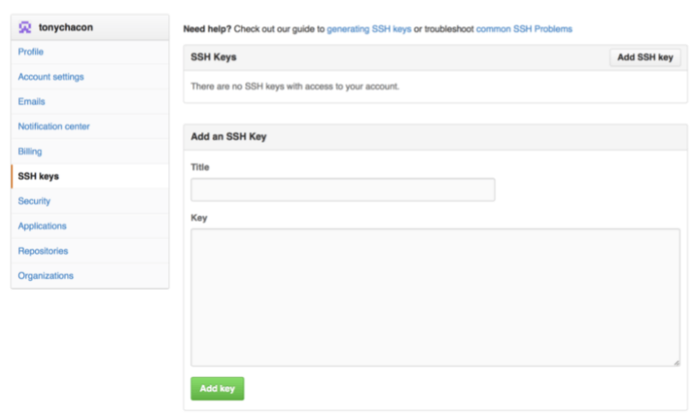

오른쪽 위의 계정 아이콘을 누른 뒤,  SSH keys를 누르고, “Add an SSH key” 버튼을 클릭한다. 키 이름을 적당히 입력하고 ~/.ssh/id_rsa.pub 파일의 내용을 입력 칸에 복사해 넣는다. 그리고 “Add key” 버튼을 클릭한다. 

##### 사용자 이메일 주소

GitHub는 Git 커밋에 있는 이메일 주소를 보고 어떤 사용자인지 식별한다. GitHub에 이메일을 모두 등록하기만 했으면 여러 이메일을 사용해도 GitHub는 잘 처리 한다.

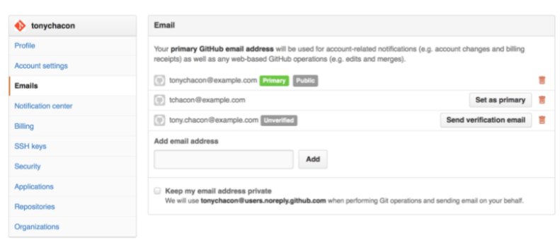

저장소의 커밋 메시지에 이 주소 세 개 중 하나라도 있으면 GitHub가 해당 사용자 계정 페이지로 링크를 걸어준다.

##### 투팩터 인증

더 안전한 보안(암호를 도둑맞았을 때 위험을 완화하기 위해 사용)을 위해서 “2FA”(투팩터 인증)을 설정하는 것으로,  2FA는 최근 들어 인기가 높아지는 인증 메커니즘이다. 

2FA를 활성화 시키면 GitHub에 로그인 할 때 인증수단이 두 가지 필요하다(역주 - 기존 로그인 방식에 OTP나 SMS를 추가). 둘 중 한 가지 방법만 뚫려서는 공격자가 계정에 접근할 수 없다. 2FA 설정 화면은 계정 설정 페이지의 Security 탭에 있다.


---

### GitHub 프로젝트에 기여하기

##### 프로젝트 Fork하기(Fork버튼을 누른다)

'Fork'하면 GitHub가 프로젝트를 통째로 복사해준다. 이 경우에는 사람들을 프로젝트에 추가하고 Push 권한을 줘야 할 필요가 없고, Push 한 변경 내용을 원래 프로젝트에 추가하고 싶다면, 기존의 저장소로 보내 기여를 해야하는데,  이것을 Pull Request라고 부른다.

즉, 프로젝트 소유자의 마음에 들 때까지 소유자와 기여자는 함께 토론한다. 마음에 들게 되면 Merge 한다.

##### GitHub 플로우

토픽 브랜치: 토픽 브랜치는 어떤 한 가지 주제나 작업을 위해 만든 짧은 호흡의 브랜치다. 

1.master 에서 토픽 브랜치를 만든다. 

2.뭔가 수정해서 커밋한다. 

3.자신의 GitHub 프로젝트에 브랜치를 Push 한다. 

4.GitHub에 Pull Request를 연다. 

5.토론하면서 그에 따라 계속 커밋한다. 

6.프로젝트 소유자는 Pull Request를 Merge 하고 닫는다. 


##### Pull Request 만들기

자신의 레파지토리로 Fork하기 -> git clone을 로컬에 clone 한후 토픽 브랜치 만듦 -> 코드를 수정하고 나서 Github에 다시 push ->  그 후 저장소에서 Pull Request 녹색버튼 클릭 ->왜 고쳤는지 설명하고, 설득 -> 관리자가 맘에 들면 Merge한다.

서로 코멘트를 달면서 최종 Merge하기 까지 계속 토론을 한다. 


##### Pull Request 팁

**Patch를 Pull Request로 보내기:** Pull Request의 Patch가 완벽하고 큐처럼 꼭 순서대로 적용돼야 한다고 생각하지 않는다. 즉 수정한 만큼만 해당 브랜치에 커밋하고 하던 일과 대화를 계속 해 나가면 된다.

**Pull Request를 최신으로 업데이트하기:** Pull Request가 만든 지 오래됐거나 깨끗하게 Merge 되지 않으면 메인테이너가 쉽게 Merge 할 수 있게 수정한다. 

Pull Request가 Merge 될 수 있도록 대상 브랜치를 Merge 하려면 먼저 원 저장소를 리모트로 추가한다. 그리고 나서 Fetch 하고 그 저장소의 대상 브랜치를 해당 토픽 브랜치에 Merge 한다. 

①원 저장소를 ‘`upstream’'이라는 이름의 리모트로 추가한다 

②리모트에서 최신 데이터를 Fetch 한다 

③대상 브랜치를 토픽 브랜치에 Merge 한다

④충돌을 해결한다

⑤동일한 토픽 브랜치에 도로 Push 한다 

**참조** :GitHub에 쓰기 가능한 곳 어디에서나 참조를 달 수 있다. 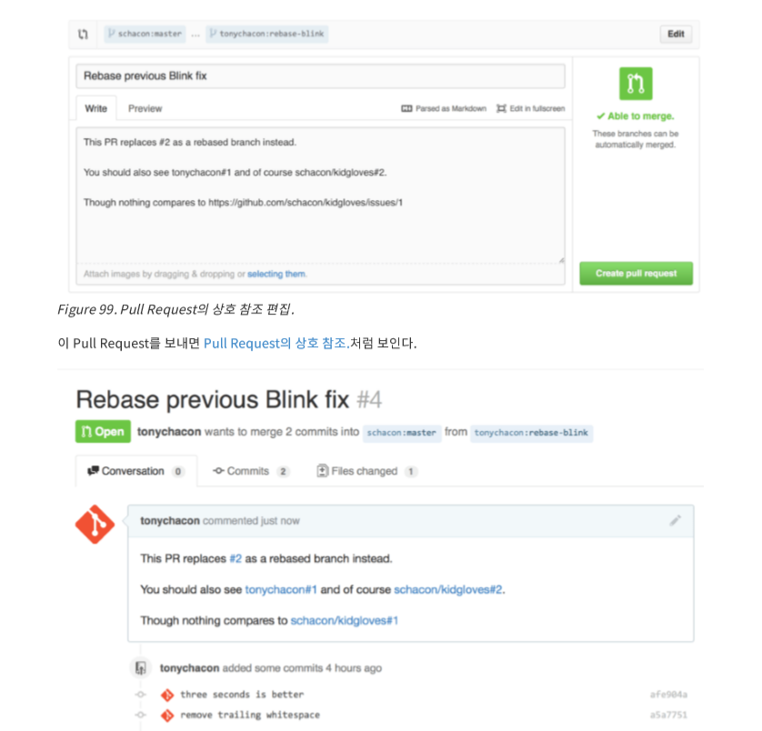

모든 Pull Request와 Issue에는 프로젝트 내에서 유일한 번호를 하나 할당한다. 예를 들어, 3인 Pull Request와 #3인 Issue는 동시에 있을 수 없다. `<num>`과 같은 형태로 코멘트가나 설명에 Pull Request와 Issue를 참조시킬 수 있다. 이 방법은 단일 프로젝트 범위에서만 유효하다. 

Fork 저장소의 Issue나 Pull Request를 참조시키려고 한다면 `username#<num>`라고 쓰고 아예 다른 저장소면 `username/repo#<num>`라고 써야 한다. 

##### Markdown

##### 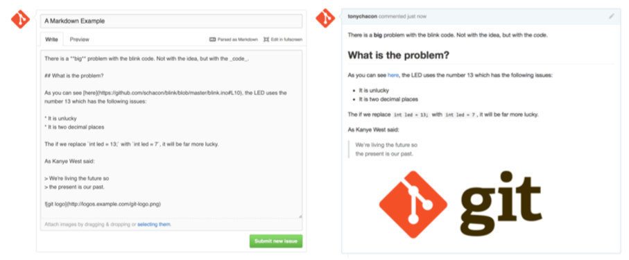

Markdown 형식으로 글을 쓰면 그냥 텍스트로 쓴 글이지만 형식을 갖춰 미끈하고 아름답게 렌더링된다. :fire:이모티콘:sparkles:, 체크리스트, 인용 문구 등 여러 방법이 있다. :eyes::sparkles:


> 인용 문구 
>
> "오늘은 기분이 좋다, 집에 얼릉 가고 싶다"

##### 오늘 해야할일:smile:

- [x] 고스트 과제하기 :cold_sweat:

- [x] 고스트 6시에 모임하기:eyes::sparkles:

- [ ] 놀고먹기:clap::tada:

  

### GitHub 프로젝트 관리하기

이번에는 직접 프로젝트를 운영하는 법을 살펴볼 차례다.

##### 새 저장소 만들기 

 대시보드 오른쪽에 있는 “New repository” 버튼을 클릭하면 저장소를 만드는 폼으로 이동한다. 맨 위 툴바의 사용자이름 옆에 있는 + 버튼을 클릭해도 된다.

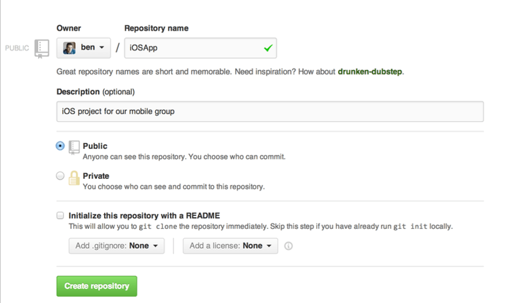

GitHub에 프로젝트를 올렸으면 다른 사람들에게 프로젝트 URL을 알려주고 공유할 수 있다. 

모든 프로젝트의 HTTP URL은 `https://github.com/<user>/<project_name>`처럼 생겼고 SSH는 ` git@github.com:<user>/<project_name>`처럼 생겼다.


##### 동료 추가하기

동료를 추가하려면 'Collaborator’로 추가해야 한다. 내 저장소에 Push 할 수 있도록 하고 싶으면 내 프로젝트에 GitHub 계정들을 추가해야 한다. 계정이 추가된 사람은 해당 프로젝트와 Git 저장소에  Push할 수 있을 뿐만 아니라 읽고 쓰기도 가능하다. 

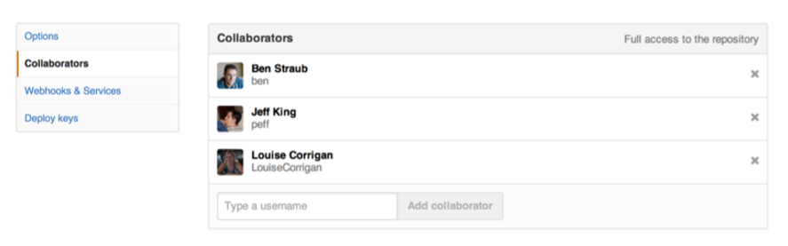

##### Pull Request 관리하기

이메일 알림 어떤 사람이 코드를 수정해서 Pull Request를 보내왔다. 그러면 새로운 Pull Request가 왔다는 메일이 담당자에게 간다. 

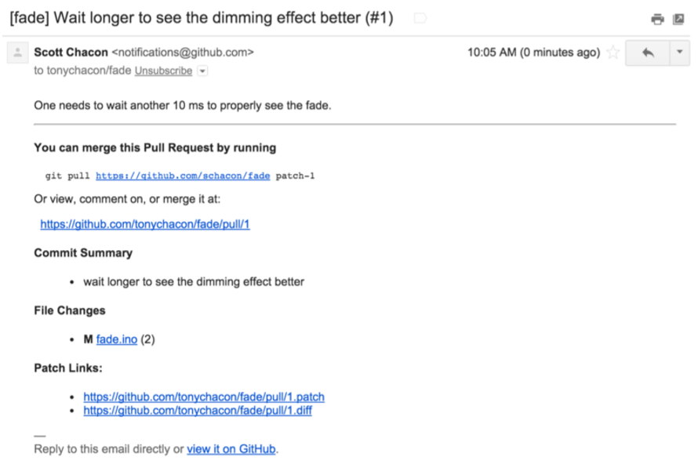

.diff 와 .patch URL은 Pull Request의 'Unified Diff’와 Patch 버전의 URL이다. 이 URL로 아래와 같이 Pull Request를 Merge 할 수 있다.

```
$ curl http://github.com/tonychacon/fade/pull/1.patch | git am
```

##### Pull Request로 함께 일하기

 GitHub 플로우에서 설명했듯이 Pull Request를 만든 사람과 토론할 수 있다. GFM을 사용하여 특정 커밋을 선택하거나, 특정 라인을 지정하거나, 혹은 전체 Pull Request 자체에도 코멘트를 남길 수 있다.


##### 특별한 파일

**README**: GitHub는 저장소 랜딩 페이지를 보여줄 때 README 파일을 이용해서 보여준다. README 파일 형식에 상관없이 잘 보여준다. 

많은 사람이 이 파일에 저장소나 프로젝트에 처음 방문한 사람들에게 필요한 정보를 정리해 둔다. 보통 아래와 같은 내용을 쓴다. 

•무슨 프로젝트인지 

•설정하고 설치하는 방법 

•사용법과 실행 결과에 대한 예제 

•프로젝트의 라이센스 

•기여하는 방법

GitHub는 README 파일을 렌더링하는 것이기 때문에 이미지나 외부 링크를 적어도 된다. 

**CONTRIBUTING**: GitHub는 CONTRIBUTING 파일도 인식한다. README와 마찬가지로 원하는 파일 형식을 사용하면 된다. Pull Request를 열 때 이 파일이 있으면 링크를 보여준다.

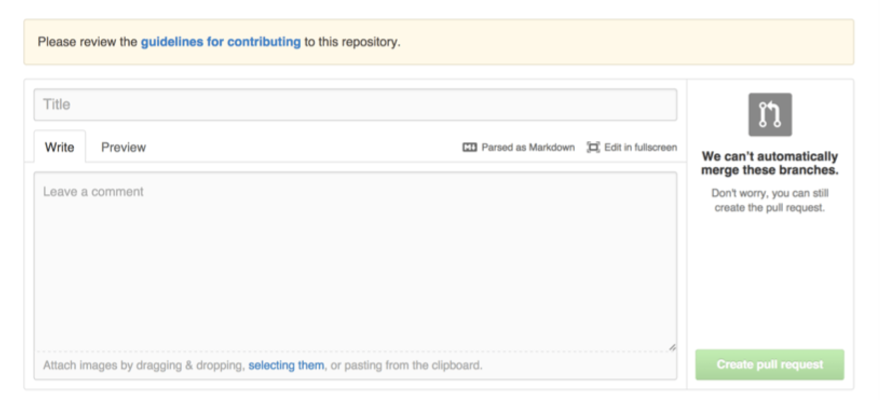

##### 프로젝트 관리 

**기본 브랜치 변경하기**: 기본 브랜치를 “master''말고 다른 브랜치로 설정할 수 있다. Pull Request를 열 때 설정한 기본 브랜치가 기본으로 선택된다. 기본 브랜치는 저장소 설정 페이지의 Options 탭에서 변경한다.


**프로젝트** **넘기기**: 프로젝트 소유자를 다른 사용자나 Organization으로 변경할 수 있다. 저장소 설정 페이지의 Options 탭을 보면 페이지 아래쪽에  Transfer ownership 항목이 있다. 여기 있는 Transfer 버튼으로 프로젝트를 넘길 수 있다.

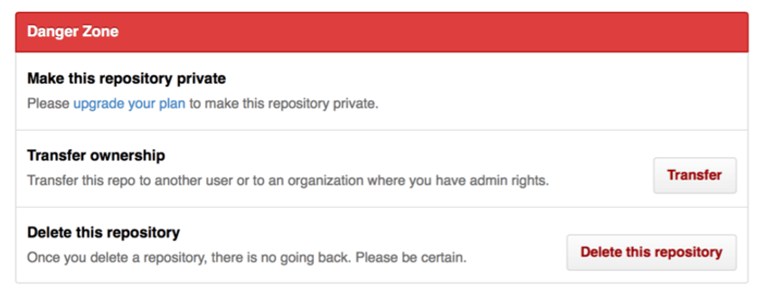


---

### Organization 관리하기

이 계정은 여러 명이 같은 프로젝트를 관리하는 데 사용하는 그룹 계정이고 사람들을 서브 그룹을 나누어 관리하는 도구도 있다. 이 계정은 “perl” 이나 “rails” 같은 오픈소스 그룹이나 “google” 이나 “twitter” 같은 회사가 사용한다.

##### Organization 기초 

 GitHub 페이지 오른쪽 위에 있는 “+” 아이콘을 클릭하고 메뉴에서 “New organization” 을 선택하면 된다.

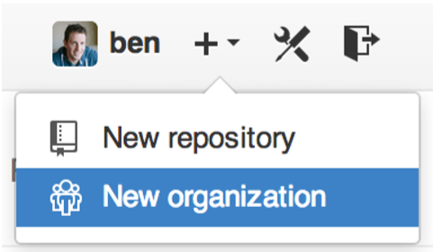

계정을 만들고 사람들을 초대하고, 필요하면 공동 소유자로 만들 수 있다.

GitHub은 Organization 소유자가 저장소를 Fork 할 때는 어느 계정으로 Fork 하는 것인지 묻는다. 새 저장소를 만들 때도 개인 계정 밑에 만들지 Organization 밑에 만들지 선택할 수 있다. 그리고 소유자는 해당 Organization에 저장소가 생길 때마다 자동으로 “Watching” 상태가 된다. 

##### 팀

Organization과 개인은 팀을 통해 연결된다. Organization의 사용자와 저장소는 팀으로 관리되고 저장소의 권한 설정( frontend, backend, deployscripts 등)도 팀으로 관리한다. 

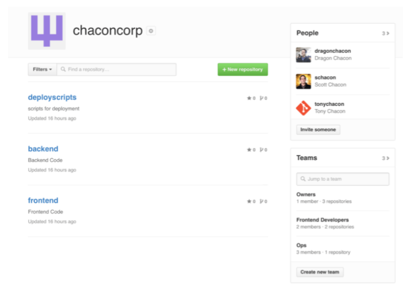


개인 사용자에 멘션하는 것처럼 팀 @mentions 도 사용할 수 있다. @acmecorp/frontend 처럼 하면 팀의 모든 멤버가 참여하게 된다. 

사용자가 속하는 팀의 수는 제한이 없다. 단순히 팀을 권한 관리 용도만 사용하는 것이 아니라, ux, css, refactoring 과 같이 팀은 어떤 질문 등을 관리하기에 좋고 legal, colorblind 같은 팀은 또 다른 이슈를 처리하는 데 좋다.


##### 감사 로그 

소유자는 Organization에서 일어나는 모든 정보를 알 수 있다. Audit Log 탭에 보면 저장소에서 일어난 일들의 로그가 있다. 누가 세계 어디에서 무슨 일을 했는지 보여준다.
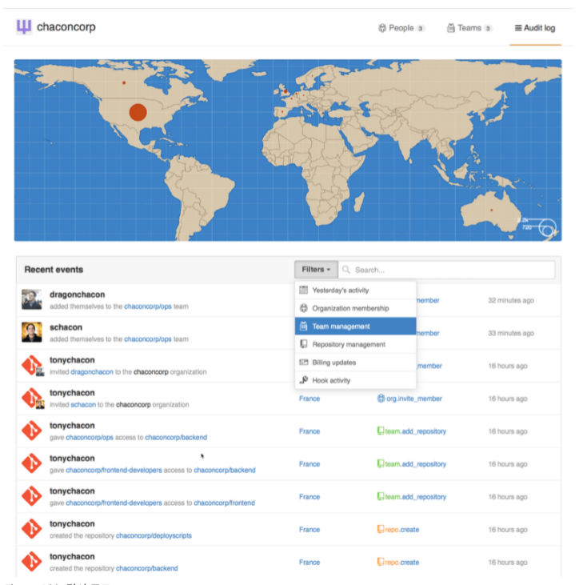


---

### Github 스크립팅

##### 훅

GitHub 서비스에 없는 사이트나 외부 서비스와 연동하고 싶거나 좀 더 세세한 설정을 하고 싶으면 GitHub 훅을 이용한다. GitHub 저장소의 훅은 단순하다. URL을 하나 주면 그 URL로 HTTP 페이로드를 보내준다. GitHub 훅 페이로드를 처리하는 간단한 웹 서비스를 하나 만들고 그 서비스에 원하는 동작을 구현하는 것이 일반적이다.

##### GitHub API

서비스와 훅은 저장소에서 발생한 이벤트의 알림을 받는 방법이다. 그런데 이벤트의 정보를 좀 더 자세히 알고 싶으거나 자동으로 동료를 추가하거나 이슈에 레이블을 달도록 하고 싶으면 GitHub API를 사용한다.  GitHub가 제공하는 API Endpoint는 매우 많아서 웹사이트에서 하는 웬만한 일은 자동화할 수 있다. 

##### 기본 사용법 

인증이 필요하지 않은 API Endpoint에 GET 요청을 보내기가 가장 쉬운데, 사용자 정보나 오픈 소스 프로젝트의 정보를 읽어오는 것들이 이에 해당한다. 

아래처럼 요청을 보내면 'schacon'이라는 사용자에 대해 자세히 알 수 있다.

```
$ curl https://api.github.com/users/schacon 
{   
"login": "schacon",
"id": 70,
"avatar_url": "https://avatars.githubusercontent.com/u/70",
# …   
"name": "Scott Chacon",   
"company": "GitHub",   
"following": 19,   
"created_at": "2008-01-27T17:19:28Z",   
"updated_at": "2014-06-10T02:37:23Z" 
} 
```

이렇게 Organization, 프로젝트, 이슈, 커밋 정보를 가져오는 Endpoint가 많이 있다. GitHub 페이지에서 볼 수 있는 것은 다 된다. *심지어 Markdown을 렌더링하거나 .gitignore 템플릿을 제공하는 API도 있다.*


##### 이슈에 코멘트하기

이슈나 Pull Request에 코멘트를 달거나 공개하지 않은 정보를 얻으려고 할 때는 인증이 필요하다. 

사용자이름과 암호가 필요한 Basic 인증도 가능하지만, 개인 엑세스 토큰을 사용하는 게 낫다. 설정 페이지의 “Applications” 탭에서 생성할 수 있다.

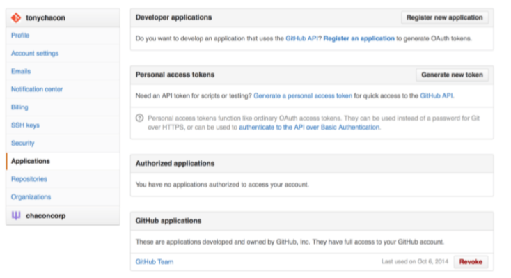

##### Pull Request의 상태 변경하기 

커밋은 하나 이상의 상태를 가질 수 있는데 API를 통해서 상태를 추가하거나 조회할 수 있다. 대부분의 CI나 테스팅 서비스들은 코드가 푸시되면 바로 테스트를 하고 나서 이 API를 사용한다.

 커밋이 모든 테스트를 통과하면 리포트한다. 이 API로 커밋 메시지가 규칙에 맞게 작성됐지 리포트할 수 있다. 코드를 보낸 사람이 제대로 가이드라인을 지켰는지나 커밋에 제대로 서명했는지도 기록할 수 있다. 

커밋 메시지에 Signed-off-by 라는 스트링이 있는지 검사하는 웹 서비스를 만들어 보자. 먼저 저장소에 이 웹 서비스를 호출하는 웹훅을 등록한다

누군가 Push 하면 모든 커밋을 훑는데, 커밋 메시지에서 Signed-off-by 스트링을 찾는다. 그 결과의 상태를 `/repos/<user>/<repo>/statuses/<commit_sha>`라는 Endpoint 주소에 POST 요청으로 보낸다. 

커밋의 상태는 success, failure, error 일 수 있다. 커밋의 상태(state)와 설명(description), 자세한 정보를 확인할 수 있는 URL(target_url), 상태를 구분하는 '컨텍스트(context)'를 함께 전송한다. 

이 훅을 적용하고 나서 누군가 Pull Request를 새로 열면 API로 표기한 커밋 상태.같은 상태 메시지를 보게 된다.

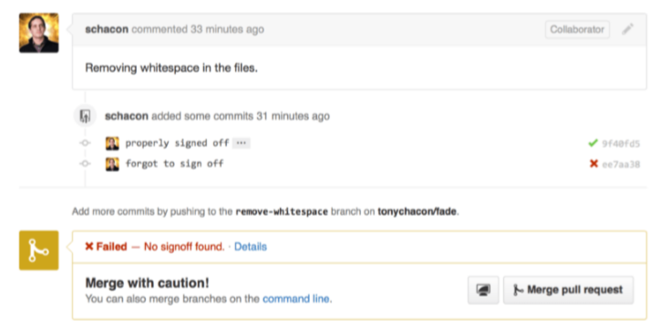

“Signed-off-by” 스트링이 있는 커밋 메시지에는 녹색 체크 아이콘이 달리고 그렇지 않은 커밋에는 빨간 X 표시가 달린다. 그리고 Pull Request의 상태는 마지막 커밋의 상태를 보여주는데 상태가 'failure’면 경고해준다.

 이 API를 사용해서 테스트 결과를 Pull Request에 리포트하는 것은 매우 유용하다. 테스트에 실패하는 커밋을 Merge 하는 일을 미연에 방지할 수 있다. 


##### Octokit 

이 책에서는 단순한 HTTP 요청을 보냈기 때문에 curl 만 사용했다. 

하지만, 더 편리하게 API를 사용할 수 있게 해주는 오픈소스 라이브러리로, Go와 Objective-C, Ruby, .NET을 지원한다. ( http://github.com/octokit )

이 도구로 프로젝트가 요구하는 대로 GitHub의 워크플로를 최적화할 수 있다. 전체 API에 대한 구체적인 문서와 상황별 가이드는 https://developer.github.com에서 확인해야 한다.