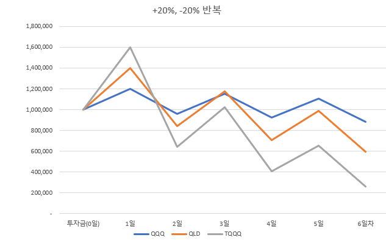
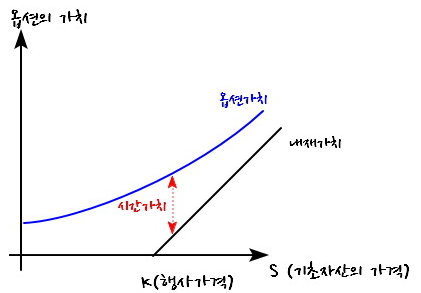
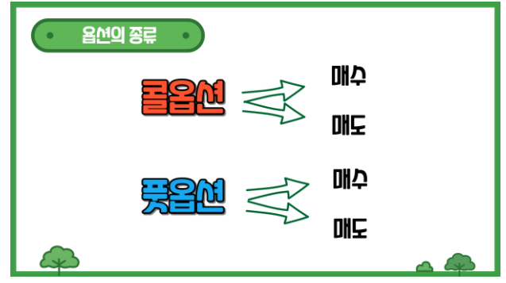
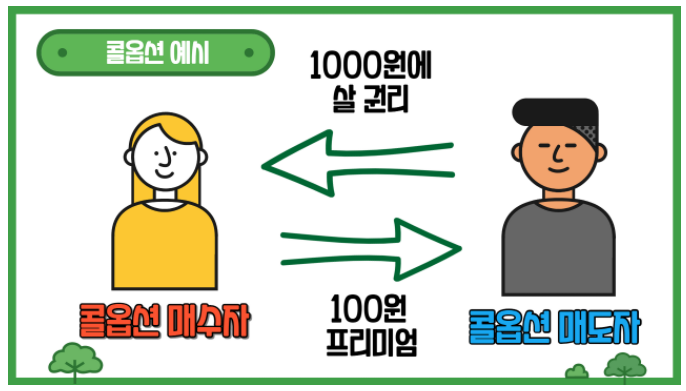
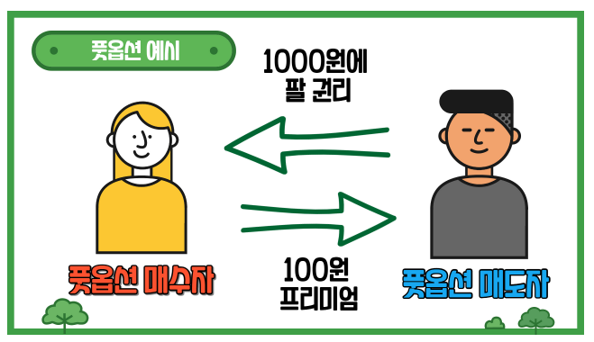
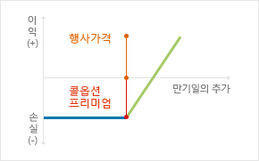
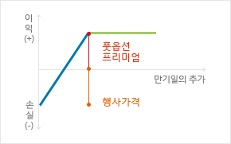
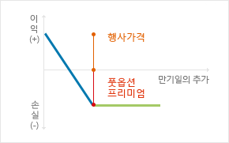
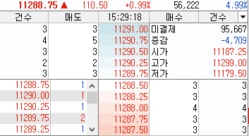
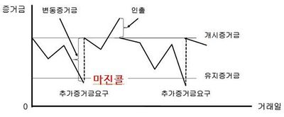

[TOC]


## INTRO

### 가치는 어떻게 결정되는가? - 희소성 논리

경제학을 가장 처음 배우게 되면 젤 처음 배우는 것이 2가지가 있습니다. 

첫 번째는 **기회비용**이고, 두 번째는 **희소성 논리**입니다.

기회비용은 하나를 선택했을 때, 그로 인해 포기한 것들 중 가장 큰 것의 가치를 말합니다. 돈에 있어서 기회비용은 상당히 중요합니다. 자본주의 사회에서 돈을 가만히 쌓아두는 것은 바보같은 짓입니다.

우선 개인에게 손해입니다. 돈을 현금으로 집에만 쌓아두고 있는다면 은행예금에 대한 이자만큼의 손해가 납니다. 또한 해를 거듭할수록 인플레이션이 발생하기 때문에 가지고 있는 자산의 가치가 하락합니다. 거시적으로는 소비가 활성화되지 않아 경제가 굳는 현상이 발생합니다. 주식투자까지는 아니더라도 최소한 은행예금에 대한 이자는 챙겨야하는 부분이라 볼 수 있습니다.

 두번째로 수요에 비해 공급이 적을 수록 희소성이 높습니다. 희소성이 높으면 가치도 당연히 높아집니다. 가지고 싶은 사람은 많은 반면 갯수는 정해져있기 때문입니다. 

```
 다이아몬드는 BC 7~8세기 인도에서 인기를 끌기 시작해 로마 시대에 유럽의 왕후나 귀족들이 지니는 보석 중의 하나였습니다. 이런 다이아몬드는 19세기까지만 해도 극히 소량만 생산되었기에 그 가치가 매우 높았습니다.  근데 남아프리카에서 대규모 다이아몬드 광산을 발견하면서 다이아몬드의 가치가 떨어지기 시작했습니다. 이런 다이아몬드의 가치를 원래대로 되돌리기 위해서는 공급을 줄여야만 했습니다.

 그래서 1888년 몇몇 영국 광산업자들은 다이아몬드의 공급량을 조절하기 위해 뭉쳤습니다. 그리고 단 하나의 회사를 만들었는데, 그 회사가 바로 '드비어스(DE BEERS)'라는 회사입니다.

 드비어스는 다이아몬드를 독점해 매년 소량의 다이아몬드만을 시장에 공급했습니다. 수요가 있어도 소량의 다이아몬드만을 공급했기에 다이아몬드의 가치는 치솟았고 구할 길이 없는 많은 사람이 다이아몬드를 갖고 싶어 했습니다.
```

이 세상에 다이아몬드가 돌처럼 많고 돌이 다이아몬드처럼 희귀했다면 돌 값은 지금의 다이아몬드 값이 되었을 것이고 다이아몬드는 줘도 안가지는 가치가 되어있을 것입니다. 이런 희소성 논리는 다이아몬드 같은 현물에 국한되지 않습니다. 

직업(의사, 판검사, 변리사), 연애(잘생긴 남자, 예쁜 여자) 등 보이지 않는 무형가치에도 모두 동일하게 적용됩니다. 


### 투자란 무엇인가?

저축과 투자

- 저축: 은행예금 같이 안전하게 돈을 저금해 두는 것
- 투자: 주식이나 채권 등의 유가증권에 향후의 가치를 바라보고 돈을 투입하는 것


투자로 얻어지는 수익

1. **차익**: 주식을 10만원에 매수했지만 주가상승으로 인해 15만원에 매도해 나온 5만원의 차이를 얻는 것
2. 이자: 개인, 회사 및 정부에게 돈을 빌려주는 대신 추후 정해진 날짜에 원금 대비 일정한 수준의 이자를 보장받는 투자이며 대표적인 상품으로는 채권
3. 배당금: 주식을 소유한 투자자 대상으로 회사에서 수익의 일부를 돌려주는 것을 말합니다. 하지만 배당금의 경우 모든 회사가 제공하는 것은 아니며 일부 경우 배당금을 돌려주던 회사가 지급을 멈출 수도 있다는 점은 유의하시길 바랍니다.


## 증권

**돈의 가치가 있는 문서**를 뜻합니다. 주로 유가증권을 뜻하며, 수표, 주식, 채권 등을 말합니다.

- 증권시장: 증권을 사고 파는 시장
- 증권회사: 증권을 사고 파는데 서비스를 제공하는 회사 ex) 한국투자증권, 키움 등


## 주식

 주식은 한마디로 **회사의 소유권**이며 주식을 소유한 주주는 이를 통해 회사의 **의결권**, 수익, 그리고 **자산을** 보유할 수 있습니다. 

 예를 들어 A와 B가 함께 회사를 설립하였다는 가정 하 이 회사의 주식은 A와 B 둘이서 나누어 가져 회사 내에서 50%의 의결권, 수익, 그리고 자산을 나누어 갖는 것이며 만약 이 식당이 100개의 주식을 발행하는 경우 각자 50개의 주식을 보유하는 셈입니다.

- **상장**

자본 조달 목적으로 이 회사의 주식을 일반인에게 개방하는 것을 **신규상장**이라 **(IPO)** 일컫으며 상장 시 A와 B의 비공개 기업은 공개 기업으로 전환됩니다. 주식 투자자는 A와 B가 시작한 회사의 소유권의 일부를 매수 하게 되는 것입니다.


### 주식투자

**주식 투자**는 시세차익을 목적으로 주식회사의 증권을 사고 파는 투자 활동. 

엄밀하게는 선물 및 옵션과 같은 파생상품에 투자하는 것은 주식투자라 부르지 않으며 **현물 투자만을 주식투자**라고 합니다.


### 주가의 책정

 주식 시장에서는 앞서 언급한 A와 B의 회사와 같이 삼성, 롯데, 그리고 현대 등 다양한 기업의 소유권을 주식으로 매매할 수 있으며 주가는 **수요와 공급**에 따라 좌우됩니다. 예를 들어 주식을 매수하는 사람들이 매도하는 사람보다 많을수록 가격은 올라가며 반대일 경우에는 가격이 내려갑니다. 

 하지만 주가에 변동이 있을 때마다 회사의 가치에도 변동이 있다는 점을 명심하셔야 합니다. 시가총액은 회사의 가치를 판단하는 지표이며 이는 회사의 유통주식 수와 주가를 곱하여 계산하는 수치입니다. 예를 들어 회사의 유통주식 수가 100개이고 주가가 1만원인 경우 이 회사의 시가총액은 100만원입니다.

 따라서 10만원짜리 주식의 회사와 5만원짜리의 주식의 회사가 동일한 가치를 소유하는 경우도 있습니다. 예로 회사 A와 회사 B 둘 다 매년 10만원의 이익을 올리고 있다는 시나리오 내에서 A의 회사는 1천원짜리 주식을 1000개 그리고 B의 회사는 1만원짜리 주식을 100개 발행한 상황을 고려해 보겠습니다. 비록 A의 회사의 주가가 10배 더 높지만 두 회사의 시가총액은 100만원으로 동일하기 때문에 주식 시장 내에서 두 회사는 같은 가치를 가지고 있습니다. 

| 대상     | 시가총액 |  주가 | 유통주식 수 | 이익   | 주가수익비율 |
| :------- | -------: | ----: | :---------- | :----- | :----------- |
| A의 회사 |  100만원 | 1천원 | 1,000개     | 10만원 | 10배         |
| B의 회사 |  100만원 | 1만원 | 100개       | 10만원 | 10배         |


### 주식의 종류 - 보통주 vs 우선주

 주식은 크게 보통주 그리고 우선주로 나눌 수 있으며 일반적으로 매매가능한 것은 전자입니다. 후자는 배당이 더 높지만 통상 의결권이 없고, 이익과 잔여재산 분배 시 우선권도 가지고 있습니다. 즉 주식회사가 망했을 때 자산 매각 시에는 우선주주가 보통주주보다 자신의 주식에 대한 청구권을 먼저 가지고 있다는 뜻입니다.

| 종류   | 장점            | 단점                           |
| :----- | :-------------- | :----------------------------- |
| 보통주 | 의결권이 부여됨 | 배당이 항상 제공되는 것은 아님 |
| 우선주 | 높은 배당률     | 의결권 부재                    |

 일부 경우에 따라서 회사들은 다른 종류의 주식을 발행할 수도 있습니다. 한국의 경우 종목명 뒤에 붙어있는 A, B, C가 이를 나타내며 일반적으로 발행순서와 연관되어 있습니다. 

 하지만 해외의 경우에는 주식의 종류가 큰 차이를 만들어 낼 수도 있습니다. 예를 들어, 구글의 경우 A는 주식 하나당 의결권 1개, B는 10개, 그리고 C는 0개를 부여합니다. 구글은 이와 같은 주식 구조를 통해 회사 내 의결권을 통제하고 있습니다. 예를 들어 B 주식은 오직 구글의 경영진만 보유할 수 있어 회사의 의결권을 창시자와 경영진에게만 주어 회사를 방어는 방법이라고도 할 수 있겠습니다.

  

  

  

   

### 배당

주식을 소유하고 있는 사람들에게 소유 지분에 따라 기업이 이윤을 분배하는 것


- 배당락일(EX-DATE)

배당에 대한 권리가 떨어진(落) 날입니다. 배당락일 전일까지는 주식이나 ETF를 보유하여야 배당금을 받을 수 있습니다. 배당락일 전일까지만 주식을 매수하고, 배당락일에 매도하더라도 배당금을 받을 수 있습니다.

 

- 배당선언일(DECLARATION DATE)

배당금액과 배당지급일을 결정하여 선포하는 날입니다.

 

- 배당기준일(RECORD DATE)

배당을 받을 주주들을 결정하는 기준이 되는 날입니다. 배당락일 전일까지 주식을 매수해야 배당기준일까지 주식이 결제됩니다.

 

- 배당지급일(PAYMENT DATE)

배당이 실제 주주들에게 지급되는 날입니다.


### 주가 지수

주가 지수는 여러 개의 주식 가격을 한번에 나타내는 지표이며 

예시로는 ,

- **코스피(KOSPI)** : 한국거래소 유가증권시장 내 상장되어 있는 모든 회사의 종합주가지수

코스피 지수의 기준은 1980년 1월 4일의 시가총액을 100으로 기준으로 산출하는 지수입니다.


- **코스닥(KOSDAQ)** : 한국 중소기업들의 종합주가 지수

코스닥의 기준시점은 1990년 1월 3일의 시가총액을 100으로 기준으로 산출하는 지수입니다.


- **다우존스** : NYSE(미국의 코스피)와 나스닥 상장기업 중 세계 경제를 대표하는 30개 기업의 지수
- **나스닥(NASDAQ)** : 미국 벤처기업, 기술주들의 종합주가지수
- **S&P 500 (Standard & Poor's)** : NYSE(미국의 코스피)와 나스닥 상장기업 중 미국을 대표하는 500대 대기업을 추려 만든 주가지수

등이 있습니다.


### 주식거래수수료

주식을 거래할 때 증권사를 통해 거래하므로 증권사에서는 일정 수수료를 받고 거래서비스를 제공합니다. 

**아래는 국내 일반 주식(파생상품X)의 거래 수수료 계산방식 입니다.**

해외선물수수료, 해외주식수수료는 추후에 다룹니다

- 매수 수수료: 매수한 주식 가격 * 증권수수료율
- 매도 수수료: 매도한 주식 가격 * 증권수수료율  + 증권거래세(0.3%)


```
10만원짜리 주식을 10주 매수하고 12만원으로 10주 모두 매도하는 상황,  주식 수수료를 0.0150%라고 가정

- 매수 수수료: 1,000,000 * 0.015% = 150원
- 매도 수수료: 1,200,000 * 0.015% * + (1,200,000 * 0.3%) = 180원 + 3600원 = 3780원
```


**국내 주식 매매 최저 수수료**

| 증권사   | 최저 HTS 국내 수수료 | 최저 MTS 국내 수수료 |
| :------- | -------------------: | -------------------: |
| 한국투자 |              0.0142% |              0.0142% |
| 키움     |              0.0150% |              0.0150% |


## 채권

정부 또는 기업에서 발행하는 차용증(빚)이며 발행기관에 따라 국채, 회사채, 그리고 은행채로 나눌 수 있습니다. 

구체적으로 채권은 이표채 그리고 할인채로 이자지급방식에 따라 나눌 수 있습니다.

- 이표채: 주기적으로 (일반적으로 3달 혹 6달) 이자를 제공
- 할인채: 액면가보다 낮은 가격으로 채권을 판매하여 만기 시 액면가를 제공

| 대상   |   액면가 |   구매가 | 이자 | 이자 주기 | 만기 | 수익률 | 원금+이자 |
| :----- | -------: | -------: | :--- | :-------- | :--- | :----- | :-------- |
| 이표채 | 10,000원 | 10,000원 | 3%   | 3개월     | 1년  | 3%     | 10,300원  |
| 할인채 | 10,000원 |  9,700원 | 0%   | 미해당    | 1년  | 3%     | 10,000원  |

또한 채권은 만기에 따라 단기채, 중기채, 그리고 장기채로 나눌 수도 있습니다. 대체적으로 단기채는 만기까지 1년 이하, 중기채는 5년 이하, 그리고 장기채는 5년 이상입니다.


### 채권에 투자하는 이유

 채권은 다른 투자 상품들에 비해 안정적이며 주기적인 소득을 희망하는 투자자에게 적합합니다. 이는 주식과는 다르게 발행자의 채무 불이행 시에도 원금을 회수 할 가능성이 있으며 나라에서 발행하는 국채의 경우 채무 불이행의 가능성이 매우 희박하여 안전한 금융 상품으로 여겨지기 때문입니다. 

 채권으로 이익을 얻는 가장 쉬운 방법은 3달마다 한번 지급하는 **이자**를 통해서입니다. 예를 들어 채권을 액면가로 구입 후 채권의 가치가 변함 없다는 전제 하에 이자만 받으면 채권 만기 때 수익률은 채권의 이자율과 동일합니다.   

 하지만 채권의 가치는 시장금리에 따라 변할 수도 있기 때문에 **시세차익으로 수익을 내는 방법**도 있습니다. 예를 들어 2019년 채권 금리는 2%였지만 2020년에는 시장 금리 하락으로 인해 채권 금리가 1%로 낮아지게 되면 2019년 채권이 2020년 채권보다 높은 가치를 가지게 됩니다. 반면에 2020년에 시장 금리 상승으로 인해 채권 금리가 3%로 높아진 경우에는 2019년 채권이 2020년 채권보다 낮은 가치를 가지게 됩니다. 이러한 시가 변동을 현명하게 활용하면 채권 매매로도 수익을 올릴 수 있습니다. 하지만 채권 가격과 이율의 변동은 만기에 돌려 받는 액면가에 아무런 영향을 끼치지 않습니다.


## 펀드

투자자로부터 모은 자금을 증권사가 주식 및 채권 등에 투자 후 그 결과를 돌려주는 간접 투자상품입니다.


### ETF(Exchanged Traded Fund)

상장지수펀드. 펀드를 거래소에 상장시켜서 사람들이 주식처럼 편리하게 거래할 수 있도록 만든 상품

쉽게말하면 주식의 묶음이라고 보면됩니다. 때문에 ETF는 코스피, 코스닥, 나스닥 지수 등에 영향을 받습니다. 


#### ETF의 장단점

- 장점

  - 펀드의 성격과 유사하지만 장내시간에 주식시장에서 편하게 거래할 수  있습니다.
  - 지수에 영향을 받는 상품이기 때문에 여러개의 기업에 분산투자하는 효과가 있습니다.
  - 거래 수수료가 저렴합니다.
  - 주식과 마찬가지로 배당금을 받을 수 있습니다.

  

- 단점

  - 추적오차와 괴리율이 발생합니다.

  > 괴리율:  ETF 현재가 - NAV의 %
  >
  > - NAV(Net Asset Value): ETF 자산에서 부채와 기타비용을 제외한 가치 (희망소비자가격)
  > - ETF 현재가: 현재 주식시장에서 거래되고 있는 ETF의 현재가격
  >
  > 괴리율이 음의 값이면 저평가된 것이므로 매수하기 좋은 타이밍입니다. 결국 괴리율은 0%로 수렴하기 때문입니다.


#### ETF 레버리지, ETF 인버스 레버리지

##### 나스닥 100

- QQQ, QLD, TQQQ: 나스닥 100 지수가 증가할 때 가격이 상승하는 etf

  - QQQ: 나스닥 지수가 1% 상승하면 1%의 수익을 얻고, 1% 하락하면 1% 손실을 입습니다.
  - QLD:  나스닥 지수가 1% 상승하면 2%의 수익을 얻고, 1% 하락하면 2% 손실을 입습니다.

  - TQQQ : 나스닥 지수가 1% 상승하면 3%의 수익을 얻고, 1% 하락하면 3% 손실을 입습니다.

    

- PSQ, QID, SQQQ: 나스닥 100 지수가 감소할 때 가격이 상승하는 etf

  - PSQ 나스닥 지수가 1% 상승하면 1%의 손실을 입고, 1% 하락하면 1% 수익을 얻습니다.
  - QID:  나스닥 지수가 1% 상승하면 2%의 손실을 입고, 1% 하락하면 2% 수익을 얻습니다.
  - SQQQ: 나스닥 지수가 1% 상승하면 3%의 손실을 입고, 1% 하락하면 3% 수익을 얻습니다.

| 종목                                | 레버리지 |
| ----------------------------------- | -------- |
| QQQ (Powershares Qqq Trust Series)  | x1       |
| QLD (Proshares Ultra Qqq)           | x2       |
| TQQQ (Proshrares  Ultropro Qqq)     | x3       |
| PSQ (ProShares Short Qqq)           | - x1     |
| QID (ProShares Ultrashort Qqq)      | - x2     |
| SQQQ (ProShares Ultrapro short Qqq) | - x3     |

> 티커(Ticeker): 미국 주식창에서 증권을 표기할 때 쓰는 약어
>
> ​	Ex) 애플 -> AAPL, 마이크로소프트-> MSFT, Proshares Ultra Qqq -> QLD


##### S&P 500

- SPY, SSO, UPRO: S&P 500 지수가 증가할 때 가격이 상승하는 etf
- SH, SDS, SPXS: S&P 500 지수가 하락할 때 가격이 상승하는 etf

| 종목 | 레버리지 |
| ---- | -------- |
| SPY  | x1       |
| SSO  | x2       |
| UPRO | x3       |
| SH   | - x1     |
| SDS  | - x2     |
| SPXS | - x3     |


#### 음의 복리효과 - ETF 레버리지 장기투자는 좋지 않다?

**음의 복리효과**

: 임의의 값 X에서 같은 비율로 등락을 반복한 결과는 X보다 작은 값이고 이를 무수히 반복하면 0에 수렴한다.


Example) 

 여기 100만원이 전재산인 한 남자가 있습니다. 이 남자는 도박을 매우 좋아하며 도박시 항상 전재산을 배팅합니다. 게임의 규칙은 각각 50%의 확률로 건 돈의 10%를 따거나 10%를 잃습니다.

이 남자는 게임을 총 6번 했고, 따고 잃기를 반복했습니다. 6게임후의 이 남자의 전재산은 얼마일까요?

 간단히 계산해보면 됩니다.

| 회차      | 1회       | 2회       | 3회       | 4회       | 5회       | 6회       |
| --------- | --------- | --------- | --------- | --------- | --------- | --------- |
| 결과      | 승 (+10%) | 패 (-10%) | 승 (+10%) | 패 (-10%) | 승 (+10%) | 패 (-10%) |
| 1,000,000 | 1,100,000 | 990,000   | 1,089,000 | 980,100   | 1,078,110 | 970,299   |

 놀랍게도 같은비율로 등락할때 순자산이 감소하는 것을 볼 수 있습니다. 이 음의 복리효과는 등락율이 더 클 때 더 두드러지게 나타납니다.


Example2) QQQ, QLD, TQQQ

20% 등락이 하루하루 반복된다고 가정해봅시다. 이 때 각 ETF의 수익률은 아래와 같습니다.

|      | 0일 (투자금) | 1일       | 2일     | 3일       | 4일     | 5일       | 6일     |
| ---- | ------------ | --------- | ------- | --------- | ------- | --------- | ------- |
| QQQ  | 1,000,000    | 1,200,000 | 960,000 | 1,152,000 | 921,600 | 1,105,920 | 884,736 |
| QLD  | 1,000,000    | 1,400,000 | 840,000 | 1,176,000 | 705,600 | 987,840   | 592,704 |
| TQQQ | 1,000,000    | 1,600,000 | 640,000 | 1,024,000 | 409,600 | 655,360   | 262,144 |

 


확실한 상승장에는 레버리지를 사용하는 게 좋지만 등락변동성이 큰 시장에서는 그대로 나락갈 수 도 있으니 주의해야합니다. 


#### ETF vs ETN?

: 증권회사가 자기신용으로 발행하는 ‘파생상품’

 두 상품의 결정적인 차이점은 ETN이 증권회사가 자기신용으로 발행하는 ‘파생상품’인 반면 ETF는 자산운용사가 해당 지수의 구성 종목을 직접 편입해 운영하는 ‘펀드’라는 것이다. 파생상품과 펀드라는 차이 탓에 양자의 수익구조에는 결정적 차이가 있습니다.

 우선 ETN은 발행 증권사가 수수료를 제외한 추종 인텍스 수익률을 보장합니다. 즉 약정된 기초 지수의 수익률과의 추적 오차가 없거나 작은 편입니다. ETF의 경우 자산운용사들이 추종하는 지수에 포함된 일부 종목에 대해 운용하기 때문에 지수 수익률 자체와 차이를 보일 수 있습니다. 또한 ETN은 만기가 있는 파생상품이라는 점에서 잔기가 없는 펀드인 ETF와 차이가 있습니다.

 아울러 ETN은 발행 증권사가 자기 계정으로 보유 운용하기 때문에 **증권사의 파산 시 또한 상장 폐지되는 신용 리스크가 존재**합니다. 실제로 2009년 리먼브라더스 파산 당시, 리먼브라더스가 발행한 3개의 ETN 보유자들은 큰 손실을 봤습니다.

 다만 투자자 관점에서 ETN과 ETF는 특정 기초 지수의 등락에 따라 가격이 결정되며 한국거래소에 상장돼 장중 거래할 수 있는 간접투자상품이라는 점에서 유사하게 느껴집니다. 이런 점 때문에 금융업계 일각에서는 ETN 시장 개설에 따라 이와 유사한 ETF 시장과 충돌하면서 기존 ETF 시장을 잠식(Cannibalization)시키는 것이 아닌가 하는 우려가 제기됬습니다만 한국거래소는 추적대상 자산의 범위 자산운용사(ETF)대 증권사(ETN)의 상품개발 대상 중복에 따른 업계의 이해충돌을 방지하기 위해 ETF와 ETN의 고유영역 설정했습니다.


## 파생상품

 주식, 채권, 금 등 다양한 기초 자산을 기반으로 새로운 현금흐름을 창출하는 증권입니다. 


### 옵션

: 기초 자산을 미래 시점에서 사거나 팔 수 있는 권리를 거래하는 것


**옵션 관련  주요 용어**

- 프리미엄: 권리 행사를 갖기 위해 지불하는 대가 (옵션을 매수하는 가격)
- 행사가격: 권리 행사가 가능해지는 가격
- 만기일: 옵션 행사가 가능한 마지막 날

```c
 예를 들어 주식의 1주 가격이 4만5천원, 프리미엄이 5천원, 그리고 만기일이 30일 남은 콜옵션이 있습니다. 
이 옵션을 매수하기 위해서는 프리미엄 5천원을 지불해야되며 30일 뒤에 옵션 행사와 무관하게 이 금액은 돌려 받을 수 없기 때문에 이 옵션의 손익분기점은 5만원입니다. 즉, 주가가 5만원까지 올라야 이득을 볼 수 있습니다.
```


**옵션의 가치**: **내재가치 + 시간가치**

- 내재가치: 옵션의 권리를 행사하는 경우 확실하게 얻어지는 이익

현재 행사가격이 4만5천원인 주식을 프리미엄 5천원을 주고 30일 이후에도 4만5천원에 구매할 수 있는 옵션구매를 했다고 가정합니다.

하루 뒤에 주가가 6만원으로 상승했다면 이 옵션의 내재가치는 60000 - 45000 = 15000원이 됩니다. 


- 시간가치: 표면적으로 드러나 있지 않은 다른 가치들 (ex 만기까지 남아있는 시간, 변동성, 이자율 등)

 

> 위 그래프는 블렉-숄즈 모델 방정식에 의해 도출된 그래프이므로 이해 할 필요 없음


**만기일**

 옵션의 만기일에는 대규모의 거래가 일어납니다. 최대한 유리한 조건으로 정산을 받기 위해 주식시장들의 큰손들은 원하는 방향으로 주식을 계속 거래해서 주가를 원하는 수준까지 올리거나 내리기 때문입니다. 또한 개인들도 이런 주가변동성을 이용해 시세차익을 얻으려고 하므로 또한 거래량이 많아집니다.

따라서 만기일에는 주가의 변동성이 크므로 알고계시면 좋을 것 같습니다.

> 네 마녀의 날(Quadruple Witching Day)
>
> 주기지수 선물/옵션, 개별주식 선물/옵션 네 만기가 겹치는 날
>
> 대한민국에서는 3,6,9,12월 두 번째 목요일


**옵션의 종류**

옵션은 크게 두가지로 나누어집니다. 첫째로 투자자에게 해당 **자산을 매수할 선택권을 부여하는 것을 콜옵션**이라 부르며 **매도할 선택권을 부여하는 것을 풋옵션**이라 합니다. 

  

 

#### 콜옵션

: 옵션 만기일에 특정 상품을 정해진 가격대로 구매할 수 있는 권리


Example)

현재 가격이 1000원짜리인 사과가 있습니다.

6개월 뒤의 사과 가격의 변동이 예상되며, 상승할 수도 하락할 수도 있는 가운데 현재 **콜옵션 매수자**는 6개월 뒤의 사과 가격이 어떻든지 사과를 1000원에 매수하고자 합니다.

이를 위해선  1000원에 사과를 팔 **콜옵션 매도자**가 필요합니다.


콜옵션 매수자는 6개월 뒤에도 사과를 1000원에 살 수 있는 권리를 콜옵션 매도자에게 구매합니다. 

 이 콜옵션을 행사할지 말지는 매수자에게 달려있습니다. 사과가 1000원보다 비싸진다면 콜옵션을 행사해서 사과를 1000원에 구매해서 차익을 챙길 수 있고, 사과가 1000원보다 싸진다면 콜옵션을 행사하지 않고 1000원 이하에 사과를 구입할 수 있습니다.

 반대로 콜옵션 매도자는 사과가 1000원보다 비싸져도 1000원에 팔 수 밖에 없고, 1000원보다 싸진다면 저렴해진만큼 손해를 보게됩니다. 

콜옵션 매수자는 권리를 지니고 콜옵션 매도자는 의무를 지는 이 계약이 **불공정** 해보입니다.

바로 여기서 옵션 프리미엄이라는 개념이 나옵니다. 콜옵션 매수자는 좋은 조건에 거래를 하는 대신 콜옵션 매도자에게 좋은 조건에 대한 대가를 지불합니다. 그 대가가 **프리미엄**입니다. 

 예시로 돌아가서, 콜옵션 매수자는 미래에 사과의 가격이 얼마가 되었든 1000원에 구매할 수 있게 해달라, 그 권리의 대가로 100원의 프리미엄을 더 주겠다고 하는 것이죠.




시간이 흘렀을 때, 두 가지 상황이 발생할 수 있습니다.

1. **사과가격이 1500원으로 상승 할 때**

콜옵션 매수자는 사과를 1000원에 살 수 있는 권리를 구매했기 때문에 1500원의 사과를 500원 싸게 살 수 있습니다. 즉 콜옵션 매수자는 500원의 차익을 얻고 프리미엄으로 지불한 비용 100원을 뺀 총 **400원의 이득**을 봅니다. 

 반면 콜옵션 매도자는 1500원의 팔 수 있는 사과를 1000원 + 프리미엄 100원, 총 1100원에 판매했기 때문에 **400원의 손실**을 봅니다.


2. **사과가격이 500원으로 하락** 할 때

콜옵션 매수자는 사과를 1000원에 살 수 있는 권리를 구매했으나 현재가인 500원보다 더 비싸게 살 필요가 없으므로 콜옵션을 포기하고 500원으로 구매하면됩니다. 이때 콜옵션 매수자는 **프리미엄 가격(100원)만큼의 손해**를 봅니다.

 반면 콜옵션 매도자는 현재가 500원의 사과를 정가로 팔고 프리미엄 100원을 받았기 때문에 **프리미엄 가격(100원) 만큼의 이득**을 봅니다.


#### 풋옵션

: 만기 시 계약 전 동의한 가격에 자산을 팔 수 있는 권리


위의 예시와 마찬가지로 사과의 현재가는 1000원이며 6개월 뒤의 사과 가격의 변동이 예상되며, 상승할 수도 하락할 수도 있는 가운데 현재 **풋옵션 매수자**는 6개월 뒤의 사과 가격이 어떻든지 사과를 1000원에 팔고자 합니다.

이를 위해선  1000원에 사과를 팔 **풋옵션 매도자**가 필요합니다.


풋옵션 매수자는 6개월 뒤에도 사과를 1000원에 팔 수 있는 권리를 픗옵션 매도자에게 구매합니다. 

 이 풋옵션도 마찬가지로 권리를 행사할지 말지는 매수자에게 달려있습니다. 사과가 1000원보다 비싸진다면 풋옵션을 행사하지 않고사과를 1000원 이상의 가격으로 판매해서 차익을 챙길 수 있고, 사과가 1000원보다 싸진다면 풋옵션을 행사하여 않고 1000원에 사과를 판매할 수 있습니다.

 콜옵션과 마찬가지로 풋옵션 매수자는 풋옵션 매도자에게 100원의 프리미엄을 지불합니다.



시간이 흘렀을 때, 두 가지 상황이 발생할 수 있습니다.

1. **사과가격이 1500원으로 상승 할 때**

풋옵션 매수자:

사과를 1000원에 팔 수 있는 권리를 구매했지만 현재가인 1500원보다 더 싸게 팔 필요가 없으므로 풋옵션을 포기하고 1500원에 판매하면됩니다. 이 때 풋옵션 매수자는 1500원의 사과를 정가로 팔고 옵션을 포기했기 때문에 프리미엄비용인 100원의 손실이 나므로 총 손익은 **100원의 손실**을 봅니다.


풋옵션 매도자: 

1500원의 사과를 정가로 사고 프리미엄 비용인 100원을 받았음으로 **100원의 이득**을 봅니다.


2. **사과가격이 500원으로 하락** 할 때

풋옵션 매수자

 : 사과를 1000원에 팔 수 있는 권리를 구매했으니 권리 행사를 하여 현재가 보다 500원을 더 비싸게 받고 팔수 있습니다. 하지만 이 옵션에 지불한 프리미엄(100원)만큼을 감하면 총 **400원의 이득**을 봅니다. 


풋옵션 매도자:

 현재가 500원의 사과를 1000원에 사서 500원의 손실이 나고 프리미엄(100원)만큼을 받았으므로 **400원의 손실**을 봅니다.


#### 결론

이를 통해 몇가지 fact를 얻을 수 있습니다.

첫째,  **옵션은 매수 -매도자의 관계가 zero sum 게임이라는 사실**입니다.

매수자가 N만큼 이득을 보면 매도자는 N만큼 손해를 봅니다.


둘째, 콜옵션이던지 풀옵션이던지 **매수자의 손실은 한정적이고 수익은 무제한입니다**. (사과의 가격이 치솟거나 곤두박질 칠 수 있기 때문에) 

=> 제로썸 게임이기 때문에 **매도자의 손실은 무제한이고 수익은 한정적(프리미엄의 비용)**입니다.


셋째, 말그대로 옵션(option)이기 때문에 매수자 입장에서 권리를 행사할 수도 포기할 수도 있습니다.

넷째, 옵션은 총 4가지 포지션이 있습니다. 


- 콜 매수 포지션

: 미래의 가격(주가)상승에 대비하는 헷지(Hedge) 포지션으로, 이익의 가능성은 무한 / 리스크 한정

> 헷지(Hedge): 미래에 발생할지도 모르는 가격 변동 위험을 회피하기 위한 일종의 안전장치

  

 콜옵션의 만기일에 기초자산인 주식의 가격이 상승하면 콜옵션 매입자는 콜옵션을 행사하여 주가 상승분만큼의 이익을 얻게 됩니다.

그러나, 예상과는 달리 만기일에 주가가 하락하여 행사가격 이하로 떨어진다면, 콜옵션 매입자는 옵션을 구입하기 위해 거래 초기에 옵션매도자에게 프리미엄을 지불하므로, 콜옵션 프리미엄에 해당하는 순손실을 입게 됩니다.

마찬가지로, 가격 상승시에 콜옵션 매입자의 순이익은 (만기일에서의 주식가격－행사가격－콜옵션 프리미엄)이 됩니다.


- 콜 매도 포지션

: 미래의 가격(주가)하락을 예측하여 프리미엄 만큼의 이익을 취하려는 포지션 / 리스크 무한대

 

 콜옵션 매도자는 주식가격이 행사가격보다 낮다면 매도시점에 받은 옵션프리미엄이 거래 이익이 됩니다.

그러나, 만기일의 주식가격이 행사가격보다 더 높다면, 콜옵션 매입자가 콜옵션을 행사하게 될 것이므로 콜옵션 매입자의 이익만큼 콜옵션 매도자는 손실을 보게 됩니다.


- 풋 매수 포지션

:  미래의 가격 하락에 대비하는 헷지 포지션, 이익의 가능성은 무한 / 리스크 한정

  

풋옵션 매입자의 경우, 만기일에 주식가격이 하락하여 행사가격보다 낮으면 풋옵션 매입자는 풋옵션을 행사함으로써 [만기일의 주가－행사가격－풋옵션 프리미엄]에 해당하는 순이익을 얻게 됩니다.

그러나, 만기일에 주가가 상승하여 행사가격보다 높게 형성된다면, 풋옵션 매입자는 풋옵션을 행사하지 않을 것으므로, 풋옵션 매입자에게는 그림에서처럼 옵션프리미엄에 해당하는 손실 이외에는 어떠한 손실도 추가로 발생하지 않습니다.


- 풋 매도 포지션

: 미래의 가격 상승을 예측하고 프리미엄 수익을 추구하는 포지션 / 리스크 무한

 

 풋옵션 매도자는 만기일에 주식가격이 행사가격 이상으로 상승하게 되면 풋옵션 매입자가 팔 수 있는 권리를 행사하지 않을 것이므로, 풋옵션 매도자는 풋옵션을 매도할 때 받은 옵션 프리미엄만큼의 순이익을 얻게 될 것입니다.

그러나, 만기일에 주식가격이 행사가격 이하로 하락하게 되면 풋옵션 매입자가 권리를 행사할 것이기 때문에, 풋옵션 매도자는 풋옵션 매입자가 얻게 되는 이익[만기일의 주가－행사가격－풋옵션 프리미엄]만큼의 손실을 입게됩니다 프로가 아닌 이상 어중간한 개인에게 매도포지션은 좋지 않습니다. 손실이 무한히 날 수 있기 때문입니다.


### 선물

```
선물의 개념은 쿤프로님의 주식리딩 방에서 특히 중요하니 자세한 예시를 들며 장을 열겠습니다.
```

 과수원을 돌보는 아저씨가 있습니다. 이제 몇 달 후에 수확을 시작해야하는데, 이만저만 걱정이 아닙니다. 올해는 사과 값이 한개당 10원으로 폭락할 것만 같습니다. 뚜렷한 과학적 근거는 없는만 왠지 불안합니다.

 과일 수집상 아저씨가 있습니다. 이제 몇 달 후면 사과 철인데 이만저만 걱정이 아닙니다. 올해는 왠지 사과 값이 폭등할 것만 같습니다. 한개에 1000원, 2000원이 아니라 최소한 만원까지 뛰어 오를 것 같습니다. 근거를 대라고 하면 뭐라고 꼭 집어서 말하기는 거시기하지만 뭔가 불안합니다.

 가을이 올 때까지 과수원 아저씨와 과일 수집상 아저씨는 근거없는 불안감으로 긴밤 지새우며 고민만 해야할까요?  방법이 없는 것일까요?

 있습니다. 과수원 아저씨와 과일 수집상 아저씨가 **미리 계약을 하는 것**입니다.  올해 사과 값이 어떻게 되든지 무조건 2000원에 사고 팔기로 계약을 하는 것입니다. 설사 사과 값이 승천해서 하늘로 치솟든, 저 깊은 나락으로 추락을 하든 무조건 2000원에 사고 팔기로 못을 박는것입니다.

 이렇게 계약을 미리하면 과수원 아저씨는 ‘혹시나 사과 값이 폭락하면 어쩌나‘ 하는 걱정을 하지 않아도 됩니다 또 과일 수집상은 ’사과 값이 폭등하면 어쩌나‘ 염려하지 않아도 됩니다. 

 물론 올해 사과 값이 어떻게 되는냐에 따라 누군가 마음의 상처는 입을 수 있습니다. 예를 들어 사과 값이 만원으로 폭등했다고 생각해봅시다. 그렇게 되면 과수원아저씨 입장에서는 죽을 것 같습니다. 이웃집 과수원 아저씨가 사과 한 개에 만원씩 파는데, 자신은 2000원에 판다고 생각해 보십시요.얼마나 가슴이 아려오겠습니까? 하지만 과일 수집상은 공중제비를 2바퀴 돕니다. 남들은 만원 주고 사야하는 사과를 2000원에 사는 기분! 이이잉 너무달아~

 반대로 사과 값이 폭락하면 어떻게 될까요? 사과 값이 개당 10원으로 폭락하면 과수원아저씨는 공중제비를 돕니다. 이웃 과수원 아저씨들은 한 개당 10원에 판매하는데 2000원씩 받고 파는 상황! 이이잉 기분 좋구만유~  하지만 사과 수집상은 죽을 것 같습니다. 10원짜리 사과를 2000원에 사는 기분이 어떠할지 충분히 상상이 됩니다.

 하지만 근심걱정으로 가을이 올 때까지 긴밤 지세우는 것 보다는 2000원에 사고팔기로 미리 계약해놓는 것이 좋습니다. 과수원 아저씨 입장에서도, 과일 수집상의 입장에서도 마음이 편하기 때문입니다. 크게 손해를 보지도, 크게 돈을 벌지도 못하지만 안정적으로 배추를 사고, 파는게 차라리 마음 편합니다.

 선물의 개념은 이런 헷지 포지션을 잡는데에서 출발했지만 요즘은 고수익, 고위험 상품으로 자리잡고 있습니다.


#### 현물과 선물

자본주의 시장 경제에는 크게 두가지 시장이 있습니다. 

 하나는, 현재 우리가 실생활에서 매일 경험하는 **현물 시장**입니다. 우리는 시장에 가서 이미 만들어진 상품을 보고 가치 평가를 한 다음 상품을 삽니다. 현물 시장에서는 이미 만들어진 상품이 없다면 거래가 이루어지지 않습니다. 눈에 보이는 모든 것을 거래하는 것이 현물 시장입니다. 당연히 주식거래도 현물 시장입니다.

 다른 하나는, **선물 시장**입니다. 선물 시장은 현물 시장과 달리 이미 만들어진 (생산된) 상품이 없이 거래된다는 점이 크게 다릅니다. 미래에, 어느 정해진 앞날에 생산될 것으로 믿고 거래하는 것입니다. 선물은 현물 시장의 위험을 피하고자 만들어진 상품입니다.

- 상품: 금, 은, 오일, 주식
- 금융: 주가지수, 금리


##### 현물(現物)

 현재 존재 하는 물건.  우리는 시장에 가서 이미 만들어진 상품을 보고 가치 평가를 한 다음 상품을 삽니다. 현물 시장에서는 이미 만들어진 상품이 없다면 거래가 이루어지지 않습니다. 눈에 보이는 모든 것을 거래하는 것이 현물 시장입니다. 당연히 주식거래도 현물 시장입니다.

>현물(주식) 거래에서 주식의 단위는 1주 입니다. ex) 삼성전자 100주 매수


###### 현물의 수익구조

현물에서 수익을 내려면 오직 한가지(One-Way) 방법밖에 없습니다. 싸게 사서 비싸게 판다(시세차익).


##### 선물(先物, futures)

 앞으로 (미래에) 만들어질 물건. 현물 시장과 달리 이미 만들어진 (생산된) 상품이 없이 거래된다는 점이 크게 다릅니다. 미래에, 어느 정해진 앞날에 생산될 것으로 믿고 거래하는 것입니다. 즉 아까의 사과의 예시처럼 미래의 특정시점(수확철)에 일정한 물품(사과)을 받기로 **현재 시점에서 미래의 상품을 계약하는 것**입니다.

 현물과 마찬가지로 선물시장은 크게 두 가지로 나눌 수 있습니다.

- 선물상품: 금, 은, 오일 등
- 선물금융: 주가지수(Index),  금리 등

> 선물 거래에서 단위는 1계약입니다.


###### 선물의 수익구조

 선물은 현재에 만들어진 상품이 아니므로 미래의 가치가 오를 수도 있고 내릴 수도 있기에

- 미래의 상품가치가 오른다 -> 매수포지션(Long position)

 = 선물매수: **만기일에 (현재는 없는)상품을 매입할 것을 약속**하고 그 대가로 사전에 정한 대금을 추후에 지불한다.


- 미래의 상품가치가 떨어진다 -> 매도 포지션(Short position)

= 선물매도: **만기일에  (현재는 없는)상품을 매도할 것을 약속**하고 그 대가로 사전에 정한 대금을 추후에 받는다.

> 매수, 매도 포지션이라는 것은 어떤 물건을 파고 사는 것이 아니라 해당 선물에 대한 "매도(short)" 혹은 "매수(long)" 라는 매물을 산다는 것입니다.
>
> ex) 매도포지션 1계약 -> short 매물을 한개 산다.


cf> 만약 매도, 매수후 청산하지 않고 그대로 놔둔다면?

 만기일에 현금결제되는 국내선물과는 달리 해외선물은 **실물인수도 방식**이기 때문에 만기일 전에 꼭 청산을 먼저 해야된다. 물론 국내 증권사에서는 만기일에 실물인수도되는 위험을 방지하기 위해 만기일 하루 전에 반대매매를 시행하게 됩니다.

> 반대매매: 주식이나 선물, 옵션 등을 미수나 신용거래로 사고나서 과도한 하락이 발생했을 때, 증권사가 고객의 동의 없이 임의로 처분하는 것


###### 선물과 현물의 연계 - 헷지 포지션

미래의 현물시장에서 발생할 수 있는 가격위험을 현재의 선물시장에서 반대포지션으로 상쇄시켜 미래의 가격변화로 인한 현물포지션의 가격변동위험을 제거

- 매도 헷지(Short Hedge)

현물을 소유하고 있는 상황에서 **미래에 가격 하락이 예상될 때 선물시장에서 매도포지션**을 취하는 것


Example) 농산물 선물

곡물중개상이 8월 1일에 옥수수를 개당 $2.3에 5000개를 사서 창고에 보관하고 있습니다. 향후 옥수수 현물가격이 하락할 것 같아 선물시장에서 옥수수 1계약을 개당 $2.4에 5000개 매도하였습니다.

**- 예상이 맞은 경우**

시간이 흘러 예상대로 옥수수 가격은 떨어졌고, 11월 30일에 현물 옥수수를 살 가공업자에게 옥수수를 개당 $2.25에 팔고 선물시장에서 선물계약을 $2.35에 5000개 매수하였습니다.

| 날짜  | 현물시장                 | 선물시장                         |
| ----- | ------------------------ | -------------------------------- |
| 8/1   | 옥수수 매수 $2.3 * 5000  | 매도포지션, 1계약당 $2.4 * 5000  |
| 11/30 | 옥수수 매도 $2.25 * 5000 | 매수포지션, 1계약당 $2.35 * 5000 |
| 결과  | 손실 250$                | 이익 250$                        |

=> 순이익0$


**- 예상이 틀린 경우**

시간이 흘러 예상과는 다르게 옥수수 가격은 올랐고, 11월 30일에 현물 옥수수를 살 가공업자에게 옥수수를 개당 $2.35에 팔고 선물시장에서 선물계약을 $2.45에 5000개 매수하였습니다.

| 날짜  | 현물시장                 | 선물시장                         |
| ----- | ------------------------ | -------------------------------- |
| 8/1   | 옥수수 매입 $2.3 * 5000  | 매도포지션, 1계약당 $2.4 * 5000  |
| 11/30 | 옥수수 매도 $2.35 * 5000 | 매수포지션, 1계약당 $2.45 * 5000 |
| 결과  | 이익 250$                | 손실 250$                        |

=> 순이익 0$


- 매입 헷지

미래에 현물을 구입할 계획이 있을 때 **미래에 가격 상승이 예상되면 선물시장에서 매수포지션**을 취하는 것


Example) 농산물 선물

옥수수 수출업자가 11월 30일에 옥수수를 수출하려고 합니다. 현재 옥수수 현물 가격은 개당 $2.3입니다. 향후 옥수수 현물가격이 상승할 것 같아 선물시장에서 옥수수 1계약을 개당 $2.4에 5000개 매입하였습니다.

시간이 흘러 예상대로 옥수수 가격은 상승했고, 11월 30일에 현물 옥수수를 개당 $2.4에 사고 선물시장에서 선물계약을 $2.5에 5000개 매도하였습니다.

| 날짜  | 현물시장                | 선물시장                      |
| ----- | ----------------------- | ----------------------------- |
| 8/1   | 옥수수 $2.3             | 매수포지션, 1계약 $2.4 * 5000 |
| 11/30 | 옥수수 매입 $2.4 * 5000 | 매도포지션, 1계약 $2.5 * 5000 |
| 결과  | 손해 500$               | 이익 500$                     |

=> 순이익 0$

현물시장과 선물시장에서의 변동폭이 같다면 (똑같이 $0.1 씩 증가하고 감소했다면) 순이익은 0$이 됩니다.


###### 공격적인 선물 투자 - 레버리지

위에서 살펴본 선물은 현물과 연계하여 손실최소화를 위해 사용되었습니다. 하지만 현물은 거래할 생각이 없고 선물로만 차익을 내는 것이 공격적인 선물투자라고 할 수 있습니다.

위 예시에서 미래의 옥수수값이 상승한다고 예측하는 상황을 봅니다.

오로지 선물만 거래하며 예측대로 됬을 경우

| 날짜  | 선물시장                      |
| ----- | ----------------------------- |
| 8/1   | 매수포지션, 1계약 $2.4 * 5000 |
| 11/30 | 매도포지션, 1계약 $2.5 * 5000 |
| 결과  | 이익 500$                     |

순이익 500$이 되므로 큰 차익을 볼 수 있습니다. 


반면에 예상이 빗나간 경우

| 날짜  | 선물시장                      |
| ----- | ----------------------------- |
| 8/1   | 매수포지션, 1계약 $2.4 * 5000 |
| 11/30 | 매도포지션, 1계약 $2.3 * 5000 |
| 결과  | 손해 500$                     |

순손실이 500$이 되므로 큰 손해를 볼 수 있습니다.

즉, 단순히 현물을 제외한 가격의 방향성만을 예측해서 큰 수익을 낼 수 있는 것이 선물시장입니다.


Example) 지수선물 - Micro E-Mini NASDAQ 100(MNQ)

| **기초자산** | Nasdaq 100 지수                |
| :----------- | ------------------------------ |
| 거래통화     | USD                            |
| Tick Size    | 0.25 Index Point               |
| Tick Value   | $5                             |
| 계약단위     | (E-mini Nasdaq 100) 가격 * $20 |
| 위탁증거금   | $1760                          |
| 유지증거금   | $1600                          |

- Tick: 우리말로는 **호가**라고 하며 주가의 최소가격변동단위를 뜻합니다.

   

  -  Tick size: 위 사진에서 한칸은 0.25입니다. 따라서 Tick size는 0.25입니다. 
  - Tick value: 1틱이 움직일 때마다 $5씩 수익, 손실이 나게됩니다.

- 위탁증거금:  투자자가 계약 당 최초 거래를 위해 반드시 있어야만 하는 돈
- 유지증거금: 본인이 거래한 종목이 당일 이 유지증거금을 이하로 내려가고 미결로 끝나면, 증권사는 즉시 안내문자와 함께 추가 미결을 해결하지 않으면 추가입금을 요구하고 이에 응하지 않으면 다음날 오후 4시를 기준으로 증권사에 의해 역매매가 강행됩니다.

```
<손익계산>
이득/손실 = tick gap * tick value * 계약 수

Example)
매수: 11287.50 (4계약)
매도: 11291.75 (4계약)

11291.75 - 11287.50 = 4.25 (17틱)
17tick * $5 * 4계약 = $340 이득
```


**레버리지**

수익을 극대화하기 위해 돈을 빌리는 비율이라는 의미로 많이 사용합니다. 

```
레버리지 비율 = (빚을 내어 보탠) 총투자금액 / 자기자본
```

 예를 들어 자기 돈이 10억일 때 90억을 빌렸으면 레버리지 비율 1000% (`x10 레버리지` 라고합니다.)

선물의 경우 **매수 금액 전체를 지불하는 것이 아니라 계약금 형식으로 일부만 지불**하고 계약할 수 있기 때문에 레버리지 사용이 가능합니다.

 Micro E mini NASDAQ의 경우 $1760(위탁증거금)만 있으면 $20000 가량의 1계약을 체결할 수 있습니다. 이 때 레버리지 비율은 1136% 가량 X11이 되는 것입니다.

레버리지 비율은 본인의 자본에 따라 선택이 가능합니다.  

만약 $5000이 내 자본금이라면 1계약에 레버리지 비율은 x4가 됩니다.


- 레버리지의 장점(고수익)

 돈을 넣으면 3일 후에 -20% or +20%의 돈으로 다시 뱉는 마법의 돼지저금통이 있다고 생각해봅시다. 이 마법의 돼지저금통은 저장용량이 매우커서 이 세상에 있는 지폐를 모두 담을 수 있습니다. 그리고 현재 나는 1000만원을 가지고 있고 나의 친구 민진이는 9000만원을 가지고 있습니다.

 여기서 나는 2가지 선택지가 있습니다. 

1. 내가 가진 돈 1000만원만 넣고 3일뒤에 800만원 or1200만원을 돌려받는다. 
2. 친구의 돈까지 빌려 8000만원 or 1억2000만원을 돌려받는다.

|        | +20%를 돌려받았을 때               | -20%를 돌려받았을 때                |
| ------ | ---------------------------------- | ----------------------------------- |
| Case 1 | 200만원 이득 (+10%)                | 200만원 손해 (-20%)                 |
| Case 2 | 빌린돈을 갚고 2000만원 이득(+200%) | 빌린돈을 갚고 2000만원 손해 (-200%) |

내 돈으로만 저금통에 넣었을 때는 이득이 생겨도 많지 않고 손해도 그렇게 많지 않습니다.

하지만 x10 레버리지 비율로 저금통에 돈을 넣는다면 총자산이 n배가 되거나 깡통을 차고 빚쟁이가 됩니다.

이와 같은 이유로 레버리지 운용에 있어서는 심혈을 기울여야합니다.

> 자체 레버리지 - 미수, 신용
>
> - 미수거래: 주식 거래시 주식을 사자마자 현금을 빠져나가는 것이 아니라 이틀 뒤 빠져나가기 때문에, 투자자에 따라 보유현금의 n배만큼 주문이 가능합니다. 단 매수 뒤 이틀 후에 차액을 채워넣어야합니다. 
>
>   그렇지 않는다면 반대매매가 일어납니다.
>
>   ex) 증거금률 40% 미수
>
>   보유현금: 100만원
>
>   미수 미사용시:  2000원짜리 주식 * 500 매입 가능 (100만원)
>
>   미수 사용시:  2000원짜리 주식 * 1250 매입 가능 (250만원)
>
>   
>
> - 신용거래: 미수거래와 같은데 3~6개월 정도 빌려 매수할 수 있다. 
>
>   ​				  하지만 그에 대한 이자(6~10%)가 붙는다.


- 레버리지의 단점(고위험) - **마진콜**

위의 예시에서 -20%로 손해가 났을 경우 원금은 물론이고 빌린돈까지 손해보게되므로 빚이 생기게 됩니다.

이런 일이 선물시장에선 빈번합니다. 그래서 증권사에서는 하루씩 끊어서 선물거래를 정산을 하는데  증거금계좌에 예탁한 돈(위탁증거금)이 유지증거금 이하로 내려간 경우 투자자에게 부족한 증거금을 보전하라고 통보하는 것을 **마진콜**이라고 합니다. 응하지 않는다면 바로 반대매매를 실행합니다.

반대로 수익이 나서 개시증거금이상으로 증거금이 많아진다면 그 초과분에 대해선 인출을 할 수 있습니다.

> 마진콜: 위탁증거금이 유지증거금 이하로 내려간 경우 투자자에게 부족한 증거금을 보전하라고 통보하는 것

 


###### 선물관련 용어

- 공매도: 현물을 빌려서 현재시점에 처분하고, 미래시점에 현물을 매입하여 차입하였던 현물을 상환하는 것.

주가 하락이 예상될 때 수익을 내는 방법입니다. 현재 없는 주식을 나중에 준다고 한다음 미리 팔고 미래에 떨어진 가격으로 다시 주식을 사서 그 차액만큼 수익을 보는 방법입니다.

 예를 들어, 주당 10,000원의 시세를 가진 A라는 주식을 갖고 있지 않은 투자자가 이 주식이 하락할 것으로 예상하고 다른 곳에서 **A 주식을 빌려 일단 10,000원에 매도(공매도)**를 합니다. 이후 결제일에 해당 주식의 가격이 5,000원으로 떨어졌다면 투자자는 **A 주식을 주당 5,000원에 매입(환매수)**하여 주당 5,000원의 차익을 얻게 됩니다.

> 환매수:  추후에 떨어진 가격의 주식을 매입해 미리 매도했던 주식을 상쇄시키는 것 (청산)


- 공매수: 타인의 자금을 차입하여 매수 주문을 하는 것을 말한다. 

신용거래에서 자금을 충분히 가지고 있지 않거나 가지고 있더라도 주권을 인수할 의사 없이 상승장이 예상되는 경우 주가 상승에서 오는 시세차익을 목적으로 매수하는 것입니다. 

 예를 들어, 주당 10,000원의 시세를 가진 A라는 주식의 시세가 상승할 것으로 예상되어 다른 곳에서 **돈을 빌려 주당 10,000에 매수(공매수)**를 합니다. 이후 결제일에 해당 주식의 가격에 15,000원으로 올랐다면 투자자는 **A 주식을 주당 15,000원에 매도(환매입)**를 하여 주당 5,000원의 차익을 얻게 됩니다.

> 환매입: 추후에 상승한 가격의 주식을 매도해 미리 매수했던 주식을 상쇄시키고 빌린 돈을 갚는 것 (청산)


- 전매도 (Long Liquidation) : 매수한 선물을 중간에 매도하고 포지션 청산
- 전매수 (Short Covering) : 매도한 선물을 중간에 매수하고 포지션 청산

- 순매수: 총 거래량에서 총매수 수량이 총매도 수량보다 많은 경우 순매수
- 순매도: 총 거래량에서 총매도 수량이 총 매수 수량보다 많을 때는 순매도


###### 공매도와 선물매도

언뜻보면 선물거래와 공매도는 같은 것으로 보입니다. 결과가 똑같기 때문입니다. **선물거래에서 매도포지션이나 공매도 둘다 없는 주식을 지금 팔고 미래 시점에 다시 주식을 매입하기 때문이죠** 

거의 같은 것으로 봐도 무방하지만 약간의 과정 차이는 존재합니다.

- 선물 매도: **미래시점에 현물을 넘겨주는 조건**으로 현재 계약하는 것.

- 공매도: 미래시점에 현물을 넘겨주는 **합의 없이** 단순히 현물을 빌려 팔고 메꾸는 방식


PER, 스몰캡

볼린저밴드, 라운드피겨

프로텍티브 풋

기축통화, M1, M2