# JavaScript

[TOC]


## Introduction

### Syntax & Semantics

> Colorless green ideas sleep furiously.


위 문장은 문법상으로는 아무런 오류가 없지만 문맥상으로는 아무 의미도 없는 문장이다. 

글의 의미는 문맥에서 나오는 것이지 문법에서 나오는 것이 아니다.

즉, 문법에 맞는 문장을 구성하는 것은 물론 **의미(Semantics)**를 가지고 있어야 언어의 역할을 충실히 수행할 수 있다.

자바스크립트 및 다른 모든 컴퓨터 언어도 마찬가지이다. 

```javascript
const number = "string"

console.log(number * number) // NaN
```

위의 코드는 문법상 아무런 문제는 없지만 number라는 변수 이름에 문자열이 할당되어 있기 때문에 의미적으로 옳지 않다. number라는 변수 이름에는 숫자를 할당하는 것이 의미적으로 옳다.


### 웹 브라우저와 Node

|          | 웹브라우저                       | Node                     |
| -------- | -------------------------------- | ------------------------ |
| 존재목적 | HTML, CSS, JS를 통한 렌더링      | 서버 개발 환경           |
| 지원범위 | ECMAScript + Client-side web API | ECMAScript + Node.js API |


- Chrome 개발자 도구

| 패널        | 설명                                                         |
| :---------- | :----------------------------------------------------------- |
| Elements    | 로딩된 웹 페이지의 DOM과 CSS를 편집하여 렌더링된 뷰를 확인해 볼 수 있다. 단, 편집한 내용이 저장되지는 않는다. 웹 페이지가 의도된 대로 렌더링되지 않았다면 이 패널을 확인하여 유용한 힌트를 얻을 수 있다. |
| Console     | 로딩된 웹 페이지의 에러를 확인하거나 자바스크립트 소스코드에 포함시킨 console.log 메소드의 결과를 확인해 볼 수 있다. |
| Sources     | 로딩된 웹 페이지의 자바스크립트 코드를 디버깅할 수 있다.     |
| Network     | 로딩된 웹 페이지에 관련한 네트워크 요청(request) 정보와 퍼포먼스를 확인할 수 있다. |
| Application | 웹 스토리지, 세션, 쿠키를 확인하고 관리할 수 있다.           |


- Node

Chrome V8 자바스크립트 엔진으로 빌드된 자바스크립트 런타임 환경(Runtime Environment)이다. 

 덧붙여서 설명하자면, 우리가 C언어로 코드를 작성하고 실행결과를 보려면 gcc컴파일러나 다른 컴파일러로 컴파일을 한후 실행하여 결과를 받아볼 수 있다. 마찬가지로 자바스크립트 언어로 작성한 코드의 결과를 받아보려면 무조건 웹브라우저에서 코드를 실행해야 결과를 받아 볼수 있었다. 노드가 나오기 전까지는 말이다.

 이제 브라우저를 키지 않고 Node를 사용하면 자바스크립트로 작성된 언어의 결과물을 받아볼 수 있게 된 것이다.


Node.js는 주로 서버 사이드 애플리케이션 개발에 사용되며 이에 필요한 모듈, 파일 시스템, HTTP 등 빌트인 API를 제공한다. Node.js는 데이터를 실시간 처리하여 빈번한 I/O가 발생하는 SPA(Single Page Application)에 적합하다. 하지만 CPU 사용률이 높은 애플리케이션에는 권장하지 않는다.


- npm

 Node.js에서 사용할 수 있는 모듈들을 패키지화하여 모아둔 저장소 역할과 패키지 설치 및 관리를 위한 CLI(Command line interface)를 제공한다. 자신이 작성한 패키지를 공개할 수도 있고 필요한 패키지를 검색하여 재사용할 수도 있다.


### 브라우저 동작원리

 자바스크립트는 브라우저에서 HTML, CSS와 함께 실행되므로 OS환경 보다는 브라우저 환경을 고려할 때 더 효율적인 자바스크립트 프로그래밍이 가능하다.

 브라우저의 핵심 기능은 사용자가 참조하고자 하는 웹페이지를 서버에 요청(Request)하고 서버의 응답(Response)을 받아 브라우저에 표시하는 것이다. 

1. 브라우저는 서버로부터 HTML, CSS, Javascript, 이미지 파일 등을 응답받는다. 

   HTML, CSS 파일은 렌더링 엔진의 HTML 파서와 CSS 파서에 의해 파싱(Parsing)되어 DOM, CSSOM 트리로 변환되고 렌더 트리로 결합된다. 이렇게 생성된 렌더 트리를 기반으로 브라우저는 웹페이지를 표시한다.


2. 자바스크립트는 렌더링 엔진이 아닌 자바스크립트 엔진이 처리한다. 

   HTML 파서는 script 태그를 만나면 자바스크립트 코드를 실행하기 위해 DOM 생성 프로세스를 중지하고 자바스크립트 엔진으로 제어 권한을 넘긴다. 제어 권한을 넘겨 받은 자바스크립트 엔진은 script 태그 내의 자바스크립트 코드 또는 script 태그의 src 어트리뷰트에 정의된 자바스크립트 파일을 로드하고 파싱하여 실행한다. 자바스크립트의 실행이 완료되면 다시 HTML 파서로 제어 권한을 넘겨서 브라우저가 중지했던 시점부터 DOM 생성을 재개한다.


이처럼 브라우저는 동기(Synchronous)적으로 HTML, CSS, Javascript을 처리한다. **이것은 script 태그의 위치에 따라 블로킹이 발생하여 DOM의 생성이 지연될 수 있다는 것을 의미한다.** 따라서 script 태그의 위치는 중요한 의미를 갖는다. body 요소의 가장 아래에 자바스크립트를 위치시키는 것은 좋은 아이디어이다. 

- HTML 요소들이 스크립트 로딩 지연으로 인해 렌더링에 지장 받는 일이 발생하지 않아 페이지 로딩 시간이 단축된다.
- DOM이 완성되지 않은 상태에서 자바스크립트가 DOM을 조작한다면 에러가 발생한다.


## 기본 문법


### 변수와 값

- 변수: `var` 키워드 사용, 자바스크립트는 변수를 할당할 때 `var` 밖에 사용하지 않는다.

```javascript
// 숫자든 문자든 var만 사용

var str = "string"
var num = 123
```


- 값: 변수에 할당되어 있는 값

1. 데이터 타입: 프로그래밍 언어에서 사용할 수 있는 값의 종류
   - number
   - string
   - boolean
   - null
   - undefined
   - symbol
   - object

자바스크립트는 C나 Java외는 다르게 변수를 선언할 때 데이터 타입을 미리 지정하지 않는다. 다시 말해, 변수에 할당된 값의 타입에 의해 동적으로 변수의 타입이 결정된다. 이를 동적 타이핑이라 하며 자바스크립트가 다른 프로그래밍 언어와 구별되는 특징 중 하나이다.


2. 리터럴: 소스코드 안에서 직접 만들어 낸 상수 값 자체를 말하며 값을 구성하는 최소 단위

```javascript
// 숫자 리터럴
10.50
1001

// 문자열 리터럴
'Hello'
"World"

// 불리언 리터럴
true
false
```


### 연산자

- 연산자(Operator): 하나 이상의 표현식을 대상으로 산술, 할당, 비교, 논리, 타입 연산 등을 수행해 하나의 값을 만드는 것
- 피연산자(Operand): 연산의 대상

```javascript
// 산술 연산자
var area = 5 * 4; // 20

// 문자열 연결 연산자
var str = 'My name is ' + 'Lee'; // "My name is Lee"

// 할당 연산자
var color = 'red'; // "red"

// 비교 연산자
var foo = 3 > 5; // false

// 논리 연산자
var bar = (5 > 3) && (2 < 4);  // true

// 타입 연산자
var type = typeof 'Hi'; // "string"

// 인스턴스 생성 연산자
var today = new Date(); // Sat Dec 01 2018 00:57:19 GMT+0900 (한국 표준시)
```

피연산자의 데이터 타입은 반드시 일치할 필요는 없다. 이때 자바스크립트는 *암묵적 타입 강제 변환*을 통해 연산을 수행한다.


### 문(Statement)과 표현식(Expression)

- Statement

프로그램은  Instruction Set이라고 할 수 있다. 각각의 Instruction이 코드와 1대1 대응이 정확하게 되진 않지만 여기서는 그 instruction을 문(statement)라고 하자.

 문은 리터럴, 연산자, 표현식 등으로 구성되며 세미콜론(;)으로 끝나며 문을 실행하면 무슨 일이든지 일어나게 된다. (값의 할당, 산술 계산 등)

```javascript
// 4개의 statement
var x = 5;
var y = 6;
var z = x+y;
console.log(z);

// if statement
if (x > 0) {
  x = 6;
}

// for statement
for (var i = 0; i < 5; i++) {
  console.log(i);
}
```

 

- Expression

표현식 하나는 하나의 값과 평가된다.

```javascript
// 표현식
5             // 5
5 * 10        // 50
5 * 10 > 10   // "5 * 10 > 10"이란 표현식은 true란 값과 평가된다.
(5 * 10 > 10) && (5 * 10 < 100)  // true
```


즉, 문이 마침표로 끝나는 하나의 완전한 문장이라면 표현식은 문을 구성하는 한가지 요소이다.

```javascript
var x = 5 * 10;

// 5 * 10 은 표현식이고
// var x = 5 * 10; 은 문이다. 즉 표현식은 문의 구성요소이다.

x = 100; 
// 표현식인 동시에 문인 경우도 있다.
```


### 함수

어떤 작업을 수행하기 위한 statement의 집합을 정의한 코드 블록

```javascript
function square (number) {
  return number * number;
}

// 동일한 작업을 반복적으로 수행해야 할 때 재사용도 가능
square(2);
square(3);
```


### 객체

자바스크립트는 객체(object) 기반의 스크립트 언어이며 자바스크립트를 이루고 있는 거의 “모든 것”이 객체이다. 원시 타입(Primitives)을 제외한 나머지 값들(함수, 배열, 정규표현식 등)은 모두 객체이다.

자바스크립트 객체는 키(이름)와 값으로 구성된 프로퍼티(property)의 집합이다. 프로퍼티의 값으로 자바스크립트에서 사용할 수 있는 모든 값을 사용할 수 있다. 자바스크립트의 함수는 일급 객체이므로 값으로 취급할 수 있다. 따라서 프로퍼티 값으로 함수를 사용할 수도 있으며 프로퍼티 값이 함수일 경우, 일반 함수와 구분하기 위해 메소드라 부른다.

```javascript
var person = {
  name: 'Lee',
  gender: 'male',
  sayHello: function () {
    console.log('Hi! My name is ' + this.name);
  }
};

console.log(typeof person); // object
console.log(person); // { name: 'Lee', gender: 'male', sayHello: [Function: sayHello] }

person.sayHello(); // Hi! My name is Lee
```

이와 같이 객체는 데이터를 의미하는 프로퍼티(property)와 데이터를 참조하고 조작할 수 있는 동작(behavior)을 의미하는 메소드(method)로 구성된 집합이다. 객체는 데이터(프로퍼티)와 그 데이터에 관련되는 동작(메소드)을 모두 포함할 수 있기 때문에 데이터와 동작을 하나의 단위로 구조화할 수 있어 유용하다.

자바스크립트의 객체는 객체지향의 상속을 구현하기 위해 “프로토타입”이라고 불리는 객체의 프로퍼티와 메소드를 상속받을 수 있다. 이 프로토타입은 타 언어와 구별되는 중요한 개념이다.


추후에 객체 파트에서 더 자세하게 다룬다.


## 심화 문법

### 데이터 타입

자바 스크립트는 **동적 타입** 언어이다. 변수를 선언할 때 타 언어와 다르게 `var`키워드 하나로 선언하는데 변수의 값에 따라 자바스크립트 엔진이 자동으로 변수의 타입을 정해주는 것을 동적 타입 언어라고 한다.

```javascript
var name = 'Doong';
var age = 25;
var isMarried = false;

console.log(typeof name); // string
console.log(typeof age); // number
console.log(typeof age); // boolean
```


#### 원시 타입

1. `number`: 타 언어와 달리 정수형/실수형을 구분하지 않는다.

   오직 **64비트 2진수 실수형** (-2<sup>53</sup>+1 ~ 2<sup>53</sup>-1)으로만 표현된다.

   보이기엔 정수로 보여도 사실 실수 형태로 처리되고 있음을 기억하자.

   또한 양의 무한대, 음의 무한대, 산술연산불가라는 값들도 각각`Infinity`, `-Infinity`, `NaN`으로 표현가능

   

2. `string`: 텍스트 데이터를 나타내는 데 사용한다.

   작은따옴표('') 혹은 큰따옴표("") 안에 텍스트를 넣어서 생성한다.

   ```javascript
   var big = "큰 따옴표";
   var small = '작은 따옴표';
   ```

   - 유사배열: 자바스크립트의 string은 배열과 같이 index로 접근이 가능하다. 하지만 수정할 수는 없다.

   ```javascript
   var str = 'doong';
   
   // 문자열은 유사배열이다.
   for (var i = 0; i < str.length; i++) {
     console.log(str[i]);
   }
   
   // 문자열을 변경할 수 없다.
   for (var i = 0; i < str.length; i++) {
     str[0] = 'A';
   }
   console.log(str); // doong
   ```


3. `boolean`: 논리적 참, 거짓을 나타내는 데이터형 `true`와 `false`값만 존재한다.
4. `undefined`: 선언 이후 값을 할당하지 않은 변수의 값은 undefined로 초기화된다. 타 언어에서는 선언하고 할당하지 않으면 변수에 쓰레기 값이 들어가게 되지만 자바스크립트는 자체 엔진이 undefined로 초기화시킨다.


5. `null`: 변수에 값이 없다는 것을 의도적으로 명시하기 위해 사용한다.

   cf> `typeof` 연산자로 `null`값 인지 확인하면 object가 출력되므로 일치연산자(===)를 사용해야한다.


#### 객체 타입

객체는 데이터와 그 데이터에 관련한 동작(절차, 방법, 기능)을 모두 포함할 수 있는 개념적 존재이다. 달리 말해, 이름과 값을 가지는 데이터를 의미하는 프로퍼티(property)와 동작을 의미하는 메소드(method)를 포함할 수 있는 독립적 주체이다. 

자바스크립트는 객체(object) 기반의 스크립트 언어로서 자바스크립트를 이루고 있는 거의 “모든 것”이 객체이다. **원시 타입(Primitives)을 제외한 나머지 값들(배열, 함수, 정규표현식 등)은 모두 객체**이다. 또한 객체는 **pass-by-reference** (참조에 의한 전달)방식으로 전달된다.


### 변수

프로그램에서 사용되는 데이터를 담아두는 박스.

프로그램엔 수많은 변수가 사용되므로 각각의 박스에 이름(주소)를 붙여놓는다. 변수가 재사용될 때 박스의 이름(주소)를 참조하여 사용한다.

이 때 이름을 변수명 혹은 식별자라고 하고 박스에 담긴 내용을 변수값이라한다.

자바스크립트에선 `var`, `let`, `const` 키워드를 사용하여 변수를 선언하고 `=` 연산자를 사용에 변수값을 할당한다.

```javascript
var school; // 변수명: school 선언
school = "초등학교"; // 변수값: 초등학교 할당

var school = "초등학교"; // 변수의 선언과 할당을 동시에 할 수 있다.
```


#### 변수명 짓기

- 영문자(특수문자 제외), underscore ( _ ), 또는 달러 기호($)로 시작하여야 한다. 이어지는 문자에는 숫자(0~9)도 사용할 수 있다.
- 자바스크립트는 대/소문자를 구별하므로 사용할 수 있는 문자는 “A” ~ “Z” (대문자)와 “a” ~ “z” (소문자)이다.
- 변수의 존재 목적을 쉽게 이해할 수 있도록 의미있는(semantic) 변수명을 지정하자

```javascript
// 상수의 변수는 대문자로 처리
var PI = 3.1415;
var circleArea = PI * radius * radius;

// _로 시작하는 변수명은 비공개(private) 변수의 의미를 가진다.
var _radius = 3;

// 변수를 중복선언하면 이전에 있던 변수에 새롭게 할당된 변수값이 덮여쓰여진다.
var PI = 3.14159265
console.log(PI); // 3.14159265
```


#### 변수 호이스팅 (Variable Hoisting)

자바스크립트에서 모든 선언문은 **Hoisting** 된다.

**Hoisting**: 모든 선언문이 해당 범위의 선두로 옮겨진 것 처럼 동작하는 특성이다. 즉, 모든 변수 혹은 함수는 선언되기 이전에 참조된다.

```javascript
console.log(foo); // undefined

var foo = 123;

console.log(foo); // 123
{
  var foo = 456;
}

console.log(foo); // 456
```

`foo`변수는 코드 2번째 줄에 선언되었기 때문에 맨 첫줄에서 `foo`의 값을 출력한다면 아직 선언되지 않은 변수라는 오류 메세지(`ReferenceError: foo is not defined`)를 기대할 수 있다.

하지만 할당되지않음(`undefined`) 메시지가 출력된다. 

왜냐하면 자바스크립트에서 모든 선언문은 해당범위의 선두로 옮겨진 것 처럼 작동하는 호이스팅이 발생했기 때문이다. 


변수의 생성과정과 연관지어 생각해보자. 아래는 변수의 생성과정이다.

1. 선언단계: 변수 객체에 변수를 등록한다.
2. 초기화 단계: 변수 객체에 등록된 변수를 메모리에 할당한다. 이 단계에서 변수는 undefined로 초기화된다.
3. 할당 단계: undefined로 초기화된 변수에 실제 값을 할당한다.


즉 호이스팅이란 코드 내에 선언문이 있을 때, 초기화 단계까지 해당 범위 안에서 미리 해놓는 것이라고 할 수 있다.

```javascript
(var foo;) // 변수 호이스팅

console.log(foo); // undefined

var foo = 123;

console.log(foo); // 123
{
  var foo = 456;
}

console.log(foo); // 456
```

위와 같이 작동한다고 볼 수 있다.


#### 변수의 중복선언

`var` 키워드로 선언한 변수는 중복선언이 가능하다. 같은 변수명을 이후에 다시 선언하더라도 에러가 발생하지 않고 덮어쓰게 된다.

```javascript
var x = 1;
console.log(x); // 1

// 변수의 중복 선언
var x = 100;
console.log(x); // 100
```


### 연산자

하나 이상의 표현식을 대상으로 산술, 할당, 비교, 논리, 타입 연산 등을 수행해 **하나의 값을 만든다.** 이때 연산의 대상을 피연산자(Operand)라 한다. 피연산자도 평가되어 하나의 값이 되므로 표현식이고 피연산자를 연산자와 결합한 연산자 표현식도 물론 표현식이다.


#### 산술 연산자

##### 이항 산술 연산자

2개의 피연산자를 대상으로 연산하여 숫자 타입의 값을 만든다.

| 이항 산술 연산자 | 의미   |
| :--------------: | :----- |
|        +         | 덧셈   |
|        -         | 뺄셈   |
|        *         | 곱셈   |
|        /         | 나눗셈 |
|        %         | 나머지 |


##### 단항 산술 연산자

1개의 피연산자를 대상으로 연산한다.

| 단항 산술 연산자 | 의미                                                 |
| :--------------: | :--------------------------------------------------- |
|        ++        | 증가                                                 |
|        --        | 감소                                                 |
|        +         | 어떠한 효과도 없다. 음수를 양수로 반전하지도 않는다. |
|        -         | 양수를 음수로 음수를 양수로 반전한 값을 반환한다.    |


##### 문자열 연결 연산자

`+` 연산자는 피연산자 중 하나 이상이 문자열인 경우 문자열 연결 연산자로 동작한다. 그 외의 경우는 덧셈 연산자로 동작한다. 

```javascript
// 문자열 연결 연산자
'1' + '2'      // '12'
'1' + 2       // '12'

// 산술 연산자
1 + 2          // 3
1 + true       // 2 (true → 1)
1 + false      // 1 (false → 0)
true + false    // 1 (true → 1 / false → 0)
1 + null       // 1 (null → 0)
1 + undefined // NaN (undefined → NaN)
```


#### 할당 연산자

우항에 있는 피연산자의 평가 결과를 좌항에 있는 변수에 할당한다. 할당 연산자는 좌항의 변수에 값을 할당하므로 부수 효과가 있다.

| 할당 연산자 | 사례   | 동일 표현 |
| :---------: | :----- | :-------- |
|      =      | x = y  | x = y     |
|     +=      | x += y | x = x + y |
|     -=      | x -= y | x = x - y |
|     *=      | x *= y | x = x * y |
|     /=      | x /= y | x = x / y |
|     %=      | x %= y | x = x % y |


#### 비교 연산자

좌항과 우항의 피연산자를 비교하여 불리언 값을 반환한다. 

| 비교 연산자 | 의미        | 사례    | 설명                     |
| :---------: | :---------- | :------ | :----------------------- |
|     ==      | 동등 비교   | x == y  | x와 y의 값이 같음        |
|     ===     | 일치 비교   | x === y | x와 y의 값과 타입이 같음 |
|     !=      | 부등 비교   | x != y  | x와 y의 값이 다름        |
|     !==     | 불일치 비교 | x !== y | x와 y의 값과 타입이 다름 |
|      >      |             | x > y   | x가 y보다 크다           |
|      <      |             | x < y   | x가 y보다 작다           |
|     \>=     |             | x >= y  | x가 y보다 같거나 크다    |
|     <=      |             | x <= y  | x가 y보다 같거나 크다    |

동등 비교(==) 연산자는 좌항과 우항의 피연산자를 비교할 때 암묵적 타입 변환을 통해 타입을 일치시킨 후 같은 값을 갖는지 비교한다. 따라서 동등 비교 연산자는 좌항과 우항의 피연산자가 타입은 다르더라도 **암묵적 타입 변환 후에 같은 값을 수 있으면 true를 반환**한다.


하지만 대부분 이상한 결과를 초래하므로 웬만하면 `===`을 사용하자

```javascript
'' == '0'           // false
0 == ''             // true
0 == '0'            // true

false == 'false'    // false
false == '0'        // true

false == undefined  // false
false == null       // false
null == undefined   // true
```


##### 삼항조건 연산자

```
조건식 ? 조건식이 ture일때 반환할 값 : 조건식이 false일때 반환할 값
```

```javascript
var x = 2;

// x가 짝수이면 '짝수'를 홀수이면 '홀수'를 반환한다.
// 2 % 2는 0이고 0은 false로 암묵적 타입 변환된다.
var result = x % 2 ? '홀수' : '짝수';

console.log(result); // 짝수
```


#### 논리 연산자

| 논리 연산자 |    의미     |
| :---------: | :---------: |
|    \|\|     | 논리합(OR)  |
|     &&      | 논리곱(AND) |
|      !      |  부정(NOT)  |

논리 부정(!) 연산자는 언제나 불리언 값을 반환한다. 

하지만 논리합(`||`) 연산자와 논리곱(`&&`) 연산자는 일반적으로 불리언 값을 반환하지만 반드시 불리언 값을 반환해야 하는 것은 아니다. (단축평가 문법)

```javascript
// 논리합(||) 연산자
true || true   // true
true || false  // true
false || true  // true
false || false // false

// 논리곱(&&) 연산자
true && true   // true
true && false  // false
false && true  // false
false && false // false

// 논리 부정(!) 연산자
!true  // false
!false // true

// 단축 평가
'Cat' && 'Dog' // “Dog”
```


#### 쉼표연산자(,), 그룹연산자(()),  typeof 연산자

```javascript
var x, y, z;
x = 1, y = 2, z = 3; // 3

10 * 2 + 3   // 23
10 * (2 + 3) // 50

typeof null  // "object"
```


## 조건, 분기,  반복

**블록(Block)**

0개 이상의 statement들을 중괄호로 묶은 것. 일반적으로 제어문, 함수 선언문에 사용된다.


### 조건문

주어진 조건식의 expression 결과에 따라 블록의 실행을 결정한다. **조건식은 boolean 값으로 평가될 수 있는 표현식이다.**


#### if..else문

```javascript
if (조건식) {
  // 조건식이 참이면 이 코드 블록이 실행된다.
} else {
  // 조건식이 거짓이면 이 코드 블록이 실행된다.
}
```


#### if..else if..else문

```javascript
if (조건식1) {
  // 조건식1이 참이면 이 코드 블록이 실행된다.
} else if (조건식2) {
  // 조건식2이 참이면 이 코드 블록이 실행된다.
} else {
  // 조건식1과 조건식2가 모두 거짓이면 이 코드 블록이 실행된다.
}
```


#### switch 문

```javascript
switch (표현식) {
  case 표현식1:
    switch 문의 표현식과 표현식1이 일치하면 실행될 문;
    break;
  case 표현식2:
    switch 문의 표현식과 표현식2가 일치하면 실행될 문;
    break;
  default:
    switch 문의 표현식과 일치하는 표현식을 갖는 case 문이 없을 때 실행될 문;
}
        
// example 
var year = 2001; // 2000년은 윤년으로 2월이 29일이다.
var month = 6;
var days = 0;
        
switch (month) {
  case 1: case 3: case 5: case 7: case 8: case 10: case 12:
    days = 31;
    break;
  case 4: case 6: case 9: case 11:
    days = 30;
    break;
  default:
    days = 28;
```

case를 여러개 붙여 쓸 수도 있다.


### 반복문

반복문(Loop statement)은 주어진 조건식(conditional expression)의 평가 결과가 참인 경우 코드 블럭을 실행한다. 그 후 조건식을 다시 검사하여 여전히 참인 경우 코드 블록을 다시 실행한다. 이는 조건식이 거짓일 때까지 반복된다.


(for, for..in, for...of, foreach)


#### for 문

```pseudocode
// 문법
for (초기화식; 조건식; 증감식) {
  조건식이 참인 경우 반복 실행될 문;
}


// 예제1, 결과: 1 0
for (var i = 1; i >= 0; i--) {
  console.log(i);
}

// 예제2, for문의 중첩,
// 결과: [1,5] [2,4] [3,3] [4,2] [5,1]
for (var i = 1; i <= 6; i++) {
  for (var j = 1; j <= 6; j++) {
    if (i + j === 6) console.log(`[${i}, ${j}]`);
  }
}
```


#### while 문

주어진 조건식의 평가 결과가 참이면 코드 블록을 계속해서 반복 실행한다. 조건문의 평가 결과가 거짓이 되면 실행을 종료한다. 만약 조건식의 **평가 결과가 불리언 값이 아니면 불리언 값으로 강제 변환**되어 논리적 참, 거짓을 구별한다.

```javascript
var count = 0;

// count가 3보다 작을 때까지 코드 블록을 계속 반복 실행한다.
while (count < 3) {
  console.log(count);
  count++;
} // 0 1 2
```


#### do...while 문

일단 코드 블록을 한번 실행하고 조건식을 본다. 따라서 코드 블록은 무조건 한번 이상 실행된다.

```javascript
var count = 0;

// count가 3보다 작을 때까지 코드 블록을 계속 반복 실행한다.
do {
  console.log(count);
  count++;
} while (count < 3); // 0 1 2
```


#### break 문

반복문들(for, while, do...while 등)의 코드 블록을 탈출한다.

```javascript
var string = 'Hello World.';
var index;

for (var i = 0; i < string.length; i++) {
  // 'l'을 만나면 반복문을 그만둔다.
  if (string[i] === 'l') {
    index = i;
    break; 
  }
}

console.log(index); // 2
```


#### continue 문

반복문(for, for…in, for…of, while, do…while)의 코드 블록 실행을 현 지점에서 중단하고 반복문의 증감식으로 이동한다. break 문처럼 **반복문을 탈출하지는 않는다.**

```javascript
var string = 'Hello World.';
var count = 0;

for (var i = 0; i < string.length; i++) {
  // 'l'이 아니면 현 지점에서 실행을 중단하고 반복문의 증감식으로 이동한다.
  if (string[i] !== 'l') continue;
  count++; // continue 문이 실행되면 이 문은 실행되지 않는다.
}

console.log(count); // 3
```


## 타입변환과 단축평가

### 타입변환

#### 명시적 타입변환(타입 캐스팅)

개발자의 의도에 의해 의도적으로 데이터의 타입을 바꾸는 것.

문자열, 숫자, 불리언 타입으로 바꿀 수 있다.


##### 문자열 타입

- `String` 생성자 함수

```javascript
// 숫자 타입 => 문자열 타입
console.log(String(1));        // "1"
console.log(String(NaN));      // "NaN"
console.log(String(Infinity)); // "Infinity"
// 불리언 타입 => 문자열 타입
console.log(String(true));     // "true"
console.log(String(false));    // "false"
```


- `Object.prototype.toString` 메소드

```javascript
// 숫자 타입 => 문자열 타입
console.log((1).toString());        // "1"
console.log((NaN).toString());      // "NaN"
console.log((Infinity).toString()); // "Infinity"
// 불리언 타입 => 문자열 타입
console.log((true).toString());     // "true"
console.log((false).toString());    // "false"
```


- 문자열 연결 연산자

```javascript
// 숫자 타입 => 문자열 타입
console.log(1 + '');        // "1"
console.log(NaN + '');      // "NaN"
console.log(Infinity + ''); // "Infinity"
// 불리언 타입 => 문자열 타입
console.log(true + '');     // "true"
console.log(false + '');    // "false"
```


##### 숫자 타입

- `Number` 생성자 함수

```javascript
// 문자열 타입 => 숫자 타입
console.log(Number('0'));     // 0
console.log(Number('-1'));    // -1
console.log(Number('10.53')); // 10.53

// 불리언 타입 => 숫자 타입
console.log(Number(true));    // 1
console.log(Number(false));   // 0
```


- `parseInt`, `parseFloat `함수를 사용 (문자열만 변환 가능)

```javascript
// 문자열 타입 => 숫자 타입
console.log(parseInt('0'));       // 0
console.log(parseInt('-1'));      // -1
console.log(parseFloat('10.53')); // 10.53
```


- 단항 연결 연산자

```javascript
// 문자열 타입 => 숫자 타입
console.log(+'0');     // 0
console.log(+'-1');    // -1
console.log(+'10.53'); // 10.53

// 불리언 타입 => 숫자 타입
console.log(+true);    // 1
console.log(+false);   // 0
```


- 산술 연산자를 이용하는 방법

```javascript
// 문자열 타입 => 숫자 타입
console.log('0' * 1);     // 0
console.log('-1' * 1);    // -1
console.log('10.53' * 1); // 10.53

// 불리언 타입 => 숫자 타입
console.log(true * 1);    // 1
console.log(false * 1);   // 0
```


##### 불리언 타입

- `Boolean` 생성자 함수

```javascript
// 문자열 타입 => 불리언 타입
console.log(Boolean('x'));       // true
console.log(Boolean(''));        // false
console.log(Boolean('false'));   // true

// 숫자 타입 => 불리언 타입
console.log(Boolean(0));         // false
console.log(Boolean(1));         // true
console.log(Boolean(NaN));       // false
console.log(Boolean(Infinity));  // true

// null 타입 => 불리언 타입
console.log(Boolean(null));      // false

// undefined 타입 => 불리언 타 입
console.log(Boolean(undefined)); // false

// 객체 타입 => 불리언 타입
console.log(Boolean({}));        // true
console.log(Boolean([]));        // true
```


- `!` 부정 논리 연산자를 두번 사용

```javascript
// 문자열 타입 => 불리언 타입
console.log(!!'x');       // true
console.log(!!'');        // false
console.log(!!'false');   // true

// 숫자 타입 => 불리언 타입
console.log(!!0);         // false
console.log(!!1);         // true
console.log(!!NaN);       // false
console.log(!!Infinity);  // true

// null 타입 => 불리언 타입
console.log(!!null);      // false

// undefined 타입 => 불리언 타입
console.log(!!undefined); // false

// 객체 타입 => 불리언 타입
console.log(!!{});        // true
console.log(!![]);        // true
```


#### 암묵적 타입변환(타입 강제 변환)

개발자의 의도와는 상관없이 자바스크립트 엔진에 의해 암묵적으로 데이터의 타입이 자동으로 변환되는 것

자바스크립트 엔진은 표현식을 평가 할 때 문맥(context)를 고려하여 암묵적 타입변환을 실행한다.


##### 문자열 타입

```javascript
1 + '2' // "12"
```

`+` 연산자는 피연산자 중 하나 이상이 문자열이므로 더하기 연산이 아닌 문자열 연결 연산자로 동작한다.

즉, context상 1은 문자열 값이어야 하므로 1을 문자열 값으로 변환시킨다.

```javascript
// 숫자 타입
0 + ''              // "0"
-0 + ''             // "0"
1 + ''              // "1"
-1 + ''             // "-1"
NaN + ''            // "NaN"
Infinity + ''       // "Infinity"
-Infinity + ''      // "-Infinity"

// 불리언 타입
true + ''           // "true"
false + ''          // "false"

// null 타입
null + ''           // "null"

// undefined 타입
undefined + ''      // "undefined"

// 심볼 타입
(Symbol()) + ''     // TypeError: Cannot convert a Symbol value to a string

// 객체 타입
({}) + ''           // "[object Object]"
Math + ''           // "[object Math]"
[] + ''             // ""
[10, 20] + ''       // "10,20"
(function(){}) + '' // "function(){}"
Array + ''          // "function Array() { [native code] }"
```


##### 숫자 타입

```javascript
1 - '1'    // 0
1 * '10'   // 10
1 / 'one'  // NaN
```

`+`를 제외한 나머지 사칙연산자(산술 연산자)의 역할은 숫자를 만드는 것이다. 따라서 산술 연산자의 피연산자의 타입은 문맥상 숫자 타입이어야하기 때문에 문자열 타입을 숫자 타입으로 변환한다.

```javascript
// 문자열 타입
+''             // 0
+'0'            // 0
+'1'            // 1
+'string'       // NaN

// 불리언 타입
+true           // 1
+false          // 0

// null 타입
+null           // 0

// undefined 타입
+undefined      // NaN

// 심볼 타입
+Symbol()       // TypeError: Cannot convert a Symbol value to a number

// 객체 타입
+{}             // NaN
+[]             // 0
+[10, 20]       // NaN
+(function(){}) // NaN

// 빈 문자열, 배열, null, false: 0
// undefined: NaN
// 그외: 1
```


##### 불리언 타입

`if` 문이나 `for` 문과 같은 제어문의 조건식(conditional expression)에 `boolean`값 이외에 다른 값이 있을 때, `boolean`값으로 변환시킨다.

 이 때 자바스크립트 엔진은 불리언 타입이 아닌 값을 Truthy 값(참으로 인식할 값) 또는 Falsy 값(거짓으로 인식할 값)으로 구분한다. 즉, Truthy 값은 true로, Falsy 값은 false로 변환된다.

```javascript
// falsy
false
undefined
null
0, -0
NaN
’’ (빈문자열)

// falsy 이외엔 다 truthy
```


**그렇다면 의도성이 파악되는 명시적 타입변환이 항상 좋을까?**

그렇지 않다. 가독성 측면에서는 암묵적 타입변환이 더 나을 때도 있다. 가령,  `10.toString()` 보다 `10 + ''`이 더 간결하고 이해하기 쉬울 수 있기 때문이다.


## 객체

### 객체란?

자바스크립트에서 객체란 key와 value로 구성된 property의 집합이다.

말이 어려울 수 있으니 예시를 들어서 설명한다.

```javascript
var person = {
  name: 'Lee',
  gender: 'male',
  sayHello: function () {
    console.log('Hi! My name is ' + this.name);
  }
};
```

`person`은 `name`, `gender`, `sayHello` 라는 **key**와 `'Lee'`, `'male'`, `'function () { ... }'` 이라는 **value**로 구성된 **객체**이다.


그렇다면 key와 value에는 어떠한 값이 와야할까?

- key: 문자열(빈 문자열도 가능) or symbol 값

  - 자바스크립트에서 사용 가능한 값이면 따옴표(" " or ' ') 생략 가능

  ```javascript
  var person = {
    'first-name': 'Ung-mo', // -으로 이어진 두 단어는 ''로 감싸줘야 함
    'last name': 'Lee',	  // white space로 이어진 두 단어는 ''로 감싸줘야 함
    gender: 'male',		  // 예약어가 아닌 한 단어는 '' 생략 가능
    dongin_kang: 10,		  // _(underscore)로 이어진 두단어는 '' 생략 가능
  };
  ```

  

  - 예약어 사용 불가능

  ```javascript
  // 예약어
  abstract  arguments boolean break byte
  case  catch char  class*  const
  continue  debugger  default delete  do
  double  else  enum* eval  export*
  extends*  false final finally float
  for function  goto  if  implements
  import* in  instanceof  int interface
  let long  native  new null
  package private protected public  return
  short static  super*  switch  synchronized
  this  throw throws  transient true
  try typeof  var void  volatile
  while with  yield
  
  // *는 ES6에서 추가된 예약어
  ```

  

- value: 모든 값 (string일 경우 '' 로 감싸줘야 함)

이 때, property의 value가 함수인 경우 일반 함수와 구분하기 위해 **메소드(method)**라 부른다. 자바스크립트의 함수는 **일급 객체**이므로 값으로 취급할 수 있다.


### 객체의 CRUD

#### 객체의 생성

##### 리터럴 방식: 중괄호 {} 선언

```javascript
var person = {
  name: 'Lee',
  gender: 'male',
  sayHello: function () {
    console.log('Hi! My name is ' + this.name);
  }
};
```


##### Object 생성자 함수: 빈 객체 생성후 프로퍼티를 추가하는 방식

```javascript
// 빈 객체 생성
var person = new Object();

// property 추가
person.name = 'Lee';
person.gender = 'male';
person.sayHello = function() {
    console.log('Hi! My name is ' + this.name);
};

```

첫번째 방법이 훨씬 편해보인다. 아마 이 방법은 잘 안쓰일 듯 하다.


##### Constructor 사용

: key는 모두 동일하고 value만 다른 객체들을 생성하려고 할 때, 리터럴 방식은 아래 예시와 같이 매번 key, value를 입력해야하므로 비효율적이다.

```javascript
var person1 = {
  name: 'Lee',
  gender: 'male',
  sayHello: function () {
    console.log('Hi! My name is ' + this.name);
  }
};

var person2 = {
  name: 'Kim',
  gender: 'female',
  sayHello: function () {
    console.log('Hi! My name is ' + this.name);
  }
};
```


따라서 템플릿(혹은 클래스)처럼 사용하여 프로퍼티가 동일한 객체 여러개를 생성할 수 있다.

빗대어 말하면, 붕어빵을 하나하나 수제로 만들기 힘드니 붕어빵 찍는 틀을 생성해서 붕어빵을 쉽게 찍어내는 것과 일맥상통한다.

```javascript
function Person(name, gender) {
    var married = false;
    this.name = name;
    this.gender = gender;
    this.sayHello = function() {
        console.log('Hi! My name is ' + this.name);
    };
}

var person1 = new Person('Lee', 'male');
var person2 = new Person('Kim', 'female');
```


주의!

1. 생성자 함수 이름은 constructor임을 알리기 위해 일반적으로 대문자로 시작한다.
2.  생성자 함수 내에서 선언된 변수 (ex. `married = false`)는 외부에서 참조할 수 없다(private).

```javascript
console.log(person1.married) // undefined
```

3. `this`에 바인딩되어있는 프로퍼티와 메소드는 외부에서 참조 할 수 있다(public).

```javascript
console.log(person1.name); // Lee
console.log(person2.gender); // female
```


#### Property value 읽기

##### 마침표(.) 표기법

property key가 유효한 자바스크립트 이름이면서 예약어가 아닌 경우 마침표 표기법을 사용 할 수 있다.

그 이외에는 대괄호 표기법으로 접근해야한다.

```javascript
var person = {
  'first-name': 'Dongin',
  'last-name': 'Kang',
  gender: 'male',
};

console.log(person.first-name);    // NaN: undefined-undefined
console.log(person.gender);    // 'male'
```


##### 대괄호([]) 표기법

반드시 **대괄호에 들어가는 프로퍼티 키 이름은 문자열**이어야 한다.

```javascript
console.log(person[first-name]);	// ReferenceError: first is not defined
console.log(person['first-name']);	// Dongin

// 마침표 표기법으로 가능하면 대괄호 표기법으로 가능하다.
console.log(person[gender]);		// ReferenceError: gender is not defined
console.log(person['gender']);		// male
```


#### Property value 갱신

객체가 가지고 있는 프로퍼티 값을 수정하거나 혹은 새로운 프로퍼티를 추가할 수 있다.

```javascript
var person = {
  'first-name': 'Dongin',
  'last-name': 'Kang',
  gender: 'male',
};

person.age = 25;
person.gender = 'female';

console.log(person.gender); // female
console.log(person.age); // 25
```


#### Property 삭제

`delete` 연산자를 이용해 객체의 프로퍼티 하나를 지울 수 있다. 피연산자는 프로퍼티 key를 사용한다.

```javascript
var person = {
  'first-name': 'Dongin',
  'last-name': 'Kang',
  gender: 'male',
};

delete gender;

console.log(person); // Object {first-name: 'Dongin', last-name: 'Kang'}
```


### 객체 관련 문법(반복문)

#### for..in

객체(배열 포함)에 포함된 모든 프로퍼티에 대한 루프를 수행한다.

```javascript
var person = {
  'first-name': 'Dongin',
  'last-name': 'Kang',
  gender: 'male',
};

// dongin에 객체의 프로퍼티 key가 반환된다. 단 순서는 보장되지 않는다.
for (var dongin in person) {
    console.log(dongin + ": " + person[dongin]);
}

/* 
first-name: Dongin
last-name: Kang
gender: male
*/
```

배열에도 똑같이 사용할 수 있지만 순서가 보장되지 않기 때문에 배열에는 사용하지 않는다.


#### for..of

배열의 요소를 순회하기 위해 사용된다.

```javascript
const array = [10, 20, 30];

for (const [index, value] of array.entries()) {
    console.log(index, value);
}

/* 
0 1
1 2
2 3
*/

for (const value of array) {
    console.log(value);
}
```


### Passed-By-Reference vs Passed-By-Value

위에서 알아보았다시피 객체는 동적 할당(중간에 프로퍼티 추가, 삭제, 수정)이 가능(mutable)하다. 따라서 stack 메모리가 아닌 런타임에 heap 메모리 영역에 할당된다. 

또한 객체는 Passed-by-reference 방식, 즉 참조형식으로 할당된다. 아래 예시를 보면 이해가 빠를 것이다.

```javascript
var foo = {
    val: 10;
}

// bar 변수에 foo 객체를 할당하는 과정
var bar = foo;

console.log(foo === bar) // true;

bar.val = 20;
console.log(foo.val, bar.val); // 20 20
console.log(foo === bar); // true 
```

`foo` 객체를 변수 `bar`에 할당하고 그 결과를 살펴보는 예제이다.

만약  `foo`객체를 복사해  변수 `bar`에 담았다면 각각의 메모리 공간을 차지하고 메모리 주소가 다를 것이므로 bar의 프로퍼티인 `val` 값을 변경하면 일치 연산자(===)의 결과는 false였을 것이다. 하지만 true인 것을 봐선 값의 복사가 아닌 값을 참조하므로 `foo`의 프로퍼티인 `val`도 20으로 값이 변경되었다.

즉, `foo` 객체의 메모리 주소를 변수 `bar`도 동일하게 가리키고 있는 것이다.


반면, 객체가 아닌 원시타입의 데이터들은 복사가 일어나지 않고 값이 전달된다. (Passed-By-Value)

원시 타입은 값이 한번 정해지면 변경할 수 없으므로(immutable) 고정된 메모리공간을 차지하므로 stack 메모리에 할당된다.

 ```javascript
var a = 1;
var b = a;

console.log(a, b);    // 1  1
console.log(a === b); // true

a = 10;
console.log(a, b);    // 1  10
console.log(a === b); // false
 ```

변수 a에는 1, 변수 b에는 a의 값인 1이 동일하게 들어있다.

객체와는 다르게 원시타입은 값의 복사가 일어난다. b는 a의 값을 받아왔을 뿐 참조하지는 않는다. 

따라서 a의 값이 변하더라도 b의 값에는 영향을 미치지 않으므로 일치연산자(===)의 결과가 false가 나왔다.


### 객체의 분류


- [Built-in Object(내장 객체)](https://poiemaweb.com/js-built-in-object)는 웹페이지 등을 표현하기 위한 공통의 기능을 제공한다. 웹페이지가 브라우저에 의해 로드되자마자 별다른 행위없이 바로 사용이 가능하다. Built-in Object는 아래와 같이 구분할 수 있다.
  - [Standard Built-in Objects (or Global Objects)](https://poiemaweb.com/js-built-in-object)
  - [BOM (Browser Object Model)](http://www.w3schools.com/js/js_window.asp)
  - [DOM (Document Object Model)](https://poiemaweb.com/js-dom)

**Standard Built-in Objects(표준 빌트인 객체)**를 제외한 BOM과 DOM을 **Native Object**라고 분류하기도 한다. 또한 사용자가 생성한 객체를 **Host Object(사용자 정의 객체)**라 한다.

- Host Object(사용자 정의 객체)

  사용자가 생성한 객체 들이다. constructor 혹은 객체리터럴을 통해 사용자가 객체를 정의하고 확장시킨 것들이기 때문에 Built-in Object 와 Native Object가 구성된 이후에 구성된다.


### Immutability

이쯤되면 Immutability에 대한 의문이 들 수 있다. 원시타입(number, string, ...)은 값이 정해지면 변경불가하다고 했는데 실제 코드에선 값이 바뀌는 것을 볼 수 있다. 아래의 코드 처럼 말이다.

```javascript
var str = 'Hello';
console.log(str); // Hello

str = 'world';
console.log(str); // world
```

 첫번째 구문이 실행되면 메모리에 문자열 ‘Hello’가 생성되고 변수 `str`은 메모리에 생성된 문자열 ‘Hello’의 메모리 주소를 가리킨다. 그리고 두번째 대입 연산자(`str='world'`) 코드가 실행되면 **이전에 생성된 문자열 ‘Hello’을 수정하는 것이 아니라 새로운 문자열 ‘world’를 메모리에 생성하고 변수 `str`은 'world' 문자열이 담긴 메모리 주소를 가리킨다.** 

 이때 문자열 ‘Hello’와 ‘world’는 모두 메모리에 존재하고 있다. 변수 `str`은 문자열 ‘Hello’를 가리키고 있다가 문자열 ‘world’를 가리키도록 변경되었을 뿐이다.

이 설명이 immutability에 대한 설명이다.


 그렇다면 객체의 경우는  mutable하다고 배웠다. 하지만 객체가 참조를 통해 공유되어 있다면 예상치 못한 프로퍼티 값의 변동이 생길 수 있기 때문에 문제가 될 수 있다. 객체를 immutable하게 처리해 줘야하는 경우가 있다. 그 방법에 대해 알아보자.


#### 객체의 방어적 복사

Object.assign은 타킷 객체로 소스 객체의 프로퍼티를 복사한다. 이때 소스 객체의 프로퍼티와 동일한 프로퍼티를 가진 타켓 객체의 프로퍼티들은 소스 객체의 프로퍼티로 덮어쓰기된다. 리턴값으로 타킷 객체를 반환한다. ES6에서 추가된 메소드이며 Internet Explorer는 지원하지 않는다.


`Object.assign(target, ...sources)`

```javascript
// Copy
const obj = { a: 1 };
const copy = Object.assign({}, obj);
console.log(copy); // { a: 1 }
console.log(obj == copy); // false, 참조하는 메모리 주소가 다르기 때문

// Merge
const o4 = { a: 1 };
const o5 = { b: 2 };
const o6 = { c: 3 };

const merge2 = Object.assign({}, o4, o5, o6);

console.log(merge2); // { a: 1, b: 2, c: 3 }
console.log(o4);     // { a: 1 }
```


`Object.assign`을 사용하여 기존 객체를 변경하지 않고 객체를 복사하여 사용할 수 있다. 하지만 `Object.assign`은 완전한 deep copy를 지원하지 않는다. 객체 내부의 객체(Nested Object)는 서로 메모리 주소를 공유(Shallow copy)한다. 

```javascript
const user1 = {
  name: 'Lee',
  address: {
    city: 'Seoul'
  }
};

// 새로운 빈 객체에 user1을 copy한다.
const user2 = Object.assign({}, user1);
// user1과 user2는 참조값이 다르다.
console.log(user1 === user2); // false

user2.name = 'Kim';
console.log(user1.name); // Lee
console.log(user2.name); // Kim

// 객체 내부의 객체(Nested Object)는 Shallow copy된다.
console.log(user1.address === user2.address); // true

user1.address.city = 'Busan';
console.log(user1.address.city); // Busan
console.log(user2.address.city); // Busan
```


#### Object.freeze

Object.freeze를 이용하면 아예 객체의 프로퍼티 값을 바꾸지 못한다.

```javascript
const user1 = {
  name: 'Lee',
  address: {
    city: 'Seoul'
  }
};

// Object.assign은 완전한 deep copy를 지원하지 않는다.
const user2 = Object.assign({}, user1, {name: 'Kim'});

console.log(user1.name); // Lee
console.log(user2.name); // Kim

Object.freeze(user1);

user1.name = 'Kim'; // 무시된다!

console.log(user1); // { name: 'Lee', address: { city: 'Seoul' } }
```


하지만 객체의 객체의 프로퍼티 값은 바꿀 수 있다.

```javascript
user.address.city = 'Busan'; // 변경된다!
console.log(user); // { name: 'Lee', address: { city: 'Busan' } }
```


객체의 객체까지 변경 불가하게 만드려면 Deep freeze를 사용해야 한다.

```javascript
function deepFreeze(obj) {
  const props = Object.getOwnPropertyNames(obj);

  props.forEach((name) => {
    const prop = obj[name];
    if(typeof prop === 'object' && prop !== null) {
      deepFreeze(prop);
    }
  });
  return Object.freeze(obj);
}
```


#### Immutable.js

위에 방법은 성능도 안좋고 귀찮다. 따라서 페이스북이 제공하는 모듈을 쓰도록하자.

```bash
$ npm install immutable
```

```java
const { Map } = require('immutable')
const map1 = Map({ a: 1, b: 2, c: 3 })
const map2 = map1.set('b', 50)
map1.get('b') // 2
map2.get('b') // 50
```


## 함수

어떤 작업을 수행하기 위해 필요한 문(statement)들의 집합을 정의한 코드 블록


### 함수란?

#### 함수의 일반적 기능

동일한 작업을 반복적으로 수행해야 한다면 (동일한 구문을 계속해서 중복해서 작성하는 것이 아니라) 미리 정의된 함수를 재사용하는 것이 효율적이다. 이러한 특성은 코드의 재사용이라는 측면에서 매우 유용하다.

함수의 일반적 기능은 어떤 작업을 수행하는 문(statement)들의 집합을 정의하여 코드의 재사용에 목적이 있다. 


#### 함수의 특수한 기능

객체 생성, 객체의 행위 정의(메소드), 정보 은닉, 클로저, 모듈화 등의 기능을 수행할 수 있다.


#### 함수의 취급

자바스크립트의 함수는 객체(**일급 객체, First-class object**)이다. 다른 객체와 구분될 수 있는 특징은 호출할 수 있다는 것이다. 함수도 객체이므로 다른 값들처럼 사용할 수 있다. 즉, 변수나 객체, 배열 등에 저장할 수 있고 다른 함수에 전달되는 인수로도 사용할 수 있으며 함수의 반환값이 될 수도 있다.


**일급 객체(First-Class Object)**

일급 객체(first-class object)란 생성, 대입, 연산, 인자 또는 반환값으로서의 전달 등 프로그래밍 언어의 기본적 조작을 제한없이 사용할 수 있는 대상을 의미한다.

다음 조건을 만족하면 일급 객체로 간주한다.

> 1. 무명의 리터럴로 표현이 가능하다.
> 2. 변수나 자료 구조(객체, 배열 등)에 저장할 수 있다.
> 3. 함수의 매개변수에 전달할 수 있다.
> 4. 반환값으로 사용할 수 있다.

대부분 프로그래밍 언어에서는 숫자는 **1급 객체**의 조건을 만족한다. 숫자는 변수에 저장할 수 있고 인자나 반환값으로 전달 될 수 있다.


자바스크립트는 함수도 1급 객체의 조건을 충족한다. 아래의 예시를 보면 이해가 빠를 것이다.

```javascript
// 1. 무명의 리터럴로 표현이 가능하다.
// 2. 변수나 자료 구조에 저장할 수 있다.
var increase = function (num) {
  return ++num;
};

var decrease = function (num) {
  return --num;
};

var predicates = { increase, decrease };

// 3. 함수의 매개변수에 전달할 수 있다.
// 4. 반환값으로 사용할 수 있다.
function makeCounter(predicate) {
  var num = 0;

  return function () {
    num = predicate(num);
    return num;
  };
}
```


### 함수의 문법

```javascript
// 함수의 정의 (함수 선언문)
function square(number) {
    var result = number*number;
    return result;
}

// 함수의 호출
square(2); // 4
```


#### 함수 표현식 (익명 함수)

함수 표현식 방식으로 정의한 함수는 함수명을 생략할 수 있다. 이러한 함수를 **익명 함수(anonymous function)**이라 한다. 함수 표현식에서는 함수명을 생략하는 것이 일반적이다.

```javascript
// 기명 함수 표현식
var foo = function multiply(a, b) {
    return a * b;
};

// 익명 함수 표현식
var bar = function(a, b) {
    return a * b;
};
```

이 때, 함수를 저장한 변수(`foo` 혹은 `bar`)로 호출하지 않고 함수의 이름(`multiply`)으로 호출하면 에러가 발생한다. 함수 표현식에서 사용한 함수명은 외부코드에서 접근이 불가능하기 때문이다.


그렇다면 함수 선언문(함수를 변수에 저장하지 않고 선언한 경우)으로 정의한 함수는 어떠할까?

```javascript
function square(number) {
    return number*number;
};

==>
    
var square = function square(number) {
    return number*number;
};
```

자바스크립트 엔진에서 자체적으로 **함수선언문을 함수표현식으로 치환**한다. 따라서 함수의 이름으로 호출되는 것 처럼 보이지만 사실은 변수명으로 호출 된 것이다. 

결국 함수선언문도 함수표현식과 동일하게 함수 리터럴 방식으로 정의된다.


### 함수 호이스팅

변수 호이스팅에서 **모든 선언문은 호이스팅 된다**는 사실을 배웠다. 마찬가지로 함수도 호이스팅이 발생한다.

하지만 ''함수표현식''인지 ''함수선언문''인지에 따라 작동방식이 완전히 달라진다.


#### 함수 선언문에서의 Hoisting

```javascript
var res = square(5);

function square(number) {
  return number * number;
}
```

위 코드를 보면 함수 선언문으로 함수가 정의되기 이전에 함수 호출이 가능하다. 

함수 선언문의 경우, 함수 선언의 위치와는 상관없이 코드 내 어느 곳에서든지 호출이 가능한데 이것을 함수 호이스팅(Function Hoisting)이라 한다.

**자바스크립트는 ES6의 let, const를 포함하여 모든 선언(var, let, const, function, function, class)을 호이스팅(Hoisting)한다.**


함수 선언문으로 정의된 함수는 **함수 선언, 초기화, 할당이 한번에 이루어진다.** 그렇기 때문에 함수 선언의 위치와는 상관없이 소스 내 어느 곳에서든지 호출이 가능하다.


#### 함수 표현식에서의 Hoisting

```javascript
var res = sqaure(5);  // TypeError: square is not a function

var square = function(number) {
    return number * number;
}
```

예상과 다르게 에러가 발생한다. 이유는 함수 표현식의 경우는 **함수 호이스팅이 아닌 변수 호이스팅이 발생**한다.

변수 호이스팅은 변수 선언, 초기화, 할당이 분리되어 진행된다.

변수선언, 초기화 과정은 해당 scope의 선두로 이동하여 hoisting 되지만 실제값의 할당은 할당문에서 이뤄진다.


**함수 표현식은 함수 선언문과는 달리** 스크립트 로딩 시점에 변수 객체(VO)에 함수를 할당하지 않고 runtime에 해석되고 실행한다.  따라서 함수 선언문으로 함수를 정의하면 사용하기에 쉽지만 대규모 애플리케이션을 개발하는 경우 인터프리터가 너무 많은 코드를 변수 객체(VO)에 저장하므로 애플리케이션의 응답속도는 현저히 떨어질 수 있으므로 주의해야 할 필요가 있다.

그리고 웬만하면 함수 표현식으로 함수를 사용하라고 전문가들도 권고하고 있다.


### 함수의 구성

#### 매개변수 (혹은 인자, parameter)

함수의 작업 실행을 위해 추가적인 정보가 필요한 경우 매개변수로 정보를 가져간다. 또한 함수 내에서 매개변수는 변수와 동일하게 동작한다.


##### 인자(parameter)와 인수(argument)

언뜻 듣기에 같은 것 처럼 보이지만 엄밀히 말하면 다른 친구들이다.

- 인자: 함수 정의에 사용되는 변수
- 인수: 함수 호출에 사용되는 변수

```javascript
// n1, n2는 인자(parameter)
var multiply = function(n1, n2) {
    console.log(n1*n2);
    return n1*n2;
};

var num1 = 2;
var num2 = 3; 
// num1, num2는 인수(argument) 
multiply(num1, num2); // 6

```


##### Call-By-Value vs Call-By-Reference

Passed-By-Value vs Passed-By-Reference와 비슷한 맥락이다. 

앞서 살펴본 내용은 값의 전달이 일어날 때 객체는 참조값(주소)을 전달하고 primitive value는 값을 복사해서 전달한다고 배웠다.

 마찬가지로 원시타입인수는 Call-By-Value로 동작한다. 함수 호출 시 원시타입인수를 함수에 매개변수로 전달할 때 값을 복사하여 함수로 전달하는 방식이다. 

```javascript
function add(num) {
    num += 1;
    return num;
}

var x = 0;

console.log(add(x)); // 1

// 이때 함수 내에서 매개변수를 통해 값이 변경되어도 전달이 완료된 원시 타입 값은 복사해서 넘겨준 값이기 때문에 변경되지 않는다.
console.log(x); // 0
```


 반면 객체형 인수는 Call-By-Reference로 동작한다. 함수 호출시 객체타입인수를 함수에 매개변수로 전달할 때 단순히 주소값만 참조하게 하여 함수로 전달하는 방식이다.

```javascript
function propSetter(obj) {
    obj.name = 'doong';
    obj.gender = 'female';
}

var doong = {
    name: 'dongin';
    gender = 'male';
};

console.log(doong); // Object {name: 'dongin', gender: 'male'}

// 이 때 함수 내에서 매개변수를 통해 참조된 객체값이 변경되면 기존 객체의 값도 변경된다.
console.log(propSetter(doong)); // Object {name: 'doong', gender: 'female'}
```


#### 반환값

함수는 자신을 호출한 코드에게 수행한 결과를 반환할 수 있다. (반환값이 없는 경우도 있음) 이 때 반환된 값을 반환값(return value)라고 한다.

- `return` 키워드를 통해 caller에게 반환값을 반환한다.
- `return` 키워드가 없는 경우 즉, 생략된 경우 암묵적으로 `undefined`를 반환한다.
- `return` 키워드를 만나면 값을 반환하고 함수를 종료시키며 호출한 코드로 돌아가기 때문에 `return` 키워드 아래 코드는 무시된다.
- 배열, 객체를 통해 여러 값을 반환할 수 있고 또한 원시타입으로 한 개의 값도 반환할 수 있다.

```javascript
function retangualr(x, y) {
    return x * y;
}

console.log(retangular(3, 5)); // 15
```


#### 함수 객체의 프로퍼티

함수는 객체이기 때문에 프로퍼터도 아래와 같이 가질 수 있다. 

```javascript
function triangle (base, height) {
    return 1/2 * base * height;
}

triangle.x = 10;
triangle.y = 20;

console.log(triangle.x, triangle.y); // 10 20
```


함수는 또한 함수만 가지는 특별한 프로퍼티를 가진다.

 


##### arguments

arguments 객체는 함수 호출 시 전달된 인수들의 정보를 담고있는 iterative **유사 배열 객체**(실제로는 배열이 아니다)이다. 함수 내부의 지역변수처럼 사용되며 함수외부에선 호출 할 수 없다.

- 유사배열객체:  **length 프로퍼티를 가진 객체**를 말한다. 유사배열객체는 배열이 아니므로 **배열 메소드를 사용하는 경우 에러가 발생**하게 된다. 따라서 배열 메소드를 사용하려면 `Function.prototype.call`, `Function.prototype.apply`를 사용하여야 하는 번거로움이 있다.


예를 들어, `foo(a, b, c)`라는 함수가 호출되었을 때 `arguments[0]: 'a'`, `arguments[1]: 'b'`, `arguments[2]: 'c'`가 되는 것이다.

```javascript
function foo(x, y) {
  console.log(arguments);
  return x * y;
}

multiply();        // {}
multiply(1);       // { '0': 1 }
multiply(1, 2);    // { '0': 1, '1': 2 }
multiply(a, b, c); // { '0': a, '1': b, '2': c }
```

함수의 parameter는 argument로 초기화 된다.

- parameter의 갯수보다 argument의 갯수가 많다면 초과된 argument는 무시된다.
- parameter의 갯수보다 argument의 갯수가 적다면 비어있는 parameter는 `undefined`로 초기화된다.


이 arguments 객체는 매개변수 갯수가 확정되지 않은 **가변 인자 함수**를 구현할 때 유용하게 사용된다.


##### caller

자신을 호출한 함수를 리턴한다.

```javascript
// 함수를 인수로 받아서 받은 함수를 리턴해준다.
function outer (func) {
    var inner = func();
    return inner;
}

// 본인의 caller를 리턴해준다.
function dependant() {
    return 'caller: ' + dependant.caller;
}

console.log(dependant()); // null, caller가 없으므로 null을 반환
console.log(outer(dependant())); // caller: function outer(func) { ... }
```


##### length

함수의 parameter의 갯수를 리턴한다. argument의 갯수와 parameter의 갯수를 다를 수 있으므로 `arguments.length`와 값이 다를 수 있다.

```javascript
function a() {};
function b(x) {};
function c(x, y) {};

console.log(a.length); // 0
console.log(b.length); // 1
console.log(c.length); // 2
```


##### name

함수 이름을 리턴한다. 기명함수의 경우에는 함수이름이 리턴되지만 익명함수의 경우에는 빈 문자열이 리턴된다.

```javascript
var named = function subtract(a, b) {
    return a > b ? a-b : b-a;
}

var anonymous = function add (a, b) {
    return a+b;
}

console.log(named.name); // substract
console.log(anonymous.name); // ''
```


##### \_\_proto\_\_ 

##### prototype

위 두 개는 추후 prototype 파트에서 자세히 설명하도록 하겠습니다.


### 여러가지 함수

#### 즉시 실행함수

함수의 정의와 동시에 실행되는 함수. 일회용 함수이다.

```javascript
// 기명 즉시 실행 함수(named immediately-invoked function expression)
(function myFunction() {
  var a = 3;
  var b = 5;
  return a * b;
}());

// 익명 즉시 실행 함수(immediately-invoked function expression)
(function () {
  var a = 3;
  var b = 5;
  return a * b;
}());

```

함수선언문은 자바스크립트 엔진에 의해 함수 몸체를 닫는 중괄호 뒤에 ;가 자동 추가되므로 항상 함수 전체를 소괄호로 감싸주어야 합니다.

 자바스크립트에서 파일이 분리되어 있다하여도 글로벌 스코프가 하나이며 글로벌 스코프에 선언된 변수나 함수는 코드 내의 어디서든지 접근이 가능하기 때문에 즉시 실행 함수 내에 처리 로직을 모아 두면 혹시 있을 수도 있는 변수명 또는 함수명의 충돌을 방지할 수 있어 이를 위한 목적으로 즉시실행함수를 사용합니다.


#### 내부 함수

함수 내부에 정의된 함수를 뜻한다.

```javascript
function parent(param) {
  var parentVar = param;
  function child() {
    var childVar = 'lee';
    console.log(parentVar + ' ' + childVar); // Hello lee
  }
  child();
  console.log(parentVar + ' ' + childVar);
  // Uncaught ReferenceError: childVar is not defined
}
parent('Hello');


function sayHello(name){
  var text = 'Hello ' + name;
  var logHello = function(){ console.log(text); }
  logHello();
}

sayHello('lee');  // Hello lee
logHello('lee');  // logHello is not defined
```

- 내부함수는 함수 외부에서 호출 할 수 없다.
- 부모 함수는 내부 함수의 변수에 접근 할 수 없다.

이에 대한 이휴는 유효범위(scope)에서 다룰 것입니다.


#### 재귀함수

자기 자신을 호출 하는 함수. 대표적으로 피보나치 수열이 있다.

```javascript
function fibonacci(n) {
  if (n < 2) return n;
  return fibonacci(n - 1) + fibonacci(n - 2);
}
```

 재귀 함수는 반복 연산을 간단히 구현할 수 있다는 장점이 있지만 무한 반복에 빠질 수 있고, stackoverflow 에러를 발생시킬 수 있으므로 주의하여야 한다.


#### 콜백함수

특정 이벤트가 발생했을 때 시스템에 의해 호출되는 함수. 대표적으론 이벤트 핸들러에 사용된다.

```html
<!DOCTYPE html>
<html>
<body>
  <button id="myButton">Click me</button>
  <script>
    var button = document.getElementById('myButton');
    button.addEventListener('click', function() {
      console.log('button clicked!');
    });
  </script>
</body>
</html>
```


## 타입 체크

자바스크립트는 동적 타입(dynamic typed) 언어이므로 변수에 어떤 값이 할당될 지 예측하기 어렵다. 

```javascript
function sum(a, b) {
  return a + b;
}
```

개발자의 의도는 숫자 두개를 넣어서 그 덧셈값을 반환하는 것이였지만, 인수에 문자열 두개가 들어가도 정상적으로 작동한다. 이러한 이유로 자바스크립트는 타입체크를 따로 해주어야한다.


### typeof

### Object.prototype.toString

### instanceof

### Array.isArray


## 프로토타입

### 프로토타입(Prototype)이란?

Java 혹은 C++ 같은 클래스 기반 언어와 달리 JavaScript는 **프로토타입 기반 객체지향 프로그래밍 언어**이다.


클래스 기반 언어에서는 클래스를 정의 한 후 이를 통해 객체를 생성하지만, 프로토타입 기반 언어에서는 클래스 없이 객체를 생성할 수 있다.


클래스 없이 객체를 생성한다고 해도 결국 객체의 틀은 존재한다. 자바스크립트의 모든 객체는 자신의 부모 역할(틀)을 담당하는 객체와 연결되어 있다. 이로 인해 클래스 기반 언어에서 사용되는 상속개념과 동일하게 부모 객체의 프로퍼티 또는 메소드를 상속받아 사용할 수 있다.

이러한 부모 객체를 Prototype 객체 줄여서 **Prototype** 이라고 한다.

```javascript
var person = {
    name : 'doong',
    age : 25
};

// person에는 hasOwnPropery 메소드가 없지만 동작한다.
console.log(person.hasOwnProperty('name')); // true
```


`console.dir(person);`을 통해 더욱 더 세심하게 알아보자

 


### Prototype Link와 Prototype Object

자바스크립트에서 위 두개를 통틀어 Prototype이라고 명명한다.


**객체는 언제나 함수의 형태로 생성된다.** 아래의 예제를 보자

```javascript
function Person() {}

// 함수의 형태로 객체 생성
var kim = new Person(); 

// 객체 리터럴의 경우
var obj = {};		// var obj = new Object(); 와 동치
```

Object도 자바스크립트에서 기본으로 제공하는 **함수**이다. 따라서 객체는 언제나 함수의 형태로 생성된다.


함수를 생성하면 2가지 일이 동시에 일어난다. 

**첫째,** 함수에 **Constructor** 자격이 부여된다.

constructor 자격이 부여되면 `new` 키워드를 통해 객체를 생성할 수 있게 된다.


**둘째,** 해당 함수의 Prototype Object 생성 및 연결

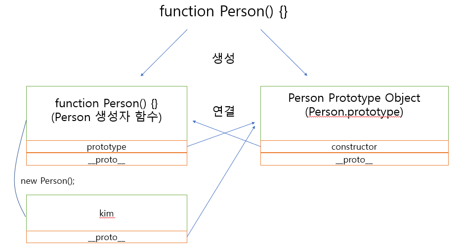

위 그림이 매우 중요하다. 함수를 하나 선언 했을 때 관계도가 필요하다면  위와 같은 그림을 꼭 그려주자


생성된 함수는 `prototype` 프로퍼티를 통해 Prototype Object(Person.prototype)에 접근할 수 있게된다. Prototype Object는 일반적인 객체랑 같고 기본속성으로 `constructor`와 `__proto__`를 가지고 있다.

 

- `constructor`: Prototype Object와 같이 생성되었던 `Person()` 함수를 가리킨다.
- `__proto__`: Property Link, 객체가 생성될 때 조상 함수의 Prototype Object에 접근하는 접근자 프로퍼티


#### Prototype Link ( [[Prototype]]  or`__proto__` )

- 모든 객체가 소유하고 있는 인터널 슬롯
- **객체의 입장(`kim`)**에서 자신의 부모(`function Person()`)의 프로토타입 객체(`Person Prototype Object`)를 가리킨다.

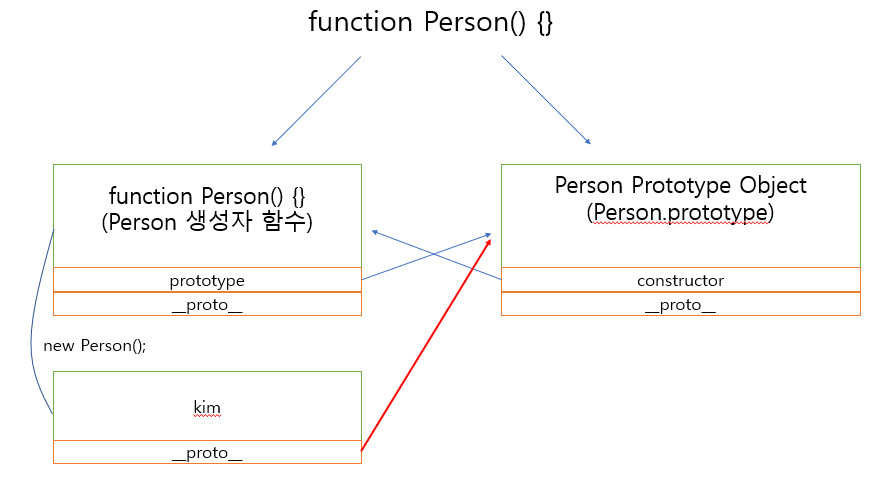 

- 접근(get)은 가능하지만 설정(set)은 불가능하다.

```javascript
console.log(kim.__proto__);
// Object.getPrototypeOf(kim); 이 내부적으로 호출된다.


// person의 부모객체인 Object의 프로퍼티와 메소드 정보
// constructor: ƒ Object()
// hasOwnProperty: ƒ hasOwnProperty()
// isPrototypeOf: ƒ isPrototypeOf()
// propertyIsEnumerable: ƒ propertyIsEnumerable()
// toLocaleString: ƒ toLocaleString()
// toString: ƒ toString()
// valueOf: ƒ valueOf()
// __defineGetter__: ƒ __defineGetter__()
// __defineSetter__: ƒ __defineSetter__()
// __lookupGetter__: ƒ __lookupGetter__()
// __lookupSetter__: ƒ __lookupSetter__()
// get __proto__: ƒ __proto__()
// set __proto__: ƒ __proto__()
```

부모객체가 있는 경우의 값은 `Object` 없는 경우는 `null` 값을 가진다.


#### Prototype Object (`prototype`)

- 함수 객체만 소유하고 있는 프로퍼티
- **함수 객체(`function Person()`)의 입장**에서 자신의 프로토타입 객체(`Person Prototype Object`)를 가리킨다.


 

### Prototype chain

 객체 자신이 가지고 있지 않은 프로퍼티 혹은 메소드를 호출하는 경우, 그 프로퍼티나 메소드를 찾을 때까지 상위 프로토타입을 탐색한다. 최상위 프로토타입인 Object Prototype Object까지 없을 때엔 `undefined`를 반환한다. 이렇게 **`__proto__` 프로퍼티를 통해 상위 프로토타입과 연결되어 있는 형태**를 Prototype chain이라 한다.

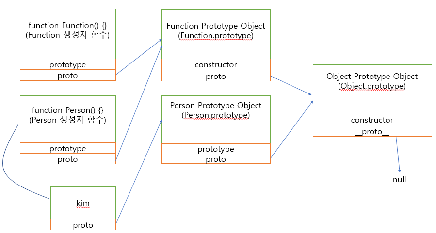

모든 객체의 최상위 프로토타입은 `Object` 이고 이 때문에 모든 객체는 Object의 자식이란 말이 나온 것이다.


#### 객체의 선언방식에 따른 프로토타입 체인

##### 객체 리터럴 (= Object() 생성자 함수)

객체 리터럴 방식으로 생성된 객체는 결국 내장함수 `Object()` 생성자 함수로 객체를 생성하는 것과 같다. 즉 `Object()` 생성자함수는 함수이고 따라서 `prototype` 프로퍼티를 소유한다.

```javascript
var person = {
  name: 'Lee',
  gender: 'male',
  sayHello: function(){
    console.log('Hi! my name is ' + this.name);
  }
};  
```

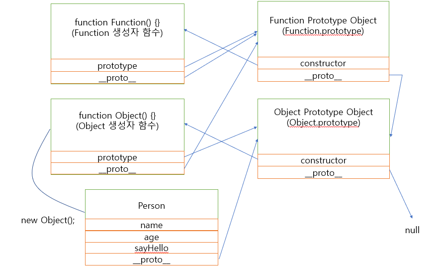 

즉 객체 리터럴을 사용해 객체를 생성한 경우 그 객체의 최종 프로토타입 객체는 `Object.prototype` 이다.


##### 생성자 함수

함수를 정의하는 방식은 3가지가 있다. Function() 생성자 함수, 함수선언식과 함수표현식을 통해 정의한다.

- Function 생성자 함수

- 함수 표현식은 함수 리터럴 방식을 차용한다.

```javascript
function square (number) {
    var result = number*number;
    return result;
}
```


- 함수 선언식의 경우 자바스크립트 엔진이 내부적으로 기명 함수표현식으로 변환한다.

```javascript
var square = function (number) {
    return number * number;
};

==>
    
var square = function square(number) {
    return number * number;
}
```

 즉, 3가지 함수 정의 방식은 결국 **Function() 생성자 함수를 통해 함수 객체를 생성**한다. 그러므로 어떠한 방식으로 함수 객체를 생성하여도 모든 함수 객체의 prototype 객체는 Function.prototype이다. 생성자 함수도 함수 객체이므로 생성자 함수의 prototype 객체는 Function.prototype이다.


### Prototype의 확장

결국 프로토타입 객체도 객체이므로 일반 객체와 같이 **프로퍼티를 추가/삭제 할 수 있다**. 그리고 이렇게 추가/삭제된 프로퍼티는 즉시 프로토타입 체인에 반영된다.

```javascript
function Person(name) {
  this.name = name;
}

var foo = new Person('Kim');

Person.prototype.sayHello = function(){
  console.log('Hi! my name is ' + this.name);
};

foo.sayHello();
```

생성자 함수 Person은 프로토타입 객체 Person.prototype와 prototype 프로퍼티에 의해 바인딩되어 있다. 

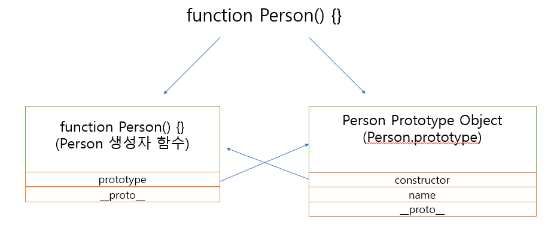 

Person.prototype 객체는 일반 객체와 같이 프로퍼티를 추가/삭제가 가능하다. 위의 예에서는 Person.prototype 객체에 메소드 sayHello를 추가하였다. 이때 sayHello 메소드는 프로토타입 체인에 반영된다. 따라서 생성자 함수 Person에 의해 생성된 모든 객체는 프로토타입 체인에 의해 부모객체인 Person.prototype의 메소드를 사용할 수 있게 되었다.

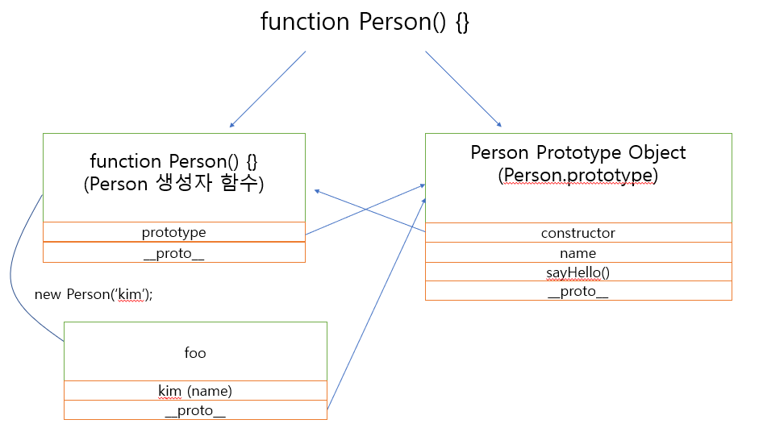


#### 원시타입과 객체의 프로토타입 확장

자바스크립트에서 원시 타입(숫자, 문자열, boolean, null, undefined)을 제외한 모든것은 객체이다. 그런데 아래 예제를 살펴보면 원시 타입인 문자열이 객체와 유사하게 동작한다.

```javascript
var str = 'test';
console.log(typeof str);                 // string
console.log(str.constructor === String); // true

console.dir(str);                        // test

var strObj = new String('test');
console.log(typeof strObj);                 // object
console.log(strObj.constructor === String); // true

console.dir(strObj); // {0: "t", 1: "e", 2: "s", 3: "t", length: 4, __proto__: String ...

console.log(str.toUpperCase());    // TEST
console.log(strObj.toUpperCase()); // TEST
```

 원시 타입 문자열과 String() 생성자 함수로 생성한 문자열 객체의 타입은 분명이 다르다. 원시 타입은 객체가 아니므로 프로퍼티나 메소드를 가질수 없다. 하지만 **원시 타입으로 프로퍼티나 메소드를 호출할 때 원시 타입과 연관된 객체로 일시적으로 변환되어 프로토타입 객체를 공유하게 된다.** 

 위의 예제에선 원시타입인 string과 연관된 객체 String Object으로 일시적으로 변환되어 프로토타입 객체를 공유했다. 

 

**원시 타입**은 객체가 아니므로 프로퍼티나 메소드를 직접 추가할 수 없다.

```javascript
var str = 'test';

// 에러는 발생하지 않는다.
str.myMethod = function () {
  console.log('str.myMethod');
};

// 하지만 실행은 안된다.
str.myMethod(); // Uncaught TypeError: str.myMethod is not a function
```

 

 **String 객체**의 프로토타입 객체에 메소드를 추가하면 원시 타입, 객체 모두 메소드를 사용할 수 있다.

```javascript
var str = 'test';

String.prototype.myMethod = function () {
  return 'myMethod';
};

console.log(str.myMethod());      // myMethod, 원시타입 string
console.log(String('string').myMethod()); // myMethod, 스트링객체 String
```

 자바스크립트는 일반객체 뿐만 아니라 표준 내장 객체(String, Array, Object 등등)의 프로토타입 객체에 개발자가 정의한 메소드의 추가를 허용한다.

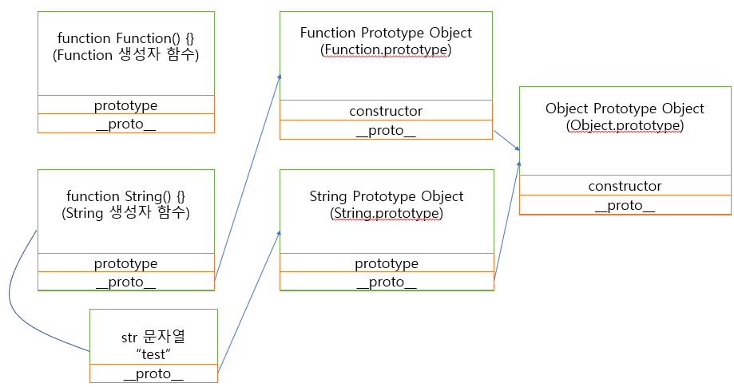


### Prototype의 변경

객체를 생성할 때 프로토타입은 결정된다. 결정된 프로토타입 객체는 다른 임의의 객체로 변경할 수 있다. 이것은 부모 객체인 프로토타입을 동적으로 변경할 수 있다는 것을 의미한다. 이러한 특징을 활용하여 객체의 상속을 구현할 수 있다.


이때 주의할 것은 프로토타입 객체를 변경하면 프로토타입 객체 변경 시점 이전에 생성된 객체는 자동으로 변경된 객체에 바인딩 되지 않습니다.

```javascript
function Person(name) {
  this.name = name;
}

// 프로토타입 객체 변경 전 선언한 객체
var foo = new Person('Lee');

// 프로토타입 객체의 변경
Person.prototype = { gender: 'male' };

// 프로토타입 객체 변경 후 선언한 객체
var bar = new Person('Kim');

console.log(foo.gender); // undefined
console.log(bar.gender); // 'male'

console.log(foo.constructor); // ① Person(name)
console.log(bar.constructor); // ② Object()
```


< 프로토타입 객체 변경 전>

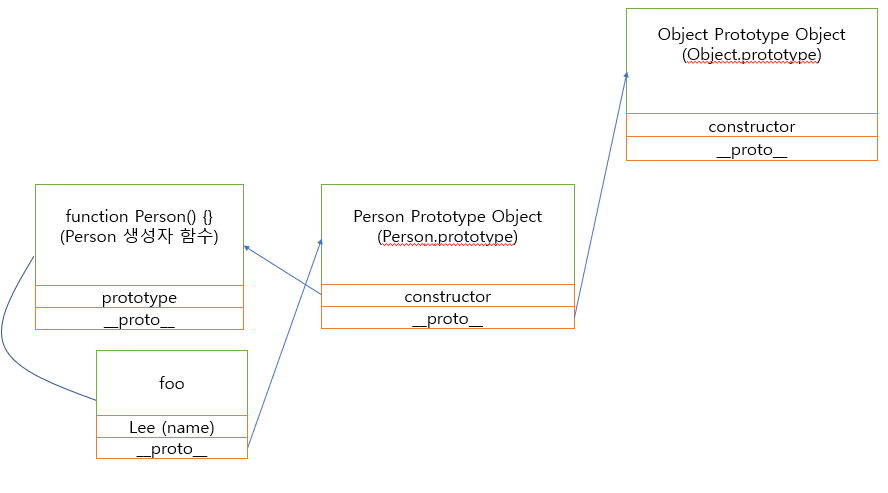


< 프로토타입 객체 변경 후>

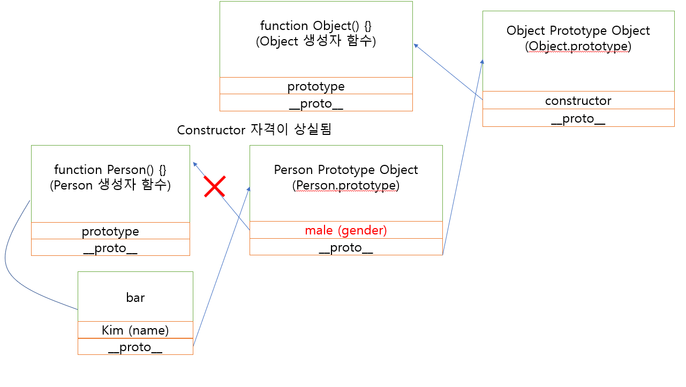

① constructor 프로퍼티는 Person() 생성자 함수를 가리킨다.

② 프로토타입 객체 변경 후, Person() 생성자 함수의 Prototype 프로퍼티가 가리키는 프로토타입 객체를 일반 객체로 변경하면서 `Person.prototype.constructor` 프로퍼티도 삭제되었다. 따라서 프로토타입 체인에 의해 `bar.constructor`의 값은 프로토타입 체이닝에 의해 `Object.prototype.constructor` Object() 생성자 함수가 된다.


## 스코프 (유효범위)

**스코프**는 참조 대상 식별자(identifier, 변수, 함수의 이름과 같이 어떤 대상을 다른 대상과 구분하여 식별할 수 있는 유일한 이름)를 찾아내기 위한 규칙이다. 자바스크립트는 이 규칙대로 식별자를 찾는다.


아래의 예시를 보자.

이름이 같은 변수 x가 중복 선언되었다. 전역에서 변수 x를 참조할 때, 그리고 함수 foo 내부에서 변수 x를 참조할 때 이름이 중복된 2개의 변수 중 어떤 변수를 참조할지 이 **스코프를 통해 참조하게된다.**

```javascript
var x = 'global';

function foo () {
  var x = 'function scope';
  console.log(x);
}

foo(); // ?
console.log(x); // ?
```

 위 예제에서 전역에 선언된 변수 x는 어디에든 참조할 수 있다. 

하지만 함수 foo 내에서 선언된 변수 x는 함수 foo 내부에서만 참조할 수 있고 함수 외부에서는 참조할 수 없다. 

이러한 규칙을 스코프라고 한다. 따라서 스코프는 식별자 이름의 충돌을 방지한다.


### 스코프의 구분

#### 전역 스코프(Global scope)

전역에 변수를 선언하면 이 변수는 어디서든지 참조할 수 있는 전역 스코프를 갖는 전역 변수가 된다. var 키워드로 선언한 전역 변수는 전역 객체(Global Object) `window`의 프로퍼티이다.

```javascript
var global = 'global';

function foo() {
  var local = 'local';
  console.log(global);
  console.log(local);
}
foo();

console.log(global);
console.log(local); // Uncaught ReferenceError: local is not defined
```

변수 global는 함수 영역 밖의 전역에서 선언되었다. 자바스크립트는 타 언어와는 달리 특별한 시작점(Entry point)이 없어서 위 코드와 같이 전역에 변수나 함수를 선언하기 쉽다.


C언어의 경우 main 함수가 시작점이 되기 때문에 대부분은 코드는 main 함수 내에 포함된다. C언어의 경우 전역 변수를 선언하기 위해서는 의도적으로 main 함수 밖에 변수를 선언하여야 한다.

```c
#include <stdio.h>

// 전역변수 선언
int g;

int main () {

  // 지역변수 선언
  int a, b;

  a = 10;
  b = 20;
  g = a + b;

  printf ("value of a = %d, b = %d and g = %d\n", a, b, g);

  return 0;
}
```

하지만 자바스크립트는 다른 C-family language와는 달리 특별한 시작점이 없으며 코드가 나타나는 즉시 해석되고 실행된다. 따라서 전역에 변수를 선언하기 쉬우며 이것는 전역 변수를 남발하게 하는 문제를 야기시킨다.

전역 변수의 사용은 변수 이름이 중복될 수 있고, **의도치 않은 재할당에 의한 상태 변화로 코드를 예측하기 어렵게 만드므로 사용을 억제하여야 한다.**


##### 암묵적 전역 스코프

선언하지 않은 변수에 값을 할당하면 전역 객체의 프로퍼티가 되어 전역 변수처럼 동작한다.


아래 예제를 살펴보자.

```javascript
var x = 10; // 전역 변수

function foo () {
  // 선언하지 않은 식별자
  y = 20;
  console.log(x + y);
}

foo(); // 30
```

위 예제의 y는 선언하지 않은 식별자이다. 따라서 `y = 20`이 실행되면 참조 에러가 발생할 것처럼 보인다. 하지만 선언하지 않은 식별자 y는 마치 선언된 변수처럼 동작한다. 이는 **선언하지 않은 식별자에 값을 할당하면 전역 객체의 프로퍼티가 되기 때문**이다.

 foo 함수가 호출되면 자바스크립트 엔진은 변수 y에 값을 할당하기 위해 먼저 스코프 체인을 통해 선언된 변수인지 확인한다. 이때 foo 함수의 스코프와 전역 스코프 어디에서도 변수 y의 선언을 찾을 수 없으므로 참조 에러가 발생해야 하지만 자바스크립트 엔진은 `y = 20`을 `window.y = 20`으로 해석하여 프로퍼티를 동적 생성한다. 결국 y는 전역 객체의 프로퍼티가 되어 마치 전역 변수처럼 동작한다. 이러한 현상을 **암묵적 전역(implicit global)**이라 한다.


- 변수 호이스팅 발생 X

y는 변수 선언없이 단지 전역 객체의 프로퍼티로 추가되었을 뿐이므로 y는 변수가 아니다. 따라서 변수가 아닌 y는 변수 호이스팅이 발생하지 않는다.

```javascript
// 전역 변수 x는 호이스팅이 발생한다.
console.log(x); // undefined

// 전역 변수가 아니라 단지 전역 프로퍼티인 y는 호이스팅이 발생하지 않는다.
console.log(y); // ReferenceError: y is not defined

var x = 10; // 전역 변수

function foo () {
  // 선언하지 않은 변수
  y = 20;
  console.log(x + y);
}

foo(); // 30
```


- `delete` 연산자로 삭제 가능 

또한 변수가 아니라 단지 프로퍼티인 y는 delete 연산자로 삭제할 수 있다. 전역 변수는 프로퍼티이지만 delete 연산자로 삭제할 수 없다.

```javascript
var x = 10; // 전역 변수

function foo () {
  // 선언하지 않은 변수
  y = 20;
  console.log(x + y);
}

foo(); // 30

console.log(window.x); // 10
console.log(window.y); // 20

delete x; // 전역 변수는 삭제되지 않는다.
delete y; // 프로퍼티는 삭제된다.

console.log(window.x); // 10
console.log(window.y); // undefined
```


##### 최소한의 전역변수 사용

###### 전역변수 객체 사용

전역변수 사용을 최소화하는 방법 중 하나는 애플리케이션에서 전역변수 사용을 위해 다음과 같이 전역변수 객체 하나를 만들어 사용하는 것이다. (더글라스 크락포드의 제안)

```javascript
var MYAPP = {};

MYAPP.student = {
  name: 'Lee',
  gender: 'male'
};

console.log(MYAPP.student.name);
```

 전역변수 객체 하나를 만들고 그 객체에 프로퍼티를 추가하는 식으로 코딩한다면 추가로 전역변수 객체를 선언할 필요가 없어진다. 


###### 즉시실행함수를 이용한 전역변수 사용 억제

 전역변수 사용을 억제하기 위해 즉시 실행 함수를 사용할 수 있다. 즉시 실행 함수는 즉시 실행되고 그 후 전역에서 바로 사라진다.

```javascript
(function () {
  var MYAPP = {};

  MYAPP.student = {
    name: 'Lee',
    gender: 'male'
  };

  console.log(MYAPP.student.name); // Lee
}());

console.log(MYAPP.student.name); // ReferenceError: MYAPP is not defined
```


#### 비 블록 레벨 스코프(Non block-level scope)

```javascript
if (true) {
  var x = 5;
}
console.log(x);
```

변수 x는 코드 블록 내에서 선언되었다. 하지만 자바스크립트는 블록 레벨 스코프를 사용하지 않으므로 함수 밖에서 선언된 변수는 코드 블록 내에서 선언되었다할지라도 모두 **전역 스코프**을 갖게된다. 따라서 변수 x는 전역 변수이다.


#### 지역 스코프 (Local scope or Function-level scope)

: 함수 코드 블록이 만든 스코프로 함수 자신과 하위 함수에서만 참조할 수 있다.

변수는 선언 위치(전역 또는 지역)에 의해 스코프를 가지게 된다. 지역(자바스크립트의 경우 함수 내부)에서 선언된 변수는 지역 스코프를 갖는 지역 변수가 된다.


### 스코프의 종류

#### 블록 레벨 스코프(block-level scope)

대부분의 C-family language는 블록 레벨 스코프(block-level scope)를 따른다. 

블록 레벨 스코프란 코드 블록({…})내에서 참조(접근)할 수 있는 스코프를 의미한다. 

```c
int main(void) {
  // block-level scope
  if (1) {
    int x = 5;
    printf("x = %d\n", x);
  }

  printf("x = %d\n", x); // use of undeclared identifier 'x'

  return 0;
}
```

 위의 C언어 코드를 보면 if문 내에서 선언된 변수 x는 if문 코드 블록 내에서만 유효하다. 즉, if문 코드 블록 밖에서는 참조가 불가능하다.


#### 함수 레벨 스코프(function-level scope)

하지만 자바스크립트는 함수 레벨 스코프(function-level scope)를 따른다. 

함수 레벨 스코프란 **함수 코드 블록 내에서 선언된 변수는 함수 코드 블록 내에서만 유효**하고 함수 외부에서는 유효하지 않다(참조할 수 없다)는 것이다.

> 단, ECMAScript 6에서 도입된 `let` keyword를 사용하면 **블록 레벨 스코프**를 사용할 수 있다.

```javascript
var x = 0;
{
  var x = 1;
  console.log(x); // 1
}
console.log(x);   // 1

let y = 0;
{
  let y = 1;
  console.log(y); // 1
}
console.log(y);   // 0
```


Example)

```javascript
var a = 10;     // 전역변수

(function () {
  var b = 20;   // 지역변수
})();

console.log(a); // 10
console.log(b); // "b" is not defined
```

자바스크립트는 함수 레벨 스코프를 사용한다. 즉, 함수 내에서 선언된 매개변수와 변수는 함수 외부에서는 유효하지 않다. 따라서 변수 b는 지역 변수이다.


- 변수명이 중복된 경우, 지역변수를 우선하여 참조한다.

```javascript
var x = 'global';

function foo() {
  var x = 'local';
  console.log(x);
}

foo();          // local
console.log(x); // global
```

전역변수 x와 지역변수 x가 중복 선언되었다. 전역 영역에서는 전역변수만이 참조 가능하고 함수 내 지역 영역에서는 전역과 지역 변수 모두 참조 가능하나 위 예제와 같이 변수명이 중복된 경우, 지역변수를 우선하여 참조한다.


- 내부함수는 외부함수의 변수를 참조할 수 있다.

```javascript
var x = 'global';

function foo() {
  var x = 'local';
  console.log(x);

  function bar() {  // 내부함수
    console.log(x); // ?
  }

  bar();
}
foo();
console.log(x); // ?

// 실행결과
// local
// local
// global
```

내부함수 bar에서 참조하는 변수 x는 외부함수 foo에서 선언된 지역변수이다. 

첫 번째 성질인 "변수명이 중복된 경우, 지역변수를 우선하여 참조한다."에 입각해서 변수 x가 중복되었지만 더 가까운 지역변수인 `var x = 'local'` 을 참조하게 되는 것이다. 


또한 함수(지역) 영역에서 전역변수를 참조할 수 있으므로 전역변수의 값도 변경할 수 있다. 내부 함수의 경우, 전역변수는 물론 상위 함수에서 선언한 변수에 접근/변경이 가능하다.

```javascript
var x = 10;

function foo() {
  x = 100;
  console.log(x); 
}
foo(); 
console.log(x); 

// 실행결과
// 100
// 100
```

foo 함수 내에서 새로 `var x = 100`으로 선언했다면 새로운 지역변수를 선언한 것이지만 `x = 100`으로 기존 전역변수의 값을 재할당한 것임으로 전역변수 x의 값이 100으로 변하게된다.


- 중첩 스코프는 가장 인접한 지역을 우선하여 참조한다.

```javascript
var x = 10;

function foo(){
  var x = 100;
  console.log(x);

  // 내부함수
  function bar() {   
    x = 1000;
    console.log(x); // ?
  }

  bar();
}
foo(); 
console.log(x);

// 실행결과
// 100
// 1000
// 10
```

위 코드에는 중복된 이름의 변수 x가 두개있다. 전역변수 x의 값은 10이고 foo의 지역변수 x의 값은 100이다.

foo의 내부함수인 bar에서 변수 x의 값을 1000으로 바꾸려고하고 있다. 이 때 가장 인접한 변수인 지역변수 x의 값(100 -> 1000)을 변경하게 된다. 

따라서 전역변수 x의 값은 10 그대로이고 foo의 지역변수 x의 값은 1000으로 바뀌게 된다.


다음 문제를 풀어보자

```javascript
var foo = function () {

  var a = 3
  var b = 5;

  var bar = function ( ) {
    var b = 7;
    var c = 11;

    console.log(a, b, c) // ? ? ?
    a += b + c;
	console.log(a, b, c) // ? ? ?
  };

  console.log(a, b, c) // ? ? ?
  bar();
  console.log(a, b, c) // ? ? ?

};
```


### 스코프 체인

실행하고자 하는 변수나 함수(식별자)가 현재 스코프에 없다면 상위 스코프로 차례차례 올라가면서 검색을 한다. 이 과정을 스코프 체인이라고 한다. 스코프 체인은 실행 컨텍스트 파트에서 상세히 다루도록 하겠다.


### 렉시컬 스코프

함수를 어디서 호출하는지가 아닌 어디에 선언하였는지에 따라 스코프가 결정된다.

아래 예제의 실행 결과를 예측해보자.

```javascript
var x = 1;

function foo() {
  var x = 10;
  bar();
}

function bar() {
  console.log(x);
}

foo(); // ?
bar(); // ?
```

위 예제의 실행 결과는 함수 bar의 상위 스코프가 무엇인지에 따라 결정된다. 두가지 가능성이 있다.

-  동적 스코프(Dynamic scope): 함수를 **어디서 호출하였는지**에 따라 상위 스코프를 결정하는 것이다. 이 경우 함수 bar의 상위 스코프는 함수 foo와 전역일 것이다. 

- 렉시컬 스코프(Lexical scope or Static scope): 함수를 **어디서 선언하였는지**에 따라 상위 스코프를 결정하는 것이다. 이 경우 함수 bar의 스코프는 전역일 것이다. 자바스크립트를 비롯한 대부분의 프로그래밍 언어는 렉시컬 스코프를 따른다.


 자바스크립트는 렉시컬 스코프를 따르므로 함수를 선언한 시점에 상위 스코프가 결정된다. 함수를 어디에서 호출하였는지는 스코프 결정에 아무런 의미를 주지 않는다. 위 예제의 함수 bar는 전역에 선언되었다. 따라서 함수 bar의 상위 스코프는 전역 스코프이고 위 예제는 전역 변수 x의 값 1을 두번 출력한다.


## Strict Mode

Strict mode란 자바스크립트 언어의 문법을 보다 엄격히 적용하여 기존에는 무시되던 오류를 발생시킬 가능성이 높거나 자바스크립트 엔진의 최적화 작업에 문제를 일으킬 수 있는 코드에 대해 명시적인 에러를 발생시킨다.


예제를 하나 보자

```javascript
function foo() {
  x = 10;
}

console.log(x); // ?
```

앞써 배웠듯이 위 예제는 에러를 발생시키지 않고 x는 **암묵적 전역 변수(implicit global)**가 된다. 

개발자의 의도와는 상관없이 자바스크립트 엔진이 생성한 암묵적 전역 변수는 오류를 발생시키는 원인이 될 가능성이 크다. 


이를 Strict Mode를 적용한다면  아래와 같이 된다.

```javascript
'use strict';

function foo() {
  x = 10; // ReferenceError: x is not defined
}

console.log(x); // 10
```


**ESLint**와 같은 린트 도구를 사용하여도 strict mode와 유사한 효과를 얻을 수 있다. 린트 도구는 정적 분석(static analysis) 기능을 통해 소스 코드를 실행하기 전에 소스 코드를 스캔하여 문법적 오류만이 아니라 잠재적 오류까지 찾아내고 오류의 이유를 리포팅해주는 도구이다.


### strict mode의 적용

strict mode를 적용하려면 스코프의 선두에 `'use strict'`를 추가한다.

즉시 실행 함수로 스크립트 전체를 감싸서 스코프를 구분하고 즉시 실행 함수의 선두에 strict mode를 적용한다.

```javascript
// 즉시실행 함수에 strict mode 적용
(function () {
  'use strict';

  // Do something...
}());
```


## this

자바스크립트의 함수는 호출될 때, 매개변수로 전달되는 인자값 이외에 `arguments` 객체와 `this`를 암묵적으로 전달 받는다.

```javascript
function square(number) {

  console.log(arguments); // Arguments [2, callee: f, Symbol(Symbol.iterator): f] ...
  console.log(this); // Window {parent: Window, openr: null, ...}

  return number * number;
}

square(2);
```


자바스크립트의 `this` keyword는 Java와 같은 익숙한 언어의 개념과 달라 개발자에게 혼란을 준다.

Java에서의 this는 인스턴스 자신(self)을 가리키는 참조변수이다. this가 객체 자신에 대한 참조 값을 가지고 있다는 뜻이다. 주로 매개변수와 객체 자신이 가지고 있는 멤버변수명이 같을 경우 이를 구분하기 위해서 사용된다. 아래 Java 코드의 생성자 함수 내의 this.name은 멤버변수를 의미하며 name은 생성자 함수가 전달받은 매개변수를 의미한다.

```java
public Class Person {

  private String name;

  public Person(String name) {
    this.name = name;
  }
}
```

하지만 자바스크립트의 경우 Java와 같이 this에 바인딩되는 객체는 한가지가 아니라 해당 함수 호출 방식에 따라 this에 바인딩되는 객체가 달라진다.


### 함수호출방식과 this 바인딩

자바스크립트의 경우 함수 호출 방식에 의해 `this`에 바인딩할 어떤 객체가 동적으로 결정된다. 다시 말해, 함수를 선언할 때 this에 바인딩할 객체가 정적으로 결정되는 것이 아니고, **함수를 호출할 때 함수가 어떻게 호출되었는지에 따라** this에 바인딩할 객체가 동적으로 결정된다.

> Lexcial scope와 혼동하지 말것!


함수의 호출 방법은 아래와 같다.

1. 일반함수 호출

2. 메소드로서 함수 호출

3. 생성자 함수 호출

4. apply/call/bind 호출

```javascript
var foo = function () {
  console.dir(this);
};

// 1. 함수 호출
foo(); // window
// window.foo();

// 2. 메소드 호출
var obj = { foo: foo };
obj.foo(); // obj

// 3. 생성자 함수 호출
var instance = new foo(); // instance

// 4. apply/call/bind 호출
var bar = { name: 'bar' };
foo.call(bar);   // bar
foo.apply(bar);  // bar
foo.bind(bar)(); // bar
```


#### 일반함수 호출시 this 바인딩

**전역객체**

전역객체는 모든 객체의 유일한 최상위 객체이며 일반적으로 Browser-side에서는 `window`, Server-side(NodeJs)에서는 `global`객체를 의미한다.


전역객체는 전역변수(혹은 전역함수)를 프로퍼티로 소유한다. 즉 전역에 선언한 변수나 함수는 전역객체(`window`)의 프로퍼티로 접근할 수 있다.

```javascript
var ga = 'Global variable';

console.log(ga); // Global variable
console.log(window.ga); // Global variable

function foo() {
    console.log('invoked!');
}

window.foo(); // invoked!
```


- 기본적으로 `this`는 전역객체(`window`)에 바인딩된다. 

```javascript
function foo() {
    console.log("foo's this: ", this); 
}

foo(); // window
```


- 전역함수의 내부함수의 this도 전역객체(`window`)에 바인딩된다. 

```javascript
function foo() {
    console.log("foo's this: ", this); // window
    
    // 전역함수의 내부함수의 this도 window에 바인딩된다. 
    function bar() {
        console.log("bar's this: ", this);
    }
    bar(); // window
}
```


- 메소드의 내부함수일 경우에도 this는 전역객체(`window`)에 바인딩된다. 

```javascript
var value = 1;

var obj = {
    value: 100,
    foo: function() {
        function bar() {
            console.log("bar's this: ", this); // window
            console.log("bar's this.value: ", this.value); // 1
        }
        
        // 메소드 내부 this는 메소드를 호출한 객체(obj)에 바인딩된다.
        console.log("foo's this: ", this); // obj
        console.log("foo's this.value: ", this.value) // 100
    }
};

obj.foo();
```


- 콜백함수의 경우에도 `this`는 전역객체(`window`)에 바인딩된다.

```javascript
var value = 1;

var obj = {
    value: 100,
    foo: function() {
        setTimeout(function() {
            console.log("callback's this: ", this); // window
            console.log("callback's this.value: ", this.value); // 1;
        }, 100);
    }
};

obj.foo();
```

==> 내부함수는 일반 함수, 메소드, 콜백함수 어디서 선언되었던 this가 전역객체에 바인딩되는 것을 볼 수 있다. 더글라스 크락포드는 이 현상을 설계 단계의 결함이라고 설명했다.


해결법 - that의 사용

메소드 내부의 this는 메소드를 호출한 객체에 `this`가 바인딩 되므로 그 바인딩 된 `this`를 `that`변수에 담아놓고 쓰는것이다.

```javascript
var value = 1;

var obj = {
  value: 100,
  foo: function() {
    var that = this;  // Workaround : this === obj

    console.log("foo's this: ",  this);  // obj
    console.log("foo's this.value: ",  this.value); // 100
    function bar() {
      console.log("bar's this: ",  this); // window
      console.log("bar's this.value: ", this.value); // 1

      console.log("bar's that: ",  that); // obj
      console.log("bar's that.value: ", that.value); // 100
    }
    bar();
  }
};

obj.foo();
```


#### 메소드 호출시 this의 바인딩

- 함수가 객체의 프로퍼티 값인 메소드로서 호출될 때 메소드 내부의 `this`는 해당 메소드를 호출한 객체에 바인딩된다.

```javascript
var obj1 = {
  name: 'Lee',
  sayName: function() {
    console.log(this.name);
  }
}

var obj2 = {
  name: 'Kim'
}

// obj2에 sayName 프로퍼티 추가
obj2.sayName = obj1.sayName;

obj1.sayName(); // Lee
obj2.sayName(); // Kim
```

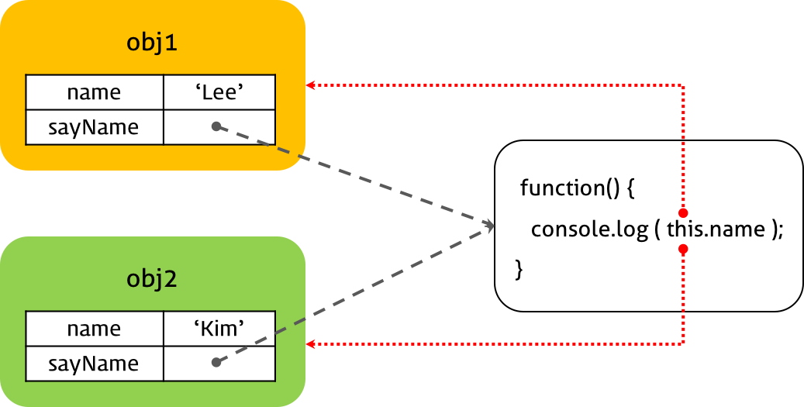


- 프로토타입 객체의 메소드의 경우에도 this는 해당 메소드를 호출한 객체에 바인딩된다.

```javascript
function Person(name) {
  this.name = name;
}

Person.prototype.getName = function() {
  return this.name;
}

var me = new Person('Lee');
console.log(me.getName()); // Lee

Person.prototype.name = 'Kim';
console.log(Person.prototype.getName()); // Kim
```


#### 생성자 함수 호출시 this의 바인딩

자바스크립트의 생성자 함수는 말 그대로 객체를 생성하는 역할을 한다. **기존 함수에 `new` 연산자를 붙여서 호출하면 해당 함수는 생성자 함수로 동작한다.**

 반대로 생각하면 생성자 함수가 아닌 일반 함수에 `new` 연산자를 붙여 호출하면 생성자 함수처럼 동작할 수 있다. 따라서 일반적으로 생성자 함수명은 첫문자를 대문자로 기술하여 혼란을 방지하려는 노력을 한다.

```javascript
// 생성자 함수
function Person(name) {
  this.name = name;
}

var me = new Person('Lee');
console.log(me); // Person { name: "Lee"}

// new 연산자와 함께 생성자 함수를 호출하지 않으면 생성자 함수로 동작하지 않는다.
// this 바인딩이 잘못되었기 때문이다.
var you = Person('Kim');
console.log(you); // undefined
```


##### 생성자 함수의 동작

1. 빈 객체 생성 및 this 바인딩

생성자 함수의 코드가 실행되기 전 빈 객체가 생성된다. 이 빈 객체가 생성자 함수가 새로 생성하는 객체이다. 이후 **생성자 함수 내에서 사용되는 this는 이 빈 객체를 가리킨다.** 그리고 생성된 빈 객체는 생성자 함수의 prototype 프로퍼티가 가리키는 객체를 자신의 프로토타입 객체로 설정한다.


2. this를 통한 프로퍼티 생성

 this는 새로 생성된 객체를 가리키므로 this를 통해 생성한 프로퍼티와 메소드는 새로 생성된 객체에 추가된다.


3. 생성된 객체 반환

- 반환문이 없는 경우, this에 바인딩된 새로 생성한 객체가 반환된다. 명시적으로 this를 반환하여도 결과는 같다.
- 반환문이 this가 아닌 다른 객체를 명시적으로 반환하는 경우, this가 아닌 해당 객체가 반환된다. 이때 this를 반환하지 않은 함수는 생성자 함수로서의 역할을 수행하지 못한다. 따라서 생성자 함수는 반환문을 명시적으로 사용하지 않는다.


##### new 연산자 없는 생성자 함수

**일반함수와 생성자 함수에 특별한 형식적 차이는 없으며 함수에 new 연산자를 붙여서 호출하면 해당 함수는 생성자 함수로 동작한다.**

그러나 객체 생성 목적으로 작성한 생성자 함수를 new 없이 호출하거나 일반함수에 new를 붙여 호출하면 오류가 발생할 수 있다. 일반함수와 생성자 함수의 호출 시 this 바인딩 방식이 다르기 때문이다.

일반 함수를 호출하면 this는 전역객체에 바인딩되지만 new 연산자와 함께 생성자 함수를 호출하면 this는 생성자 함수가 암묵적으로 생성한 빈 객체에 바인딩된다.

```javascript
function Person(name) {
  // new없이 호출하는 경우, 전역객체에 name 프로퍼티를 추가
  this.name = name;
};

// 일반 함수로서 호출되었기 때문에 객체를 암묵적으로 생성하여 반환하지 않는다.
// 일반 함수의 this는 전역객체를 가리킨다.
var me = Person('Lee');

console.log(me); // undefined
console.log(window.name); // Lee
```

 생성자 함수를 new 없이 호출한 경우, 함수 Person 내부의 this는 전역객체를 가리키므로 name은 전역변수(window)에 바인딩된다. 또한 new와 함께 생성자 함수를 호출하는 경우에 암묵적으로 반환하던 this도 반환하지 않으며, 반환문이 없으므로 undefined를 반환하게 된다.


- Scope-Safe Constructor

일반함수와 생성자 함수에 특별한 형식적 차이는 없기 때문에 일반적으로 생성자 함수명은 첫문자를 대문자로 기술하여 혼란을 방지하려는 노력을 한다. 그러나 이러한 규칙을 사용한다 하더라도 실수는 발생할 수 있다.

이러한 위험성을 회피하기 위해 사용되는 패턴(Scope-Safe Constructor)은 다음과 같다. 

```javascript
// Scope-Safe Constructor Pattern
function A(arg) {
  // 생성자 함수가 new 연산자와 함께 호출되면 함수의 선두에서 빈객체를 생성하고 this에 바인딩한다.

  /*
  this가 호출된 함수(arguments.callee, 본 예제의 경우 A)의 인스턴스가 아니면 new 연산자를 사용하지 않은 것이므로 이 경우 new와 함께 생성자 함수를 호출하여 인스턴스를 반환한다.
  arguments.callee는 호출된 함수의 이름을 나타낸다. 이 예제의 경우 A로 표기하여도 문제없이 동작하지만 특정함수의 이름과 의존성을 없애기 위해서 arguments.callee를 사용하는 것이 좋다.
  */
  if (!(this instanceof arguments.callee)) {
    return new arguments.callee(arg);
  }

  // 프로퍼티 생성과 값의 할당
  this.value = arg ? arg : 0;
}

var a = new A(100);
var b = A(10);

console.log(a.value);
console.log(b.value);
```


#### apply, call, bind 호출시 this의 바인딩

this에 바인딩될 객체는 함수 호출 패턴에 의해 결정된다. 이는 자바스크립트 엔진이 수행하는 것이다. 이러한 자바스크립트 엔진의 암묵적 this 바인딩 이외에 this를 특정 객체에 명시적으로 바인딩하는 방법도 제공된다. 이것을 가능하게 하는 것이 Function.prototype.apply, Function.prototype.call 메소드이다.

이 메소드들은 모든 함수 객체의 프로토타입 객체인 Function.prototype 객체의 메소드이다.


##### apply()

 apply() 메소드는 this를 특정 객체에 바인딩할 뿐 본질적인 기능은 함수 호출이다.

```javascript
func.apply(thisArg, [argsArray])

// thisArg: 함수 내부의 this에 바인딩할 객체
// argsArray: 함수에 전달할 argument의 배열
```


example)

```javascript
var Person = function (name) {
  this.name = name;
};

var foo = {};

// apply 메소드는 생성자함수 Person을 호출한다. 이때 this에 객체 foo를 바인딩한다.
Person.apply(foo, ['dongin']);

console.log(foo); // { name: 'dongin' }
```

빈 객체 foo를 apply() 메소드의 첫번째 매개변수에, argument의 배열을 두번째 매개변수에 전달하면서 Person 함수를 호출하였다. 이때 Person 함수의 this는 foo 객체가 된다. Person 함수는 this의 name 프로퍼티에 매개변수 name에 할당된 인수를 할당하는데 this에 바인딩된 foo 객체에는 name 프로퍼티가 없으므로 name 프로퍼티가 동적 추가되고 값이 할당된다.

apply() 메소드의 대표적인 용도는 arguments 객체와 같은 유사 배열 객체에 배열 메소드를 사용하는 경우이다. arguments 객체는 배열이 아니기 때문에 slice() 같은 배열의 메소드를 사용할 수 없으나 apply() 메소드를 이용하면 가능하다.

```javascript
function convertArgsToArray() {
  console.log(arguments);

  // arguments 객체를 배열로 변환
  // slice: 배열의 특정 부분에 대한 복사본을 생성한다.
  var arr = Array.prototype.slice.apply(arguments); // arguments.slice
  // var arr = [].slice.apply(arguments);

  console.log(arr);
  return arr;
}

convertArgsToArray(1, 2, 3);
```

`Array.prototype.slice.apply(arguments)`는 “Array.prototype.slice() 메소드를 호출하라. 단 this는 arguments 객체로 바인딩하라”는 의미가 된다. 결국 Array.prototype.slice() 메소드를 arguments 객체 자신의 메소드인 것처럼 `arguments.slice()`와 같은 형태로 호출하라는 것이다.


arguments 객체의 Array.prototype.slice() 호출


##### call()

call() 메소드의 경우, apply()와 기능은 같지만 apply()의 두번째 인자에서 배열 형태로 넘긴 것을 각각 하나의 인자로 넘긴다.

```javascript
Person.apply(foo, [1, 2, 3]);

Person.call(foo, 1, 2, 3);
```

apply()와 call() 메소드는 콜백 함수의 this를 위해서 사용되기도 한다.

```javascript
function Person(name) {
  this.name = name;
}

Person.prototype.doSomething = function(callback) {
  if(typeof callback == 'function') {
    // this: Person 객체
    callback();
  }
};

function foo() {
  console.log(this.name); // this: 전역 객체 window
}

var p = new Person('Lee');
p.doSomething(foo);  // undefined
```

 콜백함수를 호출하는 외부 함수 내부의 this와 콜백함수 내부의 this가 상이하기 때문에 문맥상 문제가 발생한다. 

따라서 콜백함수 내부의 this를 콜백함수를 호출하는 함수 내부의 this와 일치시켜 주어야 하는 번거로움이 발생한다.

```javascript
function Person(name) {
  this.name = name;
}

Person.prototype.doSomething = function (callback) {
  if (typeof callback == 'function') {
    callback.call(this);
  }
};

function foo() {
  console.log(this.name);
}

var p = new Person('Lee');
p.doSomething(foo);  // 'Lee'
```


##### bind()

ES5에 추가된 `Function.prototype.bind`를 사용하는 방법도 가능하다. `Function.prototype.bind`는 함수에 인자로 전달한 this가 바인딩된 새로운 함수를 리턴한다. 즉, `Function.prototype.bind`는 `Function.prototype.apply`, `Function.prototype.call` 메소드와 같이 함수를 실행하지 않기 때문에 명시적으로 함수를 호출할 필요가 있다.

```javascript
function Person(name) {
  this.name = name;
}

Person.prototype.doSomething = function (callback) {
  if (typeof callback == 'function') {
    // callback.call(this);
    // this가 바인딩된 새로운 함수를 호출
    callback.bind(this)();
  }
};

function foo() {
  console.log('#', this.name);
}

var p = new Person('Lee');
p.doSomething(foo);  // 'Lee'
```


## Execution Context

 실행 가능한 코드를 형상화하고 구분하는 추상적인 개념. 실행 가능한 코드가 실행되기 위해 필요한 환경 

 **실행 가능한 코드**

- 전역 코드 : 전역 영역에 존재하는 코드
- Eval 코드 : [eval 함수](https://poiemaweb.com/js-built-in-object#2121-eval)로 실행되는 코드
- 함수 코드 : 함수 내에 존재하는 코드

일반적으로 실행 가능한 코드는 전역 코드와 함수 내 코드이다.


**실행에 필요한 여러가지 정보**

- 변수 : 전역변수, 지역변수, 매개변수, 객체의 프로퍼티
- 함수 선언
- 변수의 유효범위(Scope)
- this


이와 같이 실행에 필요한 정보를 형상화하고 구분하기 위해 자바스크립트 엔진은 실행 컨텍스트를 **물리적 객체의 형태**로 관리한다. 

```javascript
var x = 'xxx';

function foo () {
  var y = 'yyy';

  function bar () {
    var z = 'zzz';
    console.log(x + y + z);
  }
  bar();
}
foo();
```

위 코드를 실행하면 아래와 같이 실행 컨텍스트 스택(Stack)이 생성하고 소멸한다. 현재 실행 중인 컨텍스트에서 이 컨텍스트와 관련없는 코드(예를 들어 다른 함수)가 실행되면 새로운 컨텍스트가 생성된다. 이 컨텍스트는 스택에 쌓이게 되고 컨트롤(제어권)이 이동한다.


논리적 스택 구조를 가지는 실행 컨텍스트 스택

1. 컨트롤이 실행 가능한 코드로 이동하면 논리적 스택 구조를 가지는 새로운 실행 컨텍스트 스택이 생성된다. 스택은 LIFO(Last In First Out, 후입 선출)의 구조를 가지는 나열 구조이다.
2. 전역 코드(Global code)로 컨트롤이 진입하면 전역 실행 컨텍스트가 생성되고 실행 컨텍스트 스택에 쌓인다. 전역 실행 컨텍스트는 애플리케이션이 종료될 때(웹 페이지에서 나가거나 브라우저를 닫을 때)까지 유지된다.
3. 함수를 호출하면 해당 함수의 실행 컨텍스트가 생성되며 직전에 실행된 코드 블록의 실행 컨텍스트 위에 쌓인다.
4. 함수 실행이 끝나면 해당 함수의 실행 컨텍스트를 파기하고 직전의 실행 컨텍스트에 컨트롤을 반환한다.

 

### 실행 컨텍스트의 구조

 


#### Variable Object (VO / 변수객체)

실행 컨텍스트가 생성되면 자바스크립트 엔진은 실행에 필요한 여러 정보들을 담을 객체를 생성한다. 이를 Variable Object(VO / 변수 객체)라고 한다. Variable Object는 코드가 실행될 때 엔진에 의해 참조되며 코드에서는 접근할 수 없다.

- 변수
- 매개변수(parameter)와 인수 정보(arguments)
- 함수 선언(함수 표현식은 제외)


Variable Object는 실행 컨텍스트의 프로퍼티이기 때문에 값을 갖는데 이 값은 다른 객체를 가리킨다. 


##### 전역 컨텍스트의 경우

**전역 객체(Global Object / GO)**를 가리킨다. 전역 객체는 전역에 선언된 전역 변수와 전역 함수를 프로퍼티로 소유한다.


##### 함수 컨텍스트의 경우

**Activation Object(AO / 활성 객체)**를 가리키며 매개변수와 인수들의 정보를 배열의 형태로 담고 있는 객체인 [arguments object](https://poiemaweb.com/js-function#61-arguments-프로퍼티)가 추가된다.


## [#](https://poiemaweb.com/js-execution-context#22-scope-chain-sc)2.2 Scope Chain (SC)

스코프 체인(Scope Chain)은 일종의 리스트로서 전역 객체와 중첩된 함수의 스코프의 레퍼런스를 차례로 저장하고 있다. 다시 말해, 스코프 체인은 해당 전역 또는 함수가 참조할 수 있는 변수, 함수 선언 등의 정보를 담고 있는 전역 객체(GO) 또는 활성 객체(AO)의 리스트를 가리킨다.

현재 실행 컨텍스트의 활성 객체(AO)를 선두로 하여 순차적으로 상위 컨텍스트의 활성 객체(AO)를 가리키며 마지막 리스트는 전역 객체(GO)를 가리킨다.


스코프 체인

**스코프 체인은 식별자 중에서 객체(전역 객체 제외)의 프로퍼티가 아닌 식별자, 즉 변수를 검색하는 메커니즘이다.**
식별자 중에서 변수가 아닌 객체의 프로퍼티(물론 메소드도 포함된다)를 검색하는 메커니즘은 **프로토타입 체인(Prototype Chain)**이다.

엔진은 스코프 체인을 통해 렉시컬 스코프를 파악한다. 함수가 중첩 상태일 때 하위함수 내에서 상위함수의 스코프와 전역 스코프까지 참조할 수 있는데 이것는 스코프 체인을 검색을 통해 가능하다. 함수가 중첩되어 있으면 중첩될 때마다 부모 함수의 Scope가 자식 함수의 스코프 체인에 포함된다. 함수 실행중에 변수를 만나면 그 변수를 우선 현재 Scope, 즉 Activation Object에서 검색해보고, 만약 검색에 실패하면 스코프 체인에 담겨진 순서대로 그 검색을 이어가게 되는 것이다. 이것이 스코프 체인이라고 불리는 이유이다.

예를 들어 함수 내의 코드에서 변수를 참조하면 엔진은 스코프 체인의 첫번째 리스트가 가리키는 AO에 접근하여 변수를 검색한다. 만일 검색에 실패하면 다음 리스트가 가리키는 Activation Object(또는 전역 객체)를 검색한다. 이와 같이 순차적으로 스코프 체인에서 변수를 검색하는데 결국 검색에 실패하면 정의되지 않은 변수에 접근하는 것으로 판단하여 Reference 에러를 발생시킨다. 스코프 체인은 함수의 감추인 프로퍼티인 `[[Scope]]`로 참조할 수 있다.

## [#](https://poiemaweb.com/js-execution-context#23-this-value)2.3 this value

this 프로퍼티에는 this 값이 할당된다. [this](https://poiemaweb.com/js-this)에 할당되는 값은 함수 호출 패턴에 의해 결정된다.

# [#](https://poiemaweb.com/js-execution-context#3-실행-컨텍스트의-생성-과정)3. 실행 컨텍스트의 생성 과정

앞에서 살펴본 아래의 코드를 가지고 실제로 어떻게 실행 컨텍스트가 생성되는지 알아보자.

```javascript
var x = 'xxx';

function foo () {
  var y = 'yyy';

  function bar () {
    var z = 'zzz';
    console.log(x + y + z);
  }
  bar();
}

foo();
```

## [#](https://poiemaweb.com/js-execution-context#31-전역-코드에의-진입)3.1 전역 코드에의 진입

컨트롤이 실행 컨텍스트에 진입하기 이전에 유일한 전역 객체(Global Object)가 생성된다. 전역 객체는 단일 사본으로 존재하며 이 객체의 프로퍼티는 코드의 어떠한 곳에서도 접근할 수 있다. 초기 상태의 전역 객체에는 빌트인 객체(Math, String, Array 등)와 BOM, DOM이 설정되어 있다.

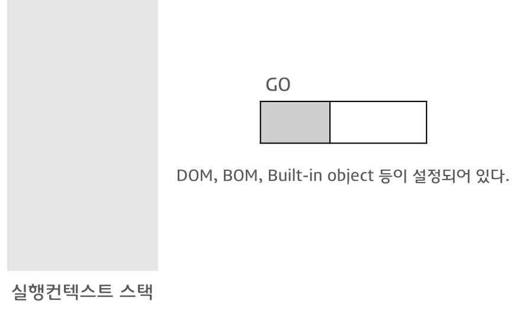

초기 상태의 실행 컨텍스트

전역 객체가 생성된 이후, 전역 코드로 컨트롤이 진입하면 전역 실행 컨텍스트가 생성되고 실행 컨텍스트 스택에 쌓인다.

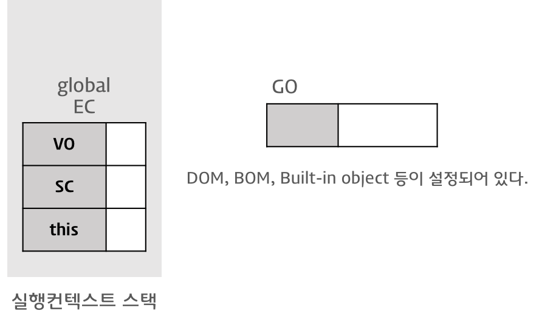

전역 실행 컨텍스트의 생성

그리고 이후 이 실행 컨텍스트를 바탕으로 이하의 처리가 실행된다.

> 1. 스코프 체인의 생성과 초기화
> 2. Variable Instantiation(변수 객체화) 실행
> 3. this value 결정

### [#](https://poiemaweb.com/js-execution-context#311-스코프-체인의-생성과-초기화)3.1.1 스코프 체인의 생성과 초기화

실행 컨텍스트가 생성된 이후 가장 먼저 스코프 체인의 생성과 초기화가 실행된다. 이때 스코프 체인은 전역 객체의 레퍼런스를 포함하는 리스트가 된다.


스코프 체인의 생성과 초기화

### [#](https://poiemaweb.com/js-execution-context#312-variable-instantiation변수-객체화-실행)3.1.2 Variable Instantiation(변수 객체화) 실행

스코프 체인의 생성과 초기화가 종료하면 변수 객체화(Variable Instantiation)가 실행된다.

Variable Instantiation은 Variable Object에 프로퍼티와 값을 추가하는 것을 의미한다. 변수 객체화라고 번역하기도 하는데 이는 변수, 매개변수와 인수 정보(arguments), 함수 선언을 Variable Object에 추가하여 객체화하기 때문이다.

전역 코드의 경우, Variable Object는 Global Object를 가리킨다.

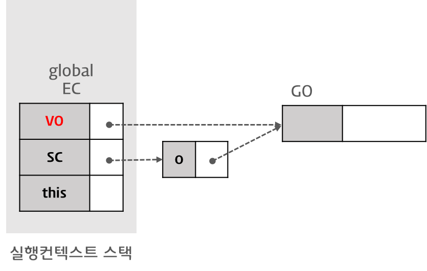

Variable Instantiation(변수 객체화): VO와 GO의 연결

Variable Instantiation(변수 객체화)는 아래의 순서로 Variable Object에 프로퍼티와 값을 set한다. (반드시 1→2→3 순서로 실행된다.)

> 1. (Function Code인 경우) **매개변수(parameter)**가 Variable Object의 프로퍼티로, 인수(argument)가 값으로 설정된다.
> 2. 대상 코드 내의 **함수** 선언(함수 표현식 제외)을 대상으로 함수명이 Variable Object의 프로퍼티로, 생성된 함수 객체가 값으로 설정된다.(**함수 호이스팅**)
> 3. 대상 코드 내의 **변수** 선언을 대상으로 변수명이 Variable Object의 프로퍼티로, undefined가 값으로 설정된다.(**변수 호이스팅**)

위 예제 코드를 보면 전역 코드에 변수 x와 함수 foo(매개변수 없음)가 선언되었다. Variable Instantiation의 실행 순서 상, 우선 2. 함수 foo의 선언이 처리되고(함수 코드가 아닌 전역 코드이기 때문에 1. 매개변수 처리는 실행되지 않는다.) 그 후 3. 변수 x의 선언이 처리된다.

#### [#](https://poiemaweb.com/js-execution-context#3121-함수-foo의-선언-처리)3.1.2.1 함수 foo의 선언 처리

함수 선언은 Variable Instantiation 실행 순서 2.와 같이 선언된 함수명 foo가 Variable Object(전역 코드인 경우 Global Object)의 프로퍼티로, 생성된 함수 객체가 값으로 설정된다.


함수 foo의 선언 처리

생성된 함수 객체는 `[[Scopes]]` 프로퍼티를 가지게 된다. `[[Scopes]]` 프로퍼티는 함수 객체만이 소유하는 내부 프로퍼티(Internal Property)로서 **함수 객체가 실행되는 환경**을 가리킨다. 따라서 현재 실행 컨텍스트의 스코프 체인이 참조하고 있는 객체를 값으로 설정한다. 내부 함수의 `[[Scopes]]` 프로퍼티는 자신의 실행 환경(Lexical Enviroment)과 자신을 포함하는 외부 함수의 실행 환경과 전역 객체를 가리키는데 이때 자신을 포함하는 외부 함수의 실행 컨텍스트가 소멸하여도 `[[Scopes]]` 프로퍼티가 가리키는 외부 함수의 실행 환경(Activation object)은 소멸하지 않고 참조할 수 있다. 이것이 **클로저**이다.

![함수 foo의 [[Scopes]]](https://poiemaweb.com/img/foo-scopes.png)

함수 foo의 [[Scopes]]

지금까지 살펴본 실행 컨텍스트는 아직 코드가 실행되기 이전이다. 하지만 스코프 체인이 가리키는 변수 객체(VO)에 이미 함수가 등록되어 있으므로 이후 코드를 실행할 때 함수선언식 이전에 함수를 호출할 수 있게 되었다.

이때 알 수 있는 것은 함수선언식의 경우, 변수 객체(VO)에 함수표현식과 동일하게 함수명을 프로퍼티로 함수 객체를 할당한다는 것이다. 단, 함수선언식은 변수 객체(VO)에 함수명을 프로퍼티로 추가하고 즉시 함수 객체를 즉시 할당하지만 함수 표현식은 일반 변수의 방식을 따른다. 따라서 함수선언식의 경우, 선언문 이전에 함수를 호출할 수 있다. 이러한 현상을 **[함수 호이스팅(Function Hoisting)](https://poiemaweb.com/js-function#2-함수-호이스팅function-hoisting)**이라 한다.

#### [#](https://poiemaweb.com/js-execution-context#3122-변수-x의-선언-처리)3.1.2.2 변수 x의 선언 처리

변수 선언은 Variable Instantiation 실행 순서 3.과 같이 선언된 변수명( x )이 Variable Object의 프로퍼티로, undefined가 값으로 설정된다. 이것을 좀더 세분화 해보면 아래와 같다.

- 선언 단계(Declaration phase)

  변수 객체(Variable Object)에 변수를 등록한다. 이 변수 객체는 스코프가 참조할 수 있는 대상이 된다.

- 초기화 단계(Initialization phase)

  변수 객체(Variable Object)에 등록된 변수를 메모리에 할당한다. 이 단계에서 변수는 undefined로 초기화된다.

- 할당 단계(Assignment phase)

  undefined로 초기화된 변수에 실제값을 할당한다.

**var 키워드로 선언된 변수는 선언 단계와 초기화 단계가 한번에 이루어진다.** 다시 말해 스코프 체인이 가리키는 변수 객체에 변수가 등록되고 변수는 undefined로 초기화된다. 따라서 변수 선언문 이전에 변수에 접근하여도 Variable Object에 변수가 존재하기 때문에 에러가 발생하지 않는다. 다만 undefined를 반환한다. 이러한 현상을 **[변수 호이스팅(Variable Hoisting)](https://poiemaweb.com/js-data-type-variable#24-변수-호이스팅variable-hoisting)**이라한다.

아직 변수 x는 ‘xxx’로 초기화되지 않았다. 이후 변수 할당문에 도달하면 비로소 값의 할당이 이루어진다.


변수 x의 선언 처리

### [#](https://poiemaweb.com/js-execution-context#313-this-value-결정)3.1.3 this value 결정

변수 선언 처리가 끝나면 다음은 this value가 결정된다. **this value가 결정되기 이전에 this는 전역 객체를 가리키고 있다가 함수 호출 패턴에 의해 [this](https://poiemaweb.com/js-this)에 할당되는 값이 결정된다.** 전역 코드의 경우, this는 전역 객체를 가리킨다.


this value 결정

**전역 컨텍스트(전역 코드)의 경우, Variable Object, 스코프 체인, this 값은 언제나 전역 객체이다.**

## [#](https://poiemaweb.com/js-execution-context#32-전역-코드의-실행)3.2. 전역 코드의 실행

지금까지는 코드 실행 환경을 갖추기 위한 사전 준비였다. 코드의 실행은 지금부터 시작된다.

```javascript
var x = 'xxx';

function foo () {
  var y = 'yyy';

  function bar () {
    var z = 'zzz';
    console.log(x + y + z);
  }
  bar();
}

foo();
```

위 예제를 보면 전역 변수 x에 문자열 ‘xxx’ 할당과 함수 foo의 호출이 실행된다.

### [#](https://poiemaweb.com/js-execution-context#321-변수-값의-할당)3.2.1 변수 값의 할당

전역 변수 x에 문자열 ‘xxx’를 할당할 때, 현재 실행 컨텍스트의 스코프 체인이 참조하고 있는 Variable Object를 선두(0)부터 검색하여 변수명에 해당하는 프로퍼티가 발견되면 값(‘xxx’)을 할당한다.


변수 값의 할당

### [#](https://poiemaweb.com/js-execution-context#322-함수-foo의-실행)3.2.2 함수 foo의 실행

전역 코드의 함수 foo가 실행되기 시작하면 새로운 함수 실행 컨텍스트가 생성된다. 함수 foo의 실행 컨텍스트로 컨트롤이 이동하면 전역 코드의 경우와 마찬가지로 **1. 스코프 체인의 생성과 초기화**, **2. Variable Instantiation 실행**, **3. this value 결정**이 순차적으로 실행된다.

단, 전역 코드와 다른 점은 이번 실행되는 코드는 함수 코드라는 것이다. 따라서 **1. 스코프 체인의 생성과 초기화**, **2. Variable Instantiation 실행**, **3. this value 결정**은 전역 코드의 룰이 아닌 함수 코드의 룰이 적용된다.

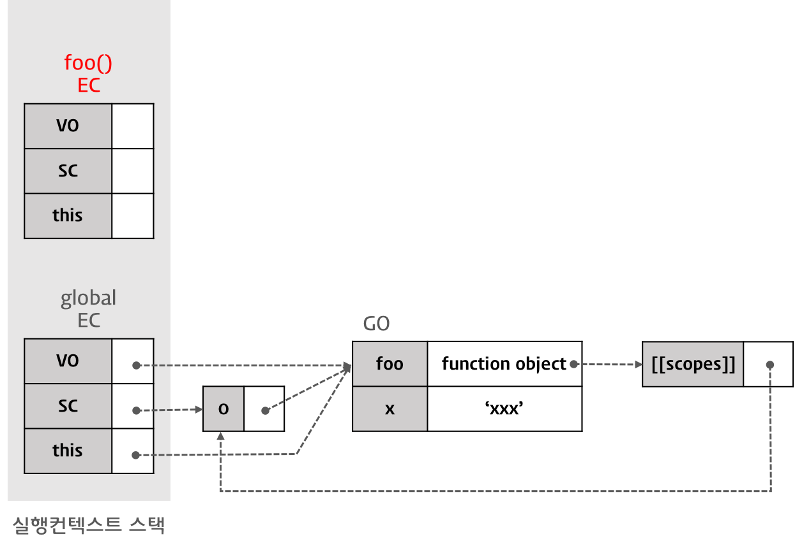

함수 foo의 실행 컨텍스트 생성

#### [#](https://poiemaweb.com/js-execution-context#3221-스코프-체인의-생성과-초기화)3.2.2.1 스코프 체인의 생성과 초기화

함수 코드의 **스코프 체인의 생성과 초기화**는 우선 Activation Object에 대한 레퍼런스를 스코프 체인의 선두에 설정하는 것으로 시작된다.

Activation Object는 우선 **arguments 프로퍼티의 초기화**를 실행하고 그 후, Variable Instantiation가 실행된다. Activation Object는 스펙 상의 개념으로 프로그램이 Activation Object에 직접 접근할 수 없다. (Activation Object의 프로퍼티로의 접근은 가능하다)


스코프 체인의 생성과 초기화: Activation Object의 생성과 바인딩

그 후, Caller(전역 컨텍스트)의 Scope Chain이 참조하고 있는 객체가 스코프 체인에 push된다. 따라서, 이 경우 함수 foo를 실행한 직후 실행 컨텍스트의 스코프 체인은 Activation Object(함수 foo의 실행으로 만들어진 AO-1)과 전역 객체를 순차적으로 참조하게 된다.


스코프 체인의 생성과 초기화: Caller의 [[Scope]]를 스코프 체인에 push

#### [#](https://poiemaweb.com/js-execution-context#3222-variable-instantiation-실행)3.2.2.2 Variable Instantiation 실행

Function Code의 경우, **스코프 체인의 생성과 초기화**에서 생성된 Activation Object를 Variable Object로서 Variable Instantiation가 실행된다. 이것을 제외하면 전역 코드의 경우와 같은 처리가 실행된다. 즉, 함수 객체를 Variable Object(AO-1)에 바인딩한다. (프로퍼티는 bar, 값은 새로 생성된 Function Object. bar function object의 [[Scope]] 프로퍼티 값은 AO-1과 Global Object를 참조하는 리스트）


Variable Instantiation 실행: 함수 bar의 선언 처리

변수 y를 Variable Object(AO-1)에 설정한다 이때 프로퍼티는 y, 값은 undefined이다.


Variable Instantiation 실행: 변수 y의 선언 처리

#### [#](https://poiemaweb.com/js-execution-context#3223-this-value-결정)3.2.2.3 this value 결정

변수 선언 처리가 끝나면 다음은 this value가 결정된다. [this](https://poiemaweb.com/js-this)에 할당되는 값은 함수 호출 패턴에 의해 결정된다.

내부 함수의 경우, this의 value는 전역 객체이다.

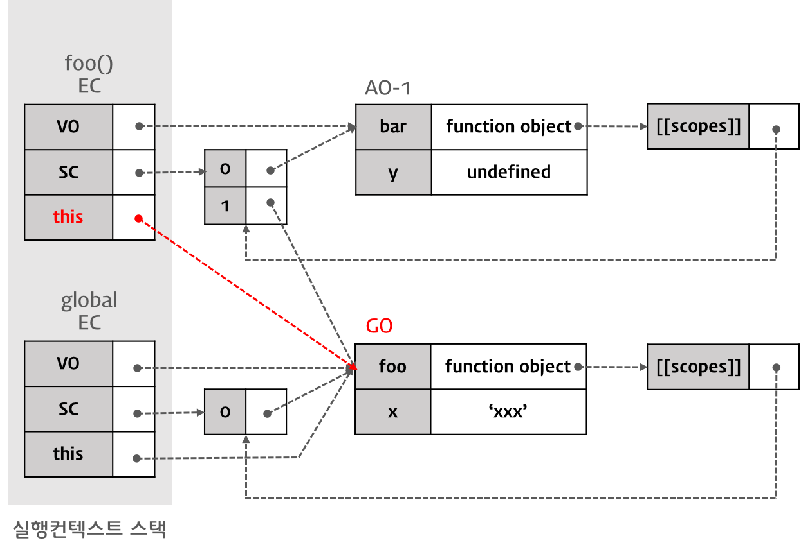

this value 결정

## [#](https://poiemaweb.com/js-execution-context#33-foo-함수-코드의-실행)3.3 foo 함수 코드의 실행

이제 함수 foo의 코드 블록 내 구문이 실행된다. 위 예제를 보면 변수 y에 문자열 ‘yyy’의 할당과 함수 bar가 실행된다.

### [#](https://poiemaweb.com/js-execution-context#331-변수-값의-할당)3.3.1 변수 값의 할당

지역 변수 y에 문자열 ‘yyy’를 할당할 때, 현재 실행 컨텍스트의 스코프 체인이 참조하고 있는 Variable Object를 선두(0)부터 검색하여 변수명에 해당하는 프로퍼티가 발견되면 값 ‘yyy’를 할당한다.

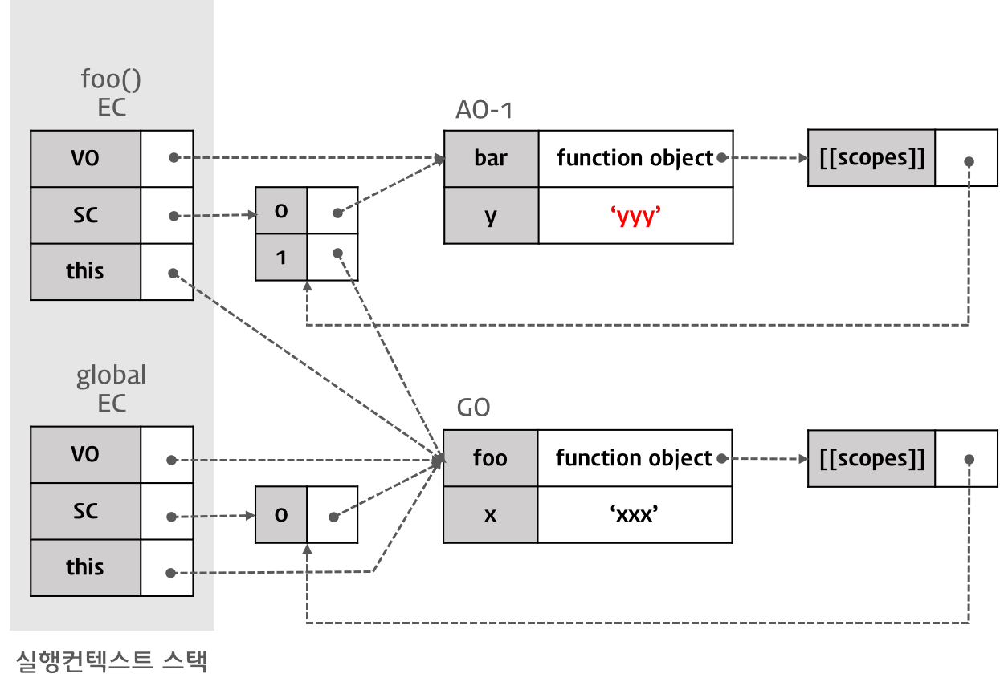

변수 y에의 값 할당

### [#](https://poiemaweb.com/js-execution-context#332-함수-bar의-실행)3.3.2 함수 bar의 실행

함수 bar가 실행되기 시작하면 새로운 실행 컨텍스트이 생성된다.


함수 bar의 실행

이전 함수 foo의 실행 과정과 동일하게 **1. 스코프 체인의 생성과 초기화**, **2. Variable Instantiation 실행**, **3. this value 결정**이 순차적으로 실행된다.

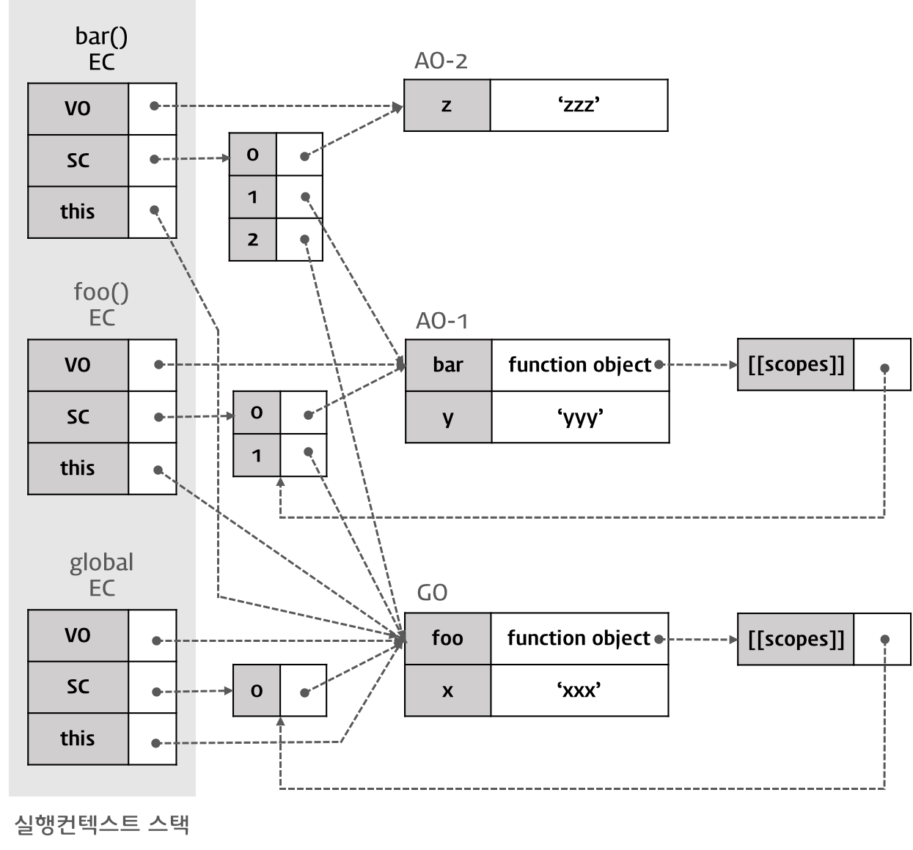

완성된 실행 컨텍스트

이 단계에서 `console.log(x + y + z);` 구문의 실행 결과는 xxxyyyzzz가 된다.

> - x : AO-2에서 x 검색 실패 → AO-1에서 x 검색 실패 → GO에서 x 검색 성공 (값은 ‘xxx’)
> - y : AO-2에서 y 검색 실패 → AO-1에서 y 검색 성공 (값은 ‘yyy’)
> - z : AO-2에서 z 검색 성공 (값은 ‘zzz’)